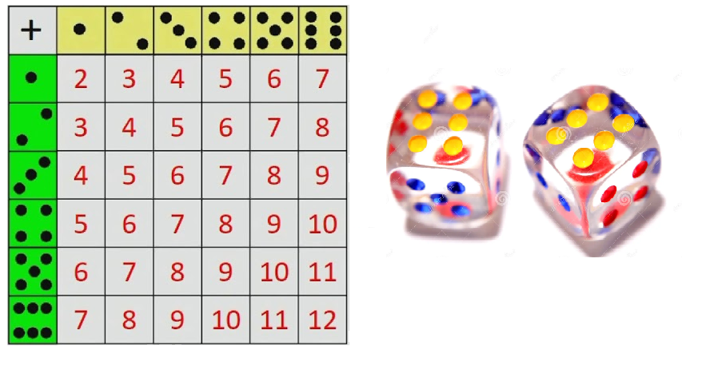
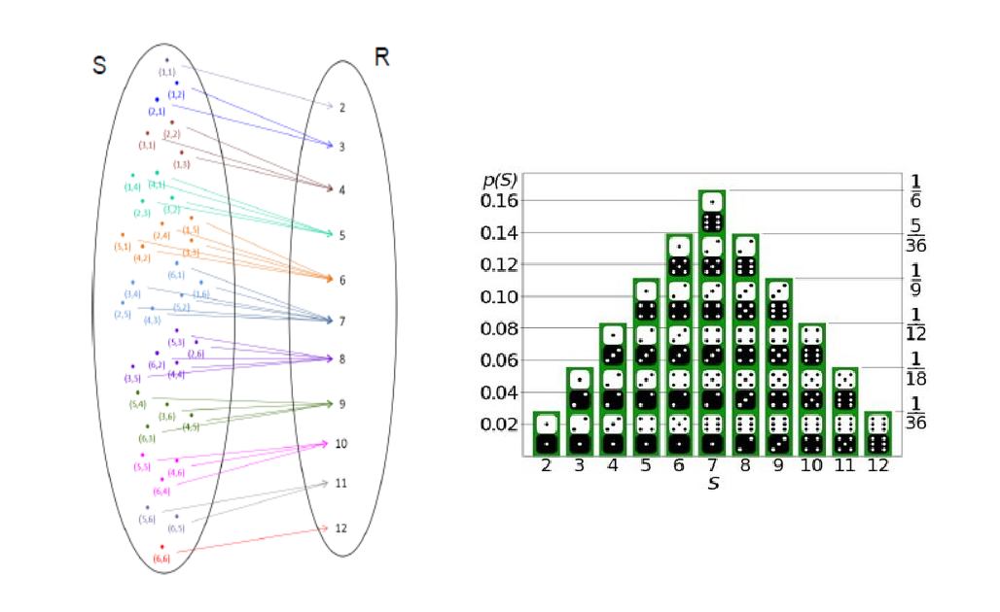

**Variable aleatoria discreta**


En cualquier experimento, existen numerosas características que pueden ser observadas,  cada resultado de un experimento puede ser asociado con un número, especificando una regla de asociación llamada variable aleatoria.

Una variable aleatoria le corresponde una función, cuyo dominio es el espacio muestral y cuyo rango es el conjunto de números reales, cada elemento del rango tiene una probabilidad de ocurrencia.


|Experimento|Variable aleatoria|Posibles valores (rango)| 
|---------|----------------|----------------------|
|Tirar al aire dos monedas|Nro de caras observadas al lanzar las dos monedas|0,1,2|
|Seleccionar 5 clientes| Nro clientes al día|0,1,2,3,4,5| 
| venta de un automovil|genero cliente|0 hombre, 1 mujer| 
|Tirar al aire dos dados|Numero al Sumar los dos dados  |2,3,4,5,6,7,8,9,10,11,12             |       

## FUnción de distribución de probabilidad

Es un gráfico tabla o formula que especifica la probabilidad asociada con cada posible salida de la variable aleatoria.

**Propiedades**

1. $0\leq f(x_i)\leq1$
2. $$\sum_{i=1}^nf(x_i)=1$$
3. $f(x_i)=P(x=x_i)$

___________________________________________________________________________________

Ejemplo

Se lanzan dos dados, Sea x la variable aleatoria obtenida al sumar el par de números de los dados.


```{r, echo=F, fig.cap='Probabilidad', fig.asp=0.3, fig.align='center'}

```


En total se tienen 36 opciones diferentes


```{r, echo=F, fig.cap='Probabilidad', fig.asp=0.3, fig.align='center'}

```

- [Clase de Distribuciones discretas](https://github.com/estadisticaITM/estadisticaITM.github.io/blob/master/ITM_discretas.pptx)


**Videos de interés**

*Variable aleatoria discreta*

<iframe width="280" height="160" src="https://www.youtube.com/embed/MMNVst-cEOM" title="YouTube video player" frameborder="0" allow="accelerometer; autoplay; clipboard-write; encrypted-media; gyroscope; picture-in-picture" allowfullscreen></iframe>

<iframe width="280" height="160" src="https://www.youtube.com/embed/cfNqJcNU7aI" frameborder="0" allow="accelerometer; autoplay; encrypted-media; gyroscope; picture-in-picture" allowfullscreen></iframe>

<iframe width="280" height="160" src="https://www.youtube.com/embed/ip-y-YW5Kg8" frameborder="0" allow="accelerometer; autoplay; encrypted-media; gyroscope; picture-in-picture" allowfullscreen></iframe>

*Propiedades de la esperanza y de la varianza*


<iframe width="280" height="160" src="https://www.youtube.com/embed/0kowS0mEOcU" frameborder="0" allow="accelerometer; autoplay; encrypted-media; gyroscope; picture-in-picture" allowfullscreen></iframe>

<iframe width="280" height="160" src="https://www.youtube.com/embed/YiHzJgg0OB8" frameborder="0" allow="accelerometer; autoplay; encrypted-media; gyroscope; picture-in-picture" allowfullscreen></iframe>

<iframe width="280" height="160" src="https://www.youtube.com/embed/I6Gcr5BUJt4" frameborder="0" allow="accelerometer; autoplay; encrypted-media; gyroscope; picture-in-picture" allowfullscreen></iframe>


