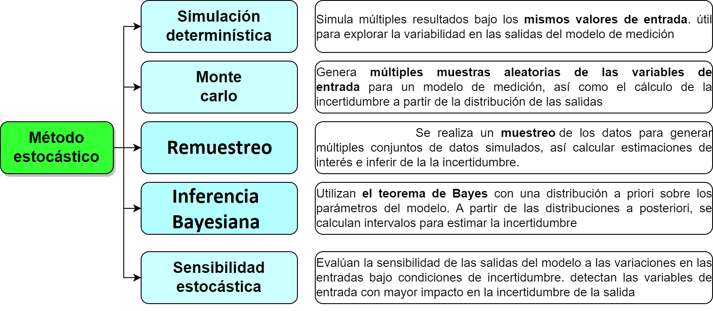
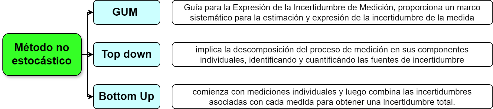
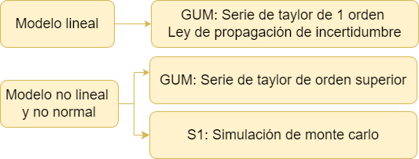
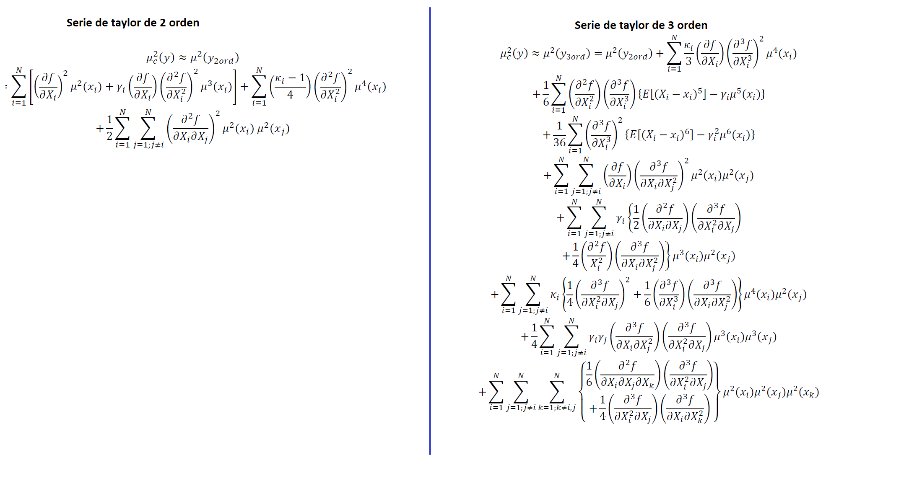
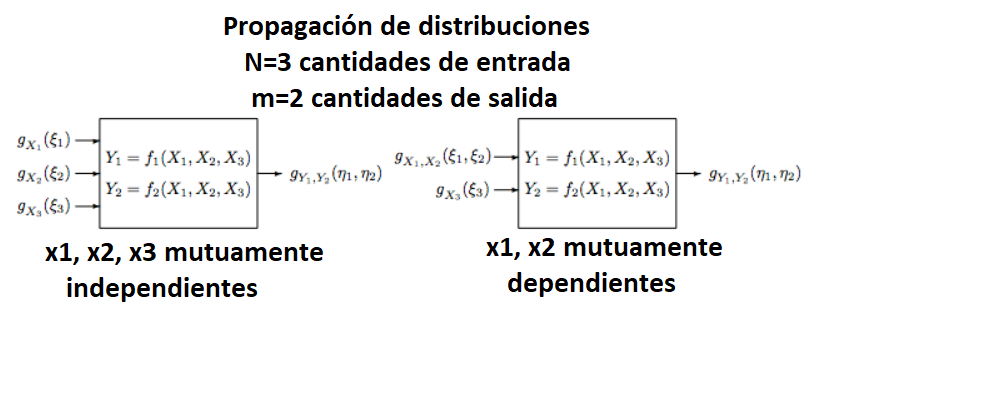

Existen 2 formas principales de estimar la incertidumbre, metodos no estocásticos como la GUM y metodos estocásticos como la simulación monte carlo (MCM), que hacen alusión a distribuciones de probabilidad. 

## Métodos estocásticos para estimar la incertidumbre

```{r out.width="100%", fig.align='center', echo=FALSE}

```

**Simulación Determinística**

Simula múltiples resultados posibles dados los mismos valores de entrada. Puede ser útil para explorar la variabilidad en las salidas del modelo de medición.


**Monte Carlo**

Implica la generación de múltiples muestras aleatorias de las variables de entrada, la propagación de estas muestras a través del modelo de medición y el cálculo de la incertidumbre a partir de la distribución de las salidas.


**Inferencia Bayesiana**

Utilizan el teorema de Bayes para actualizar la información a priori sobre los parámetros del modelo en función de los datos observados. A partir de las distribuciones a posteriori de los parámetros, se pueden calcular intervalos de credibilidad que reflejen la incertidumbre en las estimaciones.


**Métodos de remuestreo** 

Implica el muestreo de los datos disponibles para generar múltiples conjuntos de datos simulados. A partir de estos conjuntos de datos, se calculan las estimaciones de interés y se utiliza la variabilidad entre estas estimaciones para inferir la incertidumbre.


**Formas de remuestreo**


**Jackknife**

- Consiste en generar múltiples conjuntos de datos "dejando fuera" un solo punto de datos en cada iteración y recalculando el estimador en cada conjunto de datos.

- Es útil para identificar la sensibilidad del estimador a la exclusión de puntos de datos individuales y proporciona una estimación robusta de la incertidumbre sin hacer suposiciones sobre la distribución de los datos.


**Bootstrap**

Muestreo con reemplazo


**Métodos de Sensibilidad Estocástica**

Evalúan la sensibilidad de las salidas del modelo a las variaciones en las entradas bajo condiciones de incertidumbre. Pueden proporcionar información valiosa sobre qué variables de entrada tienen el mayor impacto en la incertidumbre de la salida.


## Métodos no estocásticos para la estimación de incertidumbre

```{r out.width="100%", fig.align='center', echo=FALSE}

```

**Guía para la Expresión de la Incertidumbre de Medición (GUM)**


**Top-Down**

Este enfoque implica la descomposición del proceso de medición en sus componentes individuales, identificando las fuentes de incertidumbre y cuantificándolas por separado. Luego, estas incertidumbres individuales se combinan utilizando reglas de propagación de errores.

Basado en el procesamiento de datos registrados a largo plazo, derivados de resultados de ensayos de aptitud, muestras de control del laboratorio, datos bibliográficos publicados, etc.

**Método Bottom-Up**

Comienza con mediciones individuales y luego combina las incertidumbres asociadas con cada medida para obtener una incertidumbre total.

Basado en una sucesión de etapas de cálculo que tienen en cuenta los errores provenientes de cada una de las operaciones analíticas descompuestas en actividades primarias.


________________________________________________________________________________________


## Alternativas a la GUM 

La GUM es reconocida para la evaluación de la incertidumbre de la medición, este método utiliza una aproximación de la serie de Taylor de primer orden para evaluar la estimación de un mensurando y su incertidumbre estándar asociada, mediante la ley de propagación de incertidumbres (Martins, 2011).

La GUM cuenta con dos complementos para su aplicación,

- **Suplemento 1 de la GUM — Propagación de distribuciones aplicando el método de Monte Carlo**,


- **Suplemento 2 del “GUM” – Ampliación a cualquier número de cantidades de salida.**


En la mayoría de los casos el mensurando Y no se mide directamente sino que se determina a partir de N otras cantidades de entrada $(X_i)$ que están relacionadas a través de una relación funcional conocida de la forma:

$$y=f(x_1,x_2,x_3,...x_n)$$

Sin embargo, cuando la función de medición es no lineal, el uso de esta aproximación lineal puede ser inadecuado y, por lo tanto, se deben considerar los siguientes casos:

```{r, echo=F, out.width="70%", fig.align='center'}

```

La decisión de incluir términos de orden superior en una serie de Taylor para estimar incertidumbre depende en gran medida de la precisión deseada y de la naturaleza de la función que se está aproximando.


## Inclusión de términos de orden superior en la serie de Taylor

La inclusión de los términos de tercer orden de la expansión de la serie de Taylor de la función de medición da como resultado un método más completo que la GUM y los métodos de segundo orden.

Por tanto, la evaluación de la incertidumbre de la medición utilizando este método puede considerarse más apropiada y sólida que los últimos métodos.

Estas aproximaciones requieren de varios momentos estadísticos.

**Momentos de la estadística**

1. E(X)= media

2. $var(x)=u(x_i^2)$

3. Asimetría

El sesgo $\gamma$ puede expresado en terminos de incertidumbre como 

$$E[(\varepsilon_i-x_i)^3]=\gamma u^3(x_i)$$

4. Curtosis

Que puede ser expresada en terminos de incertidumbre como: 


$$E[(\varepsilon_i-x_i)^4]=k u^4(x_i)$$

La siguiente ecuación ilustra la incertidumbre con un desarrollo de la serie de taylor de 2 orden. 

$$u_c^2(y)=\sum_{i=1}^N\left[ \frac{\partial f }{\partial x_i} \right]^2 u^2(x_i)+\sum_{i=1}^{N}\sum_{j=1}^N  \left[ \frac{1}{2} \left(\frac{\partial^2f }{\partial x_i \partial x_j} \right)^2 + \left(\frac{\partial f}{\partial x_i} \right)\left(\frac{\partial^3f }{\partial x_i \partial x_j^2} \right) \right]  u^2(x_i) u^2(x_j)$$
Expandiendo la serie se obtiene, la serie de 2 y tercer orden


```{r, echo=F, out.width="100%", fig.align='center'}

```


## Modelos con varias variables dependientes

La (GUM) [JCGM 100:2008] se ocupa principalmente de los modelos de medición univariados, es decir, modelos que tienen una única cantidad escalar de salida. Sin embargo, en toda la metrología surgen modelos con más de una cantidad de salida.

El Suplemento 2 de la GUM trata modelos de medición multivariados, es decir, modelos con cualquier número de cantidades de salida. Estas cantidades generalmente están mutuamente correlacionadas porque dependen de cantidades de entrada comunes. Se utiliza una generalización del marco de incertidumbre GUM [JCGM 100:2008 5] para proporcionar estimaciones de las cantidades de producción, las incertidumbres estándar asociadas con las estimaciones y las covarianzas asociadas con pares de estimaciones.


```{r, echo=F, out.width="100%", fig.align='center'}

```


## Bibliografía 


GUM S1. (2008). JCGM 101:2008 Evaluación de datos de medición-Suplemento 1 de la “Guía para la expresión de la incertidumbre de medida”-Propagación de distribuciones aplicando el método de Monte Carlo. www.cem.es,

Martins, M. A. F., Requião, R., & Kalid, R. A. (2011). Generalized expressions of second and third order for the evaluation of standard measurement uncertainty. Measurement: Journal of the International Measurement Confederation, 44(9), 1526–1530. https://doi.org/10.1016/j.measurement.2011.06.008


