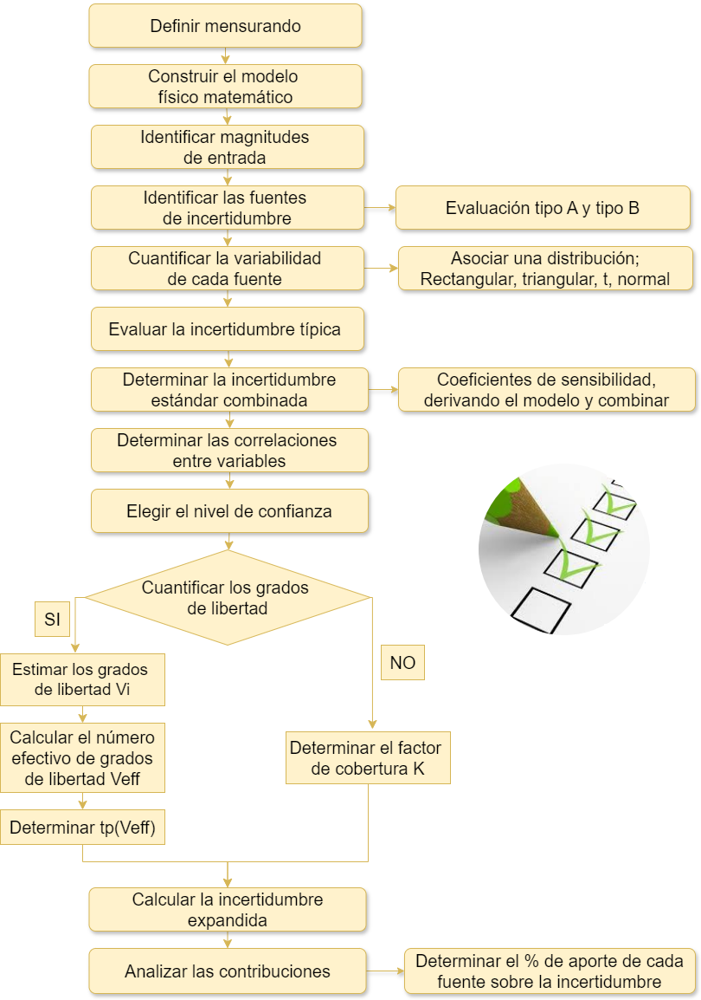

## GUM JCGM 100:2008 Guía para la expresión de la incertidumbre de medición

```{r, echo=F, out.width="50%", fig.align='center'}
knitr::include_graphics("imagen/GUM.png")
```


Reglas generales para evaluar y expresar la incertidumbre de medición Aplicable en diversos campos de mediciones, incluyendo las necesarias para:

• Mantener el control y el aseguramiento de la calidad en producción

• Cumplir con leyes y reglamentos

• Apoyar I+D aplicados en ciencia e ingeniería

• Calibrar patrones, equipos y realizar ensayos para demostrar trazabilidad

• Desarrollar, mantener y comparar patrones físicos y materiales de referencia


### PASOS PARA LA  ESTIMACIÓN DE INCERTIDUMBRE ISO-GUM


```{r, echo=F, out.width="80%", fig.align='center'}

```

sdasdas

```{r, echo=F, out.width="80%", fig.align='center'}
knitr::include_graphics("imagen/tc.png")
```

