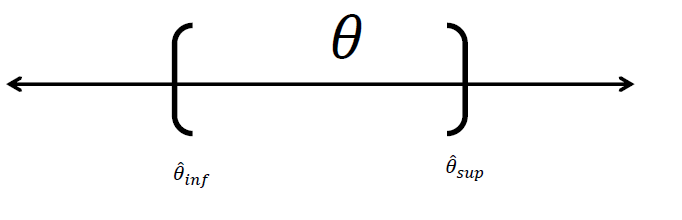

[Fórmulas](https://github.com/estadisticaITM/estadisticaITM.github.io/blob/master/f%C3%B3rmulas.pdf)

<a href="tallerIC.html" target="_blank"> Taller intervalos de confianza</a>

```{r echo=FALSE,out.width="80%",fig.align='center'}
library(DiagrammeR)
# A minimal plot
DiagrammeR("graph LR;

           A[Población]-->|Distribuciones de muestreo| B[Muestra]
           B-->|Inferencial IC PH| A
           
           ")

```


# Estimación por intervalo


Una estimación por intervalo de un parámetro $\theta$ de la población es un intervalo de la forma: 

$$\Large \hat \theta_{inf}<\theta<\hat \theta_{sup}$$
Donde los valores estimados dependen del valor estimado de $\theta$ y de la distribución de muestreo.


```{r, echo=F, out.width="80%", fig.align='center'}

```

 
# Intervalo de confianza

La inferencia estadística consiste en aquellos métodos por medio de los cuales se realizan inferencias o generalizaciones acerca de una población. 


<iframe width="280" height="160" src="https://www.youtube.com/embed/cMqgG_lBC2U" title="Estimación puntual y estimación por intervalo para un parámetro" frameborder="0" allow="accelerometer; autoplay; clipboard-write; encrypted-media; gyroscope; picture-in-picture; web-share" referrerpolicy="strict-origin-when-cross-origin" allowfullscreen></iframe>

# Nivel de confianza y de significancia

<iframe width="280" height="160" src="https://www.youtube.com/embed/YDFzX4fT1BU" title="¿Qué es el Nivel de Confianza de un intervalo?" frameborder="0" allow="accelerometer; autoplay; clipboard-write; encrypted-media; gyroscope; picture-in-picture; web-share" referrerpolicy="strict-origin-when-cross-origin" allowfullscreen></iframe>
**Nivel de confianza:** 

Probabilidad máxima con la que se asegura que un parámetro a estimar se encuentra dentro de un intervalo estimado.

**Nivel de significancia:**

Máximo error que se comete en la estimación usualmente se denota como $\alpha$.

$$\Large NC+\alpha=1$$
Si se construyen 100 intervalos de la forma $\hat \theta_{inf}<\theta<\hat \theta_{sup}$ con un NC=0.97 entonces se espera que 97 de los 100 intervalos contengan el parámetro $\theta$


## Nivel de confianza


**Qué es el nivel de confianza**

<iframe width="280" height="160" src="https://www.youtube.com/embed/YDFzX4fT1BU?list=RDCMUCMLQ_dQirjjwPjR8skwX3gA" title="YouTube video player" frameborder="0" allow="accelerometer; autoplay; clipboard-write; encrypted-media; gyroscope; picture-in-picture" allowfullscreen></iframe>

- Probabilidad máxima con la que podríamos asegurar que el parámetro a estimar se encuentra dentro de nuestro intervalo estimado.

- Representa el porcentaje de intervalos que tomados de 100 muestras independientes distintas contienen en realidad el valor desconocido.


```{r echo=F, out.height=250, out.width=350}
knitr::include_graphics("imagen/nc.png")
```

**Ejemplo:**

Si se construyen 100 intervalos de la forma $\hat \theta_{inf}< \theta <\hat \theta_{sup}$ con un nivel de confianza NC=0.97 entonces se espera que 97 de los 100 intervalos contengan el parámetro $\theta$

## Nivel de significancia 

- Es la probabilidad máxima que asumimos de forma voluntaria de equivocarnos al rechazar la hipótesis nula cuando en realidad es cierta. 

- Máximo error que queremos cometer en nuestra estimación o contraste.


```{r echo=F, out.height=250, out.width=350}
knitr::include_graphics("imagen/ns.png")
```


$$\Huge NC+\alpha=100\% $$

|NC  |NS $\alpha$|$Z_\alpha$| $\alpha/2$|$Z_{\alpha/2}$|
|----|-----------|----------|-----------|--------------|
|90% |10%        |          |         5%|              |
|95% | 5%        |          |     2.5%  |              |
|99% |1%         |          |   0.05%   |              |


# Intervalo de confianza para una muestra

## IC para la media


```{r echo=FALSE}
library(DiagrammeR)

DiagrammeR("graph TB;
  
  A{sigma conocida}-->|Si| C[Normal]
  A-->|No| B{n mayor q 30}
  B-->|No| D[t student]
  B-->|Si| C
  
           ")
            
```


### con la varianza conocida

Si $\bar x$ es la media de una muestra aleatoria de tamaño 𝑛 de una población normal con varianza $\sigma^2$ conocida, un intervalo de
confianza del 1 − 𝛼 100% para 𝜇 está dado por:


$$\Large \bar x-Z_{\alpha/2} \frac{\sigma}{\sqrt n} \leq \mu \leq \bar x+Z_{\alpha/2} \frac{\sigma}{\sqrt n}$$

donde $Z_{\alpha/2}$ es el valor z que deja un área de 𝛼/2 a la derecha.


**Ejemplo**
Una muestra aleatoria de 110 relámpagos dieron por resultado una duración de eco de radar promedio muestral de 0.81 segundos y una desviación estándar de 0.34 segundos. Calcule un intervalo de confianza de 95% para la duración de eco promedio e interprete el intervalo resultante

```{r echo=TRUE}
library(BSDA)
zsum.test(mean.x=0.81,sigma.x=0.34, n.x=110,conf.level=0.95)

```


*Intervalo de confianza para la media con varianza conocida*

<iframe width="280" height="160" src="https://www.youtube.com/embed/tnDFgEv_a-I" title="Intervalo de confianza para la media con varianza conocida" frameborder="0" allow="accelerometer; autoplay; clipboard-write; encrypted-media; gyroscope; picture-in-picture; web-share" referrerpolicy="strict-origin-when-cross-origin" allowfullscreen></iframe>


### con la varianza desconocida

Si $\bar x$ es la media de una muestra aleatoria de tamaño 𝑛 de una población normal con varianza $\sigma^2$ desconocida, un intervalo de confianza del 1 − 𝛼 100% para 𝜇 está dado por:


$$\Large \bar x-t_{\alpha/2} \frac{s}{\sqrt n} \leq \mu \leq \bar x+t_{\alpha/2} \frac{s}{\sqrt n}$$

donde $Z_{\alpha/2}$ es el valor z que deja un área de 𝛼/2 a la derecha.


**Ejemplo**
Se tienen los datos de las horas de ejercicio que hacen 10 adolescentes por semana, calcule un intervalo de confianza para el tiempo promedio con un NC del 90%


```{r echo=TRUE}

library(carData)

carData::Blackmore$exercise[1:10]

x=carData::Blackmore$exercise[1:10]

t.test(x=x,conf.level = 0.9)

```
*Intervalo de confianza para la media con varianza desconocida*
<iframe width="280" height="160" src="https://www.youtube.com/embed/ALlp1avfggM" title="Intervalo de confianza para la media con varianza desconocia" frameborder="0" allow="accelerometer; autoplay; clipboard-write; encrypted-media; gyroscope; picture-in-picture; web-share" referrerpolicy="strict-origin-when-cross-origin" allowfullscreen></iframe>

## IC para la proporción

Si $\hat p$ es la proporción de éxitos en una muestra aleatoria de tamaño 𝑛, un intervalo de confianza aproximado de (1−𝛼) 100% para 𝑝 está dado por 

$$\Large \hat p-Z_{\alpha/2} \sqrt{\frac{\hat p(1-\hat p)}{n}}\leq p \leq \hat p+Z_{\alpha/2} \sqrt{\frac{\hat p(1-\hat p)}{n}} $$


donde $𝑍_{𝛼/2}$  es el valor z que deja un área de 𝛼/2 a la derecha. Nota: usar solo cuando 𝑛𝑝≥50 y 𝑛(1 −𝑝)≥50

**EJEMPLO**
Se seleccionó una muestra de 487 mujeres no fumadoras de peso normal (que había dado a luz). 7.2% de estos nacimientos dieron por resultado niños con bajo peso al nacer (menos de 2500 g). Calcule un intervalo de confianza con un nivel de confianza del 93% para la proporción de todos esos nacimientos que dieron por resultado niños de bajo peso al nacer.

```{r echo=TRUE}
prop.test(x=72,n=1000,conf.level=0.93)
```


*Intervalo de confianza para la proporción*

<iframe width="280" height="160" src="https://www.youtube.com/embed/oJv6d9IECRo" title="Intervalo de confianza para una proporción" frameborder="0" allow="accelerometer; autoplay; clipboard-write; encrypted-media; gyroscope; picture-in-picture; web-share" referrerpolicy="strict-origin-when-cross-origin" allowfullscreen></iframe>


## IC para la varianza

Si $𝑠^2$ es la varianza de una muestra aleatoria de tamaño 𝑛 de una población normal, un intervalo de confianza aproximado de (1−𝛼) 100% para $𝜎^2$ está dado por 

$$\Large \frac {(n−1)𝑠^2}{\chi^2_{ \frac {𝛼} {2},𝑛−1} } <𝜎^2<\frac {(n−1)𝑠^2}{\chi^2_{1- \frac {𝛼} {2},𝑛−1} }$$

donde los denominadores son obtenidos de una chi-cuadrada. 
Nota: un intervalo de confianza para 𝜎 se puede obtener tomando raíz cuadrada en los límites del intervalo anterior.

**Ejemplo**

Se tienen los datos de las horas de ejercicio que hacen 10 adolescentes por semana, calcule un intervalo de confianza para la varianza del tiempo con un NC del 98%.

```{r echo=TRUE}

library(EnvStats)
library(carData)

carData::Blackmore$exercise[1:10]

x=carData::Blackmore$exercise[1:10]

varTest(x, conf.level=0.95)

```

*Intervalo de confianza para la varianza*

<iframe width="280" height="160" src="https://www.youtube.com/embed/Pw66ZHxzAF4?list=RDCMUCMLQ_dQirjjwPjR8skwX3gA" title="YouTube video player" frameborder="0" allow="accelerometer; autoplay; clipboard-write; encrypted-media; gyroscope; picture-in-picture" allowfullscreen></iframe>


# Intervalos de confianza para dos muestras

## IC para la diferencia de medias

Si el intervalo contiene el cero significa que hay igualdad entre medias
 
 
### Con varianzas conocidas

Si$\bar x_1$ y $\bar x_2$son las medias muestrales aleatorias independientes de tamaño $n_1$ y $n_2$ de poblaciones normales con varianzas conocidas $\sigma_1$ y $\sigma_2$ respectivamente, un intervalo de confianza de 1-𝛼 100 para $\mu_1-\mu_2$ está dado por:

$$\Large (\bar x_1-\bar x_2)-Z_{\frac{\alpha}{2}}\sqrt{\left( \frac{\sigma_1^2}{n_1}\right)+\left( \frac{\sigma_2^2}{n_2}\right)}<\mu_1-\mu_2<
(\bar x_1-\bar x_2)+Z_{\frac{\alpha}{2}}\sqrt{\left( \frac{\sigma_1^2}{n_1}\right)+\left( \frac{\sigma_2^2}{n_2}\right)}$$

### Con varianzas desconocidas pero iguales

Si$\bar x_1$ y $\bar x_2$son las medias muestrales aleatorias independientes de tamaño $n_1$ y $n_2$ de poblaciones normales con varianzas iguales pero desconocidas $\sigma_1$2𝑦$\sigma_2$ respectivamente, un intervalo de confianza de (1-𝛼)100% para $\mu_1-\mu_2$ está dado por:

$$\Large (\bar x_1-\bar x_2)-t_{\frac{\alpha}{2},v}S_p\sqrt{\left( \frac{1}{n_1}\right)+\left( \frac{1}{n_2} \right)}<\mu_1-\mu_2< (\bar x_1-\bar x_2)+ t_{\frac{\alpha}{2},v}S_p\sqrt{\left( \frac{1}{n_1}\right)+\left( \frac{1}{n_2}\right)}$$
$$v=n_1-n_2-2$$

$$S^2_p=\frac{(n_1)S_1^2+(n_2)S_2^2}{n_1+n_2-2}$$

*Intervalo de confianza para la diferencia de medias con varianzas iguales*

<iframe width="280" height="160" src="https://www.youtube.com/embed/aMOINMuUXVc?list=RDCMUCMLQ_dQirjjwPjR8skwX3gA" title="YouTube video player" frameborder="0" allow="accelerometer; autoplay; clipboard-write; encrypted-media; gyroscope; picture-in-picture" allowfullscreen></iframe>


### Con varianzas desconocidas y diferentes

Si$\bar x_1$ y $\bar x_2$son las medias muestrales aleatorias independientes de tamaño $n_1$ y $n_2$ de poblaciones normales con varianzas iguales pero desconocidas $\sigma_1$2𝑦$\sigma_2$ respectivamente, un intervalo de confianza de (1-𝛼)100% para $\mu_1-\mu_2$ está dado por:

$$\Large (\bar x_1-\bar x_2)-t_{\frac{\alpha}{2},v}\sqrt{\left( \frac{S_1^2}{n_1}\right)+\left( \frac{S_2^2}{n_2} \right)}<\mu_1-\mu_2< (\bar x_1-\bar x_2)+ t_{\frac{\alpha}{2},v}\sqrt{\left( \frac{S_1^2}{n_1}\right)+\left( \frac{S_2^2}{n_2} \right)}$$
$$v=\frac{\left( \left( \frac{S_1^2}{n_1}\right)+\left( \frac{S_2^2}{n_2} \right) \right) ^2}{\frac{\left( \frac{S_1^2}{n_1}\right)^2}{n_1-1}+\frac{\left( \frac{S_1^2}{n_1}\right)^2}{n_2-1}}$$

*Intervalo de confianza para la diferencia de medias con varianzas desconocidas y diferentes*

<iframe width="280" height="160" src="https://www.youtube.com/embed/YIImQIRDGMg?list=PLfX5C7cc6LRKG-OUUatElez6mzu1B9UjR" title="YouTube video player" frameborder="0" allow="accelerometer; autoplay; clipboard-write; encrypted-media; gyroscope; picture-in-picture" allowfullscreen></iframe>


## IC para la razón de varianzas

Entre los diferentes usos que se le da a este intervalo de confianza el principal consiste en determinar si hay igualdad entre dos varianzas, esto se afirma si el intervalo contiene al 1, de contenerlo se dice que hay evidencia de que las varianzas poblacionales son iguales.

$$\Large \frac{S_1^2}{S_2^2}f_{\frac{\alpha}{2},n_2-1,n_1-1}<\frac{\sigma_1^2}{\sigma_2^2}<\frac{S_1^2}{S_2^2}*f_{1-\frac{\alpha}{2},n_2-1,n_1-1}$$


*Intervalo de confianza para la razón de varianzas*

<iframe width="280" height="160" src="https://www.youtube.com/embed/SzXfVJbPh-0?list=PLfX5C7cc6LRKG-OUUatElez6mzu1B9UjR" title="YouTube video player" frameborder="0" allow="accelerometer; autoplay; clipboard-write; encrypted-media; gyroscope; picture-in-picture" allowfullscreen></iframe>

**EJEMPLO**

Se realizó una prueba para comparar un método nuevo con el método estándar. Se entrenaron dos grupos de 9 nuevos empleados cada grupo durante un período de un mes; Se midió el tiempo en minutos que necesito cada empleado en armar cierto dispositivo al final del período de entrenamiento; los resultados obtenidos fueron:


```{r echo=TRUE}
E<-c(32,37,35,28,41,44,35,31,34)
N<-c(35,31,29,25,34,40,27,32,31)

```


Admitiendo que el tiempo de armado utilizado en ambos métodos son variables aleatorias independientes y distribuidas normalmente: 

1. ¿Tiene igual varianza? 

```{r echo=TRUE}
###prueba de varianza
var.test(E,N)
```


¿Se puede aceptar la hipótesis de igualdad de tiempos de armado, en función de los datos y con un nivel de confianza del 95%?

```{r echo=TRUE}
t.test (E,N,paired=T,conf.level=0.95)
```


## IC para la diferencia de proporciones

$\bar p_x$ y $\bar p_y$son las proporciones de éxito de dos muestras aleatorias independientes de tamaño $n_1$ y $n_2$, entonces un intervalo de confianza de (1 −𝛼) 100% para $𝑝1−𝑝2$ está dado por:


$$\Large (\bar p_x-\bar p_y)-Z_{\frac{\alpha}{2}}\sqrt{\frac{p_x q_x}{n_x}+ \frac{p_y q_y}{n_y}}<p_x-p_y<(\bar p_x-\bar p_y)+Z_{\frac{\alpha}{2}}\sqrt{\frac{p_x q_x}{n_x}+ \frac{p_y q_y}{n_y}}$$
Si el intervalo contiene el cero significa que hay igualdad entre medias


*Intervalo de confianza para la diferencia de proporciones*

<iframe width="280" height="160" src="https://www.youtube.com/embed/Bwbe7cvkDn4?list=PLfX5C7cc6LRKG-OUUatElez6mzu1B9UjR" title="YouTube video player" frameborder="0" allow="accelerometer; autoplay; clipboard-write; encrypted-media; gyroscope; picture-in-picture" allowfullscreen></iframe>

**Ejemplo**
Dos grupos son considerados en un grupo sobre la efectividad de una nueva vacuna. El primer grupo, que recibe la vacuna contiene 200.745 individuos. El Segundo grupo, que recibe un placebo consiste de 201.229 individuos. Hubo 57 casos de enfermedad en el primer grupo y 142 casos en el segundo grupo. se desea saber si la vacuna es o no eficiente, use un intervalo de confianza con un nivel de significancia $\alpha=0.05$ para conocer las relaciones entre las proporciones p1 y p2.

```{r echo=TRUE}
x <- c(57,142)
n <- c(200745,201229)
prop.test(x, n)
```


Halle un intervalo de confianza al 95% para la diferencia de proporciones. Que concluye


## Intervalo de confianza para la diferencia de medias pareadas
Si $\hat d$ y $𝑠_𝑑$ son la media y la desviación estándar de las diferencias distribuidas normalmente de 𝑛pares aleatorios de mediciones, entonces un intervalo de confianza de (1-𝛼)100% para $𝜇_𝑑=𝜇_1-𝜇_2$
está dado por:

$$\Large \bar d-t_{\alpha/2} \frac{s}{\sqrt n} \leq \mu \leq \bar d+t_{\alpha/2} \frac{s}{\sqrt n}$$
**Ejemplo**
Se tienen los datos del coeficiente intelectual verbal y matemático de un grupo de personas,  se desea saber si hay diferencias entre los coeficientes, use un intervalo de confianza para la diferencia pareada del 92%


```{r echo=TRUE}
#IQ MATEMATICO
iqm=carData::Wong$piq[1:10]

#IQ VERBAL
iq=carData::Wong$viq[1:10]

t.test(x=iqm,y=iq, paired = TRUE,conf.level = 0.92)
```


*Intervalo de confianza para la diferencia de medias pareadas*

<iframe width="280" height="160" src="https://www.youtube.com/embed/hcEaKfN28Y0?list=PLfX5C7cc6LRKG-OUUatElez6mzu1B9UjR" title="YouTube video player" frameborder="0" allow="accelerometer; autoplay; clipboard-write; encrypted-media; gyroscope; picture-in-picture" allowfullscreen></iframe>

<a href="tallerIC.html" target="_blank"> Taller intervalos de confianza</a>

