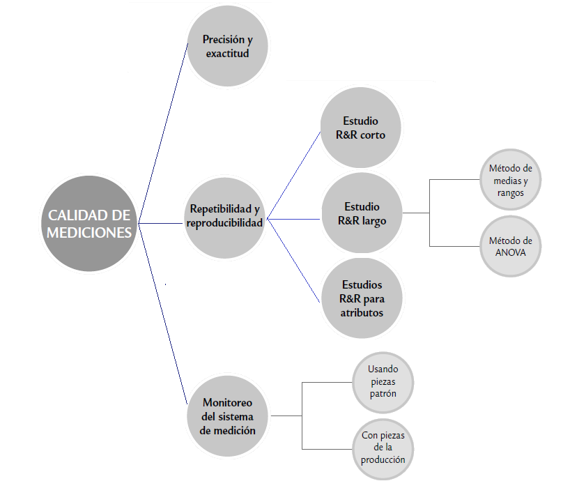
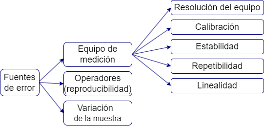

```{r, echo=F, out.width="60%", fig.align='center'}

```


Se evalúa qué parte de la variabilidad total  es atribuible al error de medición; además, permite cuantificar si este error es mucho o poco en comparación con la variabilidad del producto y con las tolerancias de la característica de calidad que se mide. Cualquier proceso de medición genera un error. Lo que se observa es la realidad más un error de medición.


```{r, echo=F, out.width="60%", fig.align='center'}

```


Los métodos utilizados para realizar los análisis de R&R son:

- Método del rango (método corto)

- Método del promedio y del rango

- Análisis de varianza (Anova); considera un modelo de efectos aleatorios para todos los factores de la variación del sistema (operadores, partes, interacción e instrumento)


Sean:

- $σ^2_{total}$  la variabilidad total observada

- $σ^2_{prod}$ la varianza atribuible al producto (partes o piezas)

- $σ^2_{instr}$ la variabilidad  del instrumento de medición, 

- $σ^2_{oper}$ la variabilidad o error debido a operadores


**Pasos para realizar un estudio R&R largo**

para cada instrumento de medición que se desee evaluar es necesario plantear un estudio en el que se apliquen los siguientes pasos:

**1.** Seleccionar 


   - Dos o más operadores para conducir el estudio acerca del instrumento de medición de interés.
   
   
   - 10 o más partes o piezas que serán medidas varias veces por cada operador. 

**2.** Decidir el número de ensayos o veces que cada operador medirá la misma pieza.  por lo menos dos ó tres ensayos  es lo más recomendable.

**3.** Identificar la zona o punto en la parte donde la medición será tomada, así como el método o técnica que deberá aplicarse.

**4.** Obtener en orden aleatorio la primera medición (o ensayo) del operador A para todas las piezas seleccionadas.

**5.** Volver a aleatorizar las piezas y obtener la primera medición del operador B.

**6.** Continuar hasta que todos los operadores hayan realizado la primera medición de todas las piezas.

**7.** Hacer el análisis estadístico de los datos.


## ANOVA para el estudio de repetibilidad y reproducibilidad

Permite identificar y cuantificar de mejor manera todas las fuentes de variación presentes en el estudio R&R. 


**Prueba de hipótesis de significancia de los parámetros**

Parámetro no significativo

$$H_0=\beta_i=0$$
Parámetro significativo

$$H_1=\beta_i \neq  0$$

### Modelo anova con interacción significativa

El modelo de efectos fijos corresponde a:

$$\large Y_{ijk}=\mu+\alpha_i+\beta_j+(\alpha\beta)_{ij} +\varepsilon_{ijk}$$
Donde:

- $Y_{ijk}$ es la  k ésima respuesta para alfa i ésima observación, beta j-ésima observación.

- $\large \mu$ es la media global del modelo

- $\large \alpha_i$ es el efecto de la i-ésima observación

- $\large \beta_j$ es el efecto de la j-ésimo observación

- $\large (\alpha\beta)_{ij}$ es el efecto de la interacción entre la i-esima y  j-ésimo observación

- $\large \varepsilon_{ijk}$ es el error aleatorio.

sujeto a :

$$\varepsilon_{ijk} \sim N(0,\sigma^2) \qquad \sum_{i=1}^o \alpha_i=0 \qquad \sum_{j=1}^p \beta_j=0 \qquad \sum_{j=1}^o (\alpha\beta)_{ij}=0 \qquad \sum_{i=1}^p (\alpha\beta)_{ij}=0$$
En caso de que la interacción sea significativa el método de ANOVA  reparte la variación total $σ^2_{total}$ de los datos en la siguiente forma:

$$σ^2_{total}=σ^2_{parte}+σ^2_{oper}+σ^2_{oper×parte}+σ^2_{instr}$$
donde se agrega el componente de interacción entre el operador y la parte, el mismo que se considera parte de la reproducibilidad. Es decir, se cumplen las siguientes relaciones:

$$σ^2_{repeti}=σ^2_{instr}$$
$$σ^2_{reprod} = σ^2_{oper} + σ^2_{oper × parte}$$
$$σ^2_{RyR}=σ^2_{repet}+σ^2_{reprod}$$


Estos componentes se estiman mediante la técnica de
ANOVA aplicada a un diseño factorial con efectos aleatorios.


Considere

- p partes, 

- t ensayos 

- o operadores, 

los grados de libertad correspondientes a cada suma de cuadrados de la ecuación anterior son, respectivamente,


$$opt − 1 = (p − 1) + (o − 1) + (o − 1)( p − 1) + op(t − 1)$$
Al dividir cada suma de cuadrados por sus grados de libertad se obtienen los cuadrados medios (CM),  con ellos se pueden construir pruebas estadísticas para verificar diferencias entre las partes, entre los operadores y la presencia de efecto de interacción operador × parte.


La tabla anova está definida de la forma


|Fuente de variación|Grados de libertad|Suma de cuadrados|cuadrados medios |Estadístico|Valor p|
|:-----------------:|:----------------:|:---------------:|:----------------:|:-----------------------:|
|operador |o-1  |$SC_o$ |$MS_O=\frac{SC_o}{(o-1)}$|$F_0=MS_o/MSE$|$P(f_{a-1,N-a}>F_0)$|
|parte    |p-1  |$SC_p$ |$MC_p=\frac{SC_p}{(p-1)}$|$F_0=MC_p/MSE$|$P(f_{a-1,N-a}>F_0)$|
|Operador*parte| $(o-1)\ast(p-1)$|$SC_{op}$|$MC_{op}=\frac{SC_{op}}{(o-1)\ast(p-1)}$|$F_0=MC_{op}/MSE$|$P(f_{a-1,N-a}>F_0)$|
|Error(instrumento)   |op(t-1) |$SC_e$     |$MC_e=\frac{SC_e}{op(t-1)}$|             |                    |
|Total               |opt-1               |SCT     |               |             |                    |


Donde la suma de cuadrados del error (SCe) corresponde a la Repetibilidad; es decir, al error en las mediciones debido al instrumento de medición.


Las sumas de cuadrados (SC) correspondientes a cada componente de variación cumplen la relación

$$ SC_{total}=SC_{parte}+SC_{oper}+SC_{oper×parte}+ SC_{error}$$


### Modelo anova sin interacción significativa

El modelo de efectos fijos corresponde a:

$$\large Y_{ijk}=\mu+\alpha_i+\beta_j +\varepsilon_{ijk}$$
Donde:

- $Y_{ijk}$ es la  k ésima respuesta para la combinación ij  

- $\large \mu$ es la media global del modelo

- $\large \alpha_i$ es el efecto de la i-ésima observación

- $\large \beta_j$ es el efecto de la j-ésimo observación

- $\large \varepsilon_{ijk}$ es el error aleatorio, q se considera la repetibilidad dada por el instrumento. 

sujeto a :

$$\varepsilon_{ijk} \sim N(0,\sigma^2) \qquad \sum_{i=1}^o \alpha_i=0 \qquad \sum_{j=1}^p \beta_j=0 $$
Cumpliendo la siguiente relación:


$$σ^2_{total}=σ^2_{prod}+σ^2_{instr}+σ^2_{oper}$$
donde la varianza del instrumento se toma como el error del modelo MCe


$$σ^2_{instr}=σ^2_{repeti}$$


$$σ^2_{Oper}=σ^2_{reprod}$$ 


Por lo tanto, el error o variabilidad de las mediciones debido a repetibilidad y reproducibilidad se obtiene con


$$σ^2_{RyR}=σ^2_{repet}+σ^2_{reprod}$$

La tabla anova está definida de la forma


|Fuente de variación|Grados de libertad|Suma de cuadrados|cuadrados medios |Estadístico|Valor p|
|:-----------------:|:----------------:|:---------------:|:----------------:|:-----------------------:|
|operador |o-1  |$SC_o$ |$MS_O=\frac{SC_o}{(o-1)}$|$F_0=MS_o/MSE$|$P(f_{a-1,N-a}>F_0)$|
|parte    |p-1  |$SC_p$ |$MC_p=\frac{SC_p}{(p-1)}$|$F_0=MC_p/MSE$|$P(f_{a-1,N-a}>F_0)$|
|Error(instrumento)   |opt-o-p+1 |$SC_e$     |$MC_e=\frac{SC_e}{opt-o-p+1}$|             |                    |
|Total               |opt-1               |SCT     |               |             |                    |


## Medidas a  tener en cuenta para el análisis de R&R


### Varianza para cada una de las componentes
Varianza del operador = varianza de la reproducibilidad

$$\sigma^2_{op}=\frac{MC_o-MC_{op}}{tp}$$
Varianza de la parte o pieza

$$\sigma^2_{parte}=\frac{MC_p-MC_{op}}{to}$$
Varianza de la interacción 

$$\sigma^2_{op*par}=\frac{MC_{op}-MC_e}{t}$$
Varianza del instrumento = Varianza de la repetibilidad
$$\sigma^2_{inst}=MCe$$
**Nota:**

En caso tal que la interacción  no se considere significativa el termino $MC_{op}$ es reemplazado por $MC_e$


_____________________________________________________________________________________________________________________________________________


### Índice de presición / tolerancia


La RyR estiman la dispersión que cubre un 99% (5.15σ) de las variaciones debidas al equipo de medición y a los operadores respectivamente. La tolerancia del sistema también se ve afectada por variabilidad de cada componente del análisis, el cálculo para obtener el porcentaje de esta afectación se puede realizar mediante los índices de precisión/tolerancia (IP/T), para cada uno de los componentes


$$Repetibilidad=\frac{\sqrt{\sigma^2_{inst}}*5.15*100}{tolerancia}$$

$$Reproducibilidad=\frac{\sqrt{\sigma^2_{oper}}*5.15*100}{tolerancia}$$

$$RyR=\frac{\sqrt{\sigma^2_{inst}*\sigma^2_{oper}}*5.15*100}{tolerancia}$$

$$Parte=\frac{\sqrt{\sigma^2_{parte}}*5.15*100}{tolerancia}$$
El criterio para establecer si el sistema de medición es preciso, con base al índice de precisión/tolerancia (IP/T) del medidor Gage R&R total, es el siguiente:


|Rango del IP/T            |Sistema de medición|
|:------------------------:|:-----------------:|
|$IP/T_{R\&R} ≤ 10\%$      |      Excelente    |
|$10\% <IP/T_{R\&R} ≤ 20\%$|            Bueno  |
|$20\% <IP/T_{R\&R} ≤ 30\%$|           Marginal|
|$IP/T_{R\&R} ≥ 30\%$      |       Inaceptable |

_________________________________________________________________________________________________________________________________________________________________________

### Relación entre repetibilidad y reproducibilidad


**si la Repetibilidad >> Reproducibilidad**, entonces:


El instrumento de medición necesita mantenimiento.

El instrumento de medición está obsoleto y requiere un rediseño.

El lugar donde se efectúan las mediciones necesita ser mejorado.

Existe una variabilidad excesiva entre las partes.

___________________________________________________________________

**Si la Reproducibilidad >> la Repetibilidad**, entonces:


Los operadores necesitan mejor entrenamiento en la utilización y lectura del instrumento de medición.

La indicación del instrumento de medición no es clara.

No se han mantenido condiciones de Reproducibilidad buenas y/o el instrumento de medición presenta deriva.


___________________________________________________________________________________________________________________________________________
### Porcentaje de contribución a la varianza

Es el cociente de cada componente de varianza con respecto a la varianza total $(σ^2_{comp}/σ^2_{total})$, provee una interpretación en la escala de las varianzas.

- si la contribución es menor que 10% el sistema de medición es aceptable, 

-  la contribución máxima debe ser del  1% para que sea excelente


### Número de categorías

el valor de nc indica el número de grupos diferentes de piezas que el sistema de medición es capaz de distinguir, lo cual tiene relación directa con la resolución con la que éste mide la característica de interés.


Calcular el número de categorías distintas o distinguibles, nc.  se calcula con 

$$n_c= \sqrt2 (σ^2_{parte}/σ^2_{R\&R})$$ 

se interpreta como el número de intervalos de confianza al 97% no traslapados, y basados en el error de medición, que caben en el ancho de la variación
de las partes. 

Por esto  La interpretación de la calidad del sistema
de medición en términos del valor de nc se hace de acuerdo con:

• Si nc > 4, la resolución del sistema de medición es adecuada.

• Si nc < 2, la resolución del sistema de medición es claramente inadecuada.

• Si 2 ≤ nc ≤ 4, tiene una resolución poco adecuada.


**Ejemplo**

Un fabricante de baterías hace varios tipos de baterías/pilas para uso doméstico. se quiere empezar un proyecto Seis Sigma para mejorar la línea de producción de las pilas de voltaje 1.5. 

Se tiene la variable “voltaje”, 2 voltímetros disponibles y 3 pilas diferentes son seleccionadas al azar al final de la línea de producción. Se mide el voltaje de cada pila con cada voltímetro 3 veces. Los datos son los siguientes:


```{r }
library(ggplot2)
voltmeter = factor(rep(1:2, each = 9))
battery = factor(rep(rep(1:3, each = 3), 2))
run = factor(rep(1:3, 6))
voltage = c(1.4727, 1.4206, 1.4754, 1.5083, 1.5739, 1.4341, 1.5517, 1.5483, 1.4614,1.3337,1.6078, 1.4767, 1.4066, 1.5951, 1.8419,1.7087, 1.8259, 1.5444)
batteries = data.frame(voltmeter, battery,run, voltage)
batteries
ggplot(batteries,aes(voltmeter,voltage))+geom_boxplot(aes(colour=battery))


```

para este modelo se identifican

- O operadores, voltímetros = 2

- t ensayos, repeticiones de cada experimento = 3

- piezas = 3


El modelo de efectos fijos corresponde a:

$$\large Y_{ijk}=\mu+\alpha_i+\beta_j +\varepsilon_{ijk}$$
Donde:

- $Y_{ijk}$ es la  k ésima respuesta para la combinación ij  

- $\large \mu$ es la media global del modelo

- $\large \alpha_i$ es el efecto de la i-ésima pila medida  (3) gl=(o-1)=2

- $\large \beta_j$ es el efecto de la j-ésimo voltímetro  (2) gl=(p-1)=1

- $\large \varepsilon_{ijk}$ es el error aleatorio, q se considera la repetibilidad dada por el instrumento. gl=op(t-1)

sujeto a :

$$\varepsilon_{ijk} \sim N(0,\sigma^2) \qquad \sum_{i=1}^3 \alpha_i=0 \qquad \sum_{j=1}^2 \beta_j=0 $$


```{r fig.height=14}

anova=aov(voltage ~ voltmeter+battery+voltmeter*battery)
summary(anova)


library(SixSigma)
#ss.rr(var, part, appr, data, main, sub)
my.rr <- ss.rr(var = voltage, part = battery,
               appr = voltmeter,
               data = batteries,
               main = "Six Sigma Gage R&R Measure",
               sub = "Batteries Project MSA")


```


**Conclusiones de R&R**

- El modelo no representa significativa la interacción entre el operario(voltímetro) y la batería (pila). 

- El aporte de las piezas a la varianza del modelo es muy poco 13.26%, cuando en realidad este valor debería ser mucho mayor. mientras que el aporte de R&R  es mucho mayor, en especial el aporte de la repetibilidad con un 71.05%, asociado a un mal manejo del instrumento

- Sistema identifica apenas un grupo lo cual quiere decir que la resolución del sistema de medición es inadecuada.

- La R&R contribuyen a un 90% de la variación del sistema, es decir que el sistema no mide bien. 


### Taller repetibilidad y reproducibilidad

En una compañía dedicada a la fabricación de bombas y válvulas, algunos componentes críticos tienen tolerancias muy estrechas que son difíciles de cumplir. De aquí que sea necesario estimar el error de medición con el fin de ver la posibilidad de reducirlo para cumplir con las especificaciones. El ancho de un componente particular es una característica de calidad crítica, cuyas especificaciones son 69 ± 0.4 mm. Se seleccionaron dos inspectores
para realizar un estudio R&R, y cada uno midió siete componentes dos veces con un vernier digital capaz de discriminar entre piezas que difieran en 0.02 mm. 

1. cual es la tolerancia de la medida

Los datos se muestran en la siguiente tabla.


```{r echo=FALSE}
medida= factor(rep(rep(1:2, each = 7),2))
insp= factor(rep(1:2, each = 14))
pza= factor(rep(1:7, 4))
dis = c(69.38,69.72,69.58,69.5,69.48,69.56,69.9,69.6,69.8,69.7,69.5,69.4,69.4,70.02,69.62,69.78,69.7,69.46,69.5,69.68,69.94,69.52,69.9,69.62,69.5,69.42,69.64,69.88)
datoss = data.frame(medida,insp,pza, dis)
datoss
```


2. La siguiente figura relaciona la medida de cada uno delos operarios en cada pieza, que se puede inferir.

```{r echo=FALSE}
library(ggplot2)

ggplot(datoss,aes(insp,dis))+
  geom_boxplot(aes(colour=pza))

```


3. Después de evaluar la significancia de cada una de las variables, escriba el modelo de efectos fijos asociado a la salida óptima del anova, con sus respectivas restricciones.

4. escriba la prueba de hipótesis de significancia del modelo

5. Interprete cada uno de los graficos que se ilustran. que se puede afirmar, ¿Cuál de los dos componentes, repetibilidad (instrumento) y reproducibilidad (operario), del error de medición tiene mayor contribución?

```{r fig.height=10}
anova=aov(dis ~ pza*insp)
summary(anova)


library(SixSigma)
#ss.rr(var, part, appr, data, main, sub)
my.rr <- ss.rr(var = dis, part = pza,
               appr = insp,
               data = datoss,
               main = "Six Sigma Gage R&R Measure",
               sub = "Batteries Project MSA")

```

6. que se puede afirmar del número de categorías

7. Calcule el índice P/T e interprete.


