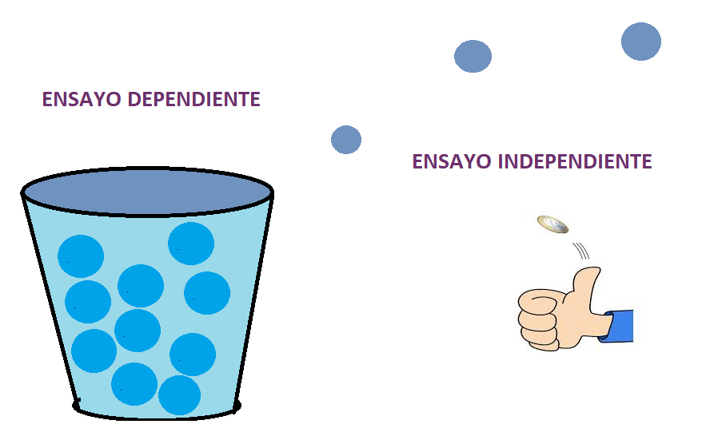
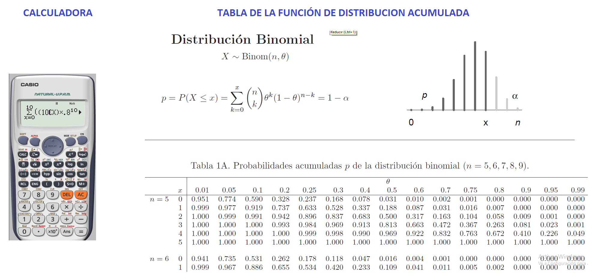

### Experimentos bernoulli

Cualquier variable aleatoria cuyos únicos valores posibles son 0 y 1 se llama variable aleatoria de Bernoulli, se utilizan para modelar fenómenos aleatorios que sólo tienen dos resultados posibles.

- Bueno o malo

- Hombre o Mujer

- Éxito o fracaso

- Al lanzar una moneda, comprobar si sale cara (éxito) o cruz (fracaso). Se suele suponer que una moneda tiene una probabilidad de éxito de 0,5.

- Al lanzar un dado, ver si se obtiene un seis (éxito) o cualquier otro valor (fracaso).

- Escoger un votante al azar, ver si este votará "sí" en un referéndum próximo.

- ¿Son verdes los ojos de una persona?

- ¿Decidió un cliente potencial comprar determinado producto?


```{r echo=F, fig.asp=0.7, fig.align='center'}

```


### Experimento binomial

- Consiste en una secuencia de n experimentos llamados ensayos, donde n se fija antes del experimento. 

- Las salidas de cada ensayo son independientes


```{r echo=F, fig.asp=0.7, fig.align='center'}

```


- Cada ensayo puede dar por resultado un éxito (E) o falla (F).

- Cada ensayo es determinado por el éxito o fracaso, 

- X es el numero de éxitos esperados Con $x=0,1,2...,n$, 

- La probabilidad de éxito en cada ensayo es constante (p), $0 \leq p \leq 1$

- La probabilidad de fracaso está dada por (q), $0 \leq q \leq 1$  

- El exito y fracaso son dos eventos complementarios

$$p+q=1$$


###    Función de distribución de probabilidad


 $$p(x=x)=f(x)=\displaystyle{n \choose x}p^x q^{n-x}$$
Si una variable aleatoria sigue una distribución binomial con parámetros n y p luego:

$$x\sim Bin(n,p)$$
**Media o valor esperado:**
$$E(X)=np$$

**Varianza**
$$V(X)=npq$$
**Desviación estándar:**
$$sd=\sqrt{npq}$$

### Función de distribución de probabilidad acumulada

 $$p(x\leq x)=F(x)=\sum_{x=0}^x\displaystyle{n \choose x}p^x q^{n-x}$$
 
 
**Graficos de la función de distribución binomial**

```{r echo=FALSE}

knitr::include_app("  https://jtrochezg.shinyapps.io/apppoison/",height = "800px")

```


Las probabilidades se pueden encontrar mediante tres formas diferentes por calculadora, por tabla, o por las funciones de R:

```{r echo=F, fig.asp=0.8, fig.align='center'}

```


###   Ejemplo

Una concentración particular de un producto químico detectado en agua contaminada se encuentra que es letal para 20% de los peces que queden expuestos a la concentración durante 24 horas. Veinte peces se colocan en un tanque que contiene esta concentración del producto químico en agua.

Los datos que suministra el enunciado son los siguientes:

- Sea x la variable aleatoria que representa los peces que sobreviven 

- Siendo así, la probabilidad p de sobrevivir es p=0.8, mientras que la probabilidad de no sobrevivir es q=0.2

- El numero de ensayos es n=20

$$p(x=x)=\displaystyle{n \choose x}p^x q^{n-x}$$
a Encuentre la probabilidad de que exactamente 14 sobrevivan.

 $$p(x=14)=\displaystyle{20 \choose 14}0.8^{14} 0.2^{6}=0.109$$
 **En R la respuesta es:**
 
```{r}
dbinom(14,size=20, prob=0.8)

```


b Encuentre la probabilidad de que al menos 10 sobrevivan.

Recordemos la forma de la función acumulada


 $$p(x\leq x)=F(x)=\sum_{x=0}^x\displaystyle{n \choose x}p^x q^{n-x}$$
 La probabilidad pedida es 
$$P(x \geq 10)=1-p(x\leq 9)=1-\sum_{x=0}^9\displaystyle{20 \choose x}0.8^x 0.2^{20-x}=0.999436$$
**En R la respuesta es:**


**Nota: **

El argumento lower tail si es falso, es equivalente a $P(X>x)$, es por ello que la probabilidad de al menos 10 se debe evaluar en el valor anterior 9.

```{r}
pbinom(9,20,lower.tail = FALSE,prob=0.8)
```


c Encuentre la probabilidad de que a lo sumo 16 sobrevivan.


 La probabilidad pedida es 
$$P(x \leq 16)=\sum_{x=0}^{16}\displaystyle{20 \choose x}0.8^x 0.2^{20-x}=0.5885$$
En R la respuesta es:
```{r}
pbinom(16,20, prob = 0.8)
```

d Encuentre la media y la varianza del número que sobrevive.
Media
$$\mu=np=20*0.8=16$$
Varianza
$$Var=npq=20*0.8*0.2=0.32$$
Desviación estándar

$$sd=\sqrt {npq}=\sqrt {20*0.8*0.2}=\sqrt {3.2}=1.8$$

### Videos de interés


*Distribución de bernoulli*

<iframe width="280" height="160" src="https://www.youtube.com/embed/TX2ga6fZxxM" frameborder="0" allow="accelerometer; autoplay; encrypted-media; gyroscope; picture-in-picture" allowfullscreen></iframe>

*Distribución binomial*

<iframe width="280" height="160" src="https://www.youtube.com/embed/e_Yg9wivrP8" title="YouTube video player" frameborder="0" allow="accelerometer; autoplay; clipboard-write; encrypted-media; gyroscope; picture-in-picture" allowfullscreen></iframe>

<iframe width="280" height="160" src="https://www.youtube.com/embed/G1w5gZZaAOg" frameborder="0" allow="accelerometer; autoplay; encrypted-media; gyroscope; picture-in-picture" allowfullscreen></iframe>


### Ejercicios propuestos

1. El voltaje de una batería nueva puede ser aceptable (A) o inaceptable (U). 
Una linterna requiere dos baterías, así que las baterías serán independientemente seleccionadas y probadas hasta encontrar dos aceptables. Suponga que 90% de todas las baterías tienen voltajes aceptables. Sea Y el número de baterías que deben ser probadas.

a. ¿Cuál es p(2), es decir P(Y = 2)? Rta=0.81

b. ¿Cuál es p(3)? [Sugerencia: Existen dos resultados diferentes que producen Y=3.] Rta=0.162

c. Para tener Y=5, ¿qué debe ser cierto de la quinta batería seleccionada? Mencione los cuatro resultados con los cuales Y=5 y luego determine p(5).

d. Use el patrón de sus respuestas en los incisos a)–c) para obtener una fórmula general para p(y).


2. Una compañía que produce cristales finos sabe por experiencia que 10% de sus copas de mesa tienen imperfecciones cosméticas y deben ser clasificadas como “de segunda”. 

a. Entre seis copas seleccionadas al azar, ¿qué tan probable es que sólo una sea de segunda? 

b. Entre seis copas seleccionadas al azar, ¿qué tan probable es que por lo menos dos sean de segunda? 

c. Si las copas se examinan una por una, ¿cuál es la probabilidad de cuando mucho cinco deban ser seleccionadas para encontrar cuatro que no sean de segunda? 

3. Se utiliza un número telefónico particular para recibir tanto llamadas de voz como faxes. Suponga que 25% de las llamadas entrantes son faxes y considere una muestra de 25 llamadas entrantes. ¿Cuál es la probabilidad de que 

a. Cuando mucho 6 de las llamadas sean un fax? 

b. Exactamente 6 de las llamadas sean un fax? 

c. Por lo menos 6 de las llamadas sean un fax? 

d. Más de 6 de las llamadas sean un fax? 

e. ¿Cuál es el número esperado de llamadas entre las 25 que impliquen un fax? 

f. ¿Cuál es la desviación estándar del número entre las 25 llamadas que implican un fax? 

g. ¿Cuál es la probabilidad de que el número de llamadas entre las 25 que implican una transmisión de fax sobrepase el número esperado por más de 2 desviaciones estándar?

4. El 20% de todos los teléfonos de cierto tipo son llevados a servicio mientras se encuentran dentro de la garantía. De éstos, 60% puede ser reparado, mientras el 40% restante debe ser reemplazado con unidades nuevas. Si una compañía adquiere diez de estos teléfonos, ¿cuál es la probabilidad de que exactamente dos sean reemplazados bajo garantía? Rta/ 0,1478 

5. Suponga que 90% de todas las baterías de cierto proveedor tienen voltajes aceptables. Un tipo de linterna requiere que las dos baterías sean tipo D y la linterna funcionará sólo si sus dos baterías tienen voltajes aceptables. Entre diez linternas seleccionadas al azar, ¿cuál es la probabilidad de que por lo menos nueve funcionarán? ¿Qué suposiciones hizo para responder la pregunta planteada? Rta/ 0,407 independencia 

6. Suponga que p = P(nacimiento de un varón) = 0.5. Una pareja desea tener exactamente dos niñas en su familia. Tendrán hijos hasta que esta condición se satisfaga. 

a. ¿Cuál es la probabilidad de que la familia tenga x varones? 

b. ¿Cuál es la probabilidad de que la familia tenga cuatro hijos? 

c. ¿Cuál es la probabilidad de que la familia tenga cuando mucho cuatro hijos? 

d. ¿Cuántos varones cree que tenga esta familia? ¿Cuántos hijos esperaría que tenga esta familia? 

7.  Un artículo en Los Ángeles Times (3 de diciembre de 1993) reporta que una de cada 200 personas portan el gen defectuoso que provoca cáncer de colon hereditario. En una muestra de 1000 individuos , ¿cuál es la distribución aproximada del número que porta este gen? Use esta distribución para calcular la probabilidad aproximada de que 

a. Entre 5 y 8 (inclusive) porten el gen. 

b. Por lo menos 8 porten el gen. 

8. De todos los clientes que adquieren abre puertas de cochera automáticas, 75% adquieren el modelo de transmisión por cadena. Sea X =el número entre los siguientes 15 compradores que seleccionan el modelo de transmisión por cadena.  

a. ¿Cuál es la función masa de probabilidad de X? 

b. Calcule P(X > 10). 

c. Calcule P(6 ≤ X ≤ 10). 

d. Calcule la media y la desviación estándar

e. Si la tienda actualmente tiene en existencia 10 modelos de transmisión por cadena y 8 modelos de transmisión por flecha, ¿cuál es la probabilidad de que las solicitudes de estos 15 clientes puedan ser satisfechas con las existencias actuales? 

