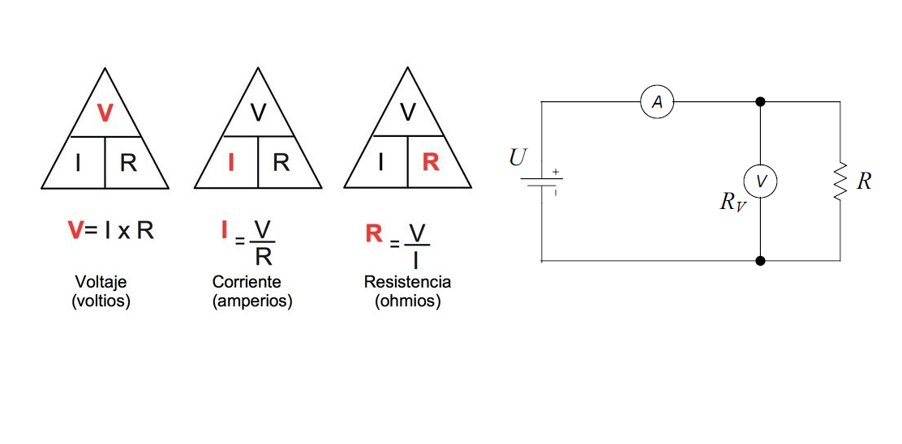

Cualquiera que sea la metodología propuesta es necesario tener en cuenta lo siguiente:

```{r, echo=F, out.width="80%", fig.align='center'}
knitr::include_graphics("imagen/tc.png")
```


## Metodología EURACHEM.

Eurachem propone la siguiente metodología para estimar la incertidumbre.


```{r, echo=F, out.width="70%", fig.align='center'}
knitr::include_graphics("imagen/df.png")
```


**Etapa 1 Especificación del mensurando**


El mensurando puede expresarse matemáticamente con una función:

$$X=f(x_1,x_2,..,x_n)$$


Donde:

- X es el mensurando, es decir, el valor que se está midiendo o estimando.

- $x_1,x_2,...,x_n$  son las variables de entrada o las magnitudes medidas que contribuyen al valor de X.


- f es una función matemática que describe la relación entre las variables de entrada y el mensurando. Esta función puede ser lineal o no lineal, dependiendo de la naturaleza de la medición.

- La mayoría de los experimentos de medición tienen características que los aproximan fácilmente a una condición de normalidad, para que la distribución de probabilidad de un resultado de medición tienda al modelo normal se requiere:

a) Que la función que define al mensurando, sea función lineal de otras magnitudes.

b) Que la distribución de probabilidad de las magnitudes que definen al mensurando Y sea del tipo normal o una aproximación a la distribución normal.

c) También se puede aceptar que la distribución de probabilidad de algunas magnitudes de definición sea rectangular, sólo si éstas últimas son un número menor que las del tipo normal.
 

```{r, echo=F, out.width="80%", fig.align='center'}
knitr::include_graphics("imagen/combi.png")
```
Tomado de Llamosa et al (2011). 
 

**Etapa 2 Identificación de fuentes de incertidumbre**

**Etapa 3 Cuantificación de la incertidumbre**

- Evaluar la incertidumbre de cada fuente individual, para posteriormente combinarlas.

- Aquellos factores que no tienen una contribución significativa
deberían ser eliminados.


**Etapa 4. Cálculo de la Incertidumbre Combinada**


## Metodología ISO-GUM


```{r, echo=F, out.width="80%", fig.align='center'}
knitr::include_graphics("imagen/gumpasos.png")
```


**Ejemplo 1**


Se ha efectuado la determinación del valor de una resistencia R, empleando el método del voltímetro y el amperímetro (en conexión corta),


```{r, echo=F, out.width="80%", fig.align='center'}

```

Los instrumentos utilizados fueron dos multímetros marca Hewlett Packard, modelo HP974A, en sus funciones de voltímetro y amperímetro, respectivamente. Se realizaron 6 mediciones en similares condiciones, obteniéndose los siguientes pares de valores:


en los alcances de 50 V y 500 mA de corriente continua, respectivamente.


En primera aproximación, la expresión (1), 

$$𝑌=𝑓(𝑋_1,𝑋_2,...,𝑋_𝑁)$$
aplicada a este caso, sería:

$$𝑌=𝑓(𝑋_1,𝑋_2,...,𝑋_𝑁)=𝑓(𝑉_𝑚,𝐼_𝑚)=𝑅_𝑚=\frac{V_𝑚}{𝐼_𝑚}$$

Sin embargo, teniendo en cuenta el consumo del voltímetro para la conexión usada, se debería efectuar, al menos inicialmente, una corrección como la que sigue:

$$ 𝑌=𝑓(𝑋_1,𝑋_2,...,𝑋_𝑁)=𝑓(𝑉_𝑚,𝐼_𝑚,𝑅_𝑉)=𝑅_𝑚=\frac{𝑉𝑚}{𝐼_𝑚−\frac{𝑉_𝑚}{𝑅_𝑉}}$$

donde $R_V$ corresponde a la resistencia interna del voltímetro con valor de 10 M𝛺.
De la ecuación anterior, se puede obtener, para cada uno de los valores medidos, la estimación de salida y, a partir de las estimaciones de entrada $x_1, x_2,…,x_N$. 


|Medición Nº  |1     |     2|     3|     4|     5|     6|prom   |sd  |
|:-----------:|:----:|:----:|:----:|:----:|:----:|:----:|:-----:|:--:|
|$Vm[V]$      |12,615|12,610|12,614|12,612|12,615|12,613|12.613 |    |
|$Im[mA]$     |237,21|237,20|237,18|237,22|237,20|237,21|237.203|    |
|$R_m[\Omega]$|53,181|53,162|53,184|53,166|53,183|53,173|53.175|0.009|


**Pasos establecidos según GUM**

1. Definir mensurando
$$ 𝑌=𝑓(𝑉_𝑚,𝐼_𝑚,𝑅_𝑉)$$
2. Modelo físico matemático

$$𝑅_𝑚=\frac{𝑉_𝑚}{𝐼_𝑚−\frac{𝑉_𝑚}{𝑅_𝑉}}$$

3. Identificar fuentes  de incertidumbre 


```{r, echo=F, out.width="80%", fig.align='center'}
knitr::include_graphics("imagen/epc.png")
```


4. Estimar las fuentes de de incertidumbre 


**Incertidumbre de resolución**

$$u=\frac{rsln}{\sqrt {12}}$$
**Incertidumbre del error**

A partir de las expresiones de los errores correspondientes a los instrumentos utilizados, y empleando el promedio de los valores medidos de tensión y corriente, se tiene:

**Voltímetro**
$$𝐸_{𝑉_𝑚}= ± (0,05 \% \quad \bar V_𝑚 + 2 \quad 𝑑í𝑔\quad rsln )$$

$$𝐸_{𝑉_𝑚}= ± (0,05 \% \quad 12.613 + 0.002 )= ± 0,0083 𝑉$$

**Amperímetro**


$$𝐸_{𝐼_𝑚}= ± (0,3 \% \bar I_𝑚 + 2 \quad 𝑑í𝑔\quad rsln)$$


$$𝐸_{𝐼_𝑚}= ± (0,3 \%* 237.203 + 0.02)= ± 0,73 𝑚𝐴$$
Las incertidumbres del error están dadas por

$$u_c=\frac{error}{\sqrt 3}$$

|fuente    |subfuente |Tipo|Distribución|Medida      |incertidumbre|
|:--------:|:--------:|:--:|:----------:|:----------:|:-----------:|
|Voltímetro|Resolución|B   |Rectángular |rsln=0.001 V|0.00029 V    |
|          |Error     |B   |Rectángular |e=0.0083 V  |0.0048  V    |
|Amperímeto|Resolución|B   |Rectángular |rsln=0.01 mA|0.0029   mA  |
|          |Error     |B   |Rectángular |e=0.73 mA   |0.42     mA|
|Repetibilidad|Resistencia |A|t student |s=0.009 𝛺 |0.00367 𝛺   |


5. Estimar los coeficientes de sensibilidad

$$𝑅_𝑚=\frac{𝑉_𝑚}{𝐼_𝑚−\frac{𝑉_𝑚}{𝑅_𝑉}}$$


Usar la regla del cociente

$$\left(\frac{f}{g}\right)=\frac{f'g-g'f}{g^2}$$


$$\frac{\partial R}{\partial V_m}=\frac{I_m}{\left(I_m-\frac{V_m}{R_v}\right)^2 }=4.2159\frac{1}{A}$$


$$\frac{\partial R}{\partial I_m}=\frac{-V_m}{\left(I_m-\frac{V_m}{R_v}\right)^2 }=-224.18\frac{V}{A^2}$$
**Contribución a la incertidumbre**

Evalua la contribución de cada variable a la incertidumbre total del proceso a través del índice de contribución de cada una de ellas; para establecer puntos críticos que pueden mejorarse para disminuir la incertidumbre del método.

$$Ind (\%)=\frac{c_i*u_i}{\sum_i(c_i*u_i)}$$

|fuente    |subfuente |incertidumbre|coef de sens          |$c_i*u_i$    |$Ind (\%)$|
|:--------:|:--------:|:-----------:|:--------------------:|:-----------:|:--------:|
|Voltímetro|Resolución|0.00029 V    |$4.2159\frac{1}{A}$   |0.001223 V/A |0.9       |
|          |Error     |0.0048  V    |                      |0.034992 V/A |26        |
|Amperímeto|Resolución|0.0029   mA  |$-224.18\frac{V}{A^2}$|0.00065  V/A |0.5       |
|          |Error     |0.42       mA|                      |0.094155  V/A|70        |
|Repetibilidad|s=0.009 𝛺|0.00367 𝛺|  1                   |0.00367 𝛺   |2.6       |
|             |       |             |     suma             |0.134698 𝛺  | 100     |   


```{r}
y=c(70,26,2.6,0.9,0.5)
x=c("Error Amp","Error Volt","repetibili","Res volt", "Res Amp")
barplot(y~x)

```


**Agrupación de incertidumbres según el tipo**


Dado que hay varias incertidumbres provienen de diferentes fuentes, se agrupan aquellas pertenecientes a la tipo B

$$u_B(R)=\sqrt {u^2_{v_m}(R)+u^2_{I_m}(R)}$$
Es decir:
$$u_B(R)=\sqrt {C^2_{V_m}[u^2(E_{v_m})+u^2(Res_{v_m})]+C^2_{I_m}[u^2(E_{I_m})+u^2(Res_{I_m})]}$$

Reemplazando:
$$u_B(R)=\sqrt {4.2159^2[0.0048^2+0.00029^2]+224.18^2[0.00042^2+0.0000029^2]}=\pm 0.096   $$


Ahora se evalua la incertidumbre total, teniendo en cuenta aquellas provenientes tanto de las tipo A como las de tipo B

$$u(R)=\pm\sqrt {u^2_A(R)+u^2_B(R)}=\pm 0.096$$
$$u(R)=\pm\sqrt {0.0038^2+0.096^2}=\pm 0.096$$


**Grados de libertad**


Determinar los grados de incertidumbre de cada uno de los parámetros

$$v_{eff}=\frac{u^4(R)}{\sum_{i=1}^N \frac{u_i^4(R)}{v_i}}=\frac{u^4(R)}{\frac{u_i^4(R)}{5}+\frac{u_i^4(R)}{\infty}+\frac{u_i^4(R)}{\infty}}$$


$$v_{eff}=\frac{(0.096 \Omega)^4}{\ \frac{(0.038\Omega)^4 }{5}}\geq 2.1*10^6$$


Para una cobertura del 95% con y gl infinitos se obtiene un factor de cobertura de 1.96 

$$U=k*u(y)=1.96*0.096 \Omega=0.19 \Omega $$
$$R=(53.18\pm 0.19)\Omega $$

Otro camino, incertidumbre dominante, bajo el teorema de límite central:


 **Criterio de la distribución dominante**


$$\frac{u_r(y)}{u_1(y)}<0.3$$ 
Donde $u_r(y)$ es la contribución de las incertidumbres no dominantes, $u_1(y)$ es la incertidumbre estándar de mayor valor siempre y cuando sea "no normal"

Aporte de las incertidumbres no dominantes

$$u_B(R)=\sqrt {0.00367^2+4.2159^2[0.0048^2+0.00029^2]+224.18^2[0.0029^2]}=\pm 0.65045   $$

Incertidumbre no dominante

$$\sqrt{224.18^2*[0.00042^2]}=4.5943$$


 $$\frac{0.65045}{4.594322}=0.1415<0.3$$ 
Bajo este criterio, y con un nc del 95%, se tiene que el factor de cobertura es 

$$k=p*\sqrt 3=1.64$$
$$U=k*u(y)=1.64*0.096 \Omega=0.15744 \Omega$$


$$R=(53.18\pm 0.16)\Omega $$
**Analisis comparativo de ambos resultados**


|            |con Dist rectángular|Con Dist Normal|
|:----       |:------------------:|:-------------:|
|gl efectivos|  $\infty$          |---            |
|$U_c$       |0.096               |0.096          |
|k           |1.64                |1.96           |
|$U_e$       |0.15744             |0.18816        |


**EJEMPLO 2**

Retomando el ejercicio anterior.

Considerando el modelo físico matemático

$$𝑅_𝑚=\frac{𝑉_𝑚}{𝐼_𝑚−\frac{𝑉_𝑚}{𝑅_𝑉}}$$

considerando dependencia entre las variables, se tienen los coeficientes de sensibilidad obtenidos mediante las derivadas parciales de la función:
$$c_1=\frac{\partial R}{\partial V_m}=\frac{I_m}{\left(I_m-\frac{V_m}{R_v}\right)^2 }=4.2159\frac{1}{A}$$


$$c_2=\frac{\partial R}{\partial I_m}=\frac{-V_m}{\left(I_m-\frac{V_m}{R_v}\right)^2 }=-224.18\frac{V}{A^2}$$


|fuente    |subfuente |incertidumbre|coef de sens          |$c_i*u_i$    |
|:--------:|:--------:|:-----------:|:--------------------:|:-----------:|
|Voltímetro|Resolución|0.00029 V    |$4.2159\frac{1}{A}$   |0.001223 V/A |
|          |Error     |0.0048  V    |                      |0.034992 V/A |
|Amperímeto|Resolución|0.0029   mA  |$-224.18\frac{V}{A^2}$|0.00065  V/A |
|          |Error     |0.42       mA|                      |0.094155  V/A|
|Repetibilidad|s=0.009 𝛺|0.00367 𝛺|  1                   |0.00367 𝛺   |
|             |       |             |     suma             |0.134698 𝛺  |  


$$u_c^2(R)=\sum_{i=1}^Nc_i^2 u^2(x_i)+2\sum_{i=1}^{N-1}\sum_{j=i+1}^N c_i * c_j* u(x_i) u(x_j) r(x_i,x_j)$$
$$\small{u_c^2(R)=\left[ \frac{I_m}{\left(I_m-\frac{V_m}{R_v}\right)^2}\right]^2 u^2(V) + \left[ \frac{-V_m}{\left(I_m-\frac{V_m}{R_v}\right)^2 } \right]^2 u^2(I) +2*\frac{I_m}{\left(I_m-\frac{V_m}{R_v}\right)^2}*\frac{-V_m}{\left(I_m-\frac{V_m}{R_v}\right)^2 } * u(V)* u(I)* r(V,I)\qquad(1)}$$

$$\small{u_c^2(R)= \frac{I_m^2}{\left(I_m-\frac{V_m}{R_v}\right)^4} u^2(V)\frac{V_m^4}{V_m^4} + \frac{V_m^2}{\left(I_m-\frac{V_m}{R_v}\right)^4 } \frac{V^2_m}{V^2_m}  u^2(I) -2*\frac{I_m}{1}*\frac{V_m}{\left(I_m-\frac{V_m}{R_v}\right)^4 }*\frac{V_m^4}{V_m^4} * u(V)* u(I)* r(V,I)}$$


$$\small{u_c^2(R)= \frac{R^4*I_m^2}{V_m^2} * \frac{u^2(V)}{V_m^2} + 
R^4*\frac{1}{V_m^2 }  u^2(I) 
-2*\frac{I_m}{1}*\frac{R^4}{1 }*\frac{1}{V_m^3} * u(V)* u(I)* r(V,I)}$$

$$\small{u_c^2(R)= \frac{R^2*R^2*I_m^2}{V_m^2} * \frac{u^2(V)}{V_m^2} + 
R^4*\frac{1}{I_m^2*R^2_m }  u^2(I) 
-2*\frac{I_m}{1}*\frac{R^4}{V_m^2 }*\frac{u(V)}{V_m} *u(I)* r(V,I)}$$


$$\small{u_c^2(R)= \frac{R^2*V^2_m}{V_m^2} * \frac{u^2(V)}{V_m^2} + 
R^4*\frac{1}{I_m^2*R^2_m }  u^2(I)
-2*\frac{I_m}{1}*\frac{R^4}{I^2R^2 }*\frac{u(V)}{V_m} *u(I)* r(V,I)}$$

$$\small{u_c^2(R)=  R^2*\frac{u^2(V)}{V_m^2} + 
R^2*\frac{u^2(I)}{I_m^2}  
-2*R^2*\frac{u(V)}{V_m} *\frac{u(I)}{I}* r(V,I)}$$


$$\small{\frac{u_c^2(R)}{R^2}=\frac{u^2(V)}{V_m^2} + 
\frac{u^2(I)}{I_m^2}  
-2*\frac{u(V)}{V_m} *\frac{u(I)}{I}* r(V,I)}$$

Reemplazando los valores en (1)


$$\small{u_c^2(y)= 4.2159^2*u(v)^2+224.18^2u(I)+
2*4.2159*(-224.18)* u(V)*u(I)* r(V,I)}$$


$$\small{ u_c^2(y)= 4.2159^2[0.0048^2+0.00029^2]+224.18^2[0.00042^2+0.0000029^2]+
2*4.2159*(-224.18)* 0.00509* 0.00332* (-0.176)}$$

$$\small{u_c^2(y)= 0.009276+2*4.2159*(-224.18)* 0.00509*(422.9*10^{-6})* (-0.176)}$$
$$\small{u_c^2(y)= 0.009276+716.12*10^{-6}}=9.992*10^{-3}$$

$$\small{\sqrt{u_c^2(y)}=\sqrt{9.992*10^{-3}}}=\pm 0.0996$$
**Comparación**

|                                  |Incertidumbre|
|----------------------------------|-------------|
|sin tener en cuenta la correlación|0.096        |
|Con la correlación                |0.099        |


La GUM cuenta con dos documentos adicionales: 

1. Evaluación de datos de medición —Suplemento 1 de la “Guía para la expresión de la incertidumbre de medida”—
Propagación de distribuciones aplicando el método de Monte Carlo.

2. Evaluación de medición datos – Suplemento 2 del “Guía para la expresión deincertidumbre en la medición” – Ampliación a cualquier número de cantidades de salida


Hast ahora se han considerado modelos  que consideran dos variables de entrada y una de salida., el suplemento 2 trata acerca de la estimación multivariada tanto de variables de entrada como de salida.


## Bibliografía

- EURACHEM. (2011). Cuantificación de la Incertidumbre en medidas analíticas.

- EA-4/02. (2022). Evaluation of the uncertainty of measurement. http://www.european-accreditation.org

- GUM. (2008). Evaluación de datos de medición Guía para la Expresión de la Incertidumbre de Medida.

- Konopka, K. (2007). Instrumentation and Measurement Technology Conference-IMTC 2007 Estimating Uncertainty of Correlated Quantities-Comparison of Two Methods.

- Llamosa, L. E., Rivera, J. H., & Torres, J. I. (2011). Using The Central Limit Theorem In The Calculation Of Measurement Uncertainty. Revista Colombiana de Física, 43(3). https://doi.org/10.04.10.

- Martínez, N. D., Rodríguez, A. M., Gutiérrez, A. R., di Carlo Vitolino, M. D., & Durán, A. D. los Á. (2018). Determinación de la incertidumbre del método de análisis de aflatoxinas por HPLC en pasa de uva. Tecnura, 22(58), 25–36. https://doi.org/10.14483/22487638.12896

- NIH. (2024). Aflatoxinas. https://www.cancer.gov/espanol/cancer/causas-prevencion/riesgo/sustancias/aflatoxinas/aflatoxinas

- Universidad Veracruzana.(UV) (2024). Cromatografía Líquida de Alta Resolución (HPLC). https://www.uv.mx/sara/equipamiento/hplc/#:~:text=La%20Cromatograf%C3%ADa%20L%C3%ADquida%20de%20Alta,de%20identificarlas%2C%20cuantificarlas%20y%20purificarlas.
