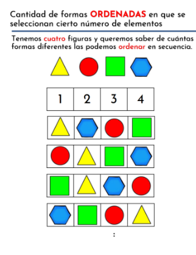
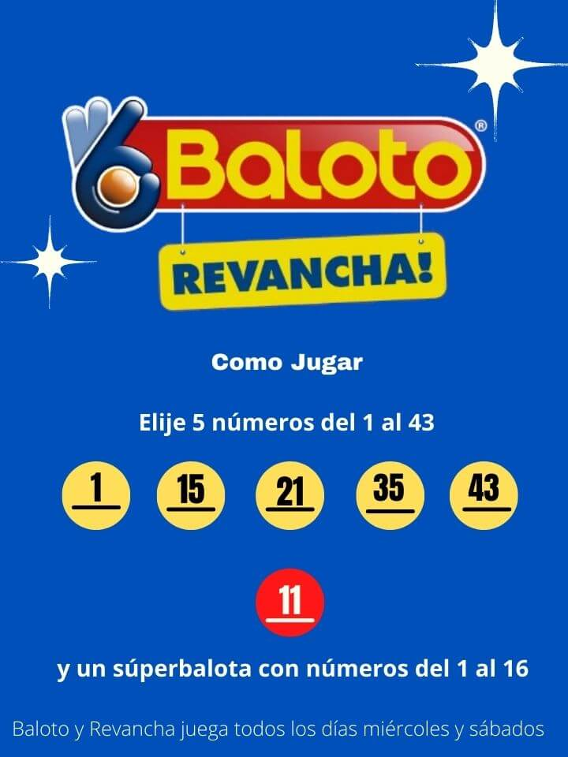

## Técnica de la multiplicación 

Si hay m formas de hacer una cosa y hay n formas de hacer otra cosa, hay mxn formas de hacer ambas cosas. 

Número total de arreglos= m x n


```{r, echo=F, fig.cap='imagen', fig.asp=0.3, fig.align='center'}
knitr::include_graphics("imagen/mul.png")
```


*Regla de la multiplicación*

<iframe width="280" height="160" src="https://www.youtube.com/embed/OuZioEJruUg" frameborder="0" allow="accelerometer; autoplay; encrypted-media; gyroscope; picture-in-picture" allowfullscreen></iframe>

## Permutación

Importa el orden, por ejemplo con las letras ABC escoja pares de letras, el resultado sería:

AB BA BC CB AC CA


La fórmula usada para la estimación de los parámetros es
$$nPr=\frac{n!}{(n-r)!}$$


Donde:

- nPr Número de permutaciones posible

- n Numero total de objetos

- r numero de objetos utilizados en un mismo momento

$$n!=n*(n-1)*(n-2)*(n-3)*...*3*2*1$$
$$5!=5*4*3*2*1$$
Si n=r para calcular el total de permutaciones se utiliza la  fórmula $P_n=n!$


```{r, echo=F, fig.cap='imagen', fig.asp=2, fig.align='center'}

```

¿CUANTAS PAREJAS ordenadas SE PUEDEN OBTENER DE LA MESA?

```{r, echo=F, fig.cap='imagen', fig.asp=0.3, fig.align='center'}

```


1. Maria - Pedro
2. Pedro - Maria
3. Ana - Maria
4. Maria - Ana
5. Pedro - miguel
6. Miguel - pedro
7. Maria - Miguel
8. Miguel - Maria 
9. Ana - Miguel
10. Miguel - Ana 
11. Ana - Pedro
12. Pedro - Ana 


$$4P2=\frac{4!}{(4-2)!}=12$$

**Vídeo de la permutación**

<iframe width="280" height="160" src="https://www.youtube.com/embed/GSldM3plWD8" frameborder="0" allow="accelerometer; autoplay; encrypted-media; gyroscope; picture-in-picture" allowfullscreen></iframe>

## Combinación

Considere las letras ABC, para este conjunto los posibles resultados son:

AB BC AC

Para la combinación AB es lo mismo BA

¿Cuantos subconjuntos de tamaño r se pueden obtener de un conjunto de tamaño n?


$$nCr=\binom{n}{r}=\frac{n!}{r!(n-r)!}$$
¿CUANTAS PAREJAS ordenadas SE PUEDEN OBTENER DE LA MESA?

```{r, echo=F, fig.cap='imagen', fig.asp=0.3, fig.align='center'}

```


1. Maria - Pedro
2. Ana - Maria
3. Pedro - miguel
4. Maria - Miguel
5. Ana - Miguel
6. Ana - Pedro


$$4C2= \binom{4}{2}=\frac{4!}{2!(4-2)!}= 6 $$


**Vídeo ejemplo de la combinación**

<iframe width="280" height="160" src="https://www.youtube.com/embed/ACy6TerY6Xw" title="Combinación - Ejemplo 2" frameborder="0" allow="accelerometer; autoplay; clipboard-write; encrypted-media; gyroscope; picture-in-picture; web-share" allowfullscreen></iframe>

*Cómo estimar combinatorias y permutaciones en la calculadora*

<iframe width="280" height="160" src="https://www.youtube.com/embed/q0TNGY2xMrM" frameborder="0" allow="accelerometer; autoplay; encrypted-media; gyroscope; picture-in-picture" allowfullscreen></iframe>


**Baloto**


```{r, echo=F, fig.cap='comprelo ganelo y disfrutelo', fig.asp=0.3, fig.align='center'}

```


