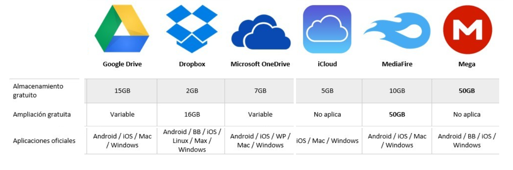
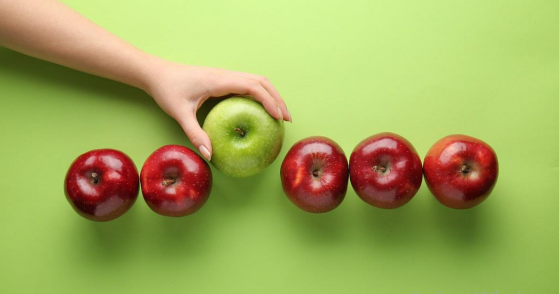

## Historia de la estadística

<div style="text-align: center;"><iframe width="280" height="160" src="https://www.youtube.com/embed/O2L_VsKDxlw" frameborder="0" allow="accelerometer; autoplay; encrypted-media; gyroscope; picture-in-picture" allowfullscreen></iframe></div>

<div style="text-align: center;"><iframe width="280" height="160" src="https://www.youtube.com/embed/LMsjlMmrc_0" frameborder="0" allow="accelerometer; autoplay; encrypted-media; gyroscope; picture-in-picture" allowfullscreen></iframe></div>


## ¿Qué es la estadística?

- Ciencia que describe y realiza inferencias sobre el mundo desde una muestra de datos

- Ciencia que proporciona metodologías para recolectar organizar, resumir, presentar y analizar datos y hacer inferencias a partir de ellos.


<div style="text-align: center;"><iframe width="280" height="160" src="https://www.youtube.com/embed/MaTO78ZoNoo" frameborder="0" allow="accelerometer; autoplay; encrypted-media; gyroscope; picture-in-picture" allowfullscreen></iframe></div>


 **Ramas de la estadística**

**Estadística descriptiva:**
Organiza y describe las características de un conjunto de datos con el propósito de facilitar su aplicación, generalmente con el apoyo de gráficas, tablas o medidas numéricas.

Los parámetros estadísticos usados son las medidas de tendencia central y de variabilidad, y los gráficos de barras, de tortas y  el histograma.

**Estadística inferencial:**

Obtiene conclusiones de la población partiendo de una muestra, por medio de diferentes métodos, como las puebas de hipótesis, pronósticos de futuras observaciones, correlaciones y modelos de asociación entre variables.


<div style="text-align: center;"><iframe width="280" height="160" src="https://www.youtube.com/embed/buKDQZG5phM" frameborder="0" allow="accelerometer; autoplay; encrypted-media; gyroscope; picture-in-picture" allowfullscreen></iframe></div>


## Algunas definiciones

**Población:**
Conjunto de elementos sobre los que queremos hacer afirmaciones


**Muestra:**
Conjunto de personas o cosas que se consideran representativos del grupo al que pertenecen, con la finalidad de estudiar o determinar las características del grupo.

<div style="text-align: center;"><iframe width="280" height="160" src="https://www.youtube.com/embed/d6rrvuxBoY8" frameborder="0" allow="accelerometer; autoplay; encrypted-media; gyroscope; picture-in-picture" allowfullscreen></iframe></div>


**Parámetro:**
Valor descriptivo de la población

**Estadístico:**
Valor descriptivo para una muestra

**Base de datos:**
Colección de información organizada, de tal modo que sea fácilmente accesible, gestionada y actualizada

**Almacenamiento de bases de datos**

Las bases de datos Surgen de la necesidad de almacenar la información a través de la historia

1. Piedras, madera y arcilla, donde se escribian jeroglíficos.

- Los babilonios y mesopotámicos a través de la escritura cuneiforme que tallaban en tabletas y en rocas, al igual q los mallas 

-La cultura inca que escribian en un sistema de cuerdas anudadas.

```{r, echo=F, fig.cap='Puntos atípicos', fig.asp=0.3, fig.align='center'}
knitr::include_graphics("imagen/escritura.png")
```


2. Papel

Edad media: Códice Formato de libro, Se compone de pergaminos plegados, cosidos y encuadernados.

El papel reemplazó progresivamente al pergamino, una herramienta más barata que permitió una difusión mas amplia, en la época moderna el códice fue hecho en papel

3. Films

4. Almacenamiento digital: bytes, tarjetas perforadas, CDs y memorias
Actualmente es posible almacenar digitalmente en un disco compacto por ejemplo los datos que cabrian en miles de carpetas archivadas

5. Nube:
Se puede guardar y compartir un volumen de archivos ilimitados, asi como acceder a ellos desde cualquier dispositivo con acceso a internet

A lo largo de la historia se ha buscado el sistema más pequeño físicamente con mayor capacidad de almacenamiento


```{r, echo=F, fig.cap='Discos duros en la nube', fig.asp=0.3, fig.align='center'}

```


**Punto atípico o outlier**
Son observaciones extremas, alejadas hacia valores muy grandes o pequeños comparadas con el resto de valores. Los valores atípicos pueden ser indicativos de datos que pertenecen a una población diferente del resto de las muestras establecidas. Se pueden detectar con un análisis descriptivo, mediante diagramas de dispersión, boxplot o histograma. 


```{r, echo=F, fig.cap='Puntos atípicos', fig.asp=0.3, fig.align='center'}

```


## Tipos de variables

Característica o condición que puede tomar diferentes valores en una muestra. Ejm:

- Presión sanguínea 
- Masa de los niños
- Frecuencia cardiaca 
- Estatura de un grupo de estudiantes
- Edad de los pacientes de un médico

*Tipos de variables*

<div style="text-align: center;"><iframe width="280" height="160" src="https://www.youtube.com/embed/sQ08tqf-rXU" frameborder="0" allow="accelerometer; autoplay; encrypted-media; gyroscope; picture-in-picture" allowfullscreen></iframe></div>


**Actividad**

Clasifique las siguiente variables según sea el caso

|variable|tipo de variable|clasificación|niveles|
|--------|:----------------:|:----------:|:-------:|
|Color de ojos|Cualitativa|Nominal      |verde, azul,cafe|
|Edad |                   |             |       | 
| velocidad|              |             |       | 
|Estado civil|            |             |       |
|Color de la piel|        |             |       |
|Color del cabello|       |             |       |
|Marcas de carro|         |             |       |
|Número de hijos de una familia|    |   |       |
|Número de mensajes enviados por whatsap un dia |  |  | |
|Número de estudiantes conectados a clase|  |   |  |
|Días de la semana|       |             |       |


## Frecuencia estadística

La frecuencia es el número de veces en que un evento se repite durante un experimento, comúnmente, la distribución de la frecuencia suele visualizarse con el uso de histogramas.

**Frecuencia absoluta**

Es el conteo o número de veces que sucede un evento en un experimento

**Frecuencia relativa**

Es el porcentaje o proporción de veces que sucede un evento en un experimento, se calcula así:

$$X_i=\frac{xi}{N}=\frac{veces\quad que \quad se \quad observa \quad un \quad evento }{Total \quad de \quad veces}$$

## Tablas de frecuencia

Se pueden construir tablas de frecuencia para variables cualitativas y cuantitativas, con la frecuencia absoluta y la frecuencia relativa.


*Ejemplo:*

<div style="text-align: center;"><iframe width="280" height="160" src="https://www.youtube.com/embed/ZcxjURk69IA" frameborder="0" allow="accelerometer; autoplay; encrypted-media; gyroscope; picture-in-picture" allowfullscreen></iframe></div>

**Tablas de frecuencia en R**

Se preguntó a los estudiantes sobre el hábito de fumar  y el género, los resultados encontrados se ilustran a continuación

```{r}
#Para instalar librerías se hace uso de la siguiente #instrucción, sin el #
#El # sirve para marcar comentarios en códigos de R 

#install.packages("knitr")
library(knitr)

fuma <- c('NUNCA','1 ó 2 VECES','NUNCA','NUNCA','CADA MES','NUNCA','NUNCA','NUNCA','A DIARIO', 'NUNCA', 'NUNCA','A DIARIO','1 ó 2 VECES', 'NUNCA', 'NUNCA', 'NUNCA','CADA MES','A DIARIO', 'NUNCA','A DIARIO', 'NUNCA','NUNCA', 'NUNCA','NUNCA', 'CADA SEMANA', 'NUNCA','NUNCA','CADA SEMANA','1 ó 2 VECES','1 ó 2 VECES','1 ó 2 VECES','1 ó 2 VECES', 'CADA SEMANA', 'NUNCA','NUNCA','NUNCA', 'NUNCA','A DIARIO', 'NUNCA', 'NUNCA','NUNCA','NUNCA','NUNCA','NUNCA','NUNCA','CADA MES','1 ó 2 VECES','A DIARIO','NUNCA','CADA SEMANA', 'NUNCA','NUNCA', 'NUNCA','1 ó 2 VECES','A DIARIO', 'CADA MES','A DIARIO','NUNCA','NUNCA','1 ó 2 VECES', '1 ó 2 VECES','1 ó 2 VECES','1 ó 2 VECES','CADA SEMANA', 'NUNCA','NUNCA','1 ó 2 VECES','CADA SEMANA','NUNCA','1 ó 2 VECES','1 ó 2 VECES', 'NUNCA','1 ó 2 VECES','1 ó 2 VECES','1 ó 2 VECES','NUNCA','NUNCA','NUNCA','NUNCA','NUNCA','NUNCA','NUNCA','NUNCA','NUNCA','1 ó 2 VECES','NUNCA', 'NUNCA', 'NUNCA','1 ó 2 VECES','NUNCA','CADA SEMANA','1 ó 2 VECES','1 ó 2 VECES','1 ó 2 VECES','A DIARIO','CADA MES','1 ó 2 VECES','CADA SEMANA', 'NUNCA', 'NUNCA','A DIARIO','1 ó 2 VECES','CADA SEMANA','NUNCA','1 ó 2 VECES','NUNCA','1 ó 2 VECES','NUNCA','NUNCA','NUNCA','NUNCA','CADA MES','CADA SEMANA','NUNCA','1 ó 2 VECES','1 ó 2 VECES','NUNCA','NUNCA','NUNCA','CADA MES','1 ó 2 VECES','NUNCA','NUNCA','NUNCA','1 ó 2 VECES', 'NUNCA','NUNCA','A DIARIO','NUNCA','A DIARIO','A DIARIO','CADA MES','1 ó 2 VECES','NUNCA','CADA MES', 'NUNCA','NUNCA','NUNCA','NUNCA','1 ó 2 VECES','1 ó 2 VECES','NUNCA','NUNCA','NUNCA','CADA MES','1 ó 2 VECES')

# Tabla de resumen
tabla=table(fuma)
tabla
#Añadir totales
Tab=addmargins(tabla)
Tab
kable(Tab,booktabs = TRUE)

# Tabla de proporciones o porcentajes

Tab1=prop.table(table(fuma))
Tab1

#Añador totales
Tab2=addmargins(Tab1)
Tab2
kable(addmargins(prop.table(table(fuma))*100),booktabs =TRUE)
```

```{r}
gen=c('Hombre','Hombre','Hombre','Hombre','Hombre','Hombre','Hombre','Hombre','Hombre','Hombre','Hombre','Hombre','Mujer','Mujer','Mujer','Hombre','Hombre','Mujer','Mujer','Hombre','Mujer','Mujer','Hombre','Mujer','Hombre','Mujer','Hombre','Mujer','Mujer','Hombre','Hombre','Mujer','Mujer','Mujer','Mujer','Mujer','Mujer','Hombre','Hombre','Hombre','Hombre','Hombre','Mujer','Hombre','Hombre','Hombre','Mujer','Hombre','Mujer','Hombre','Mujer','Hombre','Mujer','Mujer','Mujer','Mujer','Hombre','Mujer','Hombre','Hombre','Hombre','Mujer','Hombre','Hombre','Hombre','Mujer','Hombre','Mujer','Mujer','Hombre','Hombre','Hombre','Mujer','Mujer','Mujer','Mujer','Hombre','Hombre','Hombre','Mujer','Hombre','Hombre','Hombre','Hombre','Hombre','Mujer','Mujer','Mujer','Mujer','Hombre','Mujer','Hombre','Mujer','Hombre','Hombre','Hombre','Hombre','Mujer','Hombre','Hombre','Hombre','Mujer','Hombre','Hombre','Hombre','Hombre','Hombre','Hombre','Hombre','Hombre','Hombre','Hombre','Hombre','Hombre','Hombre','Hombre','Hombre','Hombre','Hombre','Hombre','Hombre','Hombre','Mujer','Hombre','Hombre','Mujer','Hombre','Hombre','Mujer','Mujer','Hombre','Mujer','Hombre','Mujer','Mujer','Hombre','Mujer','Hombre','Hombre','Hombre','Mujer','Mujer','Hombre','Hombre','Hombre','Hombre')
# Tabla de resumen
table(gen)

#añadir totales
addmargins(table(gen))

kable(addmargins(table(gen)),booktabs = TRUE)
# Tabla de proporciones o porcentajes

addmargins(prop.table(table(gen)))

kable(prop.table(table(gen))*100,booktabs = TRUE)

```

**Pregunta**
¿Quién fuma con más frecuencia? Hombres o mujeres


### Tablas de contingencia 

Además de las tablas de frecuencia también podemos encontrar tablas de doble entrada o tablas de contingencia, donde se pueden relacionar dos variables cualitativas, con sus diferentes niveles.
Además de usar la frecuencia absoluta, la frecuencia relativa puede usarse de diferentes maneras

**Ejemplo 1**

Se analiza el hobbie (Bailar, Ver TV, Deporte) y el género (Femenino y masculino) y se realiza una tabla de doble entrada:

```{r fig.asp=0.7,fig.cap='Tabla de contingencia', fig.align='center', echo=FALSE}
knitr::include_graphics("imagen/conti.png")
```

Esta tabla tiene varias formas posibles de ser analizada

**Tabla de frecuencia relativa total**

Cada observación se divide por el número total. 

```{r fig.asp=0.4,fig.cap='Tabla de contingencia relativa', fig.align='center', echo=FALSE}

```

**Tabla de frecuencia relativa por filas**

Cada observación se divide por el total de la fila, esta forma sirve para comparar, en este caso, cuál es el deporte favorito de cada genero. 

```{r fig.asp=0.5,fig.cap='Tabla de contingencia relativa por filas', fig.align='center', echo=FALSE}
knitr::include_graphics("imagen/conti2.png")
```


**Tabla de frecuencia relativa por columnas**

Cada observación se divide por el total de la columna, esta forma sirve para comparar, en este caso, cuál género prefiere cada uno de los deportes. 


```{r fig.asp=0.5,fig.cap='Tabla de contingencia relativa por columnas', fig.align='center', echo=FALSE}
knitr::include_graphics("imagen/conti3.png")
```


**Ejemplo 2**
La respuesta a la pregunta anterior la podemos encontrar realizando una tabla de contingencia o tabla de doble entrada
```{r}
#tabla de frecuencia absoluta
marco=table(fuma,gen)
marco
##para añadir los totales de filas y columnas
addmargins(marco)
```


Sin embargo con las frecuencias absolutas es difícil visualizar cual de los dos generos fuma con más frecuencia para ello hacemos uso de la frecuencia relativa

```{r}
## Frecuencia relativa total
marco=table(fuma,gen)
marco2=prop.table(marco)
marco2

##para añadir los totales de filas y columnas
addmargins(marco2)

##Frecuencia relativa por filas
tabla3=prop.table(table(fuma,gen),margin=1)
addmargins(tabla3, margin=2)

##Frecuencia relativa por COLUMNAS
tabla4=prop.table(table(fuma,gen),margin=2)
tabla4
addmargins(tabla4, margin=1)

```


**Video**
(ver hasta el minuto 9:20, lo siguiente es de probabilidades)

<div style="text-align: center;"><iframe width="280" height="160" src="https://www.youtube.com/embed/xWQun-Lyk7o" frameborder="0" allow="accelerometer; autoplay; encrypted-media; gyroscope; picture-in-picture" allowfullscreen></iframe></div>


## Gráficos

Existen diferentes tipos de gráficos, los cuales ilustran la información contenida en tablas, dentro de los gráficos más usados se encuentran:

### Gráfico de barras

Forma de resumir un conjunto de datos por categorías. Muestra los datos usando varias barras de la misma anchura, cada una representa una categoría concreta. La altura de cada barra es proporcional a la suma de los valores de la categoría que representa.

### Histograma
Es una representación gráfica de una variable en forma de barras, donde la superficie de cada barra es proporcional a la frecuencia de los valores representados, sirven para obtener una "primera vista" general de la distribución de la muestra, respecto a una característica

### Gráfico de tortas
Representación gráfica de una serie de cantidades, consiste en un círculo dividido en varios sectores, cuyo tamaño corresponde con las proporciones de las cantidades. Básicamente, este tipo de gráfico muestra la relación porcentual entre las partes con relación a su conjunto. El área proporcional en grados de la circunferencia se cacula así:

$$Grados=360° * frecuencia\quad  relativa=360°* \frac{veces \quad que \quad se \quad repite \quad un \quad evento}{total\quad de \quad veces}$$ 

**Ejemplo**


La siguiente información fue reportada en la revista Motor Trend de EE.UU, en el año 1974. contiene el consumo de combustible y 10 aspectos del diseño y rendimiento para 32 automóviles (modelos 1973–74). 

A continuación se ilustra un resumen del número de cilindros que cada uno de los automoviles mostró

```{r}
library(knitr)
library(ggplot2)

#Base de datos
head(mtcars)

#Creación de tabla de frcuencia absoluta
j=(table(mtcars$cyl))

#creación de porcentajes
x=data.frame(prop.table(j))
porcentajes=x[,2]

#grados proporcionales
grad=porcentajes*360 

m=data.frame(table(mtcars$cyl),porcentajes*100,grad)

colnames(m)=c("cilindros","frecuencia absoluta","Porcentaje","grad°")

kable(m,caption = "Frecuencia del número de cilindros",booktabs = TRUE)

barplot(j,col='#4168c3',ylab="Frecuencia absoluta", xlab="Número de cilindros")
box()

#Gráfico de tortas

bar <- ggplot(data=m, aes(x=1,y= porcentajes,
              fill=m$cilindros))+ 
       geom_bar(stat='identity', colour='white') +
                 coord_polar(theta='y')+
       scale_fill_manual(values=c("salmon","steelblue","gray"))+theme_void()+  labs(title="Gráfico de torta")+
  geom_text(aes(label=porcentajes*100),
            position=position_stack(vjust=0.5),color="white",size=5)
bar

#Gráfico de donas

bar1 <- ggplot(data=m, aes(x=2,y= porcentajes,
              fill=m$cilindros))+ 
       geom_bar(stat='identity', colour='white') +
                 coord_polar(theta='y')+
       scale_fill_manual(values=c("salmon","steelblue","gray"))+theme_void()+  labs(title="Gráfico de donas")+xlim(0.5,2.5)+
  geom_text(aes(label=porcentajes*100),
            position=position_stack(vjust=0.5),color="white",size=5)
bar1
```

**Algunos videos que sirven de ejemplo**

**Ejemplo 1**

<div style="text-align: center;"><iframe width="280" height="160" src="https://www.youtube.com/embed/VGrQRIKBOcI" frameborder="0" allow="accelerometer; autoplay; encrypted-media; gyroscope; picture-in-picture" allowfullscreen></iframe></div>


**Ejemplo 2**

<div style="text-align: center;"><iframe width="280" height="160" src="https://www.youtube.com/embed/OzS7xkOUaE0" frameborder="0" allow="accelerometer; autoplay; encrypted-media; gyroscope; picture-in-picture" allowfullscreen></iframe></div>

**Ejemplo 3**

En el siguiente ejemplo se hace uso de variables de tipo cualitativo, con la que se construye una tabla de frecuencias, gráfico de barras y de tortas.

<div style="text-align: center;"><iframe width="280" height="160" src="https://www.youtube.com/embed/DRSJxpKpL30" frameborder="0" allow="accelerometer; autoplay; encrypted-media; gyroscope; picture-in-picture" allowfullscreen></iframe></div>


### Gráfico de series de tiempo

Una serie de tiempo es una colección de observaciones de una variable tomadas de forma secuencial y ordenada en el tiempo (instantes de tiempo equiespacios). Las series pueden tener periodicidad anual, semestral, trimestral, mensual,diaria etc.

**Aparecen en numerosos campos**

*Economía y Marketing*

- Precio del alquiler de un apartamento durante varios meses.


— Precio promedio del trigo mensual.


— Índices del precio del petróleo por semana.


*Demografía*


— Número de habitantes en cierto país por año.


— Tasa de mortalidad infantil por año.


- Infectados por día de COVID19


*Medioambiente*


— Lluvia recogida diariamente en una localidad.


— Temperatura media diaria.


— Medición diaria de materal particulado en el área metropolitana.


*Tendencia*

Cambio a largo plazo que se produce en relación al nivel medio, se identifica con un movimiento suave de la serie a largo plazo, puede ser ascendente ó descendente.

*Efecto estacional* 

Variación de un patrón de comportamiento ciclico que se repiten cada cierto periodo de tiempo.

**Ejemplo en R**

La siguiente base de datos representa los precios de cierre diarios del índice bursátil Alemania DAX (Ibis), desde el año 1991 hasta 1998, los datos se muestrean en horario comercial, es decir, se omiten los fines de semana y feriados. para un total de 1860 observaciones. Los datos fueron proporcionados por Erste Bank AG, Viena, Austria.

La serie de tiempo con su respectiva descomposición se enlistan a continuación.

```{r}

tsData <- EuStockMarkets[,1] # ts data
plot(tsData,col=4)
decomposedRes <- decompose(tsData, type="mult") # use type = "additive" for additive components
plot (decomposedRes,col=4) # see plot below

```


### Gráfico de líneas

Muestran tendencias a lo largo de un período de tiempo, para diferentes niveles de una variable cualitativa, por lo tanto se usan para hacer comparaciones.

**Ejemplo**

Los siguientes datos describen el efecto de la vitamina c en el crecimiento de los dientes de un cerdo de guinea (Cuy), suministrado bajo dos formas diferentes, jugo de naranja y ácido ascorbico.

```{r}
library(plotly)

datn <- read.table(header=TRUE, text='
supp dose length
  OJ  0.5  13.23
  OJ  1.0  22.70
  OJ  2.0  26.06
  VC  0.5   7.98
  VC  1.0  16.77
  VC  2.0  26.14
')

datn2 <- datn
datn2$dose <- factor(datn2$dose)
p <- ggplot(data=datn2, aes(x=dose, y=length, group=supp, colour=supp)) +
    geom_line() +
    geom_point()

fig <- ggplotly(p)

fig
```


**Ejemplo en excel**


Se tienen los precios de la zanahoria en las plazas de mercado de 3 ciudades diferentes


```{r echo=F}

fecha <- c('4-ene','11-ene','18-ene','25-ene','1-feb','8-feb','15-feb','22-feb','29-feb','7-mar','14-mar','21-mar','28-mar','4-abr','11-abr','18-abr', '25-abr', '2-may','9-may','16-may','23-may', '30-may','6-jun',	'13-jun','20-jun','27-jun')

Bogota <- c(1700,1472,1288,1321,1492,1392,1544,1389,1296,1229,1867,1973,1158,1313,1398,1658,1708,2826,2081,2105,2208,2474,2243,1884,1775,2021)

Arauca=c(1317,1235,1227,1214,1233,1306,1302,1312, 1358,1385,1377,1712,1485,1364,1379,1230,1364,1811,2521,2264,2121,2230,2424,1794,1800,1448)

Armenia=c(1556,1389,1400,1365,1211,1211,1211,1294,1294,1206,1122,1639,1324,1194,1144,1128,1406,1374,1524,1561,2037,2111,1824,1861,1620,1750)

dt <- data.frame(fecha,Bogota,Arauca,Armenia)
knitr::kable(dt, booktabs = TRUE,
caption = 'Precios de la zanahoria')

```

## Medidas de tendencia central 

Son 3 valores que resumen y representan la información contenida en un conjunto de datos.
Las tres medidas son la media, la mediana y la
moda.

```{r fig.asp=0.8, fig.align='center', echo=FALSE}
knitr::include_graphics("imagen/central.png")
```


### Moda

Es el valor que más se repite, si no hay datos que se repiten se dice que no hay moda.
Si dos datos se repiten con la misma frecuencia se dice que los datos son bimodales.


### Media

Valor promedio de un conjunto de datos numéricos, calculada como la suma del conjunto de valores dividida entre el número total de valores, la fórmula con la que se estima es:

**Media Muestral**

$$\bar x=\frac{\sum_{i=1}^{n}x_i}{n}$$

**Media poblacional**

$$\hat \mu =\frac{\sum_{i=1}^{n}x_i}{N}$$

Donde
$x_i$ corresponde a cada observación

N es el tamaño poblacional

n es el tamaño muestral

Según el teorema de límite central cuando n>30 se considera poblacional

### Mediana

Es un valor que se encuentra en la mitad de los datos, cuando estos están ordenados

a. si los datos son pares, la mediana es la suma de los dos valores centrales dividida por dos

$$M_e=\frac{X_{\frac{n}{2}}+X_{\frac{n}{2}+1}}{2}$$

b. si los datos son impares la mediana es el valor que se encuentra en la posición $\frac{n+1}{2}$

$$M_e=X_\frac{_{n+1}}{2}$$

**Ejemplo**

Se tienen las edades de una muestra de estudiantes de estadística básica compuesta por hombres y mujeres

|Hombre|20|22|26|20|26|19|20|21|26|  |  |  |  |
|:----:|--|--|--|--|--|--|--|--|--|--|--|--|--|
|Mujer |20|20|31|26|23|42|23|20|24|25|24|27|22|

Estime la media por género, la moda y la mediana.

*Video medidas de tendencia central*

<div style="text-align: center;"><iframe width="280" height="160" src="https://www.youtube.com/embed/A_u9fS2r-Eg" frameborder="0" allow="accelerometer; autoplay; encrypted-media; gyroscope; picture-in-picture" allowfullscreen></iframe></div>


<div style="text-align: center;"><iframe width="280" height="160" src="https://www.youtube.com/embed/0DA7Wtz1ddg" frameborder="0" allow="accelerometer; autoplay; encrypted-media; gyroscope; picture-in-picture" allowfullscreen></iframe></div>

## Medidas de variabilidad

La media es un buen indicador de tendencia central, pero no da una evidencia real acerca de los datos.

Las medidas de variabilidad determinan el grado de acercamiento o distanciamiento de los valores de una distribución frente a su promedio de localización.

- Entre más grande sea el grado de variación, menor uniformidad tendrán los datos (sinónimo de heterogeneidad) y por lo tanto menor confiabilidad del promedio de tendencia central o localización por haber sido obtenido de datos dispersos (Mendoza et al, 2002). 

- Si este valor es pequeño (respecto a la unidad de medida) entonces hay una gran uniformidad entre los datos(Mendoza et al, 2002). 

- Cuando es cero quiere decir que todos los datos son iguales.

### Rango

Es la diferencia entre el valor máximo y el valor mínimo

Rango= valor max - valor mínimo

Esta medida ignora la manera en que los datos están distribuidos

```{r fig.asp=0.8, fig.align='center', echo=FALSE}
knitr::include_graphics("imagen/rango.png")
```

### Varianza y Desviación estándar
 indica qué tan dispersos están los datos con respecto a la media

```{r fig.asp=0.7, fig.align='center', echo=FALSE}
knitr::include_graphics("imagen/sd.png")

```

**Caso poblacional**

**Varianza**

$$\sigma^2=\frac{\sum_{i=1}^n(x_i-\mu)^2}{N}$$
**Desviación estándar**

$$\sigma=\sqrt{\frac{\sum_{i=1}^n(x_i-\mu)^2}{N}}$$
**Caso muestral**

**Varianza**
$$S^2=\frac{\sum_{i=1}^n(x_i-\bar x)^2}{n-1}$$
**Desviación estándar**
$$S=\sqrt{\frac{\sum_{i=1}^n(x_i-\bar x)^2}{n-1}}$$
**Pasos para estimar la desviación estándar**

1. Encuentre la media

2. Encuentre la desviación de cada uno de los valores con respecto a la media.

3. Eleve cada valor obtenido al cuadrado

4. Halle la suma de cada uno de los cuadrados

5. Divida la suma de los cuadrados por el número de ítems

6. Encuentre la raíz cuadrada de la varianza


*Medidas de variabilidad*

<div style="text-align: center;"><iframe width="280" height="160" src="https://www.youtube.com/embed/cg4kUsbjQms" frameborder="0" allow="accelerometer; autoplay; encrypted-media; gyroscope; picture-in-picture" allowfullscreen></iframe></div>

**Diferencia en medidas entre la población y la muestra**

|Medida|Población|Muestra|
|:----:|:-------:|:-----:|
|Tamaño|N        |n      |
|Media |$\mu$   |$\bar x$|
|Varianza|$\sigma^2$|$S^2$|
|Desviación estándar|$\sigma$|S|

**Comparemos**

```{r fig.asp=0.5, fig.align='center', echo=FALSE}
knitr::include_graphics("imagen/bolas.png")
```


*Cómo estimar la media, la desviación estandar en la calculadora*

<div style="text-align: center;"><iframe width="280" height="160" src="https://www.youtube.com/embed/4eXrcn6QLgs" frameborder="0" allow="accelerometer; autoplay; encrypted-media; gyroscope; picture-in-picture" allowfullscreen></iframe></div>


<div style="text-align: center;"><iframe width="280" height="160" src="https://www.youtube.com/embed/6jqoucoas8Y" frameborder="0" allow="accelerometer; autoplay; encrypted-media; gyroscope; picture-in-picture" allowfullscreen></iframe></div>


### Coeficiente de variación 

Es una medida de la dispersión relativa de un conjunto de datos, la cual relaciona la desviación típica de una muestra y su media.

Se expresa en términos porcentuales, la fórmula con la que se estima es:
$$CV=\frac{S}{\bar x}*100$$


No depende de las unidades de medición, por lo que sirve para comparar la variabilidad de dos conjuntos de datos, siempre que sus medias sean positivas.

**Ejemplo**

Se tienen las edades de una muestra de estudiantes de estadística básica compuesta por hombres y mujeres

|Hombre|20|22|26|20|26|19|20|21|26|  |  |  |  |
|:----:|--|--|--|--|--|--|--|--|--|--|--|--|--|
|Mujer |20|20|31|26|23|42|23|20|24|25|24|27|22|

Estime las medidas de variación y el coeficiente de variación.


## Media ponderada

Es apropiada cuando en un conjunto de datos, cada uno de ellos tiene una importancia relativa (o peso) respecto de los demás datos. Se obtiene multiplicando cada uno de los datos por su ponderación (peso) para luego sumarlos


$$\bar X=\sum_{i=1}^{n}x_i*w_i$$

Donde $X_i$ es cada una de las observaciones, $W_i$ es la ponderación de cada uno de ellos.

$$\sum_{i=1}^n w_i=1$$

**Ejemplo**

Se tienen las siguientes notas de un estudiante


|Peso(%)|25|15|35|10|15|total|
|:-----:|--|--|--|--|--|:---:|
|Nota   | 4|3 |2 |1 |4 |     |
|Ponderación |1| | | | |     |

- ¿Cuál es la nota total obtenida en la materia?

- Si faltara la última nota,¿Cuanto tendría que sacar para ganar la asignatura?

## Medidas de posición

Son valores que permiten dividir el conjunto de datos en partes porcentuales iguales y se usan para clasificar una observación dentro de una población o muestra. Las medidas de posición más usuales son los cuartiles, los deciles y los percentiles.

### Cuartiles

Son tres valores que distribuyen la serie de datos ordenada, en cuatro tramos iguales, en los que cada uno de ellos se concentra el 25% de los resultados.


```{r fig.asp=0.5, fig.align='center', echo=FALSE}
knitr::include_graphics("imagen/cuartiles.png")
```

La fórmula con la que se estima está dada por:

$$Q_k=X_{(k \frac{n+1}{4})}$$
con k=1,2,3

**Rango intercuartilico IQR**
Se define como la diferencia entre el tercer cuartil y el primer cuartil, es decir: 

$$IRQ=Q_3-Q_1$$


The Interquartile Range (or IQR)


### Deciles

Son 9 valores que distribuyen la serie de datos ordenada, en diez tramos iguales, en los que cada uno de ellos concentra el 10% de los resultados.


La fórmula con la que se estima está dada por:

$$D_k=X_{(k \frac{n+1}{10})}$$
con k=1,2,3...9

### Percentiles
Divide un conjunto de datos ordenados en 100 partes iguales, es decir hay 99 percentiles.

$$P_k=X_{(k \frac{n+1}{100})}$$
con k=1,2,3...99

## Boxplot

El boxplot es una herramienta de análisis que resalta las principales características de un conjunto de datos, los números usados para construirlo son:

- Valor mínimo
- Los cuartiles $Q_1,Q_2,Q_3$
- Valor máximo


```{r fig.asp=0.9, fig.align='center', echo=FALSE}
knitr::include_graphics("imagen/boxplot.png")
```

Cada sección contiene el 25% de los datos. La caja muestra la mitad de los datos, es decir el 50% de ellos, contiene la información entre el 3 cuartil y el primer cuartil.

- Sirve para realizar comparaciones de una variable cuantitativa, en relación a los niveles de una variable cualitativa.

- Es posible observar la dispersión de cada caja, mientras mas larga, más dispersión.

- Permite observar puntos atípicos,los cuales no están contenidos dentro de la caja, ni en sus bigotes.


**Ejemplo en R**

La siguiente información fue reportada en la revista Motor Trend de EE.UU, en el año 1974. contiene el consumo de combustible y 10 aspectos del diseño y rendimiento para 32 automóviles (modelos 1973–74). 

A continuación se ilustra un resumen del número de cilindros que cada uno de los automoviles mostró

```{r}
library(knitr)
library(ggplot2)

#Base de datos
head(mtcars)

#resumen de todas las variables de la base de datos
summary(mtcars)

#millas por galón
mpg=mtcars[,1]

#media de las millas por galón
mean(mpg)

#desviación estándar
sd(mpg)

##Media de mpg según elnúmero de cilindros
# Usually, you'll want to group first
mtcars %>%
  group_by(cyl) %>%
  summarise(mean = mean(mpg))

#boxplot
boxplot(mtcars[,1]~mtcars[,2],xlab="cilindros",ylab="mpg",col ="pink")
```


## Medidas de forma
Permiten identificar si una distribución de frecuencia presenta uniformidad. Son necesarias para determinar el comportamiento de los datos. Se clasifican en Medidas de asimetría y medidas de curtosis

### Medidas de asimetría
Permite establecer el grado de simetría que tiene una distribución 

**Coeficiente de asimetría de Pearson**

Relaciona la media y la moda de un conjunto de datos

$$A_s=\frac{\bar x-M_o}{S}$$

**Distribución Simétrica**

$$\bar X=M_o=M_e$$
-  Cuando $\bar X<M_e$ decimos que la distribución es Asimétrica a la izquierda, Asimétrica de cola izquierda o que tiene Asimetría negativa

-  Cuando $\bar X>M_e$ decimos que la distribución es Asimétrica a la derecha, Asimétrica de cola derecha o que tiene Asimetría positiva

**Comparemos**

```{r fig.asp=1.9, fig.align='center', echo=FALSE}

```


### Medidas de curtosis

Medida que sirve para analizar el grado de concentración que presentan los valores de una variable analizada alrededor de la zona central de la distribución de frecuencias, la kurtósis se conoce como una medida del apuntalamiento de la distribución.
Se definen tres tipos de distribuciones según su grado de curtosis, mesocurtica, platicurtica, leptocurtica.

**Comparemos**

```{r fig.asp=0.6, fig.align='center', echo=FALSE}
knitr::include_graphics("imagen/curtosis.png")
```


## Gráfico de densidad 

Visualiza la distribución de datos en un intervalo o período de tiempo continuo. Este gráfico es una variación de un histograma, donde el concepto de frecuencia relativa se cambia por el de probabilidad, la suma de todas la superficie será 1.

Los picos ayudan a mostrar dónde los valores se concentran en el intervalo, a su vez permite comparar la densidad de una variable continua en relación a los niveles de factor de una variable cualitativa.

**Ejemplo**

Comparar la densidad de las alturas de hombres y mujeres.


```{r}
library(ggplot2)
# datos (simulados)
a <- rbeta(1000, 2, 2)
b <- rbeta(2000, 2, 5)

tmp <- rbind(data.frame(origen = "a", dato = a), 
             data.frame(origen = "b", dato = b))
ggplot(tmp, aes(x = dato, fill = origen)) +
  geom_density(alpha = 0.3)
```


 
*Medidas de tendencia central en tablas de frecuencia*

<div style="text-align: center;"><iframe width="280" height="160" src="https://www.youtube.com/embed/S0sVP_rUt9s" frameborder="0" allow="accelerometer; autoplay; encrypted-media; gyroscope; picture-in-picture" allowfullscreen></iframe></div>


## Tabla de datos agrupados

Cuando los valores de la variable (continuas o discretas) son muchos, conviene agrupar los datos en intervalos o clases para así realizar un mejor análisis e interpretación de ellos.

**Proceso para la construcción de la tabla de frecuencia para datos agrupados**

1. Se elige ó se calcula el número de intervalos de clase representado por la variable m se puede usar la fórmula

 $$m=\sqrt n$$
2. Calcule el rango R

3. Calcule la amplitud de los intervalos, el cual se denota por la letra a:

$$a=\frac{R}{m}$$
4. Calcule los intervalos de clase: son dos columnas que delimitan el límite superior e inferior del intervalo (LI y LS)

El intervalo es cerrado a la izquierda y abierto a la
derecha $[x_1,x_2)$

El último intervalo es cerrado a ambos lados, para no dejar información fuera del rango

5. Se busca la marca de clase que se denota por 𝑋𝑖 dada por

$$X_i=\frac{L_{infi}+L_{supi}}{2}$$

6. Otra columna de la tabla para datos agrupados es la frecuencia absoluta(𝑓𝑖):

Es el número de observaciones que caen en un intervalo sin incluir el limite superior, es decir número de datos mayores o iguales al límite inferior pero menores que el límite superior

Es decir el intervalo es cerrado a la izquierda y abierto a la derecha.
El último intervalo es cerrado a ambos lados, para no dejar información fuera del rango

7. Se busca las otras columnas que corresponden a la Frecuencia absoluta acumulada $F_i$, frecuencia relativa $h_i$ y frecuencia relativa acumulada $H_i$

|intervalo|Límite inferior|Límite superior        |$x_i$|$f_i$|$F_i$|$h_i$|$H_i$|
|:-------:|:-------------:|:---------------------:|:------:|:-:|:--:|:-:|:--:|
|1        |  $[X_{min}$    |$L_{s1}=L_{inf1}+a)$  |$x_1$|$f_1$|$F_1=f_1$| $h_1$|$H_1=h_1$|
|2    |[$L_{inf2}=L_{sup1}$|$L_{sup2}=L_{inf2}+a)$|$x_2$|$f_2$|$F_2=f_1+f_2$|$h_2$|$H_2=h_1+h_2$|
|$\vdots$ |$\vdots$        |$\vdots$          |$\vdots$|$\vdots$|$\vdots$||$\vdots$        |$\vdots$
|m        |[$L_{infm}$     | max]                 |$x_m$|$f_m$|n| | |

### Media de datos agrupados

$$\bar x=\frac{\sum_{i=1}^n X_if_i}{n}$$
Donde:
$X_i$ es la marca de clase

$f_i$ es la frecuencia relativa

n tamaño de la muestra

También es posible encontrar el intervalo modal y el intervalo de la mediana


**Tablas de frecuencia para variables cuantitativas**
Se tiene la edad de 96 estudiantes nuevos del itm

|v1|v2|v3|v4|v5|v6|v7|v8|v9|v10|v11|v12|
|--|--|--|--|--|--|--|--|--|--|--|--|
|18|26|19|19|21|33|18|18|18|37|18|33|
|21|34|19|18|18|21|27|20|21|18|29|17|
|28|26|25|28|29|23|27|18|17|42|20|18|
|24|18|24|19|26|25|24|19|22|21|26|18|
|19|21|25|21|26|17|17|21|20|27|16|18|
|21|23|41|23|43|26|49|19|21|18|34|23|
|17|17|23|18|26|24|23|21|30|18|18|20|
|21|31|20|33|21|20|18|17|27|23|27|28|

**Ejemplo en R**

El siguiente conjunto de datos da las medidas en centimetros de las variables largo y ancho, tanto del sepalo como del petalo, para 3 especies de flores, iris setosa, versicolor y virginica.

```{r}
#install.packages("janitor")
library(dplyr)

head(iris)
#SE ESCOGE LA VARIABLE LARGO DE SEPALO

iris %>% 
  group_by(iris$Sepal.Length) %>% 
  summarise(frequency = n())

```
La salida de R no muestra todas las entradas, porque son 35 valores diferentes,
conviene agruparlos, por intervalos de frecuencias.

```{r}
iris %>% 
  mutate(sepal_length_group = cut(iris$Sepal.Length, breaks = 5)) %>% 
  group_by(sepal_length_group) %>% 
  summarise(frequency = n())

```

Podemos agregar una columna más a la tabla de frecuencias, acumulando las frecuencias para cada clase, utilizando la función cumsum.


```{r}

breaks <- seq(from = 4, to = 8, by = 1)

iris %>% 
  mutate(
    sepal_length_group = cut(iris$Sepal.Length, breaks = breaks)
  ) %>% 
  group_by(sepal_length_group) %>% 
  summarise(frequency = n()) %>% 
  mutate(cum_frequency = cumsum(frequency))


```

```{r}
#"install.packages(ggplot2)
library(ggplot2)
breaks <- seq(from = 4, to = 8, by = 1)

iris %>% 
  mutate(sepal_length_group = cut(iris$Sepal.Length, breaks = breaks)) %>% 
  group_by(sepal_length_group) %>% 
  summarise(frequency = n()) %>% 
  ggplot() +
  geom_bar(aes(x = sepal_length_group, y = frequency), stat = 'identity',col=3)
```


**Analisis de datos agrupados**


medidas de tendencia central en datos agrupados

<div style="text-align: center;"><iframe width="280" height="160" src="https://www.youtube.com/embed/S0sVP_rUt9s" frameborder="0" allow="accelerometer; autoplay; encrypted-media; gyroscope; picture-in-picture" allowfullscreen></iframe></div>

## Bibliografía
-  Mendoza, H, Bautista, G. (2002). Probabilidad y Estadística. Universidad Nacional de Colombia, http://www.virtual.unal.edu.co/cursos/ciencias/2001065/. Licencia: Creative Commons BY-NC-ND.

-  R Core Team (2019). R: A language and environment for statistical computing. R Foundation for Statistical Computing, Vienna, Austria. URL https://www.R-project.org/.