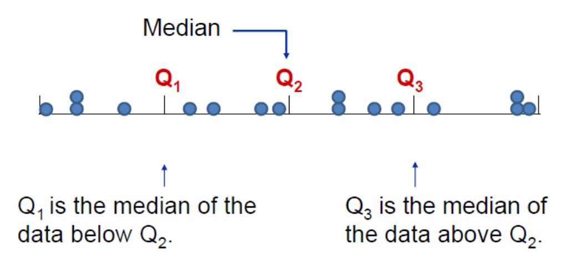

## Historia de la estadística

<div style="text-align: center;"><iframe width="280" height="160" src="https://www.youtube.com/embed/O2L_VsKDxlw" frameborder="0" allow="accelerometer; autoplay; encrypted-media; gyroscope; picture-in-picture" allowfullscreen></iframe></div>

<div style="text-align: center;"><iframe width="280" height="160" src="https://www.youtube.com/embed/LMsjlMmrc_0" frameborder="0" allow="accelerometer; autoplay; encrypted-media; gyroscope; picture-in-picture" allowfullscreen></iframe></div>


## ¿Qué es la estadística?

- Ciencia que describe y realiza inferencias sobre el mundo desde una muestra de datos

- Ciencia que proporciona metodologías para recolectar organizar, resumir, presentar y analizar datos y hacer inferencias a partir de ellos.


<div style="text-align: center;"><iframe width="280" height="160" src="https://www.youtube.com/embed/MaTO78ZoNoo" frameborder="0" allow="accelerometer; autoplay; encrypted-media; gyroscope; picture-in-picture" allowfullscreen></iframe></div>


 **Ramas de la estadística**

**Estadística descriptiva:**
Organiza y describe las características de un conjunto de datos con el propósito de facilitar su aplicación, generalmente con el apoyo de gráficas, tablas o medidas numéricas.

Los parámetros estadísticos usados son las medidas de tendencia central y de variabilidad, y los gráficos de barras, de tortas y  el histograma.

**Estadística inferencial:**

Obtiene conclusiones de la población partiendo de una muestra, por medio de diferentes métodos, como las puebas de hipótesis, pronósticos de futuras observaciones, correlaciones y modelos de asociación entre variables.


<div style="text-align: center;"><iframe width="280" height="160" src="https://www.youtube.com/embed/buKDQZG5phM" frameborder="0" allow="accelerometer; autoplay; encrypted-media; gyroscope; picture-in-picture" allowfullscreen></iframe></div>


## Algunas definiciones

**Población:**
Conjunto de elementos sobre los que queremos hacer afirmaciones


**Muestra:**
Conjunto de personas o cosas que se consideran representativos del grupo al que pertenecen, con la finalidad de estudiar o determinar las características del grupo.

<div style="text-align: center;"><iframe width="280" height="160" src="https://www.youtube.com/embed/d6rrvuxBoY8" frameborder="0" allow="accelerometer; autoplay; encrypted-media; gyroscope; picture-in-picture" allowfullscreen></iframe></div>


**Parámetro:**
Valor descriptivo de la población

**Estadístico:**
Valor descriptivo para una muestra

**Base de datos:**
Colección de información organizada, de tal modo que sea fácilmente accesible, gestionada y actualizada

**Almacenamiento de bases de datos**

Las bases de datos Surgen de la necesidad de almacenar la información a través de la historia

1. Piedras, madera y arcilla, donde se escribian jeroglíficos.

- Los babilonios y mesopotámicos a través de la escritura cuneiforme que tallaban en tabletas y en rocas, al igual q los mallas 

-La cultura inca que escribian en un sistema de cuerdas anudadas.

```{r, echo=F, fig.cap='Puntos atípicos', fig.asp=0.3, fig.align='center'}
knitr::include_graphics("imagen/escritura.png")
```


2. Papel

Edad media: Códice Formato de libro, Se compone de pergaminos plegados, cosidos y encuadernados.

El papel reemplazó progresivamente al pergamino, una herramienta más barata que permitió una difusión mas amplia, en la época moderna el códice fue hecho en papel

3. Films

4. Almacenamiento digital: bytes, tarjetas perforadas, CDs y memorias
Actualmente es posible almacenar digitalmente en un disco compacto por ejemplo los datos que cabrian en miles de carpetas archivadas

5. Nube:
Se puede guardar y compartir un volumen de archivos ilimitados, asi como acceder a ellos desde cualquier dispositivo con acceso a internet

A lo largo de la historia se ha buscado el sistema más pequeño físicamente con mayor capacidad de almacenamiento


```{r, echo=F, fig.cap='Discos duros en la nube', fig.asp=0.3, fig.align='center'}
knitr::include_graphics("imagen/nube.png")
```


**Punto atípico o outlier**
Son observaciones extremas, alejadas hacia valores muy grandes o pequeños comparadas con el resto de valores. Los valores atípicos pueden ser indicativos de datos que pertenecen a una población diferente del resto de las muestras establecidas. Se pueden detectar con un análisis descriptivo, mediante diagramas de dispersión, boxplot o histograma. 


```{r, echo=F, fig.cap='Puntos atípicos', fig.asp=0.3, fig.align='center'}
knitr::include_graphics("imagen/manzana.png")
```


## Tipos de variables

Característica o condición que puede tomar diferentes valores en una muestra. Ejm:

- Presión sanguínea 
- Masa de los niños
- Frecuencia cardiaca 
- Estatura de un grupo de estudiantes
- Edad de los pacientes de un médico

*Tipos de variables*

<div style="text-align: center;"><iframe width="280" height="160" src="https://www.youtube.com/embed/sQ08tqf-rXU" frameborder="0" allow="accelerometer; autoplay; encrypted-media; gyroscope; picture-in-picture" allowfullscreen></iframe></div>


**Actividad**

Clasifique las siguiente variables según sea el caso

|variable|tipo de variable|clasificación|niveles|
|--------|:----------------:|:----------:|:-------:|
|Color de ojos|Cualitativa|Nominal      |verde, azul,cafe|
|Edad |                   |             |       | 
| velocidad|              |             |       | 
|Estado civil|            |             |       |
|Color de la piel|        |             |       |
|Color del cabello|       |             |       |
|Marcas de carro|         |             |       |
|Número de hijos de una familia|    |   |       |
|Número de mensajes enviados por whatsap un dia |  |  | |
|Número de estudiantes conectados a clase|  |   |  |
|Días de la semana|       |             |       |


## Medidas de tendencia central 

Son 3 valores que resumen y representan la información contenida en un conjunto de datos.
Las tres medidas son la media, la mediana y la
moda.

```{r fig.asp=0.8, fig.align='center', echo=FALSE}
knitr::include_graphics("imagen/central.png")
```


### Moda

Es el valor que más se repite, si no hay datos que se repiten se dice que no hay moda.
Si dos datos se repiten con la misma frecuencia se dice que los datos son bimodales.


### Media

Valor promedio de un conjunto de datos numéricos, calculada como la suma del conjunto de valores dividida entre el número total de valores, la fórmula con la que se estima es:

**Media Muestral**

$$\bar x=\frac{\sum_{i=1}^{n}x_i}{n}$$

**Media poblacional**

$$\hat \mu =\frac{\sum_{i=1}^{n}x_i}{N}$$

Donde
$x_i$ corresponde a cada observación

N es el tamaño poblacional

n es el tamaño muestral

Según el teorema de límite central cuando n>30 se considera poblacional

### Mediana

Es un valor que se encuentra en la mitad de los datos, cuando estos están ordenados

a. si los datos son pares, la mediana es la suma de los dos valores centrales dividida por dos

$$M_e=\frac{X_{\frac{n}{2}}+X_{\frac{n}{2}+1}}{2}$$

b. si los datos son impares la mediana es el valor que se encuentra en la posición $\frac{n+1}{2}$

$$M_e=X_\frac{_{n+1}}{2}$$

**Ejemplo**

Se tienen las edades de una muestra de estudiantes de estadística básica compuesta por hombres y mujeres

|Hombre|20|22|26|20|26|19|20|21|26|  |  |  |  |
|:----:|--|--|--|--|--|--|--|--|--|--|--|--|--|
|Mujer |20|20|31|26|23|42|23|20|24|25|24|27|22|

Estime la media por género, la moda y la mediana.

*Video medidas de tendencia central*

<div style="text-align: center;"><iframe width="280" height="160" src="https://www.youtube.com/embed/A_u9fS2r-Eg" frameborder="0" allow="accelerometer; autoplay; encrypted-media; gyroscope; picture-in-picture" allowfullscreen></iframe></div>


<div style="text-align: center;"><iframe width="280" height="160" src="https://www.youtube.com/embed/0DA7Wtz1ddg" frameborder="0" allow="accelerometer; autoplay; encrypted-media; gyroscope; picture-in-picture" allowfullscreen></iframe></div>

## Medidas de variabilidad

La media es un buen indicador de tendencia central, pero no da una evidencia real acerca de los datos.

Las medidas de variabilidad determinan el grado de acercamiento o distanciamiento de los valores de una distribución frente a su promedio de localización.

- Entre más grande sea el grado de variación, menor uniformidad tendrán los datos (sinónimo de heterogeneidad) y por lo tanto menor confiabilidad del promedio de tendencia central o localización por haber sido obtenido de datos dispersos (Mendoza et al, 2002). 

- Si este valor es pequeño (respecto a la unidad de medida) entonces hay una gran uniformidad entre los datos(Mendoza et al, 2002). 

- Cuando es cero quiere decir que todos los datos son iguales.

### Rango

Es la diferencia entre el valor máximo y el valor mínimo

Rango= valor max - valor mínimo

Esta medida ignora la manera en que los datos están distribuidos

```{r fig.asp=0.8, fig.align='center', echo=FALSE}
knitr::include_graphics("imagen/rango.png")
```

### Varianza y Desviación estándar
 indica qué tan dispersos están los datos con respecto a la media

```{r fig.asp=0.7, fig.align='center', echo=FALSE}
knitr::include_graphics("imagen/sd.png")

```

**Caso poblacional**

**Varianza**

$$\sigma^2=\frac{\sum_{i=1}^n(x_i-\mu)^2}{N}$$
**Desviación estándar**

$$\sigma=\sqrt{\frac{\sum_{i=1}^n(x_i-\mu)^2}{N}}$$
**Caso muestral**

**Varianza**
$$S^2=\frac{\sum_{i=1}^n(x_i-\bar x)^2}{n-1}$$
**Desviación estándar**
$$S=\sqrt{\frac{\sum_{i=1}^n(x_i-\bar x)^2}{n-1}}$$
**Pasos para estimar la desviación estándar**

1. Encuentre la media

2. Encuentre la desviación de cada uno de los valores con respecto a la media.

3. Eleve cada valor obtenido al cuadrado

4. Halle la suma de cada uno de los cuadrados

5. Divida la suma de los cuadrados por el número de ítems

6. Encuentre la raíz cuadrada de la varianza


*Medidas de variabilidad*

<div style="text-align: center;"><iframe width="280" height="160" src="https://www.youtube.com/embed/cg4kUsbjQms" frameborder="0" allow="accelerometer; autoplay; encrypted-media; gyroscope; picture-in-picture" allowfullscreen></iframe></div>

**Diferencia en medidas entre la población y la muestra**

|Medida|Población|Muestra|
|:----:|:-------:|:-----:|
|Tamaño|N        |n      |
|Media |$\mu$   |$\bar x$|
|Varianza|$\sigma^2$|$S^2$|
|Desviación estándar|$\sigma$|S|

**Comparemos**

```{r fig.asp=0.5, fig.align='center', echo=FALSE}
knitr::include_graphics("imagen/bolas.png")
```


*Cómo estimar la media, la desviación estandar en la calculadora*

<div style="text-align: center;"><iframe width="280" height="160" src="https://www.youtube.com/embed/4eXrcn6QLgs" frameborder="0" allow="accelerometer; autoplay; encrypted-media; gyroscope; picture-in-picture" allowfullscreen></iframe></div>


<div style="text-align: center;"><iframe width="280" height="160" src="https://www.youtube.com/embed/6jqoucoas8Y" frameborder="0" allow="accelerometer; autoplay; encrypted-media; gyroscope; picture-in-picture" allowfullscreen></iframe></div>


### Coeficiente de variación 

Es una medida de la dispersión relativa de un conjunto de datos, la cual relaciona la desviación típica de una muestra y su media.

Se expresa en términos porcentuales, la fórmula con la que se estima es:
$$CV=\frac{S}{\bar x}*100$$


No depende de las unidades de medición, por lo que sirve para comparar la variabilidad de dos conjuntos de datos, siempre que sus medias sean positivas.

**Ejemplo**

Se tienen las edades de una muestra de estudiantes de estadística básica compuesta por hombres y mujeres

|Hombre|20|22|26|20|26|19|20|21|26|  |  |  |  |
|:----:|--|--|--|--|--|--|--|--|--|--|--|--|--|
|Mujer |20|20|31|26|23|42|23|20|24|25|24|27|22|

Estime las medidas de variación y el coeficiente de variación.


## Media ponderada

Es apropiada cuando en un conjunto de datos, cada uno de ellos tiene una importancia relativa (o peso) respecto de los demás datos. Se obtiene multiplicando cada uno de los datos por su ponderación (peso) para luego sumarlos


$$\bar X=\sum_{i=1}^{n}x_i*w_i$$

Donde $X_i$ es cada una de las observaciones, $W_i$ es la ponderación de cada uno de ellos.

$$\sum_{i=1}^n w_i=1$$

**Ejemplo**

Se tienen las siguientes notas de un estudiante


|Peso(%)|25|15|35|10|15|total|
|:-----:|--|--|--|--|--|:---:|
|Nota   | 4|3 |2 |1 |4 |     |
|Ponderación |1| | | | |     |

- ¿Cuál es la nota total obtenida en la materia?

- Si faltara la última nota,¿Cuanto tendría que sacar para ganar la asignatura?

## Medidas de posición

Son valores que permiten dividir el conjunto de datos en partes porcentuales iguales y se usan para clasificar una observación dentro de una población o muestra. Las medidas de posición más usuales son los cuartiles, los deciles y los percentiles.

### Cuartiles

Son tres valores que distribuyen la serie de datos ordenada, en cuatro tramos iguales, en los que cada uno de ellos se concentra el 25% de los resultados.


```{r fig.asp=0.5, fig.align='center', echo=FALSE}

```

La fórmula con la que se estima está dada por:

$$Q_k=X_{(k \frac{n+1}{4})}$$
con k=1,2,3

**Rango intercuartilico IQR**
Se define como la diferencia entre el tercer cuartil y el primer cuartil, es decir: 

$$IRQ=Q_3-Q_1$$


The Interquartile Range (or IQR)


### Deciles

Son 9 valores que distribuyen la serie de datos ordenada, en diez tramos iguales, en los que cada uno de ellos concentra el 10% de los resultados.


La fórmula con la que se estima está dada por:

$$D_k=X_{(k \frac{n+1}{10})}$$
con k=1,2,3...9

### Percentiles
Divide un conjunto de datos ordenados en 100 partes iguales, es decir hay 99 percentiles.

$$P_k=X_{(k \frac{n+1}{100})}$$
con k=1,2,3...99

## Boxplot

El boxplot es una herramienta de análisis que resalta las principales características de un conjunto de datos, los números usados para construirlo son:

- Valor mínimo
- Los cuartiles $Q_1,Q_2,Q_3$
- Valor máximo


```{r fig.asp=0.9, fig.align='center', echo=FALSE}
knitr::include_graphics("imagen/boxplot.png")
```

Cada sección contiene el 25% de los datos. La caja muestra la mitad de los datos, es decir el 50% de ellos, contiene la información entre el 3 cuartil y el primer cuartil.

- Sirve para realizar comparaciones de una variable cuantitativa, en relación a los niveles de una variable cualitativa.

- Es posible observar la dispersión de cada caja, mientras mas larga, más dispersión.

- Permite observar puntos atípicos,los cuales no están contenidos dentro de la caja, ni en sus bigotes.


**Ejemplo en R**

La siguiente información fue reportada en la revista Motor Trend de EE.UU, en el año 1974. contiene el consumo de combustible y 10 aspectos del diseño y rendimiento para 32 automóviles (modelos 1973–74). 

A continuación se ilustra un resumen del número de cilindros que cada uno de los automoviles mostró

```{r}
library(knitr)
library(ggplot2)

#Base de datos
head(mtcars)

#resumen de todas las variables de la base de datos
summary(mtcars)

#millas por galón
mpg=mtcars[,1]

#media de las millas por galón
mean(mpg)

#desviación estándar
sd(mpg)

##Media de mpg según elnúmero de cilindros
# Usually, you'll want to group first
mtcars %>%
  group_by(cyl) %>%
  summarise(mean = mean(mpg))

#boxplot
boxplot(mtcars[,1]~mtcars[,2],xlab="cilindros",ylab="mpg",col ="pink")
```


## Bibliografía
-  Mendoza, H, Bautista, G. (2002). Probabilidad y Estadística. Universidad Nacional de Colombia, http://www.virtual.unal.edu.co/cursos/ciencias/2001065/. Licencia: Creative Commons BY-NC-ND.

-  R Core Team (2019). R: A language and environment for statistical computing. R Foundation for Statistical Computing, Vienna, Austria. URL https://www.R-project.org/.