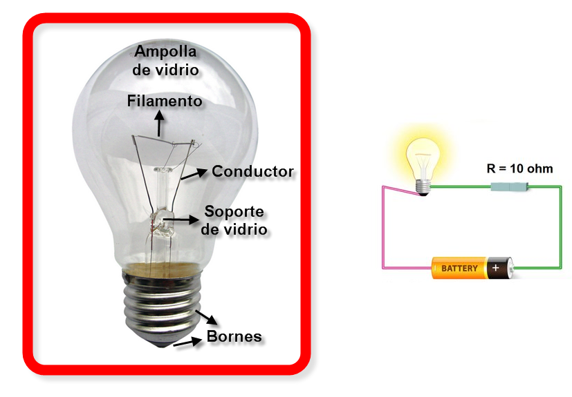

**Ejemplo**


Si se aplica una diferencia de potencial V a los bornes de una resistencia cuyo valor depende de la temperatura, de la resistencia $R_0$ a la temperatura definida $t_0$ y del coeficiente lineal de temperatura α, la potencia disipada P (el mensurando) por la resistencia a la temperatura t es función de $V, R_0, α,$ y t.


```{r, echo=F, out.width="25%", fig.align='center'}

```

La ecuación representativa es:

$$P=f(V,R_0,\alpha,t)=\frac{V^2}{R_0[1+\alpha(t-t_0)]}$$

Las derivadas paraciales de P con respecto a cada una de las variables corresponden a :

$$c_1=\frac{\partial P }{\partial V}= \frac{2V}{R_0[1+\alpha(t-t_0)]}=\frac{2P}{V}$$
$$c_2=\frac{\partial P }{\partial R_0}= \frac{-V^2}{R_0^2[1+\alpha(t-t_0)]}=\frac{-P}{R_0}$$
$$c_3=\frac{\partial P }{\partial \alpha}= \frac{-V^2(t-t_0)}{R_0[1+\alpha(t-t_0)]^2}=\frac{-P(t-t_0)}{1+\alpha(t-t_0)}$$
$$c4=\frac{\partial P }{\partial t}= \frac{-V^2\alpha}{R_0[1+\alpha(t-t_0)]^2}=\frac{-P \alpha}{1+\alpha(t-t_0)}$$
En terminos de fórmula se traduce en:

$$u^2(P)=\left[ \frac{\partial P}{\partial V} \right]^2 u^2(V)+\left[\frac{\partial P}{\partial R_0} \right]^2u^2(R_0)+\left[ \frac{\partial P}{\partial \alpha} \right]^2u^2(\alpha)+\left[ \frac{\partial f }{\partial t} \right]^2u^2(t)$$

$$u^2(P)=\left[C_1u(V)\right]^2+\left[ C_2 u(R_0) \right]^2 +\left[ C_3u(\alpha) \right]^2+\left[C_4u(t)  \right]^2$$

$$u(P)=\sqrt{\left[C_1u(V)\right]^2+\left[ C_2 u(R_0) \right]^2 +\left[ C_3u(\alpha) \right]^2+\left[C_4u(t)  \right]^2}$$