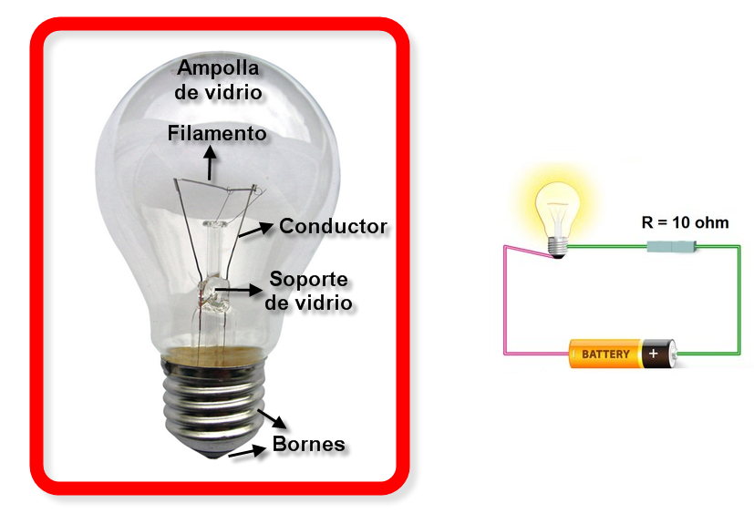

**Ejemplo**


Si se aplica una diferencia de potencial V a los bornes de una resistencia cuyo valor depende de la temperatura, de la resistencia $R_0$ a la temperatura definida $t_0$ y del coeficiente lineal de temperatura α, la potencia disipada P (el mensurando) por la resistencia a la temperatura t es función de $V, R_0, α,$ y t.


```{r, echo=F, out.width="25%", fig.align='center'}

```

La ecuación representativa es:

$$P=f(V,R_0,\alpha,t)=\frac{V^2}{R_0[1+\alpha(t-t_0)]}$$

1. Halle las derivadas parciales de P con respecto a las variables V, $R_0,\alpha, t$

2. Exprese la ecuación asociada a la estimación de la incertidumbre


