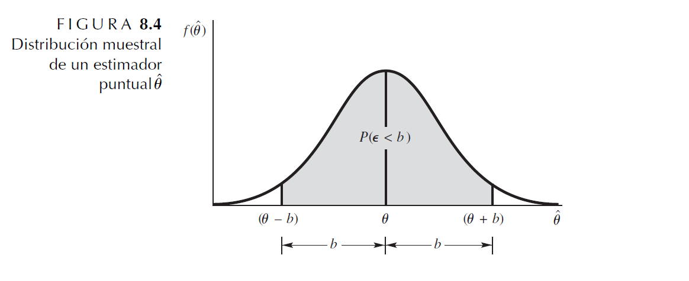

Una estimación puntual de un parámetro $\theta$ es un número único que puede ser considerado como un valor sensible de $\theta$. 

Se obtiene una estimación puntual seleccionando un estadístico apropiado y calculando su valor con los datos muestrales dados. 

El estadístico seleccionado se llama estimador puntual de $\theta$.


La estimación puntual es similar, a disparar a un tiro al blanco.

```{r fig.asp=0.8, fig.align='center', echo=FALSE}
knitr::include_graphics("imagen/central.png")
```

Como las estimaciones $\hat \theta$ son números, se evalua la bondad del estimador puntual al construir una distribución de frecuencia con los valores de las estimaciones obtenidas en muestreo repetido y se observa cómo se agrupa esta distribución alrededor del parámetro objetivo.


## Error de estimación 
El error de estimación $\varepsilon$ es la distancia entre un estimador y su parámetro objetivo. Esto es, 

$$\varepsilon=\hat \theta-\theta$$ 

Si seleccionamos dos puntos, $(\theta − b)$ y $(\theta + b)$, situados cerca de las colas de la densidad de probabilidad, la probabilidad de que el error de estimación $\varepsilon$ sea menor que b está representada por el área sombreada de la siguiente figura.


```{r fig.asp=0.8, fig.align='center', echo=FALSE}

```


Considere a b como un límite probabilístico en el error de estimación.
Esta probabilidad identifica la fracción de veces, en muestreo repetido, que el estimador $\hat \theta$  cae dentro de b unidades de $\theta$, el parámetro objetivo.


$$b = 2 \sigma _{\hat \theta}$$ 

Es un buen **límite para el error de estimación** 


## Propiedades de los estimadores


El estimador poblacional del parámetro $\theta$ estará indicado por el símbolo $\hat \theta$, que se lee como teta estimado 

1. Se desea que la media o valor esperado de la distribución de estimaciones fuera igual al parámetro estimado; esto es, $E(\hat \theta)=\theta$ Se dice que los **estimadores  son insesgados**.

2. La distribución muestral para un **estimador puntual está sesgado** si $E(\hat \theta) \neq  \theta$  

3. El error de estimación $\varepsilon$ es la distancia entre un estimador y su parámetro objetivo. Esto es, $\varepsilon=\hat \theta-\theta$ 

4. En general Cuando X es una variable aleatoria binomial con parámetros n y p, la proporción muestral $\hat p=\frac{x}{n}$es un estimador insesgado de p.

5. Sean $X_1, X_2, . . . , X_n$ una muestra aleatoria de una distribución con media  y varianza $\sigma^2$. Entonces un estimador insesgado de $\sigma^2$ es:

$$\hat \sigma^2=S^2=\frac{\sum(x_i-\bar x )^2}{n-1}$$

es 

**Valores esperados y errores estándar de algunos estimadores puntuales comunes**

|Parámetro objetivo| tamaño de muestra|Estimador puntual $\hat \theta$|$E(\hat \theta)$|Error estándar $\sigma_{\hat \theta}$|
|---------------|------------|------------------|-------|---------------------|
|$\mu$  |n         |$\bar Y$         |$\mu$  |$\frac{\sigma}{\sqrt n}$|
|p      | n        |$\hat p=\frac{Y}{n}$| p   |$\sqrt{\frac{pq}{n}}$   |
|$\mu_1-\mu_2$|$n_1,n_2$|$\bar Y_1-\bar Y_2$|$\mu_1-\mu_2$| $\sqrt{\frac{\sigma_1^2}{n_1}+\frac{\sigma_2^2}{n_2}}$|
|$p_1-p_2$|$n_1,n_2$|$\bar p_1-\bar p_2$|$p_1-p_2$| $\sqrt{\frac{p_1q_1}{n_1}+\frac{p_2q_2}{n_2}}$|


**Ejemplo 1**

Una muestra de 1000 votantes, seleccionados al azar en Bogotá mostró que 560 personas estaban a favor del candidato petro. Sea p=0.56, la fracción de votantes de la población que están a favor de petro. Precise un límite de error estándar de 2 en el error de estimación.

**Solución **

¿Qué tan confiable es el valor de la estimación $\hat p=0.56$? 

La distribución de probabilidad de $\hat p$ a una distribución normal cuando las muestras son grandes.

Como n = 1000, cuando $b = 2 \sigma_{\hat p}$, la probabilidad de que 
$\varepsilon$ sea menor que b es aproximadamente 0.95.


De lo anterior el error estándar del estimador para p está dado por 
$\sigma_{\hat p}= \sqrt \frac {pq}{n}$ por tanto el error de estimación está dado por:

$$b = 2 \sigma_{\hat p}=2 \sqrt \frac {pq}{n}$$

$$b = 2 \sigma_{\hat p}=2 \sqrt \frac {0.56*0.44}{1000}=0.03$$


La probabilidad de que el error de estimación sea menor que 0.03 es aproximadamente 0.95. 

Se tiene una confianza razonable de la estimación, 0.56, está a no más de 0.03 udds del valor verdadero de p, la proporción de votantes en la población que está a favor petro.


**Ejemplo 2**

Se realiza una comparación de la durabilidad de dos tipos de llantas para automóvil se obtuvo de muestras de pruebas en carretera de n1 = n2 = 100 llantas de cada tipo. Se registró el número de millas hasta que la cantidad restante de superficie de rodamiento llegó a un valor pequeño especificado previamente.

Las mediciones para los dos tipos de llantas se obtuvieron de manera independiente y se calcularon las siguientes medias y varianzas:


|LLanta| media $\hat y$|varianza $S^2$|
|------|---------------|--------------|
|1     |26,400 millas  |1,440,000     |
| 2    |25,100 millas  |1,960,000     |


Estime la diferencia en la media de millas hasta quedar inútiles y precise un límite de error estándar de 2 en el error de estimación.

**Solución** 

La estimación puntual de $(\mu_1 − \mu_2)$ es


$$(\bar y_1 − \bar y_2) = 26,400 −25,100 = 1300 millas$$
y el error estándar del estimador es

$$\sigma_{(\bar y_1 − \bar y_2)}= \sqrt{\frac{\sigma_1^2}{n_1}\frac{\sigma_2^2}{n_2}}$$
Debemos conocer $\sigma_1^2$ y $\sigma_2^2$ para calcular $\sigma_{(\bar y_1 − \bar y_2)}$


$$\sigma_{(\bar y_1 − \bar y_2)}= \sqrt{\frac{\sigma_1^2}{n_1}+\frac{\sigma_2^2}{n_2}}\approx\sqrt{\frac{S_1^2}{n_1}+\frac{S_2^2}{n_2}}=\sqrt{\frac{1.440.000}{100}+\frac{1.960.000}{100}}$$

$$\sqrt{34000}=184.4 millas$$
En consecuencia, estimamos que la diferencia en desgaste medio es de 1300 millas y esperamos
que el error de estimación sea menor que $2\sigma_{(\bar y_1 − \bar y_2)}$, o sea 368.8 millas, con una probabilidad de aproximadamente 0.95.


## Relación entre estimación puntual y estimación por intervalo

Se puede usar un solo número, por ejemplo 0.13 onzas, que consideramos es cercano a la media poblacional $\mu$. Este tipo de estimación se llama estimación puntual porque un solo valor constituye la estimación de $\mu$. 

En segundo término podríamos decir que $\mu$ está entre dos números, por ejemplo entre 0.07 y 0.19 onzas, estos dos valores se pueden utilizar para construir un intervalo (0.07, 0.19) que tiene la intención de encerrar el parámetro de interés; entonces, la estimación se denomina estimación de intervalo.

**Estimación puntual y por intervalo**

<iframe width="280" height="160" src="https://www.youtube.com/embed/cMqgG_lBC2U" title="YouTube video player" frameborder="0" allow="accelerometer; autoplay; clipboard-write; encrypted-media; gyroscope; picture-in-picture" allowfullscreen></iframe>

## Taller

### Ejercicios estimadores

1.  Un investigador está interesado en la posibilidad de unir las aptitudes de televisión e Internet. Una muestra aleatoria de n = 50 usuarios de Internet dio que el tiempo medio semanal empleado en ver televisión era de 11.5 horas y que la desviación estándar era de 3.5 horas. Estime el tiempo medio poblacional que los usuarios de Internet pasan viendo televisión y fije un límite para el error de estimación.
rta/ 11.5 +-0.99

2. La Environmental Protection Agency realizó un amplio estudio de los posibles efectos de trazas de elementos en el agua potable sobre la formación de cálculos renales. La tabla siguiente presenta datos de edad, cantidad de calcio en agua potable (medida en partes por millón) y hábitos de fumar. Estos datos se obtuvieron de individuos con problemas actuales de cálculos renales, todos los cuales vivían en las dos Carolinas y en estados de las Montañas Rocallosas.


|Item|Carolinas|Rocallosas|
|--------------|----------|----------|
|Tamaño muestral|467|191|
|Edad promedio  |45.1|46.4|
|Desviación estándar|10.2|9.8|
|Componente medio de calcio (ppm)|11.3|40.1|
|Desviación estándar de calcio|16.6|28.4|
|Prop fumadores |0.78|0.61|

a. Estime la concentración promedio de calcio en el agua potable para pacientes con cálculos renales en las Carolinas. Establezca un límite para el error de estimación.
Rta/ 11.3+-1.54


b. Calcule la diferencia en edades medias para pacientes con cálculos renales en las Carolinas y en las Rocallosas. Fije un límite para el error de estimación.
rta/1.3+-1.7

c Calcule y precise un límite de desviación estándar de 2 en la diferencia en proporciones de pacientes
con cálculos renales, de las Carolinas y las Rocallosas, que eran fumadores en el momento de hacer
el estudio.
Rta/ 0.17+-0.08


3. Se realizó un estudio para comparar el promedio de llamadas de emergencia a la policía en cada turno de
8 horas en dos distritos de una ciudad grande. Se seleccionaron aleatoriamente muestras de 100 turnos
de 8 horas de los registros policíacos para cada una de las dos regiones y se registró el número de llamadas
de emergencia para cada turno. Los estadísticos muestrales se proporcionan en la tabla siguiente.

|Item|región 1|Región2|
|--------------|----------|----------|
|Tamaño muestral|100|100|
|Media muestral |2.4|3.1|
|Varianza muestral|1.44|2.64|


a Calcule la diferencia en el número medio de llamadas de emergencia a la policía por turno de 8 horas
entre los dos distritos de la ciudad. Rta/ -0.7
b Encuentre un límite para el error de estimación.
Rta/0.404

