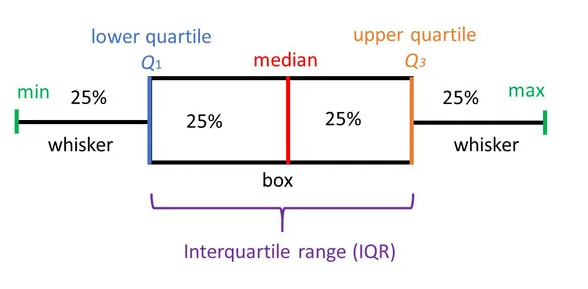

 
# Graficos para analizar la distribución de los datos 

Gran parte de los modelos estadísticos consideran que las observaciones provienen de poblaciones normales. En muchas situaciones este supuesto no se cumple. A continuación se mencionan algunos gráficos utilizados para analizar la distribución de los datos, además de la detección de puntos atípicos.   


En metrología los datos atípicos son llamados valores aberrantes, conocidos como las observaciones que se desvían significativamente de la tendencia general de los datos o que están considerablemente alejados de otros valores de la muestra. 
La detección y gestión de valores aberrantes es importante en metrología para garantizar la precisión y fiabilidad de las mediciones. Los valores aberrantes pueden sesgar los resultados del análisis y afectar la toma de decisiones basada en los datos.


## Gráfico de densidad 

Visualiza la distribución de datos en un intervalo continuo. Este gráfico es una variación de un histograma, donde el concepto de frecuencia relativa se cambia por el de probabilidad, la suma de todas la superficie será 1.

Los picos ayudan a mostrar dónde los valores se concentran en el intervalo, a su vez permite comparar la densidad de una variable continua en relación a los niveles de factor de una variable cualitativa.


**Ejemplo**

El acceso al agua potable es esencial para la salud, un derecho humano básico y un componente de una política eficaz de protección de la salud. Esto es importante como cuestión de salud y desarrollo a nivel nacional, regional y local. En algunas regiones, se ha demostrado que las inversiones en abastecimiento de agua y saneamiento pueden generar un beneficio económico neto, ya que las reducciones de los efectos adversos para la salud y los costos de atención médica superan los costos de llevar a cabo las intervenciones.

El PH es un parámetro importante para evaluar el equilibrio ácido-base del agua. La OMS ha recomendado un límite máximo permitido de pH de 6,5 a 8,5.

Se tienen los datos del ph del agua dependiendo de si el agua es potable o no, 632 datos de agua potable y 632 de agua no potable, se desea comparar su distribución. 


```{r echo=FALSE}

no<- c(3.7,8.1,8.3,9.1,5.6,10.2,8.6,11.2,7.4,8.0,7.1,7.5,6.3,7.1,9.2,9.0,7.4,6.7,3.9,5.4,6.5,3.4,7.2,9.8,10.4,7.4,5.1,3.6,5.6,9.3,5.3,7.1,9.9,4.8,5.7,7.0,10.7,8.8,7.8,6.7,9.1,10.6,7.5,8.5,5.0,3.9,6.4,8.7,8.1,6.2,5.1,7.3,7.2,5.7,6.2,8.7,6.9,3.5,3.7,6.5,7.3,1.8,5.5,7.4,6.0,6.4,6.2,6.8,9.9,10.2,8.7,6.1,9.0,7.0,6.1,7.1,5.5,7.2,9.2,4.3,7.3,8.5,2.6,8.5,8.9,6.1,8.4,9.3,7.9,7.7,3.4,6.7,7.2,10.1,7.4,7.8,6.9,7.5,8.6,10.3,7.4,11.2,6.5,6.6,5.0,6.9,8.0,6.1,6.2,6.1,8.1,9.6,8.2,8.6,6.8,7.9,5.0,6.2,9.8,9.6,5.2,7.6,5.8,6.6,4.8,7.9,6.9,8.5,7.7,8.9,6.2,6.1,7.3,8.6,8.2,8.3,9.5,7.8,4.4,7.2,6.9,6.1,7.9,6.5,5.3,6.8,5.9,9.5,6.3,8.7,5.7,6.6,7.8,7.6,7.4,9.3,3.7,6.7,9.9,5.6,5.6,4.1,6.0,8.4,6.3,11.3,9.3,7.9,7.9,10.0,6.5,5.9,5.3,7.5,4.1,7.1,6.3,8.0,8.9,6.6,7.7,9.9,9.0,5.1,8.6,7.1,7.7,6.4,4.4,7.0,6.6,3.7,4.8,5.8,6.9,7.4,4.7,9.4,7.8,9.4,9.4,6.3,4.7,8.9,6.6,6.8,6.9,5.7,5.6,7.4,6.3,9.9,5.4,5.0,6.5,6.5,6.3,8.0,7.6,6.9,9.9,7.6,7.0,8.1,7.2,7.5,8.4,6.1,6.1,6.4,9.5,7.9,5.9,6.5,5.2,7.9,7.7,6.7,10.5,9.1,8.1,7.1,8.0,7.0,5.5,8.5,7.3,6.3,7.2,8.7,8.6,7.2,7.2,8.9,6.4,6.7,5.4,7.5,4.4,10.3,6.6,4.2,7.9,6.3,7.8,8.2,5.7,7.4,4.8,7.9,5.9,7.7,7.8,6.1,5.0,8.7,7.7,8.6,5.7,6.6,6.5,9.2,6.3,6.0,7.6,6.4,6.1,5.8,5.4,5.3,5.4,9.9,7.1,9.4,7.5,5.3,7.3,7.8,6.8,5.6,5.7,5.4,5.0,4.6,7.0,5.8,8.4,5.9,6.9,10.3,8.2,7.3,8.8,6.6,6.1,5.9,5.4,5.0,6.5,9.6,8.7,8.4,3.8,4.3,9.9,4.3,8.3,3.4,7.5,7.0,7.5,7.2,8.8,9.0,9.5,6.1,7.5,7.1,6.6,6.0,6.3,7.5,6.4,9.0,7.5,5.7,7.8,7.1,8.8,8.0,7.2,6.4,6.1,8.5,5.8,6.8,7.9,8.6,5.6,8.1,6.7,6.5,9.7,9.3,10.1,6.5,6.1,6.3,5.3,8.3,6.0,6.2,8.2,9.8,8.7,7.0,6.5,7.8,9.7,8.0,7.4,5.5,6.1,6.3,6.3,9.0,8.5,4.0,6.4,6.3,7.6,5.5,7.5,7.9,5.4,8.3,6.7,6.1,6.6,4.7,8.2,5.7,6.6,8.3,10.5,5.2,7.0,6.5,6.6,9.0,6.0,6.3,6.6,7.1,8.1,7.7,5.6,5.2,4.6,6.8,6.4,6.8,6.9,7.9,5.5,6.5,6.7,6.2,4.8,7.4,8.1,7.1,7.6,4.7,8.1,4.3,7.9,9.1,6.6,7.0,9.0,8.6,6.7,6.5,6.8,5.0,8.3,5.5,7.9,5.0,6.5,8.8,8.2,7.7,7.8,7.2,7.0,4.7,4.1,8.4,10.7,6.8,10.0,4.5,8.0,5.1,6.5,6.7,5.8,6.6,8.5,6.0,5.4,5.6,10.6,4.9,7.2,5.9,7.4,7.8,4.7,9.1,5.5,4.5,7.0,10.2,6.8,8.1,7.3,5.9,8.3,5.9,5.3,10.3,7.0,6.9,8.3,8.2,5.8,6.2,7.3,7.6,6.8,5.6,4.9,5.7,10.7,7.6,8.8,6.8,5.1,7.0,9.0,9.5,4.7,10.4,5.7,10.8,9.0,6.8,8.9,4.3,6.7,5.9,6.8,7.4,6.5,6.9,9.3,7.4,6.6,6.2,9.1,4.7,10.6,7.6,6.1,5.3,6.8,7.2,6.6,8.4,8.0,7.4,6.1,7.9,5.2,6.4,7.4,4.4,8.2,4.9,6.9,6.7,7.6,8.2,8.9,8.8,4.7,7.8,6.1,7.7,4.8,5.4,5.5,6.4,8.3,6.6,8.3,6.8,6.4,6.5,6.6,9.3,4.6,7.9,6.2,7.2,8.7,4.8,9.3,7.6,5.3,5.5,8.3,8.6,6.0,5.7,5.2,7.5,11.0,6.7,4.2,7.2,6.2,9.6,5.4,8.7,7.7,7.1,8.3,5.5,10.2,5.4,8.9,8.1,7.2,5.5,5.3,6.4,6.7,6.9,8.0,8.3,8.7,8.2,9.0,8.9,6.0,8.2,7.6,7.8,7.6,6.7,8.8,7.8,6.2,8.6,7.0,3.3,7.9,2.7)

si<-c(9.4,9.0,6.8,7.2,7.7,8.3,5.9,9.8,6.1,5.0,4.8,6.5,13.2,6.6,7.8,5.2,5.6,6.9,9.1,7.3,7.3,6.5,7.2,5.3,7.1,5.3,10.8,6.3,9.8,8.2,6.9,10.4,8.0,3.9,5.7,10.0,6.6,7.6,4.8,7.7,8.3,6.2,9.0,6.1,7.1,5.4,8.1,10.0,5.7,8.9,6.4,7.0,5.9,6.8,10.0,7.3,5.9,7.3,8.1,7.8,11.3,6.6,9.2,4.6,7.8,5.6,7.9,7.4,3.7,9.6,7.0,7.7,6.7,5.4,7.0,10.0,5.6,8.0,5.5,7.5,6.8,5.9,8.7,6.0,9.6,4.3,3.6,8.5,8.1,9.2,8.8,9.5,8.1,2.8,6.4,7.8,7.7,5.1,7.5,5.4,7.1,6.9,4.8,5.0,4.8,4.0,6.5,6.8,7.0,5.6,6.0,6.3,8.0,8.9,6.0,10.3,6.1,9.4,6.9,6.5,5.8,4.9,9.7,5.5,6.4,5.5,8.5,7.4,6.7,6.8,8.7,7.1,5.0,7.7,6.3,8.6,5.8,7.1,8.0,4.7,8.2,6.4,7.0,7.5,7.3,10.0,7.8,6.3,9.6,8.9,8.1,8.2,4.9,9.0,7.4,9.1,4.2,7.8,6.7,3.6,8.0,4.6,4.0,8.9,5.9,9.5,8.8,7.7,9.1,1.8,7.7,6.7,5.1,9.5,6.2,7.4,7.8,8.6,6.4,7.3,6.1,4.7,5.4,5.6,5.8,5.3,7.7,3.7,4.9,5.8,5.0,10.0,7.4,5.1,3.6,8.9,10.1,9.9,10.3,0.2,6.0,7.1,6.4,8.1,10.3,5.5,9.2,7.1,7.1,8.2,6.4,6.2,6.8,7.1,4.6,7.7,8.1,7.5,8.1,7.7,6.8,6.3,5.4,5.7,7.7,8.6,9.9,3.4,8.4,8.4,7.6,9.9,5.2,9.7,7.9,8.9,6.9,10.5,5.7,5.3,6.8,6.8,8.6,8.5,7.6,8.1,5.4,8.0,11.9,7.4,5.1,6.9,9.6,5.4,4.9,6.4,3.9,6.9,9.1,10.3,8.8,7.4,9.4,9.4,7.3,8.9,8.1,7.8,4.7,10.9,4.7,9.9,5.8,1.0,9.5,6.4,6.4,5.5,5.4,7.4,7.8,7.2,6.2,6.8,8.0,8.2,6.7,7.6,8.5,5.4,7.7,8.2,7.8,7.2,5.7,6.7,4.8,8.5,7.7,4.2,7.8,5.9,7.3,9.5,7.5,8.0,7.7,8.3,6.9,6.8,8.2,4.7,6.0,6.6,8.8,6.9,8.8,8.1,5.1,7.4,9.4,5.9,5.8,7.6,9.0,5.4,9.8,5.2,4.9,7.8,7.1,7.9,7.5,7.2,8.7,8.4,6.3,9.3,4.9,6.1,5.7,6.6,7.6,7.9,7.4,5.6,4.3,7.3,6.4,10.8,5.0,10.4,8.4,7.8,7.6,11.2,5.7,10.5,3.8,5.7,5.5,6.8,6.0,6.3,9.2,8.7,8.0,5.5,7.2,5.5,9.8,3.6,7.1,6.6,5.9,9.5,8.4,7.7,6.9,5.8,6.3,6.6,7.3,6.6,6.0,5.9,7.6,6.9,8.0,8.8,6.9,8.7,6.0,4.4,8.2,7.8,7.9,6.1,7.1,8.0,6.6,6.4,6.3,8.0,5.1,8.2,7.6,5.3,7.9,5.3,10.6,7.5,7.1,5.4,7.0,6.0,6.2,7.7,8.1,7.3,6.8,7.4,8.8,7.1,5.3,7.2,7.7,8.7,7.0,6.9,6.4,9.9,5.6,6.3,7.7,6.4,8.0,6.6,6.0,6.4,7.0,6.4,6.0,7.3,9.2,6.6,6.9,5.9,8.2,6.9,7.6,6.6,7.5,7.3,6.8,6.7,6.0,6.7,7.5,6.3,7.4,7.3,7.0,7.6,7.0,6.3,7.3,6.8,8.4,6.6,6.2,6.6,8.1,8.4,7.9,7.9,8.9,7.0,7.6,8.5,6.8,6.5,6.2,5.6,6.2,7.7,8.8,5.6,7.3,7.9,5.7,6.0,8.0,7.2,7.6,6.9,5.7,6.1,6.0,9.7,7.7,6.7,8.0,8.2,6.5,6.8,7.0,7.7,7.9,5.8,7.6,8.7,6.9,8.5,6.5,8.2,7.3,7.1,5.9,7.3,7.4,6.4,6.9,6.5,8.3,6.7,7.2,6.5,7.0,7.5,7.0,7.0,6.5,8.1,7.2,6.8,7.0,7.4,6.5,6.6,6.8,6.3,7.1,7.5,7.5,6.0,6.7,6.8,9.5,7.1,7.6,7.0,8.1,7.0,6.3,6.2,6.9,7.8,7.9,6.4,7.8,7.0,7.0,6.6,7.4,6.9,5.3,6.9,7.8,7.3,6.8,6.7,8.0,6.9,5.8,8.5,7.0,7.3,8.1,7.5,7.5,6.4,7.1,7.4,6.7,7.7,7.0,7.2,6.6,6.9,6.3,7.0,7.4,7.4,7.7,6.5,8.2,6.1,7.1,6.6,4.7,8.0,6.8,7.0,6.4,6.3,9.0,7.8,6.1,7.2,6.7,8.1,6.3,5.9,7.6,6.7,6.9,7.6,7.4,6.6,6.3,5.9,7.9,6.5,6.8,7.2,7.1,7.2,7.8,7.0,7.7,6.3)


```


```{r echo=TRUE}

library(ggplot2)

head(no)

head(si)


# datos 

par(mfrow=c(1,2))
tmp <- rbind(data.frame(origen = "no", dato = no), 
             data.frame(origen = "si", dato = si))
ggplot(tmp, aes(x =dato, fill = origen)) +
  geom_density(alpha = 0.3)

hist(no, xlab = "PH agua no potable", ylab = "Frecuencia", las=1, main = "", col = "gray")

hist(si, xlab = "PH agua potable", ylab = "Frecuencia", las=1, main = "", col = "gray")
```

## Grafico cuantil cuantil

Los gráficos cuantil cuantil son una ayuda para explorar si un conjunto de datos proviene de una población con cierta distribución.

<iframe width="280" height="160" src="https://www.youtube.com/embed/kx_o9rnI4DE" title="QQplot" frameborder="0" allow="accelerometer; autoplay; clipboard-write; encrypted-media; gyroscope; picture-in-picture; web-share" referrerpolicy="strict-origin-when-cross-origin" allowfullscreen></iframe>

La función **qqnorm** sirve para explorar la normalidad de una muestra, generalmente va acompañada de una linea recta de referencia, que se estima con la función **qqline**.


La función **qqplot** sirve para crear el gráfico cuantil cuantil para cualquier distribución, requiere los cuantiles de la distribución candidata.


**Ejemplo de los datos de agua potable**

```{r echo=TRUE}
par(mfrow=c(1, 2))

qqnorm(y=si, main='PH agua potable', ylab='Cuantiles muestrales',
       xlab='Cuantiles teóricos', las=1)
qqline(y=si, col='blue', lwd=2, lty=2)

qqnorm(y=no, main='PH agua no potable', ylab='Cuantiles muestrales',
       xlab='Cuantiles teóricos', las=1)
qqline(y=no, col='blue', lwd=2, lty=2)

```


## Boxplot

El boxplot es una herramienta de análisis que resalta las principales características de un conjunto de datos, los números usados para construirlo son:

- Valor mínimo
- Los cuartiles $Q_1,Q_2,Q_3$
- Valor máximo


```{r fig.asp=0.9, fig.align='center', echo=FALSE}

```

Cada sección contiene el 25% de los datos. La caja muestra la mitad de los datos, es decir el 50% de ellos, contiene la información entre el 3 cuartil y el primer cuartil.

- Sirve para realizar comparaciones de una variable cuantitativa, en relación a los niveles de una variable cualitativa.

- Es posible observar la dispersión de cada caja, mientras mas larga, más dispersión.

- Permite observar puntos atípicos,los cuales no están contenidos dentro de la caja, ni en sus bigotes.

**Ejemplo**

construir un boxplot con los datos del ph del agua según su potabilidad, Qué infiere?


```{r}
boxplot(no,si)
abline(h=6.5,col=2)
abline(h=8.5,col=2)
```

# Pruebas de bondad de ajuste para distribuciones de probabilidad

<iframe width="280" height="160" src="https://www.youtube.com/embed/U8ZpUT1c8A4" title="¿Qué es una prueba de bondad de ajuste?" frameborder="0" allow="accelerometer; autoplay; clipboard-write; encrypted-media; gyroscope; picture-in-picture; web-share" referrerpolicy="strict-origin-when-cross-origin" allowfullscreen></iframe>

## Pruebas de normalidad

La hipotesis nula y alternativa de normalidad son las siguientes:

 $$H_0:  \quad Los\quad datos\quad se\quad distribuyen \quad normal$$
 
$$H_1:  \quad Los\quad datos\quad no \quad se\quad distribuyen \quad normal$$
Existen diferentes pruebas para evaluar la normalidad, todas son de fácil implementación en R.


- **Prueba Shapiro-Wilk** 

En R se usa la función **shapiro.test**, se usa cuando la muestra es como máximo de tamaño 50. Es más potente que la prueba de K-S. 

- Prueba Anderson-Darling con la función ad.test del paquete nortest.

- Prueba Cramer-von Mises con la función cvm.test del paquete nortest.

- Prueba Lilliefors (Kolmogorov-Smirnov) con la función lillie.test del paquete nortest.

- Prueba Pearson chi-square con la función pearson.test del paquete nortest.

- Prueba Shapiro-Francia con la función sf.test del paquete nortest.


**Ejemplo en R probando normalidad en los datos de potabilidad del agua**


Para los datos del ph del agua, se desea probar mediante una prueba estadística si los datos se distribuyen de forma normal

```{r echo=TRUE}
shapiro.test(no)


shapiro.test(si)
```


**Otro Ejemplo en R**


Se necesita verificar si es correcto suponer que el volumen de llenado (en onzas) de una máquina dispensadora de jugos sigue una distribución normal, por lo que se toman 25 botellas de forma aleatoria. Los datos del volumen de llenado obtenidos de la muestra se encuentran almacenados en el vector volumen.

**Hipótesis**

$H_0:$ el volumen de llenado (en onzas) sigue una distribución normal.

$H_1:$ el volumen de llenado (en onzas) no sigue una distribución normal.

Nivel de significancia: 0.05 (Hipotético).

**Analisis descriptivo**


```{r echo=TRUE}
library(nortest)
volumen <-c(8.39,12.14,11.80,12.04,7.34,12.62,11.51,12.47,11.08,14.32,11.33,11.56, 12.79,11.72,12.84,11.73,12.1,11.88,11.95,10.84,11.79,13.21,12.56,12.55,12.80)

mean(volumen)
sd(volumen)

require(car)
library(MASS)
par(mfrow=c(1,4))
hist(volumen, xlab = "Volumen de llenado", ylab = "Frecuencia", las=1, main = "", col = "gray")

plot(density(volumen), xlab = "Volumen de llenado", ylab = "Densidad", las=1, main = "")

qqPlot(volumen, xlab="Cuantiles teóricos", ylab="Cuantiles muestrales", las=1,main="")

boxplot(volumen)


ks.test(volumen, "pnorm", mean =11.81, sd=1.4)

shapiro.test(volumen)

ad.test(volumen)

cvm.test(volumen)

sf.test(volumen)

```

## Pruebas para otras distribuciones

Una alternativa a la no normalidad de los datos, es proceder a implementar pruebas no paramétricas, para evaluar si los datos se ajustan a una distribución hipotética.

**Pruebas de hipótesis**

$H_0:$ Los datos analizados siguen una distribución M.

$H_1:$ Los datos analizados no siguen una distribución M


### Test de Kolmogorov-Smirnov K-S

Se emplea para saber si una distribución de probabilidad acumulada difiere de una distribución hipotética, por lo general la distribución normal, la uniforme, la de Poisson o la exponencial. Es decir permite contrastar si un conjunto de datos muestrales proviene de un tipo de distribución. 


**Estadístico**

Cuando K-S se aplica para contrastar la hipótesis de normalidad de la población, el estadístico de prueba es la máxima diferencia entre las funciones de distribución de probabilidad muestral y la teórica:

$$D=max|F_n-F_0(x)|$$

Siendo $F_n(x)$ la función de distribución muestral y $F_0(x)$ es la función teórica (normal) especificada en la hipotesis nula $H_0$


**Ejemplo probando la distribución exponencial**

Celia quiere medir el tiempo de atención a los usuarios. Se seleccionaron 20 personas y los tiempos de atención en minutos.


```{r echo=TRUE}
require(car)
tiempo<-c(3.69, 39.50,  4.43,  2.70,  9.11, 10.21, 10.44,  2.57,  5.68,  0.80,12.63,  2.35, 25.47, 8.07,  0.96,  0.21, 12.06, 10.79,  6.58, 13.06)

par(mfrow=c(1,4))
hist(tiempo, xlab = "Tiempo", ylab = "Frecuencia", las=1, main = "", col = "gray")
qqPlot(tiempo, col = "gray", ylab="Tiempo")
plot(density(tiempo), xlab = "Tiempo", ylab = "Densidad", las=1, main = "")
boxplot(tiempo, xlab = "Tiempo", ylab = "Densidad", las=1, main = "")


```

Se procede a revisar el ajuste con respecto a una distribución exponencial con un α=0.05

Sea X el tiempo entre llegadas a Celia Express.

$$H_0:X∼exp$$

$$H_1:X≁exp$$

La siguiente función ayuda a estimar los parámetros del modelo

```{r echo=TRUE}
library(MASS)
Ajustex <- fitdistr(tiempo,"exponential")
Ajustex

Ks<- ks.test(tiempo, "pexp", rate=Ajustex$estimate[1])
Ks

```

Según las pruebas realizadas, no se rechaza la hipótesis nula y por tanto, se asume la distribución exponencial.


**Ejemplo comparando dos distribuciones**

Se desea saber si los datos de potabilidad de agua (potable y no potable) siguen la misma distribución de probabilidad.


$$H_0:X_{si}∼X_{no}$$

$$H_1:X_{si}≁X_{no}$$

```{r echo=TRUE}

par(mfrow=c(1,2))
hist(si)
hist(no)
ks.test(si, no)

```

**Ejemplo comparando dos distribuciones**

Se desea saber si los datos de potabilidad de agua (potable y no potable) siguen la misma distribución de probabilidad.


$$H_0:X_{si}∼X_{no}$$

$$H_1:X_{si}≁X_{no}$$

```{r echo=TRUE}

par(mfrow=c(1,2))
hist(si)
hist(no)
ks.test(si, no)

```


