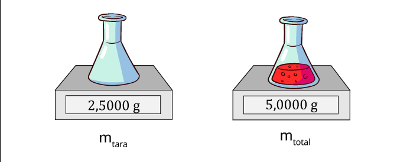
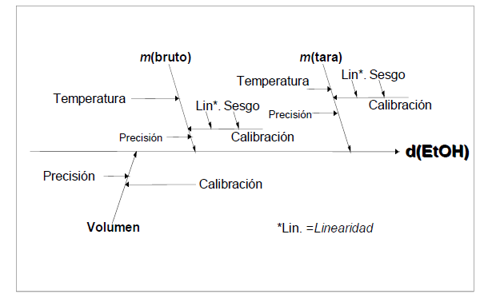
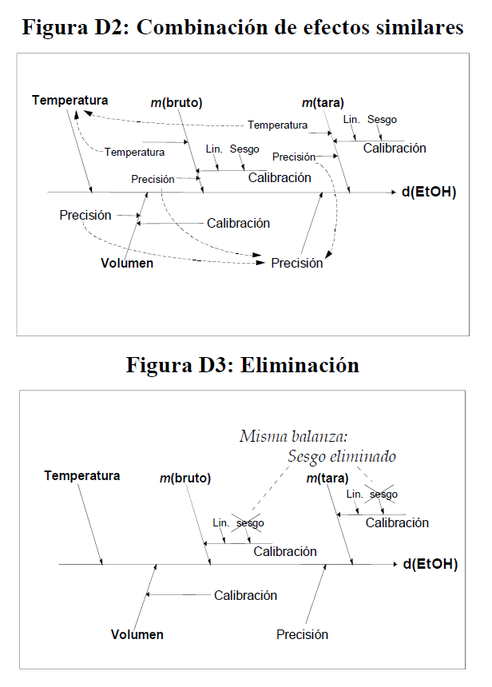

## Incertidumbre

- **Definición** Parámetro asociado al resultado de una medición que caracteriza la dispersión de los valores que podrían ser atribuidos al mensurando, (ISP, 2010).

- La incertidumbre generada por efectos sistematicos, es una de las más complejas de controlar, puede obtenerse mediante una evaluación Tipo A ó Tipo B (GUM,p18).

- La incertidumbre generada por efectos aleatorios, puede obtenerse mediante una evaluación Tipo A ó  Tipo B (GUM,p18).

- Las fuentes potenciales de incertidumbre se investigan y, siempre que sea posible, el método se ajusta para reducir la incertidumbre a un nivel aceptable. 

- El conocimiento de la incertidumbre implica un aumento de la confianza en la validez del resultado de una medición.

- Cada una de las contribuciones separadas a la incertidumbre es un componente de la incertidumbre. Cuando se expresa como desviación estándar se conoce como incertidumbre estándar.

- Fuentes de incertidumbre internas, incluye:

    - De los parámetros, 

    - De las suposiciones químicas. 

    - Por las condiciones ambientales 

    - Por la repitibilidad de las medidas

    - Por la exactitud y resolución del equipo 

    - **Muestreo:** Variaciones aleatorias entre muestras.

    - Condiciones de almacenamiento

    - Efectos instrumentales

    - Pureza de reactivos

    - Estequiometría asumida

    - Condiciones de medida

    - Efectos de la muestra, computacionales

    - De redondeo 

    - Efectos del operador y aleatorios
    
- Fuentes de incertidumbre externas, incluye:
    
    - Estudios previos de desempeño de métodos, de los que se requiere demostrar la validez para aplicar dichos resultados.

    - Materiales de referencia certificados compatibles

    - Desarrollo interno y estudios de validación
    
    
## Tipos de incertidumbre

Incertidumbre del resultado de una medición, expresada en forma de desviación típica, dependiendo del origen se clasifica en tipo A y tipo B, estas categorías se refieren a la incertidumbre y no sustituyen a las palabras “aleatorio” y “sistemático”. 


### Tipo A

Se obtiene mediante un analisis estadístico de los datos, se expresan por medio de varianzas o desviaciones y el número de grados de libertad.

Se asocia comúnmente con mediciones directas o indirectas y está influenciada por factores como la precisión de los instrumentos de medición, la variabilidad de las condiciones de prueba y otros errores experimentales. Se calcula como

$$u(típica)=\frac{s}{\sqrt n}$$


**Recorderis**
Demostración:

la incertidumbre tipo A proviene de la incertidumbre del promedio


$$\bar x=\frac{x_1+x_2+x_3+...+x_n}{n}$$

vamos a obtener su incertidumbre:


$$u(\bar x)=\sqrt{\left (\frac{1}{n}*u(x_1)\right)^2+\left (\frac{1}{n}*u(x_2)\right)^2+...+\left (\frac{1}{n}*u(x_n)\right)^2}$$

$$u(\bar x)=\sqrt{n \left (\frac{1}{n}*s\right)^2}$$


$$u(\bar x)=\sqrt{ \frac{n}{n^2}*s^2}$$


$$u(\bar x)=\sqrt{ \frac{n}{n^2}*s^2}$$

$$u(\bar x)= \frac{s}{\sqrt{n}}$$


Las categorías de incertidumbre tipo A pueden incluir:


|Categoría|Descripción|
|:--------|:-------------------------------------|
|**Variabilidad**|Fluctuación en las condiciones de fabricación y de la materia prima|
|**Replicabilidad**|Repetición de mediciones bajo las mismas condiciones experimentales, con variaciones en operarios y condiciones ambientales|
|**Reproducibilidad**|Repetición de mediciones en diferentes condiciones (equipos y métodos de medición) pero dentro de los mismos límites de precisión.|
|**Muestreo**|Sesgo en la selección de muestras de una población.|
|**Errores de modelo**|Representación del fenómeno que se está modelando. Puede incluir simplificaciones excesivas en el modelo, desconocimiento de ciertos efectos o interacciones|
|**Fuente de datos**|Asociada con los datos utilizados en el análisis o la estimación. Puede incluir errores de medición, sesgos en la recopilación de datos, etc.|
|**Presición del método de medición**|Estimada durante un prolongado periodo de tiempo de modo que permita que se produzcan variaciones naturales de todos los factores que afectan a los resultados, usando tantos analistas y equipos distintos como sea
posible (Eurachem)|


La replicabilidad se trata de repetir un estudio con un enfoque similar, mientras que la reproducibilidad implica la verificación de resultados usando los mismos datos y métodos. Ambos son esenciales para validar la investigación científica.


### Tipo B

No puede ser evaluada mediante métodos estadísticos, se determina mediante la aplicación de información externa, como datos históricos, conocimiento de expertos, especificaciones de diseño, generalmente es una desviación estándar (o un múltiplo de ésta) o la semiamplitud de un intervalo, con un nivel de confianza determinado.

Las categorías de incertidumbre tipo B pueden incluir:


- **Calibración**

Comparación entre el dispositivo de medición que se va a calibrar y otro de referencia trazable (BIPM).


- **Precisión del equipo:** 

Conjunto de condiciones que incluye condiciones similares, (el mismo procedimiento de medición, el mismo lugar y mediciones repetidas del mismo objeto u objetos similares durante un periodo amplio de tiempo), pero que puede incluir otras condiciones que involucren variaciones como calibraciones, patrones, operadores y sistemas de medida (VIM).

La menor variación en la magnitud de salida obtenible de esta forma puede tomarse como una medida de la incertidumbre (GUM); si dicha variación es δx conocido como la diferencia esperada entre 2 valores, la incertidumbre es:

$$u= \frac{δx}{\sqrt {12}}$$


- **Resolución del instrumento: ** 

La incertidumbre asociada con la capacidad del instrumento de medir con precisión hasta cierto nivel de detalle o resolución.


La siguiente fórmula se usa si el equipo es análogo: 


$$u(x)=\frac{Resolución}{\sqrt 3}$$
En el caso que un equipo sea digital, la fórmula es:

$$u(x)=\frac{Resolución}{\sqrt {12}}$$


- **de modelado matemático:** 

Incertidumbre asociada con la elección y los parámetros de los modelos matemáticos utilizados en el análisis. Esto puede incluir incertidumbre en la determinación de constantes físicas, suposiciones simplificadas en el modelo, etc.

-  **de extrapolación:**

Incertidumbre asociada con la extensión de resultados o conclusiones más allá del rango de datos o condiciones experimentales en los que se basa el análisis.

### Formas de obtener la incertidumbre 

- La incertidumbre viene dada como un **múltiplo específico de una desviación típica**, se obtiene del cociente entre el valor indicado y el factor multiplicador.


**EJEMPLO 1** 

Un certificado de calibración indica que la masa de un patrón de acero inoxidable, de valor nominal igual a un kilogramo, es $m_S = 1000,000325 g$, y que “la incertidumbre de este valor es de 240 μg, para un nivel de tres desviaciones típicas”.

   - La incertidumbre típica del patrón de masa es simplemente $u(m_S)=(240 μg)/3 =80 μg$. 

   - La incertidumbre típica relativa $u(mS)/mS$ de $80 × 10^{-6}$. 

   - La varianza estimada es $u^2(mS) = (80 μg)^2 = 6,4×10^{-9} g^2.$
    
**Nota:** Una **desviación estándar relativa** también conocida como coeficiente de variación, es una medida de dispersión relativa que compara la desviación estándar con la media de un conjunto de datos.
    
  $$\frac{sd}{\bar x}*100$$
    
 **incertidumbre típica relativa** 
    
$$u(xi)/⏐xi⏐$$
    

- A partir de un **intervalo de confianza** del 90, 95 ó 99 por ciento, suponiendo una distribución normal, la incertidumbre típica se obtiene mediante simple división del valor de incertidumbre dado por el factor correspondiente de la distribución normal. Dicho factor, para los tres niveles de confianza citados, es 1,64; 1,96 y 2,58.

**Ejemplo 2**

Una especificación establece que la lectura de una balanza está entre ±0,2 mg con un 95 % de confianza. 
    
A partir de tablas estándar de puntos porcentuales de distribución normal, se calcula un intervalo de confianza del 95% usando un valor de 1,96. 
    
Usando esta cifra resulta una incertidumbre estándar de (0,2/1,96)= 0,1.


**Ejemplo 3**
    
Un certificado de calibración indica que el valor $R_S$ de una resistencia patrón de valor nominal 10Ω es 10,000742 Ω ± 129 μΩ a 23°C, y que “la incertidumbre indicada de 129 μΩ define un intervalo con nivel de confianza del 99 por ciento”. 

La incertidumbre típica del valor de la resistencia puede suponerse que es u(RS) = (129 μΩ) / 2,58 = 50 μΩ, que corresponde a una incertidumbre típica relativa u(RS)/RS de $5,0×10^{-6}$. 


- Dada por los **límites de ±a sin nivel de confianza**

    - Si hay valores extremos, suponemos una distribución rectángular, con una desviación estándar de: 

$$\frac{a}{\sqrt 3}$$

**EJEMPLO 4**
    
Un matraz volumétrico de Clase A de 10 mL está certificado dentro de ±0,2 mL. 

La incertidumbre estándar es $$0,2/\sqrt 3=0,12 mL$$  

```{r, echo=F, out.width="10%", fig.align='center'}
knitr::include_graphics("imagen/matraz.png")
```

 
    
    - Si no se esperan valores extremos,normalmente es apropiado suponer una distribución triangular, con una desviación estándar de 
       
$$a/\sqrt6$$


**EJEMPLO 5**

Un matraz volumétrico de Clase A de 10 mL está certificado dentro de ±0,2 mL, pero controles internos rutinarios muestran que los valores extremos son infrecuentes. La incertidumbre estándar es $0,2/\sqrt 6 = 0,08 mL$


___________________________________________________________________________________________________________________________________

## Diagrama causa efecto para listar las fuentes de incertidumbre


Es una forma práctica de listar las fuentes de incertidumbres, mostrando cómo se relacionan entre ellas e indicando su influencia sobre la incertidumbre del resultado. Ayuda a identificar efectos duplicados 

- Considera los parámetros de **la expresión del mensurando**, ya que pueden tener una incertidumbre asociada, en el cual es posible simplificar y resuelver duplicaciones, es decir efectos que se repiten en diferentes ramas.


**Análisis causa-efecto**

El procedimiento empleado es el siguiente:

**1.** Escribir la ecuación completa para el resultado.  Los parámetros de la ecuación forman las ramas principales del diagrama.


**2.** Considerar cada etapa del método y añadir los factores necesarios al diagrama.

**3.** Para cada rama, añadir factores que contribuyen, hasta que sus efectos sobre la incertidumbre sean insignificantes.

**4.** Resolver las duplicaciones y repetir el proceso para clarificar las contribuciones 

**5.** Agrupar las contribuciones para cada grupo. 


Es conveniente agrupar en esta fase los términos relacionados con la precisión en una rama independiente. Es común encontrar el mismo equipo usado como instrumento de pesaje, lo que puede llevar a considerar varias veces su incertidumbre de calibración. considerarla una sola vez.


**Ejemplo 6: Determinación de la densidad del etanol**

Considerar el caso de la determinación directa de la densidad de etanol d(EtOH) mediante la pesa de un volumen conocido V en un recipiente volumétrico adecuado de tara mtara y peso bruto incluido etanol mbruto. La densidad se calcula a
partir de

$$d(EtOH)=\frac{(mbruto - mtara)}{V}$$


```{r, echo=F, out.width="70%", fig.align='center'}

```


Para mayor claridad, solo se tienen en cuenta tres efectos: 

- la calibración del equipo, 

* la temperatura

* la precisión de las medidas. 


El diagrama causa-efecto asociado es: 

```{r, echo=F, out.width="70%", fig.align='center'}

```


- Las ramas principales del resultado son los parámetros de la ecuación.

- Cada rama tiene efectos contributivos adicionales, ya sean variables o constantes; las incertidumbres de estos efectos contribuyen claramente sobre la incertidumbre del resultado en este caso hay dos efectos ‘temperatura’, tres efectos ‘precisión’ y tres efectos ‘calibración’.


- La  figura D2 representa los efectos de precisión y temperatura agrupados 

- La temperatura puede ser tratada como un único efecto sobre la densidad, mientras que las
variaciones individuales en cada determinación contribuyen a la variación observada en la
replicación de todo el método.

- El sesgo en la calibración de las dos pesadas se anula, y puede eliminarse (Figura D3)

- Las ramas ‘calibración’ restantes deberían distinguirse como dos contribuciones (diferentes) debido a posible no
linealidad en la respuesta de la balanza, junto con la incertidumbre de calibración asociada con la determinación volumétrica.


```{r, echo=F, out.width="70%", fig.align='center'}

```


**Ejemplo 7: Estudio de caso Determinación de la incertidumbre de método de análisis de aflatoxinas por HPLC en pasa uva (Martinez et al, 2018)**


Las aflatoxinas son un tipo de toxinas producidas por ciertos hongos en cultivos agrícolas como el maíz, el maní o cacahuates, la semilla de algodón y los frutos secos (de cáscara dura como las nueces) (NIH,2024), esta sustancias es considerada como un carcinógeno natural más potente conocido hasta el momento.

La Cromatografía Líquida de Alta Eficiencia (HPLC, por sus siglas en inglés) es una técnica analítica que permite separar mezclas complejas de sustancias de procedencia diversa, con el propósito de identificarlas, cuantificarlas y purificarlas (UV,2024).

Determinar la concentración final de un analito en una matriz implica calcular una función, la cual depende de las variables de cálculo (por ejemplo, volumen de extracción, respuesta del equipo, etc.). Para el cálculo de la concentración para cualquier aflatoxina, se utiliza la siguiente ecuación:

$$Concentración \frac{u_g}{kg}=c_x=C_{HPLC}\frac{V_1*V_2}{v_3*M}*\frac{1}{R}$$

Un análisis de aflatoxina implica determinar el valor de $C_{HPLC}$, que es la respuesta del cromatógrafo.Todos los demás términos son constantes porque son mediciones establecidas con valor único.

Para el análisis de la incertidumbre se construyó un diagrama de causa y efecto, para determinar las fuentes de error y su incidencia en la incertidumbre.

```{r, echo=F, out.width="70%", fig.align='center'}
knitr::include_graphics("imagen/ikishawa.png")
```


