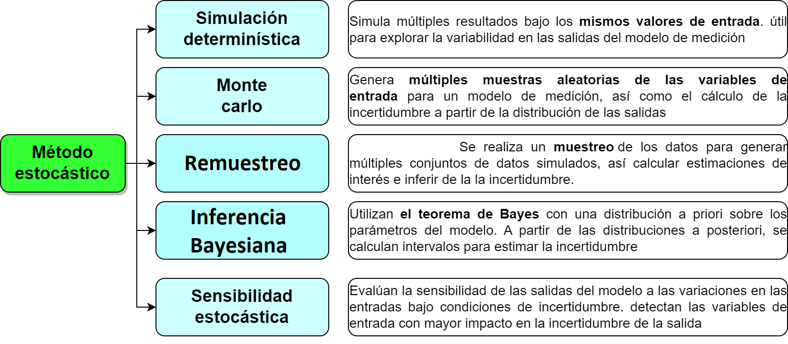
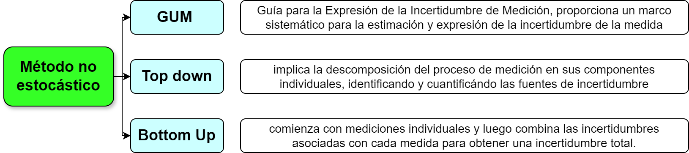

## Proceso de estimación de incertidumbre

```{r, echo=F, out.width="70%", fig.align='center'}
knitr::include_graphics("imagen/df.png")
```

### 1. Especificación del mensurando

**Expresión del mensurando**

El mensurando puede expresarse matemáticamente de la siguiente manera:

$$X=f(x_1,x_2,..,x_n)$$


Donde:

X es el mensurando, es decir, el valor que se está midiendo o estimando.

$x_1,x_2,...,x_n$  son las variables de entrada o las magnitudes medidas que contribuyen al valor de X.


f es una función matemática que describe la relación entre las variables de entrada y el mensurando. Esta función puede ser lineal o no lineal, dependiendo de la naturaleza de la medición.


### 2. Identificación de fuentes de incertidumbre

- Las fuentes potenciales de incertidumbre se investigan y, siempre que sea posible, el método se ajusta para reducir la incertidumbre a un nivel aceptable. 

- El parámetro que mide la incertidumbre  puede ser,  una desviación estándar (o un múltiplo de ésta) o la semiamplitud de un intervalo, con un nivel de confianza determinado.

- La incertidumbre de medida puede ser evaluada a partir de la distribución estadística de los resultados de series de mediciones, y pueden caracterizarse por sus desviaciones estándar experimentales. 

- El conocimiento de la incertidumbre implica un aumento de la confianza en la validez del resultado de una medición.


- Cada una de las contribuciones separadas a la incertidumbre es un componente de la incertidumbre. Cuando se expresa como desviación estándar se conoce como incertidumbre estándar.

- Si hay correlación entre las componentes, se tiene en cuenta mediante la covarianza. 

Listar todas las posibles fuentes de incertidumbre, incluye:

- De los parámetros, 

- De las suposiciones químicas. 

- Por las condiciones ambientales 

- Por la repitibilidad de las medidas

- Por la exactitud y resolución del equipo 

- **Muestreo:** Variaciones aleatorias entre muestras.

- Condiciones de almacenamiento

- Efectos instrumentales

- Pureza de reactivos

- Estequiometría asumida

- Condiciones de medida

- Efectos de la muestra, computacionales

- De redondeo 

- Efectos del operador y aleatorios

- considerar los parámetros de **la expresión del mensurando**, ya que pueden tener una incertidumbre asociada.

- El **diagrama de causa y efecto** es una forma muy práctica de listar las fuentes de incertidumbres, mostrando cómo se relacionan entre ellas e indicando su influencia sobre la incertidumbre del resultado. Ayuda a identificar efectos duplicados 

___________________________________________________________________________________________________________________________________

**Procedimientos para formar una lista estructurada**

**Principios del enfoque**

La estrategia tiene dos fases:

- Con un diagrama de causa-efecto se identifican efectos sobre un resultado.

- Simplifique y resuelva duplicaciones. La lista inicial se depura para simplificar su presentación final y asegurar que los efectos no se han duplicado innecesariamente.


**Análisis causa-efecto**

El procedimiento empleado es el siguiente:

**1.** Escribir la ecuación completa para el resultado. 

Los parámetros de la ecuación forman las ramas principales del diagrama.


**2.** Considerar cada etapa del método y añadir los factores necesarios al diagrama.

**3.** Para cada rama, añadir factores que contribuyen, hasta que sus efectos sobre la incertidumbre sean insignificantes.

**4.** Resolver las duplicaciones y repetir el proceso para clarificar las contribuciones 

**5.** Agrupar las contribuciones para cada grupo. Es conveniente agrupar en esta fase los términos relacionados con la precisión en una rama independiente. Es común encontrar el mismo equipo usado como instrumento de pesaje, lo que puede llevar a considerar varias veces su incertidumbre de calibración. considerarla una sola vez.


**Ejemplo 1: Determinación de la densidad del etanol**


Considerar el caso de la determinación directa de la densidad de etanol d(EtOH) mediante la pesa de un volumen conocido V en un recipiente volumétrico adecuado de tara mtara y peso bruto incluido etanol mbruto. La densidad se calcula a
partir de

$$d(EtOH)=\frac{(mbruto - mtara)}{V}$$


```{r, echo=F, out.width="70%", fig.align='center'}

```


Para mayor claridad, solo se tienen en cuenta tres efectos: 

- la calibración del equipo, 

* la temperatura

* la precisión de las medidas. 


El diagrama causa-efecto asociado es: 

```{r, echo=F, out.width="70%", fig.align='center'}
knitr::include_graphics("imagen/diag.png")
```


- Las ramas principales del resultado son los parámetros de la ecuación.

- Cada rama tiene efectos contributivos adicionales, ya sean variables o constantes; las
incertidumbres de estos efectos contribuyen claramente sobre la incertidumbre del resultadoen este caso hay dos efectos ‘temperatura’, tres efectos ‘precisión’ y tres efectos ‘calibración’.


- La  figura D2 representa los efectos de precisión y temperatura agrupados 

- La temperatura puede ser tratada como un único efecto sobre la densidad, mientras que las
variaciones individuales en cada determinación contribuyen a la variación observada en la
replicación de todo el método.

- El sesgo en la calibración de las dos pesadas se anula, y puede eliminarse (Figura D3)

- Las ramas ‘calibración’ restantes deberían distinguirse como dos contribuciones (diferentes) debido a posible no
linealidad en la respuesta de la balanza, junto con la incertidumbre de calibración asociada con la determinación volumétrica.


```{r, echo=F, out.width="70%", fig.align='center'}
knitr::include_graphics("imagen/diag1.png")
```


**Ejemplo: Estudio de caso Determinación de la incertidumbre de método de análisis de aflatoxinas por HPLC en pasa uva (Martinez et al, 2018)**


Las aflatoxinas son un tipo de toxinas producidas por ciertos hongos en cultivos agrícolas como el maíz, el maní o cacahuates, la semilla de algodón y los frutos secos (de cáscara dura como las nueces) (NIH,2024), esta sustancias es considerada como un carcinógeno natural más potente conocido hasta el momento.

La Cromatografía Líquida de Alta Eficiencia (HPLC, por sus siglas en inglés) es una técnica analítica que permite separar mezclas complejas de sustancias de procedencia diversa, con el propósito de identificarlas, cuantificarlas y purificarlas (UV,2024).

Determinar la concentración final de un analito en una matriz implica calcular una función, la cual depende de las variables de cálculo (por ejemplo, volumen de extracción, respuesta del equipo, etc.). Para el cálculo de la concentración para cualquier aflatoxina, se utiliza la siguiente ecuación:

$$Concentración \frac{u_g}{kg}=c_x=C_{HPLC}\frac{V_1*V_2}{v_3*M}*\frac{1}{R}$$
Un análisis de aflatoxina implica determinar el valor de $C_{HPLC}$, que es la respuesta del cromatógrafo.Todos los demás términos son constantes porque son mediciones establecidas con valor único.

Para el análisis de la incertidumbre se construyó un diagrama de causa y efecto, para determinar las fuentes de error y su incidencia en la incertidumbre.

```{r, echo=F, out.width="70%", fig.align='center'}
knitr::include_graphics("imagen/ikishawa.png")
```


### Resolución

Es la capacidad de un sistema o instrumento para detectar y mostrar cambios o variaciones pequeñas en una magnitud o medida. Es decir, es la mínima cantidad o el menor cambio que puede ser detectado y expresado por el sistema o el instrumento de medición.


```{r, echo=F, fig.asp=0.3, fig.align='center'}
knitr::include_graphics("imagen/reso.png")
```

**Incertidumbre por resolución**

La siguiente fórmula se usa si el equipo es análogo: 


$$u(x)=\frac{Resolución}{\sqrt 3}$$
En el caso que un equipo sea digital, la fórmula es:

$$u(x)=\frac{Resolución}{\sqrt {12}}$$


## Categorías de la incertidumbre tipo A


También conocida como incertidumbre aleatoria, se refiere a la incertidumbre que puede ser evaluada y cuantificada mediante métodos estadísticos. Esta incertidumbre se asocia comúnmente con mediciones directas o indirectas y está influenciada por factores como la precisión de los instrumentos de medición, la variabilidad de las condiciones de prueba y otros errores experimentales. 


Las categorías de incertidumbre tipo A pueden incluir:

- **Replicabilidad:** 

La variabilidad asociada con la repetición de mediciones bajo las mismas condiciones experimentales.  Esto puede incluir la variabilidad de los operadores, la fluctuación de las condiciones ambientales, etc.

- **Reproducibilidad:** 

La variabilidad asociada con la repetición de mediciones en diferentes condiciones experimentales pero dentro de los mismos límites de precisión. Esto puede incluir diferentes equipos, métodos de medición alternativos, etc.

- **Precisión del equipo:** 

La incertidumbre asociada con la precisión y la calibración del equipo utilizado en el proceso de medición.


- **Variabilidad del proceso:**

La variabilidad inherente al proceso o fenómeno que se está midiendo. Esta puede ser influenciada por factores como la variabilidad de la materia prima, la fluctuación en las condiciones de fabricación, etc.

- **Errores sistemáticos:** La incertidumbre debida a errores sistemáticos en el proceso de medición, como errores de calibración, sesgos en los instrumentos, etc.

- **Resolución del instrumento: **La incertidumbre asociada con la capacidad del instrumento de medir con precisión hasta cierto nivel de detalle o resolución.

Estas categorías son solo algunas de las posibles fuentes de incertidumbre tipo A y pueden variar dependiendo del contexto específico de la medición o del experimento. La evaluación adecuada de la incertidumbre tipo A es crucial para obtener resultados confiables y precisos en cualquier análisis o experimento.

## Categorías de la incertidumbre tipo B

La incertidumbre tipo B, también conocida como incertidumbre no aleatoria, se refiere a la incertidumbre que no puede ser evaluada mediante métodos estadísticos y generalmente se determina mediante la aplicación de información externa, como datos históricos, conocimiento experto, especificaciones de diseño, etc. Las categorías de incertidumbre tipo B pueden incluir:

- **Errores de modelo:** 

Incertidumbre asociada con la representación del fenómeno o sistema que se está modelando. Puede incluir simplificaciones excesivas en el modelo, desconocimiento de ciertos efectos o interacciones, etc.

- **Incertidumbre de la fuente de datos:** Incertidumbre asociada con los datos utilizados en el análisis o la estimación. Puede incluir errores de medición, sesgos en la recopilación de datos, etc.

- **Incertidumbre de calibración:** Incertidumbre asociada con la calibración de los instrumentos de medición utilizados en el análisis. Esto puede incluir incertidumbres declaradas por el proveedor del equipo de medición o incertidumbres asociadas con el método de calibración utilizado.

- **Incertidumbre de muestreo:** 


Incertidumbre asociada con la variabilidad inherente a la selección de muestras de una población más grande. Puede incluir sesgos en la selección de la muestra, errores de muestreo aleatorio, etc.

- **Incertidumbre de modelado matemático:** 


Incertidumbre asociada con la elección y los parámetros de los modelos matemáticos utilizados en el análisis. Esto puede incluir incertidumbre en la determinación de constantes físicas, suposiciones simplificadas en el modelo, etc.


-  **Incertidumbre de extrapolación:**


Incertidumbre asociada con la extensión de resultados o conclusiones más allá del rango de datos o condiciones experimentales en los que se basa el análisis.

Estas categorías son ejemplos comunes de fuentes de incertidumbre tipo B, pero la naturaleza específica de la incertidumbre puede variar según el contexto del análisis o la evaluación. La evaluación adecuada de la incertidumbre tipo B es esencial para comprender completamente la confiabilidad y precisión de los resultados obtenidos en cualquier análisis o experimento.


### Bibliografía

- EURACHEM. (2011). Cuantificación de la Incertidumbre en medidas analíticas.

- Martínez, N. D., Rodríguez, A. M., Gutiérrez, A. R., di Carlo Vitolino, M. D., & Durán, A. D. los Á. (2018). Determinación de la incertidumbre del método de análisis de aflatoxinas por HPLC en pasa de uva. Tecnura, 22(58), 25–36. https://doi.org/10.14483/22487638.12896


- NIH. (2024). Aflatoxinas. https://www.cancer.gov/espanol/cancer/causas-prevencion/riesgo/sustancias/aflatoxinas/aflatoxinas

- Universidad Veracruzana.(UV) (2024). Cromatografía Líquida de Alta Resolución (HPLC). https://www.uv.mx/sara/equipamiento/hplc/#:~:text=La%20Cromatograf%C3%ADa%20L%C3%ADquida%20de%20Alta,de%20identificarlas%2C%20cuantificarlas%20y%20purificarlas.

## Distribuciones de muestreo

Un **estadístico** es una función de las variables aleatorias observables en una muestra, como la media muestral $\bar Y$, la varianza muestral $S^2$, Max, Min, la amplitud (Rango = max – min), la mediana muestral, etc. 

Se usan estadísticos para hacer inferencias o estimaciones, acerca de parámetros de población desconocidos. Todos los estadísticos son funciones de las variables aleatorias observadas en una muestra, por tanto también son variables aleatorias. En consecuencia, todos **los estadísticos tienen distribuciones de probabilidad, que llamaremos distribuciones muestrales**. 

La distribución muestral de un estadístico proporciona un modelo teórico para el histograma de frecuencia relativa de los posibles valores del estadístico que observaríamos por medio de muestreo repetido.

Si se seleccionan muestras aleatorias de tamaño 20 en una población grande. Se calcula la media muestral $\bar X$ para cada muestra; la colección de todas estas medias muestrales recibe el nombre de **distribución muestral de medias**, así como tambien se puede obtener la **distribución muestral de las desviaciones estándar** como se ilustra en la siguiente figura:

```{r fig.asp=0.8, fig.align='center', echo=FALSE}
knitr::include_graphics("imagen/dmm.png")
```

Un elemento importante en los procesos de simulación es identificar las distribuciones de probabilidad apropiadas para los datos. Esto, normalmente, requiere analizar información empírica o histórica, y ajustarla a alguna distribución. 


## Estimación de la incertidumbre

Existen 2 formas principales de estimar la incertidumbre, metodos no estocásticos como la GUM y metodos estocásticos como la simulación monte carlo (MCM), que hacen alusión a distribuciones de probabilidad. Generalmente se mide la incertidumbre con el metodo GUM y se cerciora el resultado con el metodo estocástico MCM.

## Métodos estocásticos para estimar la incertidumbre

```{r out.width="100%", fig.align='center', echo=FALSE}

```

### Simulación Determinística

Simula múltiples resultados posibles dados los mismos valores de entrada. Puede ser útil para explorar la variabilidad en las salidas del modelo de medición.


### Monte Carlo 

Implica la generación de múltiples muestras aleatorias de las variables de entrada, la propagación de estas muestras a través del modelo de medición y el cálculo de la incertidumbre a partir de la distribución de las salidas.


### Inferencia Bayesiana

Utilizan el teorema de Bayes para actualizar la información a priori sobre los parámetros del modelo en función de los datos observados. A partir de las distribuciones a posteriori de los parámetros, se pueden calcular intervalos de credibilidad que reflejen la incertidumbre en las estimaciones.


### Métodos de remuestreo 

Implica el muestreo de los datos disponibles para generar múltiples conjuntos de datos simulados. A partir de estos conjuntos de datos, se calculan las estimaciones de interés y se utiliza la variabilidad entre estas estimaciones para inferir la incertidumbre.


**Formas de remuestreo**


**Jackknife**

- Consiste en generar múltiples conjuntos de datos "dejando fuera" un solo punto de datos en cada iteración y recalculando el estimador en cada conjunto de datos.

- Es útil para identificar la sensibilidad del estimador a la exclusión de puntos de datos individuales y proporciona una estimación robusta de la incertidumbre sin hacer suposiciones sobre la distribución de los datos.


**Bootstrap**

Muestreo con reemplazo


### Métodos de Sensibilidad Estocástica: 

Evalúan la sensibilidad de las salidas del modelo a las variaciones en las entradas bajo condiciones de incertidumbre. Pueden proporcionar información valiosa sobre qué variables de entrada tienen el mayor impacto en la incertidumbre de la salida.


## Métodos no estocásticos para la estimación de incertidumbre

```{r out.width="100%", fig.align='center', echo=FALSE}

```

### Guía para la Expresión de la Incertidumbre de Medición (GUM)

La GUM es un estándar internacional que proporciona un marco sistemático para la estimación y expresión de la incertidumbre de la medida. Se basa en la identificación de fuentes de incertidumbre y su propagación a través del modelo de medición.


### Top-Down

Este enfoque implica la descomposición del proceso de medición en sus componentes individuales, identificando las fuentes de incertidumbre y cuantificándolas por separado. Luego, estas incertidumbres individuales se combinan utilizando reglas de propagación de errores.

Basado en el procesamiento de datos registrados a largo plazo, derivados de resultados de ensayos de aptitud, muestras de control del laboratorio, datos bibliográficos publicados, etc.

### Método Bottom-Up 

Comienza con mediciones individuales y luego combina las incertidumbres asociadas con cada medida para obtener una incertidumbre total.

Basado en una sucesión de etapas de cálculo que tienen en cuenta los errores provenientes de cada una de las operaciones analíticas descompuestas en actividades primarias.

__________________________________________________________________________________


MCM es una alternativa a la GUM cuando

a. La estimación de la magnitud de salida (mensurando) y su incertidumbre asociada provista por la GUM podría no ser confiable

b. la pdf para la magnitud de salida del mensurando se aparta de una distribución normal

c. para validar los resultados de la GUM

________________________________________________________________________________________


## Librerías de R para estimar la incertidumbre

|Librería|Nombre|Descripción|
|:------:|:----:|-----------|
|boot|Funciones Bootstrap|Proporciona funciones para el remuestreo para estimar intervalos de confianza y otras medidas de incertidumbre para estadísticas y parámetros|
|uncertainty|Estimación de incertidumbre y análisis de contribución|Ofrece herramientas para la propagación de incertidumbre en cálculos y modelos. Permite realizar análisis de sensibilidad y estimar la incertidumbre en los resultados|
|car|Companion to Applied Regression|incluye funciones para calcular intervalos de confianza y realizar pruebas de hipótesis que pueden ser útiles para estimar la incertidumbre en modelos|
|propagate|propagación de incertidumbre| Ofrece herramientas para realizar análisis de sensibilidad y estimar la incertidumbre en los resultados.|
|gamlss|Generalized Additive Models for Location Scale and Shape|útil para el modelado de distribuciones de probabilidad complejas y puede ser utilizada para estimar la incertidumbre en modelos estadísticos más avanzados.|

## Distribuciones de probabilidad para estimar incertidumbre

### Distribución normal

Una distribución ampliamente usada y la más importante de toda la estadística, diversas poblaciones y fenómenos numéricos son representados por esta distribución por ejemplo

- Errores de medición en experimentos científicos

- Mediciones antropométricas

- Tiempos de reacción en experimentos psicológicos

- Mediciones de inteligencia y aptitud 


**Función de distribución de probabilidad**

Esta distribución depende de los parámetros de localización y escala, determinados por la media $E(X)=\mu$ y la desviación estándar $sd = \sigma$,

El valor de $\sigma$ es la distancia desde $\mu$ hasta los puntos de inflexión de la curva (los puntos donde la curva cambia de concavidad de hacia abajo a hacia arriba).

La función de distribución de probabilidad está dada por:

$$\LARGE f(x)=\frac{1}{\sqrt{2\pi}\sigma}e^{-\frac{(x-\mu)^2}{2\sigma^2}} $$
Con $-\infty<\mu<\infty$ y $\sigma>0$

Si una variable se distribuye normal se denota de la forma:

$$\LARGE x \sim N(\mu, \sigma^2)$$

**Aplicativo de distribuciones de probabilidad continuas**

```{r echo=FALSE}

knitr::include_app("https://amgq828.shinyapps.io/appcontinuas/",height = "1000px")

```


### Distribución rectangular ó uniforme


En una distribución rectangular cada valor en un intervalo dado tiene la misma probabilidad, o sea la función de densidad de probabilidad es constante en este intervalo. 

Sea $X∼U(a,b)$, es decir, una variable aleatoria con distribución uniforme en el intervalo  (a,b), con $a,b \quad \varepsilon \quad \mathbb{R}$:

- La **función de densidad de probabilidad** es :

$$ f(x)=\begin{cases}
\frac{1}{b-a},
& \mbox{si x $\varepsilon \quad \mathbb{R}$,}\\
0, & \mbox{e.o.c.}
\end{cases} $$

- La función de distribución acumulada (CDF) es 
$$ F(x)=P(x \leq \frac{x-a}{b-a}) $$

- La esperanza o valor medio es

$$E(x)=\frac{a+b}{2}$$

- La varianza 


$$E(x)=\frac{(b-a)^2}{12}$$

```{r echo=FALSE}

plotunif <- function(x, min = 0, max = 1, lwd = 1, col = 1, ...) {

    # Rejilla de valores del eje X
    if (missing(x)) {
        x <- seq(min - 0.5, max + 0.5, 0.01)
    }

    if(max < min) {
        stop("'min' must be lower than 'max'")
    }
   
    plot(x, dunif(x, min = min, max = max),
         xlim = c(min - 0.25, max + 0.25), type = "l",
         lty = 0, ylab = "1/2a", ...) 
    segments(min, 1/(max - min), max, 1/(max - min), col = col, lwd = lwd)
    segments(min - 2, 0, min, 0, lwd = lwd, col = col)
    segments(max, 0, max + 2, 0, lwd = lwd, col = col)
    points(min, 1/(max - min), pch = 19, col = col)
    points(max, 1/(max - min), pch = 19, col = col)
    segments(min, 0, min, 1/(max - min), lty = 2, col = col, lwd = lwd)
    segments(max, 0, max, 1/(max - min), lty = 2, col = col, lwd = lwd)
    points(0, min, pch = 21, col = col, bg = "white")
    points(max, min, pch = 21, col = col, bg = "white")
}

plotunif(min = 0, max = 1, lwd = 2, col = 4, main = "PDF uniforme",xlab="2a=(+-a)")
```

Se usa para estimar la incertidumbre cuando:

- Un certificado da unos límites sin especificar el nivel de confianza (por ejemplo, 25 mL $\pm$ 0,05 mL)

- Se ha hecho una estimación en forma de un rango máximo ($\pm$a) sin conocimiento de la forma de la distribución.

https://huggingface.co/spaces/FreddyHernandez/discrete_uniform


El rango de una distribución de probabilidad se refiere al conjunto de todos los posibles valores que puede tomar una variable aleatoria en esa distribución. Es la diferencia entre el valor máximo y el valor mínimo de esta variable.


**Ejemplo**

Un químico estima un factor de contribución entre 7 y 10, pero cree que el valor podría ser cualquiera entre esos dos valores, pero no tiene idea de si alguna de las partes del rango tiene mayor probabilidad de ser que otra. Esto es una descripción de una función de distribución rectangular con un rango 2a=3 (semi rango de a=1,5). 

Sea la función de estimación de incertidumbre rectángular.

La siguiente fórmula se usa si la incertidumbre que se desea calcular es por especificaciones o por resulución del equipo análogo, en cada caso se reemplaza el valor de a por cada cada valor. 


$$u(x)=\frac{a}{\sqrt 3}$$
En el caso que un equipo sea digital, la fórmula de la incertidumbre asociada a la resolución  es:

$$u(x)=\frac{a}{\sqrt {12}}$$

Se puede calcular una estimación de la incertidumbre estándar. Usando el rango antes indicado, a=1,5, resulta una incertidumbre estándar de:

$$u(x)=\frac{1,5}{{\sqrt 3}} = 0,87$$

### Distribución triángular

La función de distribución de probabilidad es:

$$ f(x)=\begin{cases}
\frac{2(x-a)}{(b-a)(c-a)},
& \mbox{si $a\leq x < c$,}\\
\frac{2(b-x)}{(b-a)(b-c)},
& \mbox{si $c\leq x < b$,}\\
0, & \mbox{e.o.c.}
\end{cases} $$

La grafica de la función de distribución de probabilidad es:

```{r}
library(triangle)
curve(dtriangle(x,3,11,8),xlim=c(3,11),lwd=2,ylab="f(x)",main="Distribución triangular")
```


- La esperanza o valor medio es

$$E(x)=\frac{a+b+c}{3}$$

- La varianza 


$$E(x)=\frac{a^2+b^2+c^2+ab+ac+bc}{6}$$


Para estimar incertidumbre se usa cuando

- La información disponible está mas delimitada que en una distribución rectangular. Los valores cercanos a la mitad de la distribución son más probables que los próximos a los límites.

- Se ha hecho una estimación en forma de un rango máximo $(\pm a)$ descrito por una distribución simétrica.

Sea la función de estimación de incertidumbre triángular 

$$u(x)=\frac{a}{\sqrt 6}$$


**Aplicaciones de la incertidumbre**


```{r, echo=F, out.width="70%", fig.align='center'}
knitr::include_graphics("imagen/API.png")
```


