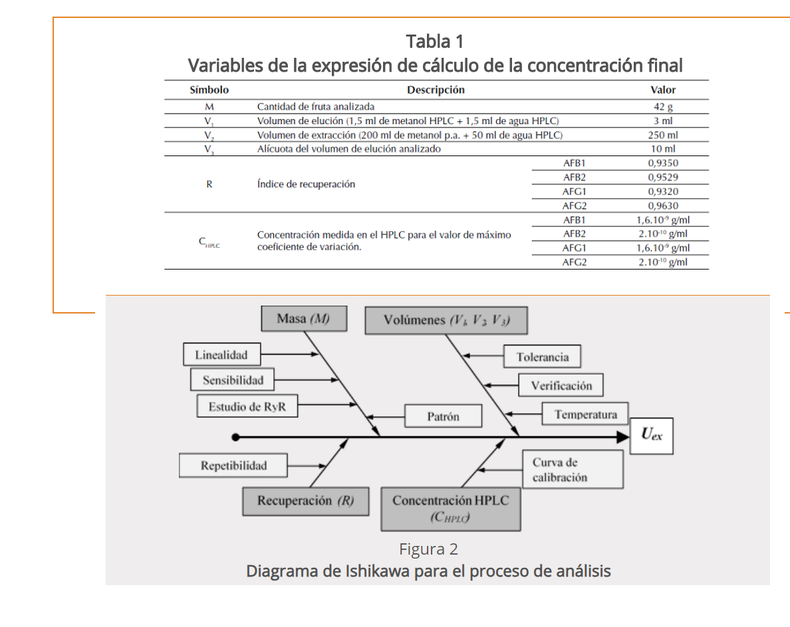

Parámetro asociado al resultado de una medición que caracteriza la dispersión de los valores que podrían ser atribuidos al mensurando, (ISP, 2010)


## Tipos de incertidumbre


### Incertidumbre típica $u$

Incertidumbre del resultado de una medición, expresada en forma de desviación típica, dependiendo del origen de los datos la incertidumbre típica se clasifica en tipo A y tipo B

Antes de combinar las incertidumbres, estas deben estar expresadas como desviaciones estándar.

#### Tipo A

Obtenida mediante un analisis estadístico de los datos, se expresan por medio de varianzas o las desviaciones y el número de grados de libertad.
Se asocia comúnmente con mediciones directas o indirectas y está influenciada por factores como la precisión de los instrumentos de medición, la variabilidad de las condiciones de prueba y otros errores experimentales. 


Las categorías de incertidumbre tipo A pueden incluir:

- **Replicabilidad:** 

La variabilidad asociada con la repetición de mediciones bajo las mismas condiciones experimentales.  Esto puede incluir la variabilidad de los operadores, la fluctuación de las condiciones ambientales, etc.

- **Reproducibilidad:** 

La variabilidad asociada con la repetición de mediciones en diferentes condiciones experimentales pero dentro de los mismos límites de precisión. Esto puede incluir diferentes equipos, métodos de medición alternativos, etc.

- **Precisión del equipo:** 

La incertidumbre asociada con la precisión y la calibración del equipo utilizado en el proceso de medición.


- **Variabilidad del proceso:**

La variabilidad inherente al proceso o fenómeno que se está midiendo. Esta puede ser influenciada por factores como la variabilidad de la materia prima, la fluctuación en las condiciones de fabricación, etc.

- **Errores sistemáticos:** La incertidumbre debida a errores sistemáticos en el proceso de medición, como errores de calibración, sesgos en los instrumentos, etc.

- **Resolución del instrumento: ** La incertidumbre asociada con la capacidad del instrumento de medir con precisión hasta cierto nivel de detalle o resolución.


La siguiente fórmula se usa si el equipo es análogo: 


$$u(x)=\frac{Resolución}{\sqrt 3}$$
En el caso que un equipo sea digital, la fórmula es:

$$u(x)=\frac{Resolución}{\sqrt {12}}$$

#### Tipo B

También conocida como incertidumbre no aleatoria, no puede ser evaluada mediante métodos estadísticos y generalmente se determina mediante la aplicación de información externa, como datos históricos, conocimiento experto, especificaciones de diseño, etc. Las categorías de incertidumbre tipo B pueden incluir:


- **Errores de modelo:** 

Incertidumbre asociada con la representación del fenómeno o sistema que se está modelando. Puede incluir simplificaciones excesivas en el modelo, desconocimiento de ciertos efectos o interacciones, etc.

- **Incertidumbre de la fuente de datos:** 

Incertidumbre asociada con los datos utilizados en el análisis o la estimación. Puede incluir errores de medición, sesgos en la recopilación de datos, etc.

- **Incertidumbre de calibración:** 

Incertidumbre asociada con la calibración de los instrumentos de medición utilizados en el análisis. Esto puede incluir incertidumbres declaradas por el proveedor del equipo de medición o incertidumbres asociadas con el método de calibración utilizado.

- **Incertidumbre de muestreo:** 

Incertidumbre asociada con la variabilidad inherente a la selección de muestras de una población más grande. Puede incluir sesgos en la selección de la muestra, errores de muestreo aleatorio, etc.

- **Incertidumbre de modelado matemático:** 

Incertidumbre asociada con la elección y los parámetros de los modelos matemáticos utilizados en el análisis. Esto puede incluir incertidumbre en la determinación de constantes físicas, suposiciones simplificadas en el modelo, etc.

-  **Incertidumbre de extrapolación:**

Incertidumbre asociada con la extensión de resultados o conclusiones más allá del rango de datos o condiciones experimentales en los que se basa el análisis.

### Formas de presentar la incertidumbre

- Viene dada como un **múltiplo específico de una desviación típica**, se obtiene como el cociente entre el valor indicado y el factor multiplicador.

**EJEMPLO** 

Un certificado de calibración indica que la masa de un patrón de acero inoxidable, de valor nominal igual a un kilogramo, es $m_S = 1000,000325 g$, y que “la incertidumbre de este valor es de 240 μg, para un nivel de tres desviaciones típicas”.

    - La incertidumbre típica del patrón de masa es simplemente $u(m_S)=(240 μg)/3 =80 μg$. 

    - La incertidumbre típica relativa $u(mS)/mS$ de $80 × 10^{-9}$** . 

    - La varianza estimada es $u^2(mS) = (80 μg)^2 = 6,4×10^{-9} g^2.$
    
    **Nota:**
    
- Una **desviación estándar relativa** también conocida como coeficiente de variación, es una medida de dispersión relativa que compara la desviación estándar con la media de un conjunto de datos.
    
  $$\frac{sd}{\bar x}*100$$
    
- **incertidumbre típica relativa** 
    
$$u(xi)/⏐xi⏐$$
    

   
- A partir de un **intervalo de confianza** del 90, 95 ó 99 por ciento, suponiendo una distribución normal, la incertidumbre típica se obtiene mediante simple división del valor de incertidumbre dado por el factor correspondiente de la distribución normal. Dicho factor, para los tres niveles de confianza citados, es 1,64; 1,96 y 2,58.

**Ejemplo 1**

Una especificación establece que la lectura de una balanza está entre ±0,2 mg con un 95 % de confianza. 
    
A partir de tablas estándar de puntos porcentuales de distribución normal, se calcula un intervalo de confianza del 95% usando un valor de 1,96. 
    
Usando esta cifra resulta una incertidumbre estándar de (0,2/1,96)= 0,1.


**Ejemplo 2**
    
Un certificado de calibración indica que el valor $R_S$ de una resistencia patrón de valor nominal 10Ω es 10,000742 Ω ± 129 μΩ a 23 °C, y que “la incertidumbre indicada de 129 μΩ define un intervalo con nivel de confianza del 99 por ciento”. 

La incertidumbre típica del valor de la resistencia puede suponerse que es u(RS) = (129 μΩ) / 2,58 = 50 μΩ, que corresponde a una incertidumbre típica relativa u(RS)/RS de $5,0×10^{-6}$). 


- Dada por los **límites de ±a sin nivel de confianza**

    -Si hay valores extremos, suponemos una distribución rectángular, con una desviación estándar de: 

$$\frac{a}{\sqrt 3}$$

**EJEMPLO**
    
    
Un matraz volumétrico de Clase A de 10 mL está certificado dentro de ±0,2 mL. 
  
  La incertidumbre estándar es $$0,2/\sqrt 3=0,12 mL$$  

```{r, echo=F, out.width="10%", fig.align='center'}
knitr::include_graphics("imagen/matraz.png")
```

 
    
    
    - Si no se esperan valores extremos,normalmente es apropiado suponer una distribución triangular, con una desviación estándar de $a/\sqrt6$.


**EJEMPLO**

Un matraz volumétrico de Clase A de 10 mL está certificado dentro de ±0,2 mL, pero controles internos rutinarios muestran que los valores extremos son infrecuentes. La incertidumbre estándar es $0,2/\sqrt 6 = 0,08 mL$


## Incertidumbre típica combinada $u_c$

Resultado de la combinación de las contribuciones de todas las fuentes de incertidumbre es igual a la raíz cuadrada positiva de una suma de términos, siendo éstos las varianzas o covarianzas de otras magnitudes, ponderadas en función de la variación del resultado de medida con la variación de dichas magnitudes (GUM).


## Incertidumbre expandida $U$ 

Magnitud que define un intervalo en torno al resultado de una medición, y en el que se espera encontrar una fracción importante de la distribución de valores que podrían ser atribuidos razonablemente al mensurando (GUM)

Se obtiene multiplicando la incertidumbre típica combinada por un **factor de cobertura k**, generalmente es con un valor de 2 que garantiza al menos el 95% de confianza del resultado.

La elección del factor k, habitualmente comprendido entre los valores 2 y 3, se fundamenta en la probabilidad o nivel de confianza requerido para el intervalo 

- Observe qué según el nivel de confianza el factor de cobertura cambia


|nivel de confianza en porcentaje|Factor de cobertura|
|:------------------------------:|:-----------------:|
|68.27%                          |?|
|90%                          |?|
|95%                          |?|
|95.45%   |?|
|99%                          |?|
|99.73%                          |?|

Este intervalo tiene su fundamento en la **regla empírica de la estadística** y se construye con la distribución normal.
 
 Si la distribución de la población de una variable es (aproximadamente) normal, entonces

1. Aproximadamente 68% de los valores están dentro de 1 DE (desviación estándar) de la media.

$$\LARGE P(\mu-\sigma\leq x \leq \mu+\sigma)=68.27\%$$

2. Aproximadamente 95% de los valores están dentro de 2 DE de la media.
$$\LARGE P(\mu-2\sigma\leq x \leq \mu+2\sigma)=95.45\%$$

3. Aproximadamente 99.7% de los valores están dentro de 3 DE de la media.

$$\LARGE P(\mu-3\sigma\leq x \leq \mu+3\sigma)=99.73\%$$

Graficamente:


```{r echo=F, out.width="40%",fig.align='center'}
knitr::include_graphics("imagen/n2.png")
```


## Estimación de la incertidumbre

Existen 2 formas principales de estimar la incertidumbre, metodos no estocásticos como la GUM y metodos estocásticos como la simulación monte carlo (MCM), que hacen alusión a distribuciones de probabilidad. Generalmente se mide la incertidumbre con el metodo GUM y se cerciora el resultado con el metodo estocástico MCM.

## Métodos estocásticos para estimar la incertidumbre

```{r out.width="100%", fig.align='center', echo=FALSE}
knitr::include_graphics("imagen/mestocastico.png")
```

**Simulación Determinística**

Simula múltiples resultados posibles dados los mismos valores de entrada. Puede ser útil para explorar la variabilidad en las salidas del modelo de medición.


**Monte Carlo**

Implica la generación de múltiples muestras aleatorias de las variables de entrada, la propagación de estas muestras a través del modelo de medición y el cálculo de la incertidumbre a partir de la distribución de las salidas.


**Inferencia Bayesiana**

Utilizan el teorema de Bayes para actualizar la información a priori sobre los parámetros del modelo en función de los datos observados. A partir de las distribuciones a posteriori de los parámetros, se pueden calcular intervalos de credibilidad que reflejen la incertidumbre en las estimaciones.


**Métodos de remuestreo** 

Implica el muestreo de los datos disponibles para generar múltiples conjuntos de datos simulados. A partir de estos conjuntos de datos, se calculan las estimaciones de interés y se utiliza la variabilidad entre estas estimaciones para inferir la incertidumbre.


**Formas de remuestreo**


**Jackknife**

- Consiste en generar múltiples conjuntos de datos "dejando fuera" un solo punto de datos en cada iteración y recalculando el estimador en cada conjunto de datos.

- Es útil para identificar la sensibilidad del estimador a la exclusión de puntos de datos individuales y proporciona una estimación robusta de la incertidumbre sin hacer suposiciones sobre la distribución de los datos.


**Bootstrap**

Muestreo con reemplazo


**Métodos de Sensibilidad Estocástica**

Evalúan la sensibilidad de las salidas del modelo a las variaciones en las entradas bajo condiciones de incertidumbre. Pueden proporcionar información valiosa sobre qué variables de entrada tienen el mayor impacto en la incertidumbre de la salida.


## Métodos no estocásticos para la estimación de incertidumbre

```{r out.width="100%", fig.align='center', echo=FALSE}
knitr::include_graphics("imagen/metnoestocastico.png")
```

**Guía para la Expresión de la Incertidumbre de Medición (GUM)**

La GUM es un estándar internacional que proporciona un marco sistemático para la estimación y expresión de la incertidumbre de la medida. Se basa en la identificación de fuentes de incertidumbre y su propagación a través del modelo de medición.


**Top-Down**

Este enfoque implica la descomposición del proceso de medición en sus componentes individuales, identificando las fuentes de incertidumbre y cuantificándolas por separado. Luego, estas incertidumbres individuales se combinan utilizando reglas de propagación de errores.

Basado en el procesamiento de datos registrados a largo plazo, derivados de resultados de ensayos de aptitud, muestras de control del laboratorio, datos bibliográficos publicados, etc.

**Método Bottom-Up**

Comienza con mediciones individuales y luego combina las incertidumbres asociadas con cada medida para obtener una incertidumbre total.

Basado en una sucesión de etapas de cálculo que tienen en cuenta los errores provenientes de cada una de las operaciones analíticas descompuestas en actividades primarias.

__________________________________________________________________________________


MCM es una alternativa a la GUM cuando

a. La estimación de la magnitud de salida (mensurando) y su incertidumbre asociada provista por la GUM podría no ser confiable

b. la pdf para la magnitud de salida del mensurando se aparta de una distribución normal

c. para validar los resultados de la GUM

________________________________________________________________________________________


## Librerías de R para estimar la incertidumbre

|Librería|Nombre|Descripción|
|:------:|:----:|-----------|
|boot|Funciones Bootstrap|Proporciona funciones para el remuestreo para estimar intervalos de confianza y otras medidas de incertidumbre para estadísticas y parámetros|
|uncertainty|Estimación de incertidumbre y análisis de contribución|Ofrece herramientas para la propagación de incertidumbre en cálculos y modelos. Permite realizar análisis de sensibilidad y estimar la incertidumbre en los resultados|
|car|Companion to Applied Regression|incluye funciones para calcular intervalos de confianza y realizar pruebas de hipótesis que pueden ser útiles para estimar la incertidumbre en modelos|
|propagate|propagación de incertidumbre| Ofrece herramientas para realizar análisis de sensibilidad y estimar la incertidumbre en los resultados.|
|gamlss|Generalized Additive Models for Location Scale and Shape|útil para el modelado de distribuciones de probabilidad complejas y puede ser utilizada para estimar la incertidumbre en modelos estadísticos más avanzados.|


## Proceso para identificar y cuantificar la incertidumbre

```{r, echo=F, out.width="70%", fig.align='center'}
knitr::include_graphics("imagen/df.png")
```

### 1. Especificación del mensurando

**Expresión del mensurando**

El mensurando puede expresarse matemáticamente de la siguiente manera:

$$X=f(x_1,x_2,..,x_n)$$


Donde:

X es el mensurando, es decir, el valor que se está midiendo o estimando.

$x_1,x_2,...,x_n$  son las variables de entrada o las magnitudes medidas que contribuyen al valor de X.


f es una función matemática que describe la relación entre las variables de entrada y el mensurando. Esta función puede ser lineal o no lineal, dependiendo de la naturaleza de la medición.


### 2. Identificación de fuentes de incertidumbre

- Las fuentes potenciales de incertidumbre se investigan y, siempre que sea posible, el método se ajusta para reducir la incertidumbre a un nivel aceptable. 

- El parámetro que mide la incertidumbre  puede ser,  una desviación estándar (o un múltiplo de ésta) o la semiamplitud de un intervalo, con un nivel de confianza determinado.

- La incertidumbre de medida puede ser evaluada a partir de la distribución estadística de los resultados de series de mediciones, y pueden caracterizarse por sus desviaciones estándar experimentales. 

- El conocimiento de la incertidumbre implica un aumento de la confianza en la validez del resultado de una medición.


- Cada una de las contribuciones separadas a la incertidumbre es un componente de la incertidumbre. Cuando se expresa como desviación estándar se conoce como incertidumbre estándar.

- Si hay correlación entre las componentes, se tiene en cuenta mediante la covarianza. 

Listar todas las posibles fuentes de incertidumbre, incluye:

- De los parámetros, 

- De las suposiciones químicas. 

- Por las condiciones ambientales 

- Por la repitibilidad de las medidas

- Por la exactitud y resolución del equipo 

- **Muestreo:** Variaciones aleatorias entre muestras.

- Condiciones de almacenamiento

- Efectos instrumentales

- Pureza de reactivos

- Estequiometría asumida

- Condiciones de medida

- Efectos de la muestra, computacionales

- De redondeo 

- Efectos del operador y aleatorios

- considerar los parámetros de **la expresión del mensurando**, ya que pueden tener una incertidumbre asociada.

- El **diagrama de causa y efecto** es una forma muy práctica de listar las fuentes de incertidumbres, mostrando cómo se relacionan entre ellas e indicando su influencia sobre la incertidumbre del resultado. Ayuda a identificar efectos duplicados 

___________________________________________________________________________________________________________________________________

**Procedimientos para formar una lista estructurada**

**Principios del enfoque**

La estrategia tiene dos fases:

- Con un diagrama de causa-efecto se identifican efectos sobre un resultado.

- Simplifique y resuelva duplicaciones. La lista inicial se depura para simplificar su presentación final y asegurar que los efectos no se han duplicado innecesariamente.


**Análisis causa-efecto**

El procedimiento empleado es el siguiente:

**1.** Escribir la ecuación completa para el resultado. 

Los parámetros de la ecuación forman las ramas principales del diagrama.


**2.** Considerar cada etapa del método y añadir los factores necesarios al diagrama.

**3.** Para cada rama, añadir factores que contribuyen, hasta que sus efectos sobre la incertidumbre sean insignificantes.

**4.** Resolver las duplicaciones y repetir el proceso para clarificar las contribuciones 

**5.** Agrupar las contribuciones para cada grupo. Es conveniente agrupar en esta fase los términos relacionados con la precisión en una rama independiente. Es común encontrar el mismo equipo usado como instrumento de pesaje, lo que puede llevar a considerar varias veces su incertidumbre de calibración. considerarla una sola vez.


**Ejemplo 1: Determinación de la densidad del etanol**


Considerar el caso de la determinación directa de la densidad de etanol d(EtOH) mediante la pesa de un volumen conocido V en un recipiente volumétrico adecuado de tara mtara y peso bruto incluido etanol mbruto. La densidad se calcula a
partir de

$$d(EtOH)=\frac{(mbruto - mtara)}{V}$$


```{r, echo=F, out.width="70%", fig.align='center'}
knitr::include_graphics("imagen/masa.png")
```


Para mayor claridad, solo se tienen en cuenta tres efectos: 

- la calibración del equipo, 

* la temperatura

* la precisión de las medidas. 


El diagrama causa-efecto asociado es: 

```{r, echo=F, out.width="70%", fig.align='center'}
knitr::include_graphics("imagen/diag.png")
```


- Las ramas principales del resultado son los parámetros de la ecuación.

- Cada rama tiene efectos contributivos adicionales, ya sean variables o constantes; las incertidumbres de estos efectos contribuyen claramente sobre la incertidumbre del resultado en este caso hay dos efectos ‘temperatura’, tres efectos ‘precisión’ y tres efectos ‘calibración’.


- La  figura D2 representa los efectos de precisión y temperatura agrupados 

- La temperatura puede ser tratada como un único efecto sobre la densidad, mientras que las
variaciones individuales en cada determinación contribuyen a la variación observada en la
replicación de todo el método.

- El sesgo en la calibración de las dos pesadas se anula, y puede eliminarse (Figura D3)

- Las ramas ‘calibración’ restantes deberían distinguirse como dos contribuciones (diferentes) debido a posible no
linealidad en la respuesta de la balanza, junto con la incertidumbre de calibración asociada con la determinación volumétrica.


```{r, echo=F, out.width="70%", fig.align='center'}
knitr::include_graphics("imagen/diag1.png")
```


**Ejemplo: Estudio de caso Determinación de la incertidumbre de método de análisis de aflatoxinas por HPLC en pasa uva (Martinez et al, 2018)**


Las aflatoxinas son un tipo de toxinas producidas por ciertos hongos en cultivos agrícolas como el maíz, el maní o cacahuates, la semilla de algodón y los frutos secos (de cáscara dura como las nueces) (NIH,2024), esta sustancias es considerada como un carcinógeno natural más potente conocido hasta el momento.

La Cromatografía Líquida de Alta Eficiencia (HPLC, por sus siglas en inglés) es una técnica analítica que permite separar mezclas complejas de sustancias de procedencia diversa, con el propósito de identificarlas, cuantificarlas y purificarlas (UV,2024).

Determinar la concentración final de un analito en una matriz implica calcular una función, la cual depende de las variables de cálculo (por ejemplo, volumen de extracción, respuesta del equipo, etc.). Para el cálculo de la concentración para cualquier aflatoxina, se utiliza la siguiente ecuación:

$$Concentración \frac{u_g}{kg}=c_x=C_{HPLC}\frac{V_1*V_2}{v_3*M}*\frac{1}{R}$$
Un análisis de aflatoxina implica determinar el valor de $C_{HPLC}$, que es la respuesta del cromatógrafo.Todos los demás términos son constantes porque son mediciones establecidas con valor único.

Para el análisis de la incertidumbre se construyó un diagrama de causa y efecto, para determinar las fuentes de error y su incidencia en la incertidumbre.

```{r, echo=F, out.width="70%", fig.align='center'}

```


### Bibliografía

- EURACHEM. (2011). Cuantificación de la Incertidumbre en medidas analíticas.

- Martínez, N. D., Rodríguez, A. M., Gutiérrez, A. R., di Carlo Vitolino, M. D., & Durán, A. D. los Á. (2018). Determinación de la incertidumbre del método de análisis de aflatoxinas por HPLC en pasa de uva. Tecnura, 22(58), 25–36. https://doi.org/10.14483/22487638.12896


- NIH. (2024). Aflatoxinas. https://www.cancer.gov/espanol/cancer/causas-prevencion/riesgo/sustancias/aflatoxinas/aflatoxinas

- Universidad Veracruzana.(UV) (2024). Cromatografía Líquida de Alta Resolución (HPLC). https://www.uv.mx/sara/equipamiento/hplc/#:~:text=La%20Cromatograf%C3%ADa%20L%C3%ADquida%20de%20Alta,de%20identificarlas%2C%20cuantificarlas%20y%20purificarlas.


