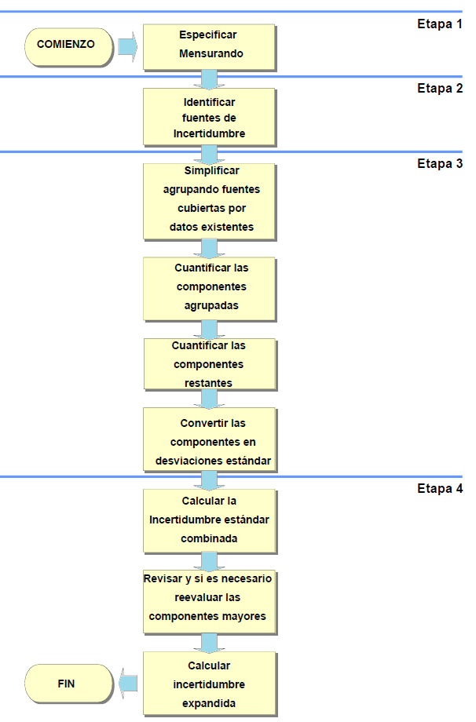

## Error


Diferencia entre un valor medido de una magnitud y un valor de referencia, 


**Error absoluto**
Diferencia entre el valor indicado por el instrumento $A_i$ y el valor verdadero $A_r$ de la magnitud medida.

$$E=A_i-A_r$$
**Algunas causas de error**

```{r, echo=F, out.width="80%",fig.align='center'}
knitr::include_graphics("imagen/fm.png")
```

**Componentes del error**

Se considera que un error tiene dos componentes, llamadas componente aleatoria y componente sistemática


**Error sistemático**

También se le conoce como sesgo(EURACHEM, 2011), los efectos que cambian sistemáticamente en magnitud durante series de análisis, dan lugar a errores sistemáticos que no son constantes.


______________________________________________________________________________

```{r echo=FALSE}

library(tidyverse)
library(kableExtra)


timeline_tab <- tibble(
  Descripción = c(
"___________________________________"),
Aleatorio = c("_____________________"
),
Sistemático = c(
"__________________________")) %>%
add_row(Descripción = c(
"Causa",
"",
"",
"",
""),
Aleatorio = c(
"- Variaciones impredecibles en observaciones repetidas del mensurando. ",
"- variaciones de las magnitudes",
"- Muestreo",
"",
""),
Sistemático = c(
"- Permanecen constantes o varían de forma predecible en el análisis del mismo mensurando.",
"- Selección de los sujetos de estudio",
"- Obtención de la información",
"- Presencia de variables externas distorsionadas",
"")
) %>%
add_row(Descripción = c(
"___________________________________"),
Aleatorio = c("_____________________"
),
Sistemático = c(
"__________________________")
) %>%
add_row(Descripción = c(
"Disminuye al aumentar el tamaño del estudio"),
Aleatorio = c("Si"
),
Sistemático = c(
"No")
) %>%
  
add_row(Descripción = c(
"___________________________________"),
Aleatorio = c("_____________________"
),
Sistemático = c(
"__________________________")
) %>%
add_row(Descripción = c(
"Afectación"),
Aleatorio = c(
"Presición"
),
Sistemático = c(
"Validez"
)
) %>%
add_row(Descripción = c(
"___________________________________"),
Aleatorio = c("_____________________"
),
Sistemático = c(
"__________________________")
) %>%
add_row(Descripción = c(
""),
Aleatorio = c(
""),
Sistemático = c(""))
timeline_tab %>%
kable(booktabs = TRUE, align = "c",
      col.names = c("Descripción ","Error aleatorio",
"Error sistemático"),
escape=FALSE) %>%
column_spec(c(1), width = "3cm") %>%
column_spec(c(2, 3), width = "9cm") 
```
_____________________________________________________________________

## Sesgo

En metrología se diferencian diferentes tipos de sesgo


**Sesgo de medida**

valor estimado de un error sistemático (VIM)

**Sesgo instrumental**

Diferencia entre la media de las indicaciones repetidas y un **valor de referencia** (VIM). 


__________________________________________________________________


- La determinación del **sesgo global** en relación con valores de referencia apropiados es importante para establecer la trazabilidad a patrones reconocidos. 


- Según la guia ISO se deben aplicar correcciones para todos los efectos sistemáticos significativos y reconocidos.

- La determinación del sesgo es un componente esencial de la incertidumbre global.

A la hora de decidir si un sesgo conocido puede ser razonablemente descartado, se recomienda la siguiente aproximación:

i) Estimar la incertidumbre combinada sin considerar el sesgo relevante.

ii) Comparar el sesgo con la incertidumbre combinada.

iii) Cuando el sesgo no es significativo comparado con la incertidumbre combinada, el sesgo puede ser descartado.

iv) Cuando el sesgo es significativo comparado con la incertidumbre combinada, se requiere una acción adicional. Acciones apropiadas
podrían ser:

- Eliminar o corregir el sesgo, haciendo la debida asignación de la incertidumbre de la corrección.

- Informar del sesgo observado y su incertidumbre además del resultado.

__________________________________________________

El sesgo puede estar determinado por:

**Los materiales de referencia certificados (MRC)** 

Su incertidumbre se estima mediante un análisis repetido del MRC. si no resulta ser significativa, la incertidumbre asociada es la combinación de la incertidumbre del valor del MRC, con la desviación estándar asociada a la medida del sesgo. 

**Un método**

Se determina por comparación de un método de referencia con método empírico. Si los resultados muestran que el sesgo es estadísticamente estadísticamente no significativo, la incertidumbre estándar es la del método de referencia, combinada con la incertidumbre estándar asociada a la diferencia medida entre métodos, dada por la desviación estándar de la distribución de muestreo de diferencia medias para varianzas poblacionales desconocidas pero iguales. 


**EJEMPLO**
Un método (M1) para determinar la concentración de selenio es comparado con un método de referencia (M2). Los resultados (en $mg/kg$) para cada método son los que se muestran a continuación:


|Método|$\bar x$|   s|n  |
|------|:------:|:--:|:-:|
|M1    |5.40    |1.47|5  |
|M2    |4.76    |2.75|5  |

Usando pruebas de hipótesis pruebe que no existen diferencias significativas entre ambos métodos.

$$H_0=\mu_1=\mu_2$$
$$H_1=\mu_1\neq \mu_2$$


Para probarlo se usa la distribución de muestreo para la diferencias de medias con varianzas desconocidas y diferentes. 

La fórmula para unificar las desviaciones estándar vienen dadas por: 

$$S^2=\frac{(n_1-1)*S_1^2+(n_2-1)*S_2^2}{n_1+n_2-2}$$
Aplicando la fórmula se tiene

$$s_c=\sqrt{\frac{1.47^2*(5-1)+2.75^2*(5-1)}{5+5-2}}=2.205$$

El  valor del estadístico se calcula mediante la fórmula:

$$t_{n_1+n_2-2}=\frac{\bar X_1-\bar X_2-(\mu_1-\mu_2)}{s_c\sqrt{\frac{1}{n_1}+\frac{1}{n_2}}}$$
reemplazando:

$$t_{8}=\frac{5.4-4.76-(0)}{2.205\sqrt{\frac{1}{5}+\frac{1}{5}}}=\frac{0.64}{1.4}=0.46$$
para definir el valor p

$$P(t_8>0.46)=32.89\%$$

```{r}
pt(0.46, 8, lower.tail = F) 

plot( function(x) dt( x, df = 8 ), -5, 5, ylim = c( 0, 0.4 ),
      col = "red", type = "l", lwd = 2,
      main = "Función densidad t de Student df = 8" )
abline(v=0.46,col=2)
```


La diferencia de medias muestrales es 0,64, y se compara con
un término de la desviación estándar de 1,4, asociada a la diferencia, y por lo tanto representa una contribución aplicable a la incertidumbre asociada al sesgo medido.

**Actividad**


Se investiga el efecto de la variación de una hora en el tiempo de extracción mediante una prueba t con 5 mediciones, todas ellas en la misma muestra, para el tiempo de extracción normal, y para la extracción con una hora menos

Los datos suministrados son:

|Momento|    |    |    |    |    |media|desviación estándar s|
|-------|:--:|:--:|:--:|:--:|:--:|----:|---------------------|
|Antes  |1.67|1.86|1.88|1.55|1.72|     |                     |  
|Después|1.87|1.83|1.72|1.54|1.67|     |                     |


1. Escriba la prueba de hipotesis asociada
2. Acepte o rechace la hipótesis
2. Halle la media y desviación estándar
3. Halle el valor  de la contribución asociada al efecto de la variación permitida en el tiempo de extracción


```{r}

x1=c(1.67,1.86,1.88,1.55,1.72)
x2=c(1.87,1.83,1.72,1.54,1.67)
 
t.test(x1,x2) # Prueba t de Student

```


_____________________________________________________________________________________


## Proceso de estimación de incertidumbre

```{r, echo=F, out.width="70%", fig.align='center'}

```

### 1. Especificación del mensurando

**Expresión del mensurando**

El mensurando puede expresarse matemáticamente de la siguiente manera:

$$X=f(x_1,x_2,..,x_n)$$


Donde:

X es el mensurando, es decir, el valor que se está midiendo o estimando.

$x_1,x_2,...,x_n$  son las variables de entrada o las magnitudes medidas que contribuyen al valor de X.


f es una función matemática que describe la relación entre las variables de entrada y el mensurando. Esta función puede ser lineal o no lineal, dependiendo de la naturaleza de la medición.


### 2. Identificación de fuentes de incertidumbre

- Las fuentes potenciales de incertidumbre se investigan y, siempre que sea posible, el método se ajusta para reducir la incertidumbre a un nivel aceptable. 

- El parámetro que mide la incertidumbre  puede ser,  una desviación estándar (o un múltiplo de ésta) o la semiamplitud de un intervalo, con un nivel de confianza determinado.

- La incertidumbre de medida puede ser evaluada a partir de la distribución estadística de los resultados de series de mediciones, y pueden caracterizarse por sus desviaciones estándar experimentales. 

- El conocimiento de la incertidumbre implica un aumento de la confianza en la validez del resultado de una medición.


- Cada una de las contribuciones separadas a la incertidumbre es un componente de la incertidumbre. Cuando se expresa como desviación estándar se conoce como incertidumbre estándar.

- Si hay correlación entre las componentes, se tiene en cuenta mediante la covarianza. 

Listar todas las posibles fuentes de incertidumbre, incluye:

- De los parámetros, 

- De las suposiciones químicas. 

- Por las condiciones ambientales 

- Por la repitibilidad de las medidas

- Por la exactitud y resolución del equipo 

- **Muestreo:** Variaciones aleatorias entre muestras.

- Condiciones de almacenamiento

- Efectos instrumentales

- Pureza de reactivos

- Estequiometría asumida

- Condiciones de medida

- Efectos de la muestra, computacionales

- De redondeo 

- Efectos del operador y aleatorios

- considerar los parámetros de **la expresión del mensurando**, ya que pueden tener una incertidumbre asociada.

- El **diagrama de causa y efecto** es una forma muy práctica de listar las fuentes de incertidumbres, mostrando cómo se relacionan entre ellas e indicando su influencia sobre la incertidumbre del resultado. Ayuda a identificar efectos duplicados 

___________________________________________________________________________________________________________________________________

**Procedimientos para formar una lista estructurada**

**Principios del enfoque**

La estrategia tiene dos fases:

- Con un diagrama de causa-efecto se identifican efectos sobre un resultado.

- Simplifique y resuelva duplicaciones. La lista inicial se depura para simplificar su presentación final y asegurar que los efectos no se han duplicado innecesariamente.


**Análisis causa-efecto**

El procedimiento empleado es el siguiente:

**1.** Escribir la ecuación completa para el resultado. 

Los parámetros de la ecuación forman las ramas principales del diagrama.


**2.** Considerar cada etapa del método y añadir los factores necesarios al diagrama.

**3.** Para cada rama, añadir factores que contribuyen, hasta que sus efectos sobre la incertidumbre sean insignificantes.

**4.** Resolver las duplicaciones y repetir el proceso para clarificar las contribuciones 

**5.** Agrupar las contribuciones para cada grupo. Es conveniente agrupar en esta fase los términos relacionados con la precisión en una rama independiente. Es común encontrar el mismo equipo usado como instrumento de pesaje, lo que puede llevar a considerar varias veces su incertidumbre de calibración. considerarla una sola vez.


```{r echo=FALSE}
library(DiagrammeR) 
library(DiagrammeRsvg) 
library(rsvg) 

grViz("digraph{
 
      graph[rankdir = LR]
      node[shape = rectangle, style = filled]
      node[fillcolor = Violet, margin = 0.2]
      D[label = 'Evitables']
      E[label = 'Inevitables']
  
      subgraph cluster_0 {
        graph[shape = rectangle]
        style = rounded
        bgcolor = Gold
        label = 'Sistemáticas'
        node[shape = rectangle, fillcolor = LemonChiffon, margin = 0.25]
        F[label = 'Aparatos mal calibrados,
        vidrios dilatados por calentamiento, 
        equipos mal cuidados, 
        errores de método, etc.']
      }
      
      subgraph cluster_2 {
        graph[shape = rectangle]
        style = rounded
        bgcolor = Gold
    
         label = 'Personales'
        node[shape = rectangle, fillcolor = LemonChiffon, margin = 0.25]
         G[label = 'Inexperiencia del operador,
        equivocación de un reactivo,
        lecturas erróneas,
        brusquedad en el uso de aparatos']
      }
  
      subgraph cluster_1 {
         graph[shape = rectangle]
         style = rounded
         bgcolor = Gold
    
         label = 'Aleatorias'
         node[shape = rectangle, fillcolor = LemonChiffon, margin = 0.25]
         I[label = 'Reflejan la dispersión de la
         magnitud al repetir su medida']
      }
  
  subgraph cluster_3 {
         graph[shape = rectangle]
         style = rounded
         bgcolor = Gold
    
         label = 'instrumentales'
         node[shape = rectangle, fillcolor = LemonChiffon, margin = 0.25]
         H[label = 'Debido a la sensibilidad de los
dispositivos de medida.']
         
      }
      edge[color = black, arrowhead = vee, arrowsize = 1.25]
      
      D -> F    D -> G
      E -> H    E -> I 
      
      }")
```

**Ejemplo 1: Determinación de la densidad del etanol**


Considerar el caso de la determinación directa de la densidad de etanol d(EtOH) mediante la pesa de un volumen conocido V en un recipiente volumétrico adecuado de tara mtara y peso bruto incluido etanol mbruto. La densidad se calcula a
partir de

$$d(EtOH)=\frac{(mbruto - mtara)}{V}$$


```{r, echo=F, out.width="70%", fig.align='center'}
knitr::include_graphics("imagen/masa.png")
```


Para mayor claridad, solo se tienen en cuenta tres efectos: 

- la calibración del equipo, 

* la temperatura

* la precisión de las medidas. 


El diagrama causa-efecto asociado es: 

```{r, echo=F, out.width="70%", fig.align='center'}
knitr::include_graphics("imagen/diag.png")
```


- Las ramas principales del resultado son los parámetros de la ecuación.

- Cada rama tiene efectos contributivos adicionales, ya sean variables o constantes; las
incertidumbres de estos efectos contribuyen claramente sobre la incertidumbre del resultadoen este caso hay dos efectos ‘temperatura’, tres efectos ‘precisión’ y tres efectos ‘calibración’.


- La  figura D2 representa los efectos de precisión y temperatura agrupados 

- La temperatura puede ser tratada como un único efecto sobre la densidad, mientras que las
variaciones individuales en cada determinación contribuyen a la variación observada en la
replicación de todo el método.

- El sesgo en la calibración de las dos pesadas se anula, y puede eliminarse (Figura D3)

- Las ramas ‘calibración’ restantes deberían distinguirse como dos contribuciones (diferentes) debido a posible no
linealidad en la respuesta de la balanza, junto con la incertidumbre de calibración asociada con la determinación volumétrica.


```{r, echo=F, out.width="70%", fig.align='center'}
knitr::include_graphics("imagen/diag1.png")
```


**Ejemplo: Estudio de caso Determinación de la incertidumbre de método de análisis de aflatoxinas por HPLC en pasa uva (Martinez et al, 2018)**


Las aflatoxinas son un tipo de toxinas producidas por ciertos hongos en cultivos agrícolas como el maíz, el maní o cacahuates, la semilla de algodón y los frutos secos (de cáscara dura como las nueces) (NIH,2024), esta sustancias es considerada como un carcinógeno natural más potente conocido hasta el momento.

La Cromatografía Líquida de Alta Eficiencia (HPLC, por sus siglas en inglés) es una técnica analítica que permite separar mezclas complejas de sustancias de procedencia diversa, con el propósito de identificarlas, cuantificarlas y purificarlas (UV,2024).

Determinar la concentración final de un analito en una matriz implica calcular una función, la cual depende de las variables de cálculo (por ejemplo, volumen de extracción, respuesta del equipo, etc.). Para el cálculo de la concentración para cualquier aflatoxina, se utiliza la siguiente ecuación:

$$Concentración \frac{u_g}{kg}=c_x=C_{HPLC}\frac{V_1*V_2}{v_3*M}*\frac{1}{R}$$
Un análisis de aflatoxina implica determinar el valor de $C_{HPLC}$, que es la respuesta del cromatógrafo.Todos los demás términos son constantes porque son mediciones establecidas con valor único.

Para el análisis de la incertidumbre se construyó un diagrama de causa y efecto, para determinar las fuentes de error y su incidencia en la incertidumbre.

```{r, echo=F, out.width="70%", fig.align='center'}
knitr::include_graphics("imagen/ikishawa.png")
```


### Resolución

Es la capacidad de un sistema o instrumento para detectar y mostrar cambios o variaciones pequeñas en una magnitud o medida. Es decir, es la mínima cantidad o el menor cambio que puede ser detectado y expresado por el sistema o el instrumento de medición.


```{r, echo=F, fig.asp=0.3, fig.align='center'}
knitr::include_graphics("imagen/reso.png")
```

**Incertidumbre por resolución**

La siguiente fórmula se usa si el equipo es análogo: 


$$u(x)=\frac{Resolución}{\sqrt 3}$$
En el caso que un equipo sea digital, la fórmula es:

$$u(x)=\frac{Resolución}{\sqrt {12}}$$

## Distribuciones de probabilidad asociadas a las fuentes de incertidumbre en las medidas

Algunas de las distribuciones estadísticas de probabilidad comúnmente utilizadas para modelar estas fuentes de incertidumbre incluyen:

**Distribución Normal (Gaussiana):** 


Es la distribución más utilizada para modelar errores de medición aleatorios. Se asume que los errores se distribuyen normalmente alrededor del valor verdadero, con la mayor densidad de probabilidad centrada en el valor medio.

**Distribución Uniforme:** 

Se utiliza cuando no hay razón para creer que los errores de medición están sesgados hacia ninguna dirección. Por ejemplo, cuando se está midiendo algo dentro de ciertos límites y la probabilidad de que el valor esté dentro de ese rango es igualmente probable en todo el intervalo.

**Distribución de Cauchy-Lorentz:** 

A veces, se utiliza para modelar errores de medición cuando se sabe que hay una distribución de valores verdaderos, pero los errores de medición son asimétricos y pueden ser influenciados por factores externos no controlados.

Distribución de Poisson: Se utiliza comúnmente para modelar la distribución de conteos, por ejemplo, en el caso de mediciones que involucran recuentos de partículas o eventos discretos.

Distribución Exponencial: Se utiliza para modelar el tiempo entre eventos sucesivos en un proceso de Poisson, y a veces se aplica en el contexto de mediciones de tiempo.


## Categorías de la incertidumbre tipo A


También conocida como incertidumbre aleatoria, se refiere a la incertidumbre que puede ser evaluada y cuantificada mediante métodos estadísticos. Esta incertidumbre se asocia comúnmente con mediciones directas o indirectas y está influenciada por factores como la precisión de los instrumentos de medición, la variabilidad de las condiciones de prueba y otros errores experimentales. 


Las categorías de incertidumbre tipo A pueden incluir:

- **Replicabilidad:** 

La variabilidad asociada con la repetición de mediciones bajo las mismas condiciones experimentales.  Esto puede incluir la variabilidad de los operadores, la fluctuación de las condiciones ambientales, etc.

- **Reproducibilidad:** 

La variabilidad asociada con la repetición de mediciones en diferentes condiciones experimentales pero dentro de los mismos límites de precisión. Esto puede incluir diferentes equipos, métodos de medición alternativos, etc.

- **Precisión del equipo:** 

La incertidumbre asociada con la precisión y la calibración del equipo utilizado en el proceso de medición.


- **Variabilidad del proceso:**

La variabilidad inherente al proceso o fenómeno que se está midiendo. Esta puede ser influenciada por factores como la variabilidad de la materia prima, la fluctuación en las condiciones de fabricación, etc.

- **Errores sistemáticos:** La incertidumbre debida a errores sistemáticos en el proceso de medición, como errores de calibración, sesgos en los instrumentos, etc.

- **Resolución del instrumento: **La incertidumbre asociada con la capacidad del instrumento de medir con precisión hasta cierto nivel de detalle o resolución.

Estas categorías son solo algunas de las posibles fuentes de incertidumbre tipo A y pueden variar dependiendo del contexto específico de la medición o del experimento. La evaluación adecuada de la incertidumbre tipo A es crucial para obtener resultados confiables y precisos en cualquier análisis o experimento.

## Categorías de la incertidumbre tipo B

La incertidumbre tipo B, también conocida como incertidumbre no aleatoria, se refiere a la incertidumbre que no puede ser evaluada mediante métodos estadísticos y generalmente se determina mediante la aplicación de información externa, como datos históricos, conocimiento experto, especificaciones de diseño, etc. Las categorías de incertidumbre tipo B pueden incluir:

- **Errores de modelo:** 

Incertidumbre asociada con la representación del fenómeno o sistema que se está modelando. Puede incluir simplificaciones excesivas en el modelo, desconocimiento de ciertos efectos o interacciones, etc.

- **Incertidumbre de la fuente de datos:** Incertidumbre asociada con los datos utilizados en el análisis o la estimación. Puede incluir errores de medición, sesgos en la recopilación de datos, etc.

- **Incertidumbre de calibración:** Incertidumbre asociada con la calibración de los instrumentos de medición utilizados en el análisis. Esto puede incluir incertidumbres declaradas por el proveedor del equipo de medición o incertidumbres asociadas con el método de calibración utilizado.

- **Incertidumbre de muestreo:** 


Incertidumbre asociada con la variabilidad inherente a la selección de muestras de una población más grande. Puede incluir sesgos en la selección de la muestra, errores de muestreo aleatorio, etc.

- **Incertidumbre de modelado matemático:** 


Incertidumbre asociada con la elección y los parámetros de los modelos matemáticos utilizados en el análisis. Esto puede incluir incertidumbre en la determinación de constantes físicas, suposiciones simplificadas en el modelo, etc.


-  **Incertidumbre de extrapolación:**


Incertidumbre asociada con la extensión de resultados o conclusiones más allá del rango de datos o condiciones experimentales en los que se basa el análisis.

Estas categorías son ejemplos comunes de fuentes de incertidumbre tipo B, pero la naturaleza específica de la incertidumbre puede variar según el contexto del análisis o la evaluación. La evaluación adecuada de la incertidumbre tipo B es esencial para comprender completamente la confiabilidad y precisión de los resultados obtenidos en cualquier análisis o experimento.

# Estudio reproducibilidad y repetibilidad


Los métodos utilizados para realizar los análisis de R&R son:
- Método del rango (método corto)

- Método del promedio y del rango

- Análisis de varianza (Anova); 

las ventajas de este último son que las varianzas son estimadas con mayor exactitud, se obtiene mayor información como la interacción del operador con la parte que se mide; además, considera un modelo de efectos aleatorios para todos los factores o componentes de la variación del sistema (operadores, partes, interacción e instrumento)

## Importancia del ANALisis ANOVA de un modelo 

El método ANOVA reparte la variación total $σ^2_{total}$ de los datos en variación debida a la
producción de la pieza  $σ^2_{pieza}$, variación debida a la repetibilidad $σ^2_{repet}$ y variación debida a la reproducibilidad $σ^2_{reproducibilidad}$
reprod), de la siguiente forma:

$$σ^2_{total}=σ^2_{pieza}$$


### Bibliografía

- EURACHEM. (2011). Cuantificación de la Incertidumbre en medidas analíticas.

- Martínez, N. D., Rodríguez, A. M., Gutiérrez, A. R., di Carlo Vitolino, M. D., & Durán, A. D. los Á. (2018). Determinación de la incertidumbre del método de análisis de aflatoxinas por HPLC en pasa de uva. Tecnura, 22(58), 25–36. https://doi.org/10.14483/22487638.12896


- NIH. (2024). Aflatoxinas. https://www.cancer.gov/espanol/cancer/causas-prevencion/riesgo/sustancias/aflatoxinas/aflatoxinas

- Universidad Veracruzana.(UV) (2024). Cromatografía Líquida de Alta Resolución (HPLC). https://www.uv.mx/sara/equipamiento/hplc/#:~:text=La%20Cromatograf%C3%ADa%20L%C3%ADquida%20de%20Alta,de%20identificarlas%2C%20cuantificarlas%20y%20purificarlas.

**Preguntas del día**

1. ¿Qué es el error?

2. ¿Qué factores inducen al error de medición?

3. ¿Qué componentes tiene el error de medición?

4. ¿Qué es el sesgo de medición?

5. ¿Qué importancia tiene el sesgo en la estimación de la incertidumbre?

5. Que fuentes de incertidumbre reconoces

6. Qué es resolución de un equipo.


