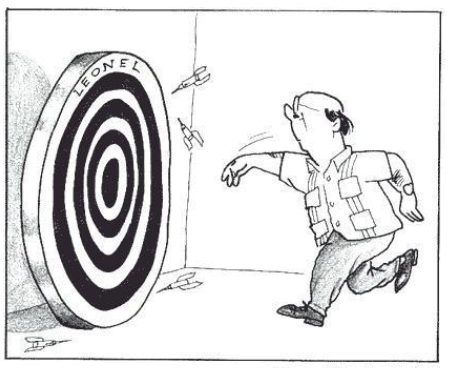

**Tipos de incertidumbre**

**Incertidumbre** 

- Parámetro asociado al resultado de una medición que caracteriza la dispersión de los valores que podrían ser atribuidos al mensurando, (ISP, 2010)


- Es la duda que todo resultado de medición lleva implícito, se representa por medio de un intervalo o rango de valores con una cierta probabilidad de cobertura, llamado intervalo de confianza, que suele ser del 95 %. Este **factor de cobertura K** es igual a 2 para un nivel de confianza del 95 %.


 Lo anterior se conoce como **regla empírica de la estadística** y se construye con la distribución normal.
 
 Si la distribución de la población de una variable es (aproximadamente) normal, entonces

1. Aproximadamente 68% de los valores están dentro de 1 DE (desviación estándar) de la media.

$$\LARGE P(\mu-\sigma\leq x \leq \mu+\sigma)=68.27\%$$

2. Aproximadamente 95% de los valores están dentro de 2 DE de la media.
$$\LARGE P(\mu-2\sigma\leq x \leq \mu+2\sigma)=95.45\%$$

3. Aproximadamente 99.7% de los valores están dentro de 3 DE de la media.

$$\LARGE P(\mu-3\sigma\leq x \leq \mu+3\sigma)=99.73\%$$

Graficamente:


```{r echo=F, out.width="40%"}
knitr::include_graphics("imagen/n2.png")
```

 


**Incertidumbre típica**

Incertidumbre del resultado de una medición, expresada en forma de desviación típica

```{r fig.asp=0.9, fig.align='center', echo=FALSE}
knitr::include_graphics("imagen/mme.png")
```

Dependiendo del origen de los datos la incertidumbre típica se clasifica en 

**Tipo A:** 
Obtenida mediante un analisis estadístico de los datos, se expresan por medio de varianzas o las desviaciones y el número de grados de libertad.

**Tipo B:** 
La evaluación no resulta de una serie de mediciones, si no mediante la bibliografia, como evaluación del material de referencia, certificado de calibración, reportes de la deriva de los instrumentos ó ficha técnica del instrumento 


**Incertidumbre típica combinada**

Resultado de la combinación de las contribuciones de todas las fuentes de incertidumbre es igual a la raíz cuadrada positiva de una suma de términos, siendo éstos las varianzas o covarianzas de esas otras magnitudes, ponderadas en función de la variación del resultado de medida con la variación de dichas magnitudes (GUM).


**Incertidumbre expandida **

Magnitud que define un intervalo en torno al resultado de una medición, y en el que se espera encontrar una
fracción importante de la distribución de valores que podrían ser atribuidos razonablemente al mensurando (GUM)

Se obtiene multiplicando la incertidumbre típica combinada por un factor de cobertura k, generalmente es con un valor de 2 que garantiza al menos el 95% de confianza del resultado

El propósito de esta incertidumbre expandida es proporcionar un intervalo en torno al resultado de medida, que pueda contener una gran parte de la distribución de valores que razonablemente podrían ser atribuidos al mensurando. La elección del factor k, habitualmente comprendido entre los valores 2 y 3, se fundamenta en la probabilidad o nivel de confianza requerido para el intervalo 

<iframe width="280" height="160" src="https://www.youtube.com/embed/-Zp1V8YJHgg" title="¿Qué es la INCERTIDUMBRE METROLÓGICA?" frameborder="0" allow="accelerometer; autoplay; clipboard-write; encrypted-media; gyroscope; picture-in-picture; web-share" allowfullscreen></iframe>


```{r fig.asp=0.9, fig.align='center', echo=FALSE}
knitr::include_graphics("imagen/med.png")
```


## Estimación de la incertidumbre

Existen 2 formas principales de estimar la incertidumbre, conocidas como metodos estocásticos, que hacen alusión a distribuciones de probabilidad y metodos no estocásticos como la GUM.


## Conceptos estadísticos 


## Medidas de tendencia central 
Son 3 valores que resumen y representan la información contenida en un conjunto de datos. Las tres medidas son la media, la mediana y la moda.

```{r fig.asp=0.8, fig.align='center', echo=FALSE}

```


### Moda

Es el valor que más se repite, si no hay datos que se repiten se dice que no hay moda.
Si dos datos se repiten con la misma frecuencia se dice que los datos son bimodales.


### Media

Valor promedio de un conjunto de datos numéricos, calculada como la suma del conjunto de valores dividida entre el número total de valores, la fórmula con la que se estima es:

**Media Muestral**

$$\bar x=\frac{\sum_{i=1}^{n}x_i}{n}$$

**Media poblacional**

$$\hat \mu =\frac{\sum_{i=1}^{n}x_i}{N}$$

Donde
$x_i$ corresponde a cada observación

N es el tamaño poblacional

n es el tamaño muestral

Según el teorema de límite central cuando n>30 se considera poblacional

### Mediana

Es un valor que se encuentra en la mitad de los datos, cuando estos están ordenados

## Medidas de variabilidad

La media es un buen indicador de tendencia central, pero no da una evidencia real acerca de los datos.

Las medidas de variabilidad determinan el grado de acercamiento o distanciamiento de los valores de una distribución frente a su promedio de localización.

- Entre más grande sea el grado de variación, menor uniformidad tendrán los datos (sinónimo de heterogeneidad) y por lo tanto menor confiabilidad del promedio de tendencia central o localización por haber sido obtenido de datos dispersos (Mendoza et al, 2002). 

- Si este valor es pequeño (respecto a la unidad de medida) entonces hay una gran uniformidad entre los datos(Mendoza et al, 2002). 

- Cuando es cero quiere decir que todos los datos son iguales.

### Rango

Es la diferencia entre el valor máximo y el valor mínimo

Rango= valor max - valor mínimo

Esta medida ignora la manera en que los datos están distribuidos

```{r fig.asp=0.8, fig.align='center', echo=FALSE}
knitr::include_graphics("imagen/rango.png")
```

### Varianza y Desviación estándar
 indica qué tan dispersos están los datos con respecto a la media

```{r fig.asp=0.7, fig.align='center', echo=FALSE}
knitr::include_graphics("imagen/sd.png")

```

**Caso poblacional**

**Varianza**

$$\sigma^2=\frac{\sum_{i=1}^n(x_i-\mu)^2}{N}$$
**Desviación estándar**

$$\sigma=\sqrt{\frac{\sum_{i=1}^n(x_i-\mu)^2}{N}}$$
**Caso muestral**

**Varianza**
$$S^2=\frac{\sum_{i=1}^n(x_i-\bar x)^2}{n-1}$$
**Desviación estándar**
$$S=\sqrt{\frac{\sum_{i=1}^n(x_i-\bar x)^2}{n-1}}$$


*Medidas de variabilidad*

<div style="text-align: center;"><iframe width="280" height="160" src="https://www.youtube.com/embed/cg4kUsbjQms" frameborder="0" allow="accelerometer; autoplay; encrypted-media; gyroscope; picture-in-picture" allowfullscreen></iframe></div>

**Diferencia en medidas entre la población y la muestra**

|Medida|Población|Muestra|
|:----:|:-------:|:-----:|
|Tamaño|N        |n      |
|Media |$\mu$   |$\bar x$|
|Varianza|$\sigma^2$|$S^2$|
|Desviación estándar|$\sigma$|S|

**Comparemos**

```{r fig.asp=0.5, fig.align='center', echo=FALSE}
knitr::include_graphics("imagen/bolas.png")
```


### Coeficiente de variación 

Es una medida de la dispersión relativa de un conjunto de datos, la cual relaciona la desviación típica de una muestra y su media.

Se expresa en términos porcentuales, la fórmula con la que se estima es:
$$CV=\frac{S}{\bar x}*100$$


No depende de las unidades de medición, por lo que sirve para comparar la variabilidad de dos conjuntos de datos, siempre que sus medias sean positivas.

