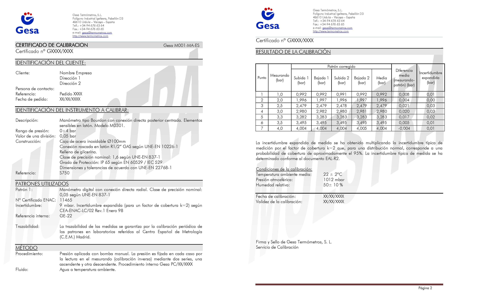

**Preguntas del día**

1. ¿Qué es calibración?

2. ¿Qué es la resolución de un equipo?

3. ¿Qué es el error?

4. ¿Qué factores inducen al error de medición?

5. ¿Qué componentes tiene el error de medición?

6. ¿Qué es el sesgo de medición?

7. ¿Qué importancia tiene el sesgo en la estimación de la incertidumbre?

8. ¿Qué fuentes de incertidumbre reconoces?


## Resolución

Es la capacidad de un sistema o instrumento para detectar y mostrar cambios o variaciones pequeñas en una magnitud o medida. Es decir, es la mínima cantidad o el menor cambio que puede ser detectado y expresado por el sistema o el instrumento de medición.


```{r, echo=F, fig.asp=0.3, fig.align='center'}
knitr::include_graphics("imagen/reso.png")
```


## Calibración

- Operación que bajo condiciones específicas establece una relación entre los valores y sus incertidumbres de medida asociadas(VIM).

- Conjunto de operaciones por comparación entre un patrón y un instrumento de prueba para determinar el error máximo y su incertidumbre asociada, va documentado en un certificado de calibración.

- Comparación documentada entre el dispositivo de medición que se va a calibrar y otro de referencia trazable (BIPM, Bureau International des Poids et Mesures, es decir, la oficina internacional de pesos y medidas).

- Descalibración no existe

- Una calibración puede expresarse mediante una declaración, una función de calibración, un diagrama de calibración, una curva de calibración o una tabla de calibración.

- El estado de nuevo o usado no lo excluye de la calibración 

- Previo a una calibración el equipo debe estar en óptimas condiciones de funcionamiento.


**Comprobación metrológica**

Intermedio entre calibraciones


**Trazabilidad metrológica (VIM)**


Propiedad de un resultado de medida, que puede relacionarse con una referencia, mediante una cadena ininterrumpida y documentada de calibraciones, que contribuyen a la medición de la incertidumbre.

**Certificado de calibración**

Documento que muestra las diferencias de medida entre el instrumento a calibrar (mensurando) y el patrón contra el que se contrasta. 


**Qué debe contener un certificado de calibración**

- Nombre del equipo

- Resolución

- Rango 

- Método de calibración

- Incertidumbre del mensurando 

- Qué voy a medir?

- Con que instrumento voy a medir

- Diferencias entre las medidas que muestra el instrumento a calibrar (mensurando)

- Patrones contrastados

- Incertidumbre de medida de cada punto contrastado.


```{r out.width="100%", fig.align='center', echo=FALSE}

```


## Medición

Proceso que consiste en obtener experimentalmente uno o varios valores que pueden atribuirse razonablemente a una magnitud **VIM**


**Mensurando:** 

Cantidad destinada a la medida. (VIM)

 **Apreciación** 
 
Es la menor variación de la medida que podemos registrar con un instrumento. En los instrumentos con escala, la apreciación es el valor entre dos divisiones consecutivas; por ejemplo una probeta de 25,0 mL tiene una apreciación de 0,5 mL.


## Metodos de medición

Descripción genérica de la secuencia lógica de operaciones utilizadas en una medición.

La norma internacional ISO/IEC 17025 identifica los métodos en términos de su origen, mientras que VIM los clasifica según el fenómeno.

```{r fig.asp=0.5, fig.align='center', echo=FALSE}
knitr::include_graphics("imagen/mm.png")
```


## Precisión de medida


Conjunto de condiciones que incluye el mismo procedimiento de medición, el mismo lugar y mediciones repetidas del mismo objeto u objetos similares durante un periodo amplio de tiempo, puede incluir variaciones como calibraciones, patrones, operadores y sistemas de medida (VIM)


## Precisión y exactitud de medida


**Exactitud de medida**


¿Que tan cercano esta al valor verdadero?


Proximidad entre un valor medido y un valor verdadero de un mensurando


**Precisión de medida (VIM)**


¿Qué tan cercanas están las medidas entre ellas?

Capacidad que tiene un equipo de replicar  un valor, así sea el verdadero u otro diferente, se expresa mediante medidas de dispersión tales como la desviación típica, la varianza o el coeficiente de variación bajo las condiciones especificadas.

Proximidad entre los valores medidos obtenidos en mediciones repetidas de un mismo objeto bajo condiciones específicas  de repetibilidad, de precisión intermedia, o de reproducibilidad. 


```{r echo=FALSE}
library(DiagrammeR) 
library(DiagrammeRsvg) 
library(rsvg) 

grViz("digraph{
 
      graph[rankdir = LR]
  
      node[shape = rectangle, style = filled]
  
    
      node[fillcolor = Violet, margin = 0.2]
      D[label = 'Condiciones especificas']
      
  
      subgraph cluster_0 {
        graph[shape = rectangle]
        style = rounded
        bgcolor = Gold
    
         label = 'De Repetibilidad'
        node[shape = rectangle, fillcolor = LemonChiffon, margin = 0.25]
        F[label = 'En un periodo corto de tiempo el mismo: 
- Procedimiento de medida,      
- Operadores
- Sistema de medida, 
- Condiciones de operación 
- Lugar
- Objeto o uno similar']
      }
      
      subgraph cluster_2 {
        graph[shape = rectangle]
        style = rounded
        bgcolor = Gold
    
         label = 'De precisión intermedia'
        node[shape = rectangle, fillcolor = LemonChiffon, margin = 0.25]
         G[label = 'Mismas condiciones de repetibilidad
         pero con algunas variaciones como nuevas:
         - Calibraciones
         - Patrones 
         - Operadores 
         - Sistemas de medida']
      }
  
      subgraph cluster_3 {
         graph[shape = rectangle]
         style = rounded
         bgcolor = Gold
    
         label = 'De reproducibilidad'
         node[shape = rectangle, fillcolor = LemonChiffon, margin = 0.25]
         H[label = 'Mediciones repetidas de los mismos
         objetos u otros similares en diferentes 
         - Lugares
         - Operadores
         - Sistemas de medida ']
         
      }
      edge[color = black, arrowhead = vee, arrowsize = 1.25]
      
      D -> F    D -> G  D -> H
      
      }")
```

**Relación entre precisión y exactitud**

```{r out.width="80%", fig.align='center', echo=FALSE}
knitr::include_graphics("imagen/dina.png")
```

R y R  son conocidas después de tomar las mediciones.


## Tolerancia de una medida

Cantidad de error ocurrida entre el valor medido y el valor verdadero. Lo importante es especificar el rango de error permitido. En términos de medición, la diferencia entre las dimensiones máximas y mínimas de los errores permitidos se denomina "tolerancia". 

- Generalmente se representa como un valor +/- fuera de una especificación nominal. 

- "No es conveniente utilizar el término “tolerancia” para designar el ‘error máximo permitido" **VIM**

- En cuanto a la **calidad de la tolerancia** podemos decir que cuanto mayor sea la calidad menor será la tolerancia.

- El sistema ISO prevé 18 calidades designadas por : IT01, IT-0,...., IT-16,


|Calidades |Aplicaciones|
|:--------:|:------------------------------------------------------:|
|IT-01 IT-5| Construcción de instrumentos de control y en mecánica de alta precisión|
|IT-6 IT-11|Mecánica de precisión y ajustes mecánicos|
|IT-12 IT-16|Trabajos de fabricación y piezas de fundición|


- La amplitud de la zona de tolerancia dependerá de la calidad que se asigne y la dimensión a obtener.

|mayor de (mm)|hasta (mm)|0.1|0|1|2|3|4|5|6|7|8|9|10|11|12|13|14|15|16| 
|:-----------:|:--------:|:-:|-|-|-|-|-|-|-|-|-|-|--|--|--|--|--|--|--|
|0|3|0.3|0.5|0.8|1.2|2|3|4|6|10|14|25|40|60|100|140|250|400|600|
|3|6|0.4|0.6|1|1.5|2.5|4|5|8|12|18|30|48|75|120|180|300|480|750|


## Incertidumbre de una medida


- Parámetro asociado al resultado de una medición que caracteriza la dispersión de los valores que podrían ser atribuidos al mensurando, (ISP, 2010)

- Es el intervalo de los valores posibles de una medida. 


**Aplicaciones de la incertidumbre**


```{r, echo=F, out.width="70%", fig.align='center'}
knitr::include_graphics("imagen/API.png")
```


**Relación entre la incertidumbre y la tolerancia en las medidas**

Las medidas llevan asociado un error desconocido; al que se le asigna una cota superior, llamada incertidumbre.

$$medida ± incertidumbre $$


**Tolerancia (de una magnitud)** 

Es el intervalo de valores en el que debe encontrarse una magnitud para que se acepte como válida.


```{r fig.asp=0.5, fig.align='center', echo=FALSE}
knitr::include_graphics("imagen/tol.png")
```


$$Intervalo \quad toleracia \geq error+incertidumbre$$

### Tipos de incertidumbre de una medida

El resultado de una medición suele ser un número expresado como múltiplo de una unidad de medida. 

**Ejemplo**

En un experimento se ha medido la gravedad, obteniendo como resultado $(9,51 ± 0,45) m/s^2$, esto da a entender que:

-  No se puede asegurar que el valor de la  gravedad sea $9,51 m/s^2$

- Se puede afirmar que hay un margen de error de $0,45 m/s^2$, ya sea por exceso o por defecto. 


**Incertidumbre absoluta**

Dada una medida experimental de una magnitud, a, y una incertidumbre absoluta, $u_a$; el valor verdadero, A, debe estar contenido, con razonable certeza, dentro del siguiente intervalo:

$$a-u_a\leq A \leq a+ u_a $$


**Incertidumbre relativa**

Es el cociente entre la incertidumbre absoluta y el valor de la medida, es una cantidad adimensional que nos informa de la precisión de la medida. Suele expresarse (multiplicándola por 100) como porcentaje.

$$\frac{u_a}{a}$$


**Incertidumbre en medidas reproducibles**


Cuando al realizar una serie de medidas de una misma magnitud se obtienen los mismos resultados, no se puede concluir que la incertidumbre sea cero; lo que sucede es que los errores quedan ocultos ya que son menores que la incertidumbre asociada al aparato de medición. 

En este caso, puede establecerse un criterio simple y útil: cuando las medidas son reproducibles, se asigna una incertidumbre igual a la mitad de la división más pequeña del instrumento, la cual se conoce como resolución.

Por ejemplo, al medir con un instrumento graduado en mililitros repetidas veces el volumen de un recipiente se obtiene siempre 48.0 ml, la incertidumbre será 0.5 ml.

```{r out.width="100%", fig.align='center', echo=FALSE}
knitr::include_graphics("imagen/menisco.png")
```


Lo que significa que la medición está entre 47.5 a 48.5 ml, a éste se le conoce como intervalo de confianza de la medición y su tamaño es el doble de la incertidumbre. Esto generalmente se aplica cuando se trata de aparatos de medición tales como reglas, transportadores, balanzas, probetas, manómetros, termómetros, etc


 
 
**Incertidumbre en medidas no-reproducibles**

Cuando se hacen repeticiones de una medida y estas resultan diferentes, con
valores $x_1, x_2,...,x_N$, surgen las preguntas:


- ¿Cuál es el valor que se reporta?


- ¿Qué incertidumbre se asigna al valor reportado?


La respuesta a estas preguntas se obtiene a partir del estudio estadístico de las
mediciones,promedio y desviación estándar.

Para una medida repetida la incertidumbre está dada por:

$$u=\frac{ sd}{\sqrt n}$$


## Error

Diferencia entre un valor medido de una magnitud y un valor de referencia.


**Error absoluto**
Diferencia entre el valor indicado por el instrumento $A_i$ y el valor verdadero $A_r$ de la magnitud medida.

$$E=A_i-A_r$$
**Algunas causas de error**

```{r, echo=F, out.width="80%",fig.align='center'}
knitr::include_graphics("imagen/fm.png")
```

### Componentes del error

Se considera que un error tiene dos componentes, llamadas componente aleatoria y componente sistemática


**Error sistemático**

- También se le conoce como sesgo (EURACHEM, 2011)

- Se repiten en el proceso de medición sin modificación. 

- Siempre genera medidas que se encuentran alrededor del mismo valor erróneo, por lo que nunca se compensarán, provocando que el valor real y central no coincidan.

- Ocasionados por errores de calibración y sesgos en los instrumentos.


**Error aleatorio**

Se distribuye alrededor de un valor central, se espera que este valor coincida con el valor real, es decir, las fluctuaciones aleatorias en los valores medidos terminan compensándose.

______________________________________________________________________________


|Descripción|Error aleatorio| Error sistemático| 
|:---------:|:-------------:|:----------------:|
|________________|____________________|__________________________|
||- Variaciones impredecibles en observaciones repetidas del mensurando.|- Permanecen constantes o varían de forma predecible en el análisis del mismo mensurando.|
|Causa|- variaciones de las magnitudes|- Selección de los sujetos de estudio| 
| |- Muestreo|- Obtención de la información|
| | |- Presencia de variables externas distorsionadas
|________________|____________________|__________________________|
|Disminuye al aumentar el tamaño del estudio|Si|No|
|________________|____________________|__________________________|
|Afectación|Precisión|Validez|
|________________|____________________|__________________________|


_____________________________________________________________________


```{r echo=FALSE}
library(DiagrammeR) 
library(DiagrammeRsvg) 
library(rsvg) 

grViz("digraph{
 
      graph[rankdir = LR]
      node[shape = rectangle, style = filled]
      node[fillcolor = Violet, margin = 0.2]
      D[label = 'Evitables']
      E[label = 'Inevitables']
  
      subgraph cluster_0 {
        graph[shape = rectangle]
        style = rounded
        bgcolor = Gold
        label = 'Sistemáticas'
        node[shape = rectangle, fillcolor = LemonChiffon, margin = 0.25]
        F[label = 'Aparatos mal calibrados,
        vidrios dilatados por calentamiento, 
        equipos mal cuidados, 
        errores de método, etc.']
      }
      
      subgraph cluster_2 {
        graph[shape = rectangle]
        style = rounded
        bgcolor = Gold
    
         label = 'Personales'
        node[shape = rectangle, fillcolor = LemonChiffon, margin = 0.25]
         G[label = 'Inexperiencia del operador,
        equivocación de un reactivo,
        lecturas erróneas,
        brusquedad en el uso de aparatos']
      }
  
      subgraph cluster_1 {
         graph[shape = rectangle]
         style = rounded
         bgcolor = Gold
    
         label = 'Aleatorias'
         node[shape = rectangle, fillcolor = LemonChiffon, margin = 0.25]
         I[label = 'Reflejan la dispersión de la
         magnitud al repetir su medida']
      }
  
  subgraph cluster_3 {
         graph[shape = rectangle]
         style = rounded
         bgcolor = Gold
    
         label = 'instrumentales'
         node[shape = rectangle, fillcolor = LemonChiffon, margin = 0.25]
         H[label = 'Debido a la sensibilidad de los
dispositivos de medida.']
         
      }
      edge[color = black, arrowhead = vee, arrowsize = 1.25]
      
      D -> F    D -> G
      E -> H    E -> I 
      
      }")
```

## Sesgo

En metrología se diferencian diferentes tipos de sesgo


**Sesgo de medida**

valor estimado de un error sistemático (VIM)

**Sesgo instrumental**

Diferencia entre la media de las indicaciones repetidas y un **valor de referencia** (VIM). 

