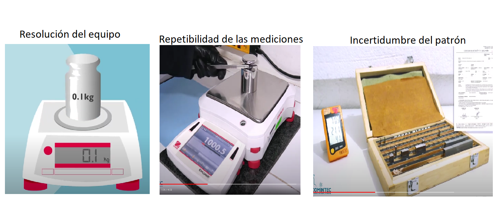

**Tipos de incertidumbre**

**Incertidumbre** 

- Parámetro asociado al resultado de una medición que caracteriza la dispersión de los valores que podrían ser atribuidos al mensurando, (ISP, 2010)


- Es la duda que todo resultado de medición lleva implícito, se representa por medio de un intervalo o rango de valores con una cierta probabilidad de cobertura, llamado intervalo de confianza, que suele ser del 95 %. Este factor de cobertura se representa con la letra K y para un nivel de confianza del 95 %, K es igual a 2.

 Lo anterior se conoce como **regla empírica de la estadística** y se construye con la distribución normal.
 
 Si la distribución de la población de una variable es (aproximadamente) normal, entonces

1. Aproximadamente 68% de los valores están dentro de 1 DE (desviación estándar) de la media.

$$\LARGE P(\mu-\sigma\leq x \leq \mu+\sigma)=68.27\%$$

2. Aproximadamente 95% de los valores están dentro de 2 DE de la media.
$$\LARGE P(\mu-2\sigma\leq x \leq \mu+2\sigma)=95.45\%$$

3. Aproximadamente 99.7% de los valores están dentro de 3 DE de la media.

$$\LARGE P(\mu-3\sigma\leq x \leq \mu+3\sigma)=99.73\%$$

Graficamente:


```{r echo=F, out.width="40%"}
knitr::include_graphics("imagen/n2.png")
```

 


**Incertidumbre típica**

Incertidumbre del resultado de una medición, expresada en forma de desviación típica

```{r fig.asp=0.9, fig.align='center', echo=FALSE}

```

Dependiendo del origen de los datos la incertidumbre típica se clasifica en 

Tipo A: Obtenida mediante un analisis estadístico de los datos, se expresan por medio de varianzas o las desviaciones y el número de grados de libertad.


Tipo B: La evaluación no resulta de una serie de mediciones, si no mediante la bibliografia, como evaluación del material de referencia, certificado de calibración, reportes de la deriva de los instrumentos ó ficha técnica del instrumento 


**Incertidumbre típica combinada**

Resultado de la combinación de las contribuciones de todas las fuentes de incertidumbre es igual a la raíz cuadrada positiva de una suma de términos, siendo éstos las varianzas o covarianzas de esas otras magnitudes, ponderadas en función de la variación del resultado de medida con la variación de dichas magnitudes (GUM).


**Incertidumbre expandida **

magnitud que define un intervalo en torno al resultado de una medición, y en el que se espera encontrar una
fracción importante de la distribución de valores que podrían ser atribuidos razonablemente al mensurando (GUM)

Se obtiene multiplicando la incertidumbre típica combinada  por un factor de cobertura k, generalmente es con un valor de 2 que garantiza al menos el 95% de confianza del resultado


la incertidumbre típica combinada uc se multiplica por un factor de cobertura k, obteniéndose la denominada incertidumbre expandida U. El propósito de esta incertidumbre expandida U es proporcionar un intervalo en torno al resultado de medida, que pueda contener una gran parte de la distribución de valores que razonablemente podrían ser atribuidos al mensurando. La elección del factor k, habitualmente comprendido entre los valores 2 y 3, se fundamenta en la probabilidad o nivel de confianza requerido para el intervalo 

<iframe width="280" height="160" src="https://www.youtube.com/embed/-Zp1V8YJHgg" title="¿Qué es la INCERTIDUMBRE METROLÓGICA?" frameborder="0" allow="accelerometer; autoplay; clipboard-write; encrypted-media; gyroscope; picture-in-picture; web-share" allowfullscreen></iframe>


```{r fig.asp=0.9, fig.align='center', echo=FALSE}
knitr::include_graphics("imagen/med.png")
```


## Estimación de la incertidumbre

Existen diferentes 2 formas principales de estimar la incertidumbre, conocidas como metodos estocásticos, que hacen alusión a distribuciones de probabilidad y metodos no estocásticos como la GUM.


