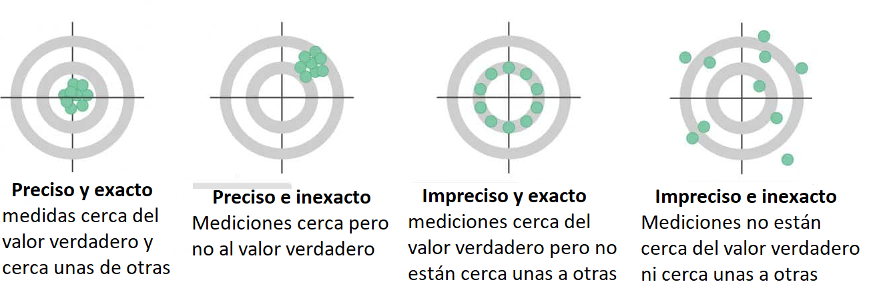

## Resolución

Es la capacidad de un sistema o instrumento para detectar y mostrar cambios o variaciones pequeñas en una magnitud o medida. Es decir, es la mínima cantidad o el menor cambio que puede ser detectado y expresado por el sistema o el instrumento de medición.

## Medición

Proceso que consiste en obtener experimentalmente uno o varios valores que pueden atribuirse razonablemente a una magnitud

## Incertidumbre


- Parámetro asociado al resultado de una medición que caracteriza la dispersión de los valores que podrían ser atribuidos al mensurando, (ISP, 2010)

- Es el intervalo de los valores posibles de una medida. 


## Incertidumbre y tolerancia en las medidas

Las medidas llevan asociado un error desconocido; al que se le asigna una cota superior, llamada incertidumbre.

$$medida ± incertidumbre $$


**Tolerancia (de una magnitud)** 

Es el intervalo de valores en el que debe encontrarse una magnitud para que se acepte como válida.


```{r fig.asp=0.5, fig.align='center', echo=FALSE}
knitr::include_graphics("imagen/tol.png")
```


$$Intervalo \quad toleracia \geq error+incertidumbre$$

## Incertidumbre de una medida

El resultado de una medición suele ser un número expresado como múltiplo de una unidad de medida. 

**Ejemplo**


En un experimento se ha medido la gravedad, obteniendo como resultado $(9,51 ± 0,45) m/s^2$, esto da a entender que:

-  No se puede asegurar que el valor de la  gravedad sea $9,51 m/s^2$

- Se puede afirmar que hay un margen de error de $0,45 m/s^2$, ya sea por exceso o por defecto. 

**Incertidumbre absoluta**

Dada una medida experimental de una magnitud, a, y una incertidumbre absoluta, $u_a$; el valor verdadero, A, debe estar contenido, con razonable certeza, dentro del siguiente intervalo:

$$a-u_a\leq A \leq a+ u_a $$


**Incertidumbre relativa**

Es el cociente entre la incertidumbre absoluta y el valor de la medida, es una cantidad adimensional que nos informa de la precisión de la medida. Suele expresarse (multiplicándola por 100) como porcentaje.

$$\frac{u_a}{a}$$
 **Apreciación** 
 
 
Es la menor variación de la medida que podemos registrar con dicho instrumento. En los instrumentos con escala, la apreciación es el valor entre dos divisiones consecutivas; por ejemplo una probeta de 25,0 mL tiene una apreciación de 0,5 mL.

## Metodos de medición

Descripción genérica de la secuencia lógica de operaciones utilizadas en una medición.

La norma internacional ISO/IEC 17025 identifica los métodos en términos de su origen, mientras que VIM los clasifica según el fenómeno.

```{r fig.asp=0.5, fig.align='center', echo=FALSE}
knitr::include_graphics("imagen/mm.png")
```


**Comprobación metrológica**

Intermedio entre calibraciones


**Trazabilidad metrológica (VIM)**


Propiedad de un resultado de medida, que puede relacionarse con una referencia, mediante una cadena ininterrumpida y documentada de calibraciones, que contribuyen a la medición de la incertidumbre.


**Mensurando:** 

Cantidad destinada a la medida. (VIM)


**Exactitud de medida**


¿Que tan cercano esta al valor verdadero?


Proximidad entre un valor medido y un valor verdadero de un mensurando


## Precisión y exactitud de medida

**Precisión de medida (VIM)**


¿Qué tan cercanas están las medidas entre ellas?

Capacidad que tiene un equipo de replicar  un valor, así sea el verdadero u otro diferente, se expresa mediante medidas de dispersión tales como la desviación típica, la varianza o el coeficiente de variación bajo las condiciones especificadas.

Proximidad entre los valores medidos obtenidos en mediciones repetidas de un mismo objeto bajo condiciones específicas  de repetibilidad, de precisión intermedia, o de reproducibilidad. 


```{r echo=FALSE}
library(DiagrammeR) 
library(DiagrammeRsvg) 
library(rsvg) 

grViz("digraph{
 
      graph[rankdir = LR]
  
      node[shape = rectangle, style = filled]
  
    
      node[fillcolor = Violet, margin = 0.2]
      D[label = 'Condiciones especificas']
      
  
      subgraph cluster_0 {
        graph[shape = rectangle]
        style = rounded
        bgcolor = Gold
    
         label = 'De Repetibilidad'
        node[shape = rectangle, fillcolor = LemonChiffon, margin = 0.25]
        F[label = 'En un periodo corto de tiempo el mismo: 
- Procedimiento de medida,      
- Operadores
- Sistema de medida, 
- Condiciones de operación 
- Lugar
- Objeto o uno similar']
      }
      
      subgraph cluster_2 {
        graph[shape = rectangle]
        style = rounded
        bgcolor = Gold
    
         label = 'De precisión intermedia'
        node[shape = rectangle, fillcolor = LemonChiffon, margin = 0.25]
         G[label = 'Mismas condiciones de repetibilidad
         pero con algunas variaciones como nuevas:
         - Calibraciones
         - Patrones 
         - Operadores 
         - Sistemas de medida']
      }
  
      subgraph cluster_3 {
         graph[shape = rectangle]
         style = rounded
         bgcolor = Gold
    
         label = 'De reproducibilidad'
         node[shape = rectangle, fillcolor = LemonChiffon, margin = 0.25]
         H[label = 'Mediciones repetidas de los mismos
         objetos u otros similares en diferentes 
         - Lugares
         - Operadores
         - Sistemas de medida ']
         
      }
      edge[color = black, arrowhead = vee, arrowsize = 1.25]
      
      D -> F    D -> G  D -> H
      
      }")
```

**Relación entre precisión y exactitud**

```{r out.width="80%", fig.align='center', echo=FALSE}

```

R y R  son conocidas después de tomar las mediciones.


## Error


Diferencia entre un valor medido de una magnitud y un valor de referencia, 


**Error absoluto**
Diferencia entre el valor indicado por el instrumento $A_i$ y el valor verdadero $A_r$ de la magnitud medida.

$$E=A_i-A_r$$
**Algunas causas de error**

```{r, echo=F, out.width="80%",fig.align='center'}
knitr::include_graphics("imagen/fm.png")
```

**Componentes del error**

Se considera que un error tiene dos componentes, llamadas componente aleatoria y componente sistemática


**Error sistemático**

También se le conoce como sesgo(EURACHEM, 2011), los efectos que cambian sistemáticamente en magnitud durante series de análisis, dan lugar a errores sistemáticos que no son constantes.


______________________________________________________________________________

```{r echo=FALSE}

library(tidyverse)
library(kableExtra)


timeline_tab <- tibble(
  Descripción = c(
"___________________________________"),
Aleatorio = c("_____________________"
),
Sistemático = c(
"__________________________")) %>%
add_row(Descripción = c(
"Causa",
"",
"",
"",
""),
Aleatorio = c(
"- Variaciones impredecibles en observaciones repetidas del mensurando. ",
"- variaciones de las magnitudes",
"- Muestreo",
"",
""),
Sistemático = c(
"- Permanecen constantes o varían de forma predecible en el análisis del mismo mensurando.",
"- Selección de los sujetos de estudio",
"- Obtención de la información",
"- Presencia de variables externas distorsionadas",
"")
) %>%
add_row(Descripción = c(
"___________________________________"),
Aleatorio = c("_____________________"
),
Sistemático = c(
"__________________________")
) %>%
add_row(Descripción = c(
"Disminuye al aumentar el tamaño del estudio"),
Aleatorio = c("Si"
),
Sistemático = c(
"No")
) %>%
  
add_row(Descripción = c(
"___________________________________"),
Aleatorio = c("_____________________"
),
Sistemático = c(
"__________________________")
) %>%
add_row(Descripción = c(
"Afectación"),
Aleatorio = c(
"Presición"
),
Sistemático = c(
"Validez"
)
) %>%
add_row(Descripción = c(
"___________________________________"),
Aleatorio = c("_____________________"
),
Sistemático = c(
"__________________________")
) %>%
add_row(Descripción = c(
""),
Aleatorio = c(
""),
Sistemático = c(""))
timeline_tab %>%
kable(booktabs = TRUE, align = "c",
      col.names = c("Descripción ","Error aleatorio",
"Error sistemático"),
escape=FALSE) %>%
column_spec(c(1), width = "3cm") %>%
column_spec(c(2, 3), width = "9cm") 
```
_____________________________________________________________________


```{r echo=FALSE}
library(DiagrammeR) 
library(DiagrammeRsvg) 
library(rsvg) 

grViz("digraph{
 
      graph[rankdir = LR]
      node[shape = rectangle, style = filled]
      node[fillcolor = Violet, margin = 0.2]
      D[label = 'Evitables']
      E[label = 'Inevitables']
  
      subgraph cluster_0 {
        graph[shape = rectangle]
        style = rounded
        bgcolor = Gold
        label = 'Sistemáticas'
        node[shape = rectangle, fillcolor = LemonChiffon, margin = 0.25]
        F[label = 'Aparatos mal calibrados,
        vidrios dilatados por calentamiento, 
        equipos mal cuidados, 
        errores de método, etc.']
      }
      
      subgraph cluster_2 {
        graph[shape = rectangle]
        style = rounded
        bgcolor = Gold
    
         label = 'Personales'
        node[shape = rectangle, fillcolor = LemonChiffon, margin = 0.25]
         G[label = 'Inexperiencia del operador,
        equivocación de un reactivo,
        lecturas erróneas,
        brusquedad en el uso de aparatos']
      }
  
      subgraph cluster_1 {
         graph[shape = rectangle]
         style = rounded
         bgcolor = Gold
    
         label = 'Aleatorias'
         node[shape = rectangle, fillcolor = LemonChiffon, margin = 0.25]
         I[label = 'Reflejan la dispersión de la
         magnitud al repetir su medida']
      }
  
  subgraph cluster_3 {
         graph[shape = rectangle]
         style = rounded
         bgcolor = Gold
    
         label = 'instrumentales'
         node[shape = rectangle, fillcolor = LemonChiffon, margin = 0.25]
         H[label = 'Debido a la sensibilidad de los
dispositivos de medida.']
         
      }
      edge[color = black, arrowhead = vee, arrowsize = 1.25]
      
      D -> F    D -> G
      E -> H    E -> I 
      
      }")
```


## Sesgo

En metrología se diferencian diferentes tipos de sesgo


**Sesgo de medida**

valor estimado de un error sistemático (VIM)

**Sesgo instrumental**

Diferencia entre la media de las indicaciones repetidas y un **valor de referencia** (VIM). 


__________________________________________________________________


- La determinación del **sesgo global** en relación con valores de referencia apropiados es importante para establecer la trazabilidad a patrones reconocidos. 


- Según la guia ISO se deben aplicar correcciones para todos los efectos sistemáticos significativos y reconocidos.

- La determinación del sesgo es un componente esencial de la incertidumbre global.

A la hora de decidir si un sesgo conocido puede ser razonablemente descartado, se recomienda la siguiente aproximación:

i) Estimar la incertidumbre combinada sin considerar el sesgo relevante.

ii) Comparar el sesgo con la incertidumbre combinada.

iii) Cuando el sesgo no es significativo comparado con la incertidumbre combinada, el sesgo puede ser descartado.

iv) Cuando el sesgo es significativo comparado con la incertidumbre combinada, se requiere una acción adicional. Acciones apropiadas
podrían ser:

- Eliminar o corregir el sesgo, haciendo la debida asignación de la incertidumbre de la corrección.

- Informar del sesgo observado y su incertidumbre además del resultado.

__________________________________________________

El sesgo puede estar determinado por:


**Un método**

Se determina por comparación de un método de referencia con método empírico. Si los resultados muestran que el sesgo es estadísticamente estadísticamente no significativo, la incertidumbre estándar es la del método de referencia, combinada con la incertidumbre estándar asociada a la diferencia medida entre métodos, dada por la desviación estándar de la distribución de muestreo de diferencia medias para varianzas poblacionales desconocidas pero iguales. 


**EJEMPLO**
Un método (M1) para determinar la concentración de selenio es comparado con un método de referencia (M2). Los resultados (en $mg/kg$) para cada método son los que se muestran a continuación:


|Método|$\bar x$|   s|n  |
|------|:------:|:--:|:-:|
|M1    |5.40    |1.47|5  |
|M2    |4.76    |2.75|5  |

Usando pruebas de hipótesis pruebe que no existen diferencias significativas entre ambos métodos.

$$H_0=\mu_1=\mu_2$$
$$H_1=\mu_1\neq \mu_2$$


Para probarlo se usa la distribución de muestreo para la diferencias de medias con varianzas desconocidas y diferentes. 

La fórmula para unificar las desviaciones estándar vienen dadas por: 

$$S^2=\frac{(n_1-1)*S_1^2+(n_2-1)*S_2^2}{n_1+n_2-2}$$
Aplicando la fórmula se tiene

$$s_c=\sqrt{\frac{1.47^2*(5-1)+2.75^2*(5-1)}{5+5-2}}=2.205$$

El  valor del estadístico se calcula mediante la fórmula:

$$t_{n_1+n_2-2}=\frac{\bar X_1-\bar X_2-(\mu_1-\mu_2)}{s_c\sqrt{\frac{1}{n_1}+\frac{1}{n_2}}}$$
reemplazando:

$$t_{8}=\frac{5.4-4.76-(0)}{2.205\sqrt{\frac{1}{5}+\frac{1}{5}}}=\frac{0.64}{1.4}=0.46$$
para definir el valor p

$$P(t_8>0.46)=32.89\%$$

```{r}
pt(0.46, 8, lower.tail = F) 

plot( function(x) dt( x, df = 8 ), -5, 5, ylim = c( 0, 0.4 ),
      col = "red", type = "l", lwd = 2,
      main = "Función densidad t de Student df = 8" )
abline(v=0.46,col=2)
```

no hay diferencias significativas entre los resultados dados por los dos métodos.
La diferencia de medias muestrales es 0,64, y se compara con
un término de la desviación estándar de 1,4, asociada a la diferencia, y por lo tanto representa una contribución aplicable a la incertidumbre asociada al sesgo medido.

**Actividad**


Se investiga el efecto de la variación de una hora en el tiempo de extracción mediante una prueba t con 5 mediciones, todas ellas en la misma muestra, para el tiempo de extracción normal, y para la extracción con una hora menos

Los datos suministrados son:

|Momento|    |    |    |    |    |media|desviación estándar s|
|-------|:--:|:--:|:--:|:--:|:--:|----:|---------------------|
|Antes  |1.67|1.86|1.88|1.55|1.72|     |                     |  
|Después|1.87|1.83|1.72|1.54|1.67|     |                     |


1. Escriba la prueba de hipotesis asociada
2. Acepte o rechace la hipótesis
2. Halle la media y desviación estándar
3. Halle el valor  de la contribución asociada al efecto de la variación permitida en el tiempo de extracción


```{r}

x1=c(1.67,1.86,1.88,1.55,1.72)
x2=c(1.87,1.83,1.72,1.54,1.67)
 
t.test(x1,x2) # Prueba t de Student

```


_____________________________________________________________________________________


**Preguntas del día**

1. ¿Qué es el error?

2. ¿Qué factores inducen al error de medición?

3. ¿Qué componentes tiene el error de medición?

4. ¿Qué es el sesgo de medición?

5. ¿Qué importancia tiene el sesgo en la estimación de la incertidumbre?

5. Que fuentes de incertidumbre reconoces

6. Qué es resolución de un equipo.


