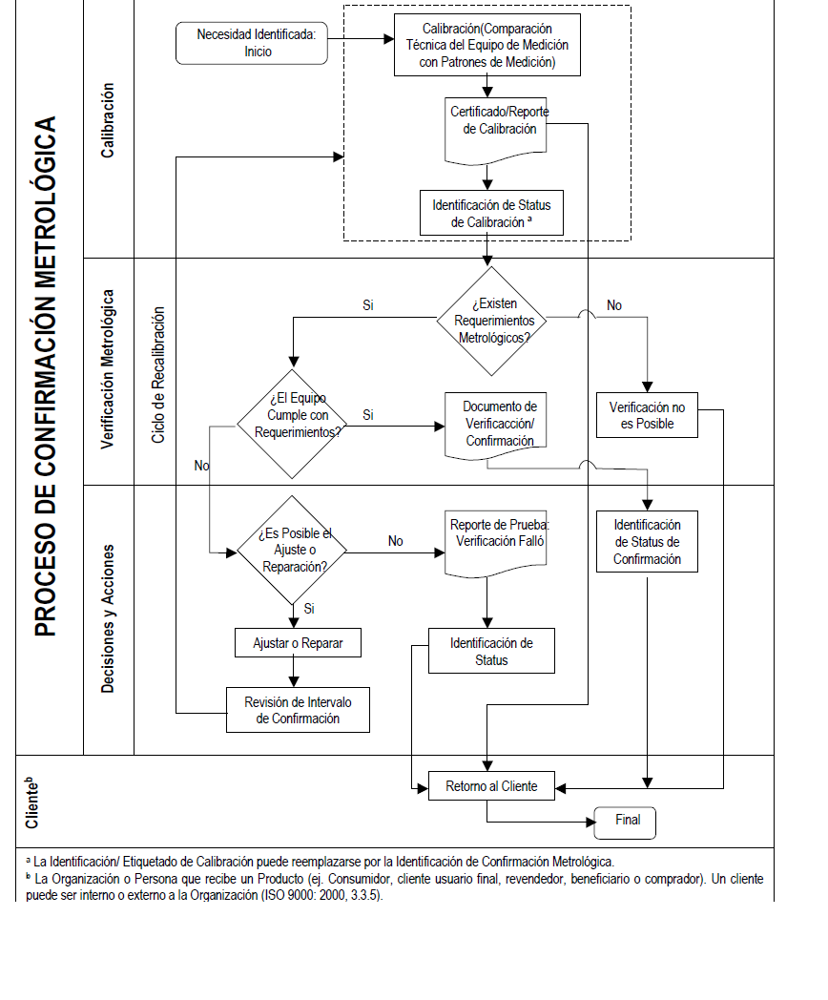

## Estadística y metrología


La ciencia **estadística** busca reducir el error, resultante de una estimación con su valor verdadero, con el objeto de tener valoraciones confiables como por ejemplo:

- En economía predecir el precio futuro de una divisa o acción

- Predecir la temperatura de un día


En la vida cotidiana, nos interesan muchas medidas como:

- El tiempo que debemos hervir un huevo

- El límite máximo de velocidad 

- El peso del equipaje permitido en un avión 

- El número de galones con que se tanquea el carro 

La **metrología** es la ciencia que se ocupa de mantener y aumentar la precisión de las mediciones, en cualquier campo, por ejemplo

- Obtener una estimación fiable de niveles traza de contaminantes alimentarios como el mercurio en el pescado

- En el campo de la medicina tener mediciones de la presión arterial para el diagnostico de enfermedades.

~~~
Una medición cuidadosa puede significar, que una teoría aceptada necesita revisión o que se requiere un nuevo diseño en algún componente crítico de una aeronave.
~~~

### Tipos de metrología


**Legal**

Se relaciona con las actividades que se derivan de los requisitos legales que se aplican a la medición, las unidades de medida, los instrumentos de medida y los métodos de medida que se llevan a cabo por los organismos competentes.


**Científica**


Se encarga de la custodia, mantenimiento y trazabilidad de los patrones, así como la investigación y desarrollo de nuevas técnicas de medición, de acuerdo al estado del arte de la ciencia.

Dentro de sus funciones se encuentra

- Determinaciones de las constantes físicas fundamentales 

- Caracterísiticas de los fenomenos 

- Busca mejorar sistemas de medición para lograr un control cada vez más rápido y más confiable de la mano con el sistema de medidas internacionales SI


**Técnica o industrial**

Comprende todas las actividades metrológicas que necesita la industria para cumplir con sus tareas como:

– La información sobre mediciones.

– Las calibraciones.

– La trazabilidad.

– El servicio de calibración.

– El aseguramiento de la calidad.

## Incertidumbre y tolerancia en las medidas

Las medidas llevan asociado un error desconocido; al que se le asigna una cota superior, llamada incertidumbre.

$$medida ± incertidumbre $$


**Incertidumbre** 

- Parámetro asociado al resultado de una medición que caracteriza la dispersión de los valores que podrían ser atribuidos al mensurando, (ISP, 2010)

- Es el intervalo de los valores posibles de una medida. 

**Tolerancia (de una magnitud)** 

Es el intervalo de valores en el que debe encontrarse una magnitud para que se acepte como válida.


```{r fig.asp=0.5, fig.align='center', echo=FALSE}
knitr::include_graphics("imagen/tol.png")
```


$$Intervalo \quad toleracia \geq error+incertidumbre$$


**Mensurando:** Cantidad destinada a la medida. (VIM)


**Ejemplo**


En un experimento se ha medido la gravedad, obteniendo como resultado $(9,51 ± 0,45) m/s^2$, esto da a entender que:

-  no se puede asegurar que el valor de la  gravedad sea $9,51 m/s^2$

- se puede afirmar que hay un margen de error de $0,45 m/s^2$, ya sea por exceso o por defecto. 


Las mediciones precisas garantizan la confiabilidad de los procesos, sin embargo la precisión depende del contexto

```{r fig.asp=0.5, fig.align='center', echo=FALSE}
knitr::include_graphics("imagen/balanza.png")
```


**Exactitud de medida**


¿Que tan cercano esta al valor verdadero?


Proximidad entre un valor medido y un valor verdadero de un mensurando


**Precisión de medida (VIM)**


¿Qué tan cercanas están las medidas entre ellas?

Capacidad que tiene un equipo de replicar  un valor, así sea el verdadero u otro diferente, se expresa mediante medidas de dispersión tales como la desviación típica, la varianza o el coeficiente de variación bajo las condiciones especificadas.

Proximidad entre los valores medidos obtenidos en mediciones repetidas de un mismo objeto bajo condiciones específicas  de repetibilidad, de precisión intermedia, o de reproducibilidad. 


```{r echo=FALSE}
library(DiagrammeR) 
library(DiagrammeRsvg) 
library(rsvg) 

grViz("digraph{
 
      graph[rankdir = LR]
  
      node[shape = rectangle, style = filled]
  
    
      node[fillcolor = Violet, margin = 0.2]
      D[label = 'Condiciones especificas']
      
  
      subgraph cluster_0 {
        graph[shape = rectangle]
        style = rounded
        bgcolor = Gold
    
         label = 'De Repetibilidad'
        node[shape = rectangle, fillcolor = LemonChiffon, margin = 0.25]
        F[label = 'En un periodo corto de tiempo el mismo: 
- Procedimiento de medida,      
- Operadores
- Sistema de medida, 
- Condiciones de operación 
- Lugar
- Objeto o uno similar']
      }
      
      subgraph cluster_2 {
        graph[shape = rectangle]
        style = rounded
        bgcolor = Gold
    
         label = 'De precisión intermedia'
        node[shape = rectangle, fillcolor = LemonChiffon, margin = 0.25]
         G[label = 'Mismas condiciones de repetibilidad
         pero con algunas variaciones como nuevas:
         - Calibraciones
         - Patrones 
         - Operadores 
         - Sistemas de medida']
      }
  
      subgraph cluster_3 {
         graph[shape = rectangle]
         style = rounded
         bgcolor = Gold
    
         label = 'De reproducibilidad'
         node[shape = rectangle, fillcolor = LemonChiffon, margin = 0.25]
         H[label = 'Mediciones repetidas de los mismos
         objetos u otros similares en diferentes 
         - Lugares
         - Operadores
         - Sistemas de medida ']
         
      }
      edge[color = black, arrowhead = vee, arrowsize = 1.25]
      
      D -> F    D -> G  D -> H
      
      }")
```

```{r out.width="80%", fig.align='center', echo=FALSE}
knitr::include_graphics("imagen/dina.png")
```

R y R  son conocidas después de tomar las mediciones.


**Calibración **

- Operación que bajo condiciones especificas establece una relación entre los valores y sus incertidumbres de medida asociadas(VIM).

- Conjunto de operaciones por comparación entre un patrón y un instrumento de prueba para determinar el error máximo y su incertidumbre asociada, va documentado en un certificado de calibración.

- Comparación documentada entre el dispositivo de medición que se va a calibrar y otro de referencia trazable (BIPM, Bureau International des Poids et Mesures, es decir, la oficina internacional de pesos y medidas).

- Descalibración no existe

- Una calibración puede expresarse mediante una declaración, una función de calibración, un diagrama de calibración, una curva de calibración o una tabla de calibración.

- El estado de nuevo o usado no lo excluye de la calibración 

- Previo a una calibración el equipo debe estar en óptimas condiciones de funcionamiento.


**Cerificado de calibración**

Documento que muestra las diferencias de medida entre el instrumento a calibrar (mensurando) y el patrón contra el que se contrasta. 


**Qué debe contener un certificado de calibración**

- Nombre del equipo

- Resolución

- Rango 

- Método de calibración

- Incertidumbre del mensurando 

- Qué voy a medir?

- Con que instrumento voy a medir

- Diferencias entre las medidas que muestra el instrumento a calibrar (mensurando)

-  Según **La norma ISO/IEC 17025** debe incluir el método utilizado, en términos de su origen como método directo o indirecto.

- Patrones contrastados

- Incertidumbre de medida de cada punto contrastado.


```{r out.width="100%", fig.align='center', echo=FALSE}
knitr::include_graphics("imagen/certi.png")
```

**Verificación metrológica**

Acto administrativo siguiente después de haber calibrado un equipo, en el que se comparan las características metrologicas de un equipo de medición y los requisitos metrológicos del cliente, (Ver Norma 10012)


**Comprobación metrológica**

Intermedio entre calibraciones


**Trazabilidad metrológica (VIM)**


Propiedad de un resultado de medida, que puede relacionarse con una referencia, mediante una cadena ininterrumpida y documentada de calibraciones, que contribuyen a la medición de la incertidumbre.


##**Normas y organizaciones metrológicas**

|Abreviatura|significado|autor|
|:---------:|:----------------------------|:--------------------:|
|     VIM   |Vocabulario internacional de metrología  |JCGM* Comité Conjunto para las Guías en Metrología (JCGM por sus siglas en inglés), |
| GUM       |guia para la expresión de la incertidumbre de las medidas    |ISO|
|ICONTEC    |          |       |
|Norma 10012 (2003)|Gestión de las mediciones|   ISO  |
|IS         | sistema internacional de las medidas|       |
|ONAC       |           |       |
|ISO/IEC 17025:2006|Establece los criterios para los laboratorios que desean demostrar su competencia técnica, que poseen un sistema de calidad efectivo y que son capaces de producir resultados técnicamente válidos (McIntyre, J. D. y Honsa., 2000).|       |
|ISO        |organización internacional de estandarización - International Standardisation Organisation)||
*BIPM, IEC, IFCC, ILAC, ISO, IUPAC, IUPAP y OIML


**Norma 10012**


```{r out.width="100%", fig.align='center', echo=FALSE}

```


## ¿Cómo medir la incertidumbre de una medida?

El resultado de una medición suele ser un número expresado como múltiplo de una unidad de medida.  Para la cuantificación de las medidas la ISO creo la guia para la expresión de la incertidumbre de las medidas. **(GUM)**, actualizada en el año 1995.

### **Sistema internacional de medida (SI)**

Para comunicar los resultados de las mediciones de manera efectiva y eficiente, los científicos e ingenieros acordaron el sistema internacional de medidas SI, este sistema es integral, aceptado y adoptado internacionalmente, coherente y cómodo de usar y revisado  periódicamente. 

|Cantidad|   Unidad|Simbolo|
|:------ |:-------:|:-----:|
| Masa   |Kilogramo|  kg   |
| Tiempo |Segundo  |s    	 |
|Longitud|Metro    |m    	 |
| Temperatura termodinamica|Kelvin|k|
|Corriente electrica|Amperio|A|
|Intensidad luminosa|Candela|sd|
|Cantidad de sustancia|mole|mol|

Existen otras medidas derivadas de las anteriores.

**Ejemplo**
Muestre que la unidad derivada de N/m , la cual es la medida de la tensión sobre una superficie puede ser expresada como $kg*s^{-2}$

$$\frac{N}{m}=\frac{kg*m*s^{-2}}{m}=kg*s^{-2}$$

También existen los **prefijos**, que expresan con abreviaturas cantidades muy pequeñas o muy grandes


**Ejemplo**


$$3.4*10^{-3} A$$
podría escribirse como  3.4 mA

**Ejercicio**
1. Escriba la medida con las unidades de cantidad  base

|$F/m$|$W/m^2$|$J/m^3$|$J/K$|$\Omega*m$|
|:----------:|:-----------:|:-----:|:-----------:|:--------:|
|$\Omega/m^2$|$W/(m^2·K^4)$| $N*m$ |$C^2/(N·m^2)$|$N/A^2$   |


2. Escriba las siguientes cantidades con los prefijos

- $6.4 × 10^{−5} m^2/s$

- $7.5 × 10^8\Omega$ 

- $1.8 × 10^{10} Pa$

- $ 3.5 × 10^5 \Omega*m$

## Fuentes de incertidumbre en las medidas

```{r echo=FALSE}
library(DiagrammeR) 
library(DiagrammeRsvg) 
library(rsvg) 

grViz("digraph{
 
      graph[rankdir = LR]
  
      node[shape = rectangle, style = filled]
  
    
      node[fillcolor = Violet, margin = 0.2]
      D[label = 'Evitables']
      E[label = 'Inevitables']
  
      subgraph cluster_0 {
        graph[shape = rectangle]
        style = rounded
        bgcolor = Gold
    
         label = 'Sistemáticas'
        node[shape = rectangle, fillcolor = LemonChiffon, margin = 0.25]
        F[label = 'Aparatos mal calibrados,
        vidrios dilatados por calentamiento, 
        equipos mal cuidados, 
        errores de método, etc.']
      }
      
      subgraph cluster_2 {
        graph[shape = rectangle]
        style = rounded
        bgcolor = Gold
    
         label = 'Personales'
        node[shape = rectangle, fillcolor = LemonChiffon, margin = 0.25]
         G[label = 'Inexperiencia del operador,
        equivocación de un reactivo,
        lecturas erróneas,
        brusquedad en el uso de aparatos']
      }
  
      subgraph cluster_1 {
         graph[shape = rectangle]
         style = rounded
         bgcolor = Gold
    
         label = 'Aleatorias'
         node[shape = rectangle, fillcolor = LemonChiffon, margin = 0.25]
         I[label = 'Reflejan la dispersión de la
         magnitud al repetir su medida']
      }
  
  
  
  
  subgraph cluster_3 {
         graph[shape = rectangle]
         style = rounded
         bgcolor = Gold
    
         label = 'instrumentales'
         node[shape = rectangle, fillcolor = LemonChiffon, margin = 0.25]
         H[label = 'Debido a la sensibilidad de los
dispositivos de medida.']
         
      }
      edge[color = black, arrowhead = vee, arrowsize = 1.25]
      
      D -> F    D -> G
      E -> H    E -> I 
      
      }")
```


## Incertidumbre en la medida


**Incertidumbre absoluta**

Dada una medida experimental de una magnitud, a, y una incertidumbre absoluta, $u_a$; el valor verdadero, A, debe estar contenido, con razonable certeza, dentro del siguiente intervalo:

$$a-u_a\leq A \leq a+ u_a $$


**Incertidumbre relativa**

Es el cociente entre la incertidumbre absoluta y el valor de la medida, es una cantidad adimensional que nos informa de la precisión de la medida. Suele expresarse (multiplicándola por 100) como porcentaje.

$$\frac{u_a}{a}$$


## Redondeo y cifras significativas


<iframe width="280" height="160" src="https://www.youtube.com/embed/W1-LgkocIfs" title="⭐ Cifras significativas y REDONDEO de la Incertidumbre de medición - CON EJEMPLOS" frameborder="0" allow="accelerometer; autoplay; clipboard-write; encrypted-media; gyroscope; picture-in-picture; web-share" allowfullscreen></iframe>

Se ha medido una distancia como 1,1451 m, se consideran suficientes  3 cifras significativas, cual es el valor al que se debe redondear?

¿1.14 ó 1.15?       ¿Cuál es mas cercano?

Cuando se realizan mediciones, ¿cuántas cifras se deben informar? Los instrumentos modernos son capaces de mostrar valores de muchas cifras. Como ejemplo, un multímetro digital?


```{r fig.asp=0.5, fig.align='center', echo=FALSE}

```

Aveces es prudente registrar todas las cifras proporcionadas por un instrumento, en muchos casos todas las cifras carecen de significado.


**Regla 1**
La incertidumbre aproximada de un valor se puede estimar como la mitad del rango posible de valores.

Por ejemplo supongamos una distancia se encuentra entre los valores (25,15−25,05)m=0,10 metros. La mitad de este intervalo es de 0,05 m. Entonces la distancia es d = 25,1 m, con una incertidumbre de 0,05 m. La incertidumbre proporcional es:

$$\frac{0,05}{25,1}=0.2%$$


**Regla 2**

Cuando se multiplican, dividen, suman o restan valores, la incertidumbre resultante es la más cercana a la mayor de las incertidumbres proporcionales de las componentes.

Por ejemplo, supongamos una velocidad v,  cuando la distancia d = 25,1 m y el tiempo necesario es t = 3,4 s. La distancia d tiene una incertidumbre  de 0,2%, mientras que el tiempo t tiene una incertidumbre de 1,7%. Escribimos, provisionalmente, la velocidad resultante es:

$$v=\frac{d}{t}=\frac{25.1 m}{3.4 s}=7.382 353 m/s $$

La mayor de las incertidumbres de los componentes es 1,7%.Las incertidumbres proporcionales implícitas resultantes., se muestran en las siguiente tabla


|Valor aproximado|Diferencia|Incertidumbre|
|:--------------:|:---------|:-----------:|
|     7.38       |  0.002   |0.032% |
|7.4             |0.018     |0.238% |
|7               |0.382353  | 5.4%|


De estas posibilidades, deberíamos elegir el 0,2% como el más cercano al 1,7% requerido, por lo que citamos la velocidad como 7,4 m/s.


## Metodos de medición

Descripción genérica de la secuencia lógica de operaciones utilizadas en una medición.

La norma internacional ISO/IEC 17025 identifica los métodos en términos de su origen, mientras que VIM los clasifica seún el fenómeno.


```{r fig.asp=0.5, fig.align='center', echo=FALSE}
knitr::include_graphics("imagen/mm.png")
```


**Preguntas**

1. ¿Qué es la metrología?

2. Tipos de metrología

3. ¿Qué es calibración?

4. ¿Qué es incertidumbre?

5. ¿Qué es el error?

6. ¿Qué es tolerancia?

6. ¿Que es incertidumbre?

7. Qué es verificación metrológica?

8. qué normas conoces de metrología