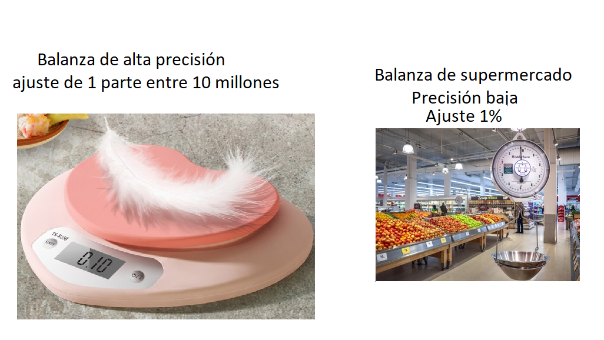
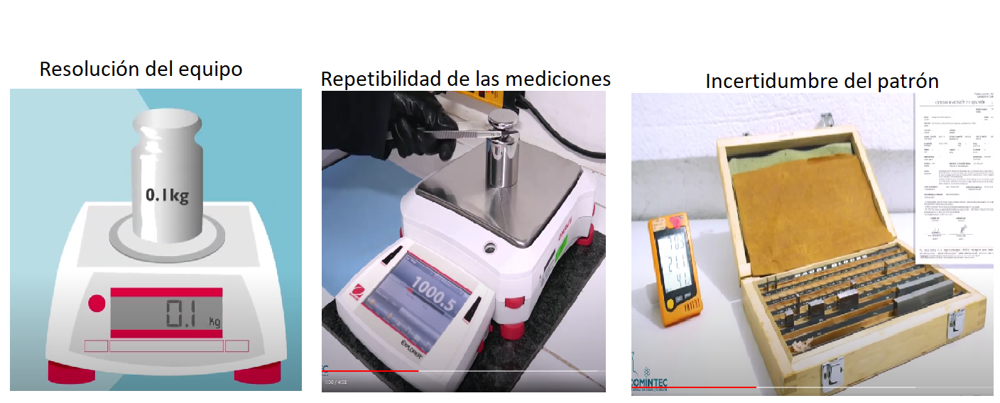
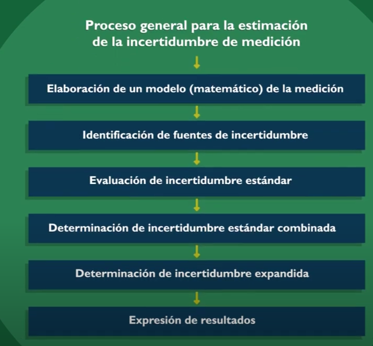

# Fundamentos de medición 

```{r out.width="40%", fig.align='center', echo=FALSE}
knitr::include_graphics("imagen/metro.png")
```

## ¿cómo identificar y reducir la incertidumbre?


La ciencia **estadística** busca reducir el error, resultante de una estimación con su valor verdadero, con el objeto de tener valoraciones confiables para diferentes áreas de estudio como, por ejemplo:

- En economía predecir con exactitud el precio futuro de una divisa o acción

- Predecir la temperatura de un día

- Obtener una estimación fiable de niveles traza de contaminantes alimentarios como el mercurio en el pescado

- En el campo de la medicina tener la precisión en las mediciones de la presión arterial reduce el riesgo de diagnósticos erróneos


En la vida cotidiana se realizan muchas mediciones, como por ejemplo:

- El tiempo que debemos hervir un huevo

- El límite máximo de velocidad 

- El peso del equipaje permitido en un avión 


~~~
Una medición cuidadosa puede significar, por ejemplo, que una teoría aceptada necesita revisión o que se requiere un nuevo diseño en algún componente crítico de una aeronave.
~~~

La ciencia de la **metrología** se ocupa de mantener y aumentar la precisión de las mediciones, en cualquier campo,

- las mediciones precisas garantizan la confiabilidad de los procesos, sin embargo la precisión depende del contexto

```{r fig.asp=0.5, fig.align='center', echo=FALSE}

```


## ¿Cómo medir la incertidumbre de una medida?##

El resultado de una medición suele ser un número expresado como múltiplo de una unidad de medida. Entre ellas tenemos:

- El peso en kilogramos

- La temperatura en grados centígrados

- La longitud en milímetros

- La velocidad en kilómetros por hora

En algunos casos el valor es independiente de la unidad, esto sucede cuando una cantidad se define como una relación entre otras dos cantidades, las cuales pueden medirse en términos de la misma unidad. Por ejemplo, el coeficiente de fricción estática, μs, se define como la relación de dos fuerzas y, por tanto, μs es un número adimensional; para vidrio sobre vidrio, μs ≃ 0,94.


Para la cuantificación de las medidas la organización internacional de estandarización (ISO International Standardisation Organisation) creo la guia para la expresión de la incertidumbre de las medidas. **(GUM)**, actualizada en el año 1995.

**Sistema internacional de medida (SI)** 
Para comunicar los resultados de las mediciones de manera efectiva y eficiente, los científicos e ingenieros acoron el sistema internacional de medidas SI, este sistema es integral, aceptado y adoptado internacionalmente, coherente y cómodo de usar y revisado  periódicamente. 

|Cantidad|   Unidad|Simbolo|Definición |
|:------ |:-------:|:-----:|----------	|
| Masa   |Kilogramo|  kg   |El kilogramo es igual a la masa del prototipo internacional del kilogramo, hecho de una aleación de platino e iridio y se conserva en condiciones ambientales cuidadosamente controladas cerca de París.|
| Tiempo |Segundo  |s    	|   El segundo es la duración de 9.192.631.770 períodos de radiación correspondientes a la transición entre los dos niveles hiperfinos del estado fundamental del átomo de cesio-133.	    	|
|Longitud	|Metro|m     	|El metro es la longitud del camino recorrido por la luz en el vacío. durante un intervalo de tiempo de 1/299792458 de segundo|
| Temperatura termodinamica|Kelvin|k|El kelvin es la fracción 1/273,16 de la temperatura termodinámica del punto triple del agua|
|Corriente electrica|Amperio|A|El amperio es la corriente que se genera si se ubican dos conductores a un metro de distancia, de forma paralela, rectilíneos, de longitud infinita, de sección despreciable, produciría entre estos c una fuerza de $2×10^{−7}$ newton por metro de longitud|
|Intensidad luminosa|Candela|sd|La candela es la intensidad luminosa, en una dirección determinada, de una fuente que emite radiación monocromática de frecuencia 540×1012 hercios y que tiene una intensidad radiante en esa dirección de 1/683 vatio por teradián|
|Cantidad de sustancia|mole|mol|El mol es la cantidad de sustancia de un sistema que contiene como tantas entidades elementales como átomos hay en 0,012 kilogramo de carbono 12.|

Existen otras medidas derivadas de las anteriores.

**Ejemplo**
Muestre que la unidad derivada de N/m , la cual es la medida de la tensión sobre una superficie puede ser expresada como $kg*s^{-2}$

$$\frac{N}{m}=\frac{kg*m*s^{-2}}{m}=kg*s^{-2}$$

También existen los **prefijos**, que expresan con abreviaturas cantidades muy pequeñas o muy grandes
**Ejemplo**
$$3.4*10^{-3} A$$
podría escribirse como  3.4mA

**Ejercicio**
1. Escriba la medida con las unidades de cantidad  base

|$F/m$       |$W/m^2$      |$J/m^3$|$J/K$        |$\Omega*m$|
|:----------:|:-----------:|:-----:|:-----------:|:--------:|
|$\Omega/m^2$|$W/(m^2·K^4)$| $N*m$ |$C^2/(N·m^2)$|$N/A^2$   |


2. Escriba las siguientes cantidades con los prefijos

- $6.4 × 10^{−5} m^2/s$

- $7.5 × 10^8\Omega$ 

- $1.8 × 10^{10} Pa$

- $ 3.5 × 10^5 \Omega*m$

## Redondeo y cifras significativas

Se ha medido una distancia como 1,1451 m, se consideran suficientes  3 cifras significativas, cual es el valor al que se debe redondear?

1.14 ó 1.15?
cual es mas cercano?

Cuando se realizan mediciones, ¿cuántas cifras se deben informar? Los instrumentos modernos son capaces de mostrar valores de muchas cifras. Como ejemplo, un multímetro digital?

Aveces es prudente registrar todas las cifras proporcionadas por un instrumento, en muchos casos todas las cifras carecen de significado.

**Reglas**
En ausencia de una declaración explícita sobre la incertidumbre de un valor cotizado, la incertidumbre aproximada de un valor se puede estimar como la mitad del rango posible de valores con un decimal adicional que sean todos consistentes, después del redondeo, con el valor cotizado.

Supongamos que una distancia, d, se indica como 25,1 m. Esto implica una distancia posible en cualquier lugar del intervalo aproximado de 25,05 ma 25,15 m. Este intervalo comprende un número infinito de valores, todos los cuales (excepto el primero y el último, siguiendo el consejo de redondeo anterior) se “redondearían” a los 25,1 m citados y, por lo tanto, son consistentes con 25,1 m. El intervalo que contiene estos valores es (25,15 − 25,05)m=
0,10 metros. La mitad de este intervalo es de 0,05 m. Entonces inferimos del valor citado de la distancia d = 25,1 m que la incertidumbre es de 0,05 m. La incertidumbre proporcional es entonces 0,05/25,1 o aproximadamente cinco partes en 2500 o 0,2%.


## Vocabulario internacional de metrología VIM

**Mensurando:** Cantidad destinada a la medida. (VIM)


**Incertidumbre**: Diferentes autores han dado diferentes definiciones de este concepto


**Definicion 1** Parámetro asociado al resultado de una medición que caracteriza la dispersión de los valores que podrían razonablemente ser atribuidos al mensurando, (ISP, 2010)


**Incertidumbre de la medición:** Parámetro no negativo que caracteriza la dispersión de los valores que se atribuyen a una mensurando, basándose en la información utilizada. (VIM, JCGM 200:2008)

Nota: La incertidumbre de medición comprende muchos componentes. Algunos pueden ser evaluados por el tipo de distribución estadística de los valores de las mediciones, como promedios y desviaciones.


**Tipos de incertidumbre**

**Incertidumbre típica o estándar $u$**
Obtenida a partir de las incertidumbres típicas individuales asociadas a la magnitud de entrada de un modelo de medición (Shmid W y lazos R, 2000) Algunos ejemplos son

```{r fig.asp=0.9, fig.align='center', echo=FALSE}

```
Dependiendo del origen de los datos la incertidumbre típica se clasifica en 

Tipo A: Es una evaluación de un componente de la incertidumbre de medida mediante un analisis estadístico de los datos 


Tipo B: La evaluación no resulta de una serie de mediciones, si no mediante la bibliografia, como evaluación del material de referencia, certificado de calibración, reportes de la deriva de los instrumentos ó ficha técnica del instrumento 

**Incertidumbre combinada $u_c$**
Resultado de la combinación de las constribuciones de todas las fuentes de incertidumbre 

**Incertidumbre expandida $U$**
Se obtiene multiplicando la incertidumbre típica combinada  por un factor de cobertura k, generalmente es con un valor de 2 que garantiza al menos el 95% de confianza del resultado


<iframe width="280" height="160" src="https://www.youtube.com/embed/-Zp1V8YJHgg" title="¿Qué es la INCERTIDUMBRE METROLÓGICA?" frameborder="0" allow="accelerometer; autoplay; clipboard-write; encrypted-media; gyroscope; picture-in-picture; web-share" allowfullscreen></iframe>


```{r fig.asp=0.9, fig.align='center', echo=FALSE}

```


**Bibliografia**

1. Validación de métodos y determinación de la incertidumbre de la medición: “Aspectos generales sobre la validación de métodos”, Instituto de salud publica de Chile, 2010. 

2. Shmid W y lazos R. (2000) Guia para estimar la incertidumbre en la medición. centro nacional de metrología.

KIRKUP L., FRENKEL R. B., AN INTRODUCTION TO UNCERTAINTY IN MEASUREMENT USING THE GUM (GUIDE TO THE EXPRESSION OF UNCERTAINTY IN MEASUREMENT), Cambridge University Press New York, 2006.

Lira I., Evaluating the Measurement Uncertainty Fundamentals and Practical Guidance, IOP Publishing Ltd, 2002.

Patrick F.D., Measurement and Data Analysis for Engineering and Science, CRC Press, 2010.

Rabinovich G.S., Measurement Errors and Uncertainties Theory and Practice, Springer Science and Media, Inc, 2005.

Willink R., MEASUREMENT UNCERTAINTY AND PROBABILITY, Springer Science and Media, Cambridge University Press New York, 2013.

Joint Committee for Guides in Metrology (JCGM), Evaluation of measurement data — Guide to the expression of uncertainty in measurement, 100:2008. 

Joint Committee for Guides in Metrology (JCGM), Evaluation of measurement data — Supplement using a Monte Carlo method, 101:2008.

Joint Committee for Guides in Metrology (JCGM), International vocabulary of metrology – Basic and general concepts and associated terms (VIM), 200:2012.

Maroto A., Incertidumbre en métodos analíticos de rutina, Tarragona. 2002.

Cárdenas J.J., Metodología para la determinación de la incertidumbre asociada a la medición en fuentes fijas usando la guía para la expresión de la incertidumbre de medida y un método estocástico, Medellín. 2018.


