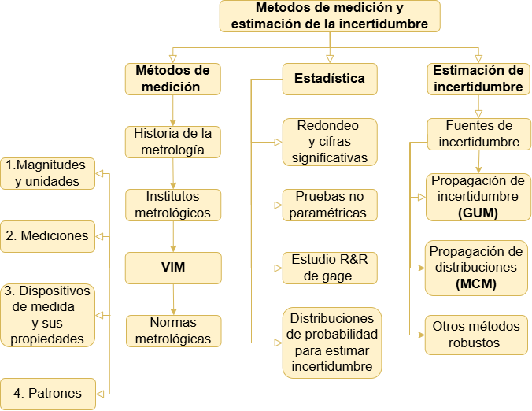

```{r out.width="40%", fig.align='center', echo=FALSE}
knitr::include_graphics("imagen/metro.png")
```


```{r out.width="50%", fig.align='center', echo=FALSE}

```


## Métodos de medición

<a href="intro.html" target="_blank">Fundamentos de la medición</a>

<a href="vim.html" target="_blank">Vocabulario internacional de metrología</a>

<a href="incer.html" target="_blank">Definiciones metrológicas</a>


## Estadística

<a href="redon.html" target="_blank">Redondeo</a>

<a href="pruebas_no_paramétricas.html" target="_blank">Pruebas no parámetricas</a>

<a href="RYR.html" target="_blank">Estudio reproducibilidad y repetibilidad gageR&R</a>

<a href="distris.html" target="_blank">Distribuciones de probabilidad estadísticas usadas para la estimación de incertidumbre</a>


## Incertidumbre


<a href="gum.html" target="_blank">Estimación de incertidumbre</a>

<a href="coefsensi.html" target="_blank">coeficientes de sensibilidad</a>

<a href="GUM2.html" target="_blank">GUM</a>

<a href="mcm2.html" target="_blank">Monte carlo2</a>


## Bibliografía

1. Validación de métodos y determinación de la incertidumbre de la medición: “Aspectos generales sobre la validación de métodos”, Instituto de salud publica de Chile, 2010. 

2. Shmid W y lazos R. (2000) Guia para estimar la incertidumbre en la medición. centro nacional de metrología.

3. KIRKUP L., FRENKEL R. B., AN INTRODUCTION TO UNCERTAINTY IN MEASUREMENT USING THE GUM (GUIDE TO THE EXPRESSION OF UNCERTAINTY IN MEASUREMENT), Cambridge University Press New York, 2006.

4. Lira I., Evaluating the Measurement Uncertainty Fundamentals and Practical Guidance, IOP Publishing Ltd, 2002.

5. Metrologos, A. (2005). Institución Apasionada por la Metrología Métodos de: Medición, Prueba y Calibración Laboratorios de Calibración: Somos su Relevo a la Calidad. www.metas.com.mx

6. Patrick F.D., Measurement and Data Analysis for Engineering and Science, CRC Press, 2010.

7. Rabinovich G.S., Measurement Errors and Uncertainties Theory and Practice, Springer Science and Media, Inc, 2005.

8. Willink R., MEASUREMENT UNCERTAINTY AND PROBABILITY, Springer Science and Media, Cambridge University Press New York, 2013.

9. Joint Committee for Guides in Metrology (JCGM), Evaluation of measurement data — Guide to the expression of uncertainty in measurement, 100:2008. 

10. Joint Committee for Guides in Metrology (JCGM), Evaluation of measurement data — Supplement using a Monte Carlo method, 101:2008.

11. Joint Committee for Guides in Metrology (JCGM), International vocabulary of metrology – Basic and general concepts and associated terms (VIM), 200:2012.

12. Maroto A., Incertidumbre en métodos analíticos de rutina, Tarragona. 2002.

13. Cárdenas J.J., Metodología para la determinación de la incertidumbre asociada a la medición en fuentes fijas usando la guía para la expresión de la incertidumbre de medida y un método estocástico, Medellín. 2018.

