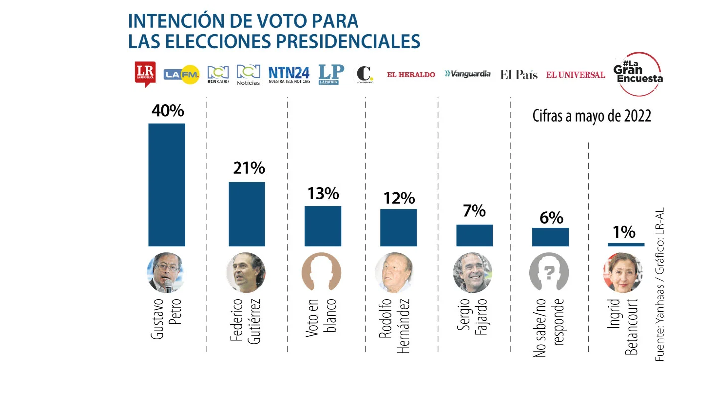

```{r echo=F, out.height=300, out.width=350 }
knitr::include_graphics("imagen/muestreo.png")
```

# Definiciones

**Población:** conjunto de elementos sobre los que queremos hacer afirmaciones.

**Muestra:** subconjunto de la población que se extrae para ser estudiado

**Parámetro:** número derivado del estudio de una variable estadística de toda una población.

**Estadístico:** Medida de resumen numérica que se calcula a partir de la muestra


**Unidad de observación:** Objeto sobre el cual se realiza una medición. En poblaciones humanas las unidades de observación son los humanos.

**Unidad de muestreo:** Unidad donde realizamos el muestreo

**Marco de muestreo:** Lista de las unidades de muestreo

 Las familias sirven como unidades de muestreo y las unidades
de observación son los individuos que viven en una familia.


**Inferencia estadística**

Es una rama de la estadística, que a través de métodos y muestras realiza inferencias o generalizaciones de una población.

El muestreo se realiza para obtener información acerca de los parámetros desconocidos de la población, por medio de un experimento que permite observar o medir las características de la población, de las cuáles se tiene incertidumbre.


```{r echo=F, out.height=350, out.width=500}
knitr::include_graphics("imagen/mmm.png")
```


**Por qué una muestra**

Imposibilidad o costo excesivo de realizar un censo en que se mide toda la población

## Objetivos del muestreo 

- Describir la muestra: Estadística Descriptiva

- Obtener conclusiones de la población a partir de la muestra: Inferencia Estadística.


**Cómo elegir el tamaño de la muestra**

Algunos Criterios Generales son;

- ¿Qué se va a medir?

- ¿Qué se quiere determinar? 

- Nivel máximo de error admisible.

- Nivel de confianza con qué se quiere obtener la estimación del tamaño muestral

- Variabilidad de las características a medir

 
Se dice que las variables aleatorias $X_1, X_2, . . . , X_n$ forman una muestra aleatoria simple de tamaño n si:

1. Las $X_i$ son variables aleatorias independientes.

2. Cada $X_i$ tiene la misma distribución de probabilidad, en la mayoría de veces se asume normal.

3. Cualquier función de las variables aleatorias que forman una muestra se llaman estadístico .
 
Es decir las $X_i$ son independientes e idénticamente distribuidas (iid) $$𝑋_𝑖\sim  N(0,\sigma ^2)$$


# Tamaños de muestra

## Para la media


  <iframe width="280" height="158" src="https://www.youtube.com/embed/JX5m7o6rOAQ" frameborder="0" allow="accelerometer; autoplay; encrypted-media; gyroscope; picture-in-picture" allowfullscreen></iframe>
 </div>


#### Para la proporción

  <iframe width="280" height="158" src="https://www.youtube.com/embed/4G2kKHX5O8U" frameborder="0" allow="accelerometer; autoplay; encrypted-media; gyroscope; picture-in-picture" allowfullscreen></iframe>

# Tipos de muestreo

```{r echo=F, out.height=350, out.width=500}
knitr::include_graphics("imagen/mues.png")
```


## Muestreo no-Probabilístico

1.Se basa en el juicio personal del investigador. 

2.Puede generar buenas muestras pero no permite una evaluación estadística de confianza. 

3. Frecuentemente usado como primera aproximación 

Algunos de este tipo de muestreo son:

- Muestreo por conveniencia  
- Muestreo por cuotas 
- Muestreo tipo “bola de nieve” (snowball) 

### Muestreo por Conveniencia 

Los elementos de la muestra se eligen por estar en el lugar o en el momento adecuado para la investigación. El criterio de selección (lugar, tiempo y demás) es completamente dependiente del investigador, sin reglas predeterminadas. 

Ejemplos: 

- Encuestas en la calle

- Encuestas a estudiantes 

- Encuestas web


```{r echo=F, out.height=300, out.width=500}
knitr::include_graphics("imagen/mj.png")
```


### Muestreo por cuotas

Permite dividir la población en grupos o estratos que comparten características  como el sexo, la edad, los estudios, etc., y de ellos se selecciona una muestra proporcional y representativa. 

Por ejemplo: en una empresa grande quieren saber cuáles son los hobbies preferidos por sus empleados. Como son tantas personas, deciden dividirlas en dos estratos, por género: hombres y mujeres.

Las mujeres representan el 40 % de los empleados y los hombres el 60 %, por lo tanto, el investigador decide que en la muestra se incluirán 40 mujeres y 60 hombres para tener un total de 100 individuos en el estudio. Así, asegura que la participación de cada género es proporcional a la población que representan. A esos porcentajes elegidos se les llama cuotas.


```{r echo=F, out.height=300, out.width=400}
knitr::include_graphics("imagen/mc.png")
```

###  Muestreo bola de nieve

Se selecciona un grupo inicial, los nuevos encuestados se seleccionan en base a las referencias de los encuestados anteriores, explotando sus “redes sociales”,es útil si el tamaño de la muestra es pequeño y no está disponible fácilmente.esta técnica ayuda a los investigadores a encontrar muestras cuando son difíciles de localizar.  

Muy utilizado en ciencias sociales, cuando la característica a estudiar es rara o escasa y cuando es difícil conseguir encuestados.

Por ejemplo: si  un investigador está buscando personas con cierta enfermedad, contacta a uno o dos individuos que presenten dicha condición médica y que ellos mismos sean quienes te recomienden a otros individuos con una historia médica parecida.


```{r echo=F, out.height=300, out.width=500}
knitr::include_graphics("imagen/mb.png")
```


## Muestreo probabilístico

Se controla la probabilidad de seleccionar un determinado individuo, permite estudiar objetivamente la confianza de las generalizaciones hacia la población objetivo. 


Algunos de este tipo de muestreo son:


### Muestreo aleatorio simple 
Cada elemento del marco muestral tiene la misma probabilidad de ser seleccionado y cada elemento se selecciona de manera independiente de los otros.

Con reemplazo: se pueden repetir elementos
Sin reemplazo: no se pueden repetir elementos
Se indexa a la población y luego se elige un índice de manera aleatoria hasta completar el tamaño deseado de la muestra.

Muestreo sistemático 
Muestreo estratificado 
Muestreo por grupos

```{r echo=F, out.height=250, out.width=500}
knitr::include_graphics("imagen/bingo.png")
```

### Muestreo aleatorio estratificado 

Antes de seleccionar los elementos, se agrupa la población muestral en estratos de acuerdo a una variable importante: edad, género, ocupación.

Objetivo: reducir la variabilidad que se puede observar dentro de cada estrato

Dentro de cada estrato se puede proceder con muestreo simple.

```{r echo=F, out.height=250, out.width=500}
knitr::include_graphics("imagen/estrato.png")
```

### Muestreo por conglomerados

El método de muestreo por conglomerados se utiliza cuando la población está agrupada naturalmente.

Si se supone que los conglomerados son muestra significativa de la variable que se está estudiando, se puede seleccionar algunos grupos al azar (todos los conglomerados deben tener las mismas probabilidades de ser seleccionados) y utilizarlos en representación de la población.


En la práctica, el conglomerado más utilizado es el geográfico. Si queremos hacer un estudio en un país, podemos dividir el país en conglomerados como las comunidades, provincias, ciudades

```{r echo=F, out.height=250, out.width=500}
knitr::include_graphics("imagen/conglomerados.png")
```


### Muestreo sistemático

Se utiliza en muestras ordenadas del 1 al N.
Supongamos que tenemos una población de N individuos ordenados del 1 al N. Queremos seleccionar una muestra de tamaño n.
Sea k el entero más próximo a N/n.
Escogemos al azar un número i entre 1 y k (utilizando los números aleatorios, sacar una bola de un bombo, etc.).
La muestra será el elemento i y los elementos i+k, i+2k, etc. Es decir, el elemento k y los elementos a intervalos fijos k hasta conseguir los n sujetos:

```{r echo=F, out.height=250, out.width=500}
knitr::include_graphics("imagen/sistema.png")
```

**Ejemplo**
Se quiere saber la opinión sobre un profesor de una clase de 60 personas. Dichas personas están ordenadas por orden alfabético en la lista de alumnos de clase. Para realizar la encuesta, seleccionamos a 12 personas. Por lo tanto, N=60 y n=12. El intervalo fijo entre sujetos es:

$$k=N/n     =60/12=5$$
Ahora elegimos al azar un número entre 1 y k=5. Suponemos que nos sale $i=2$. La muestra resultado mediante el muestreo sistemático será:


```{r echo=F, out.height=250, out.width=500}
knitr::include_graphics("imagen/sistema2.png")
```


**Ejemplo**

```{r echo=F, out.height=250, out.width=500}

```

**Ficha técnica de la encuesta**

|Item |Respuesta|
|---------|-----|
|**Persona natural o jurídica que la realizó:**| YanHaas S.A Incrito ante el consejo nacional electoral|
|**Encomendada y financiada por:**| Alinza de medios; RCN y periódicos asociados    |
|**Temas a los que se refiere:**|Intención de voto para las elecciones presidenciales 2022|
|**Universo poblacional:**|Personas 18 años en adelante que manifiestan interés de votar en las proximas elecciones presidenciales 2022, en las cinco regiones geográficas de estudio: Antioquia-eje cafetero(1), Caribe (2), Bogotá (3), central-Oriente (4) y pacífica (5) |
|**Grupo objetivo**|Hombres y mujeres mayores de 18 años que manifestaron intención de voto en las próximas elecciones presidenciales del año 2022|
|**Sistema de muestreo**|Muestreo aleatorio estratificado por región y tamaño del municipio según censo electoral |
|**Marco muestral:**|Listado de municipios y barrios, viviendas y personas|
|**Tamaño de la muestra:**|1249 encuestas distribuidas en 60 municipios del país|
| **Margen de error observado:**|3.2%|
|**Nivel de confianza:**|95%|
