```{r echo=F,fig.align='center', out.width=350 }

```

**Definiciones**


|**Palabra**|**Definición**|
|-------|-----------------|
|**Inferencia estadística**|Es una rama de la estadística, que a través de métodos y muestras realiza inferencias o generalizaciones de una población.|
|**Población**|Conjunto de elementos sobre los que queremos hacer afirmaciones|
|**Muestra**|subconjunto de la población que se extrae para ser estudiado|
|**Parámetro**|Número derivado del estudio de una variable estadística de toda una población.|
|**Estadístico**|Medida de resumen numérica que se calcula a partir de la muestra|
|**Unidad de observación** |Objeto sobre el cual se realiza una medición. En poblaciones humanas las unidades de observación son los humanos|
|**Unidad de muestreo**|Unidad donde realizamos el muestreo,Las familias sirven como unidades de muestreo y las unidades de observación son los individuos que viven en una familia.|
|**Marco de muestreo**|Lista de las unidades de muestreo|


El muestreo se realiza para obtener información acerca de los parámetros desconocidos de la población, por medio de un experimento que permite observar o medir las características de la población, de las cuáles se tiene incertidumbre.


```{r echo=F, out.height=250, out.width=500, fig.align='center'}
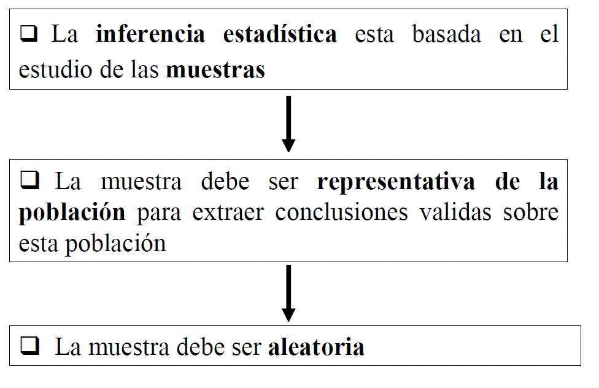
```


<iframe width="280" height="160" src="https://www.youtube.com/embed/4Nu0Lpo8nAM?list=PLYqPCyWfFHmbVTdxBk4AXnIApU1EwlMus" title="🔍👉 ¿QUÉ ES MUESTREO EN ESTADÍSTICA? / IMPORTANCIA del MUESTREO &amp; PARA QUÉ SIRVE el MUESTREO 👍" frameborder="0" allow="accelerometer; autoplay; clipboard-write; encrypted-media; gyroscope; picture-in-picture; web-share" referrerpolicy="strict-origin-when-cross-origin" allowfullscreen></iframe>
# Muestreo

**Por qué una muestra**

Imposibilidad o costo excesivo de realizar un censo en que se mide toda la población

**Objetivos del muestreo **

- Describir la muestra: Estadística Descriptiva

- Obtener conclusiones de la población a partir de la muestra: Inferencia Estadística.


**Cómo elegir el tamaño de la muestra**

Algunos Criterios Generales son;

- ¿Qué se va a medir?

- ¿Qué se quiere determinar? 

- Nivel máximo de error admisible.

- Nivel de confianza con qué se quiere obtener la estimación del tamaño muestral

- Variabilidad de las características a medir


**Teorema**


________________________________________________________________________________________________________
 
Se dice que las variables aleatorias $X_1, X_2, . . . , X_n$ forman una muestra aleatoria simple de tamaño n si:

1. Las $X_i$ son variables aleatorias independientes.

2. Cada $X_i$ tiene la misma distribución de probabilidad, en la mayoría de veces se asume normal.

3. Cualquier función de las variables aleatorias que forman una muestra se llaman estadístico .
 
Es decir las $X_i$ son independientes e idénticamente distribuidas (iid) $$𝑋_i\sim  N(0,\sigma ^2)$$


________________________________________________________________________________________________________


**Aspectos necesarios**


|Nivel de confianza NC |Nivel de significancia $\alpha$.|
|:------------------|:---------------------|
|Probabilidad máxima con la que podríamos asegurar que el parámetro a estimar se encuentra dentro de nuestro intervalo estimado|Es la probabilidad máxima que asumimos de forma voluntaria de equivocarnos al rechazar la hipótesis nula cuando en realidad es cierta|
|Representa el porcentaje de intervalos que tomados de 100 muestras independientes distintas contienen en realidad el valor desconocido.|Máximo error que se comete en la estimación|


$$\Large NC+\alpha=1$$
Si se construyen 100 intervalos de la forma $\hat \theta_{inf}<\theta<\hat \theta_{sup}$ con un NC=0.97 entonces se espera que 97 de los 100 intervalos contengan el parámetro $\theta$


```{r echo=F, out.height=250, out.width=350, fig.align='center'}
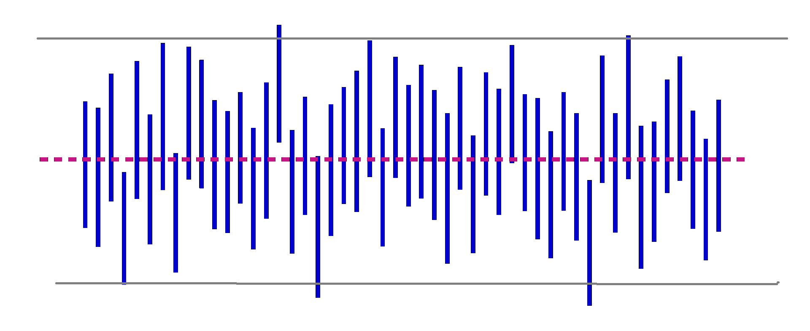
```


```{r echo=F, out.height=250, out.width=350,  fig.align='center'}
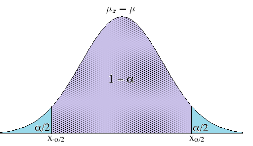
```


$$\Huge NC+\alpha=100\% $$

|NC |NS $\alpha$|$Z_\alpha$| $\alpha/2$|$Z_{\alpha/2}$|
|:-:|:---------:|:--------:|:---------:|--------------|
|90%|10%        |          |         5%|              |
|95%| 5%        |          |     2.5%  |              |
|99%|1%         |          |   0.05%   |              |


## Tamaños de muestra

### Para la media

**Video**

  <iframe width="280" height="158" src="https://www.youtube.com/embed/JX5m7o6rOAQ" frameborder="0" allow="accelerometer; autoplay; encrypted-media; gyroscope; picture-in-picture" allowfullscreen></iframe>
 </div>


|Población finita|Población infinita|
|:--------------:|:----------------:|
|$$\Large n= \frac{N*Z_{\alpha/2}^2*\sigma^2}{(N-1)e^2 + Z_{\alpha/2}^2\sigma^2}$$|$$\Large n=\frac{Z_{\alpha/2}^2\sigma ^2}{e^2}$$|
El error puede considerarse como

$$e=(e\%)\bar x$$


**Ejemplo población infinita**

Se desea estimar el contenido medio de un refresco con un nivel de confianza del 93%, con un error máximo de estimación de 5 ml. Muestras previas indican que la desviación del contenido es 12 ml. Calcular el tamaño de muestra.

NC=0.93

$\alpha=0.07$

$\alpha/2=0.035$

$Z_{\alpha/2}=1.81$

$\sigma=12 ml$

$e=5 ml$


$$\Large n=\frac{Z_{\alpha/2}^2\sigma ^2}{e^2}$$


Se deben hacer mediciones en 19 refrescos.

### Para la proporción

|Población finita|Población infinita|
|:--------------:|:----------------:|
|$$\Large n= \frac{NZ_{\alpha/2}^2pq}{(N-1)e^2 +Z_{\alpha/2}^2pq}$$|$$\Large n=\frac{Z_{\alpha/2}^2pq}{e^2}$$|


**Video**

  <iframe width="280" height="158" src="https://www.youtube.com/embed/4G2kKHX5O8U" frameborder="0" allow="accelerometer; autoplay; encrypted-media; gyroscope; picture-in-picture" allowfullscreen></iframe>


**Ejemplo población infinita**

Se desea estimar con un nivel de confianza del 97%, el porcentaje de clientes que compraría un nuevo producto, para esto se toma una muestra previa de 80 clientes, de los cuales 65 manifestarían que compraría el nuevo producto. Si se desea un error máximo de estimación del 6%. calcule el tamaño de muestra.


NC=0.97

$\alpha=0.03$

$\alpha/2=0.015$

$Z_{\alpha/2}=2.17$

$p=\frac{65}{80}\approx 0.8$

q=0.2 

$e=0.06$


$$\Large n=\frac{Z^2pq}{e^2}$$

$$\Large n=\frac{2.17^2*0.8*0.2}{0.06^2}\approx 210$$
Se deben encuestar 210 personas para conocer sus preferencias sobre la compra o no del producto.


### Tipos de muestreo


```{r echo=F, out.height=350, out.width=500, fig.align='center'}
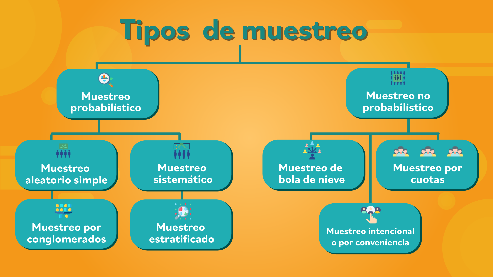
```


<iframe width="280" height="160" src="https://www.youtube.com/embed/o3FlcVm6D_I?list=PLYqPCyWfFHmbVTdxBk4AXnIApU1EwlMus" title="🔍👉 TIPOS de MUESTREO PROBABILÍSTICO y NO PROBABILÍSTICO / TIPOS de MUESTREO 👍" frameborder="0" allow="accelerometer; autoplay; clipboard-write; encrypted-media; gyroscope; picture-in-picture; web-share" referrerpolicy="strict-origin-when-cross-origin" allowfullscreen></iframe>


### Muestreo no-Probabilístico


1.Se basa en el juicio personal del investigador. 

2.Puede generar buenas muestras pero no permite una evaluación estadística de confianza. 

3. Frecuentemente usado como primera aproximación 

Algunos de este tipo de muestreo son:

- Muestreo por conveniencia  
- Muestreo por cuotas 
- Muestreo tipo “bola de nieve” (snowball) 

**Muestreo por Conveniencia **

Los elementos de la muestra se eligen por estar en el lugar o en el momento adecuado para la investigación. El criterio de selección (lugar, tiempo y demás) es completamente dependiente del investigador, sin reglas predeterminadas. 

Ejemplos: 

- Encuestas en la calle

- Encuestas a estudiantes 

- Encuestas web


```{r echo=F, out.height=300, out.width=500, fig.align='center'}
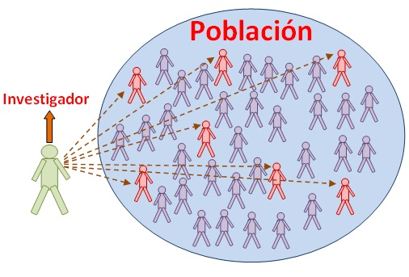
```

<iframe width="280" height="160" src="https://www.youtube.com/embed/yW9DARfzBeA" title="🔍👉 MUESTREO por CONVENIENCIA &amp; MUESTREO POR CONVENIENCIA EJEMPLOS + VENTAJAS Y DESVENTAJAS" frameborder="0" allow="accelerometer; autoplay; clipboard-write; encrypted-media; gyroscope; picture-in-picture; web-share" referrerpolicy="strict-origin-when-cross-origin" allowfullscreen></iframe>


**Muestreo por cuotas o estratos**

Permite dividir la población en grupos o estratos que comparten características  como el sexo, la edad, los estudios, etc., y de ellos se selecciona una muestra proporcional y representativa. 

Por ejemplo: en una empresa grande quieren saber cuáles son los hobbies preferidos por sus empleados. Como son tantas personas, deciden dividirlas en dos estratos, por género: hombres y mujeres.

Las mujeres representan el 40 % de los empleados y los hombres el 60 %, por lo tanto, el investigador decide que en la muestra se incluirán 40 mujeres y 60 hombres para tener un total de 100 individuos en el estudio. Así, asegura que la participación de cada género es proporcional a la población que representan. A esos porcentajes elegidos se les llama cuotas.


```{r echo=F, out.height=300, out.width=400, fig.align='center'}

```

**Muestreo bola de nieve**

Se selecciona un grupo inicial, los nuevos encuestados se seleccionan en base a las referencias de los encuestados anteriores, explotando sus “redes sociales”,es útil si el tamaño de la muestra es pequeño y no está disponible fácilmente.esta técnica ayuda a los investigadores a encontrar muestras cuando son difíciles de localizar.  

Muy utilizado en ciencias sociales, cuando la característica a estudiar es rara o escasa y cuando es difícil conseguir encuestados.

Por ejemplo: si  un investigador está buscando personas con cierta enfermedad, contacta a uno o dos individuos que presenten dicha condición médica y que ellos mismos sean quienes te recomienden a otros individuos con una historia médica parecida.


```{r echo=F, out.height=300, out.width=500, fig.align='center'}
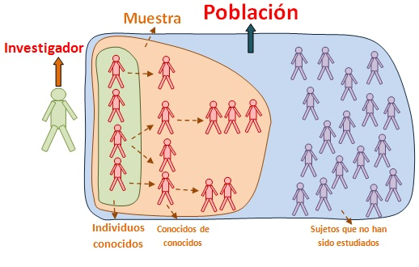
```


### Muestreo probabilístico

Se controla la probabilidad de seleccionar un determinado individuo, permite estudiar objetivamente la confianza de las generalizaciones hacia la población objetivo. 


Algunos de este tipo de muestreo son:


**Muestreo aleatorio simple** 


Cada elemento del marco muestral tiene la misma probabilidad de ser seleccionado y cada elemento se selecciona de manera independiente de los otros.

Con reemplazo: se pueden repetir elementos
Sin reemplazo: no se pueden repetir elementos
Se indexa a la población y luego se elige un índice de manera aleatoria hasta completar el tamaño deseado de la muestra.

Muestreo sistemático 
Muestreo estratificado 
Muestreo por grupos

```{r echo=F, out.height=250, out.width=500, fig.align='center'}

```

**Muestreo aleatorio estratificado**

Antes de seleccionar los elementos, se agrupa la población muestral en estratos de acuerdo a una variable importante: edad, género, ocupación.

Objetivo: reducir la variabilidad que se puede observar dentro de cada estrato

Dentro de cada estrato se puede proceder con muestreo simple.


Los individuos de un estrato tienen unas características propias que los diferencian de los otros estratos. Por lo tanto, un individuo solo puede estar en un único estrato.


```{r echo=F, out.height=250, out.width=500, fig.align='center'}
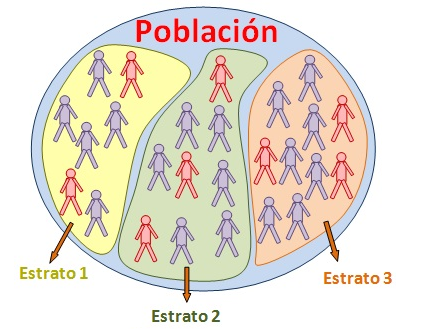
```


### Afijación

Es el proceso de distribuir el tamaño total de la muestra n entre los diferentes estratos de una población en el muestreo aleatorio estratificado. 

Busca optimizar la representatividad según el tamaño (afijación proporcional) o la varianza (afijación de Neyman/óptima) de cada estrato, asegurando estimaciones más precisas.

La distribución de unidades muestrales en cada estrato depende de diversos factores, pero hay tres de ellos que son fundamentales:

- La importancia o peso de los estratos $W_h$.

- La variabilidad de la variable de estudio S en cada estrato.

- Los costos de muestrear una unidad en el estrato h.

**Métodos principales de afijación:**

**Afijación óptima**: tiene en cuenta los costos de la investigación, costos unitarios. 
Se usa cuando las varianzas son altas. Cuanto mayor sea la varianza mayor será la proporcion de unidades que se deben tomar del estrato h.


<iframe width="280" height="160" src="https://www.youtube.com/embed/GTCFoTK_OYo" title="🔍👉 #6 AFIJACIÓN ÓPTIMA / MUESTREO ESTRATIFICADO EJEMPLOS / MUESTREO ESTRATIFICADO 👍" frameborder="0" allow="accelerometer; autoplay; clipboard-write; encrypted-media; gyroscope; picture-in-picture; web-share" referrerpolicy="strict-origin-when-cross-origin" allowfullscreen></iframe>

**Afijación Uniforme:** Asigna el mismo número de elementos a cada estrato, independientemente de su tamaño poblacional.

**Afijación Proporcional:** La muestra se distribuye según el peso de cada estrato en la población. Si un estrato representa el 46% de la población, recibirá el 46% de la muestra total, la fórmula es:


|tamaño|media|proporción|
|:----:|:---:|:--------:|
||$$n=\frac{NZ_{\alpha/2}^2\sum W_h S_h^2}{NE^2+Z_{\alpha/2}^2\sum W_h S_h^2}$$|$$n=\frac{NZ_{\alpha/2}^2\sum W_h P_h Q_h} {NE^2+Z_{\alpha/2}^2\sum  W_h P_h Q_h}$$|


**Ejemplo para la media**

Se requiere estimar un tamaño de muestra estratificado de neyman por facultad (estrato), para realizar un estudio acerca de la edad promedio de los estudiantes

|Facultad   |conteo|%($W_h$)|$\bar x$ edad piloto|s piloto|$W_h*s^2$|muestra|
|:---------:|:----:|:------:|:------------------:|:------:|:-------:|:-----:|
|Artes      |2865  |10.2    |25.2                |6.8     | 4.71    |12|
|Económicas |11962 |42.5    |   27.1             |7.2     |   22.03 |48|
|exactas    |3225  |11.5    |    23.9            |6.6     | 0.76    |13|
|Ingenierías|10096 |35.8    |     23.8           |6.6     | 2.36    |41|
|   total   |28148 |100     |   25.4             |7       | 29.86   |114|


sea el error admisible E: 1 año

Nivel de confianza 95%: $Z_{\alpha/2}=1.96$

$$n=\frac{NZ_{\alpha/2}^2\sum W_h S_h^2}{NE^2+Z_{\alpha/2}^2\sum W_h S_h^2}$$

$$n=\frac{(28148)(1.96^2)(29.86)}{(28148)(1^2)+1.96^2(29.86)}=114$$
**Para la media**

<div style="text-align: center;">
<iframe 
width="280" 
height="160" 
src="https://www.youtube.com/embed/PmFVVqlKGng" 
frameborder="0" 
allow="accelerometer;autoplay;clipboard-write;encrypted-media;gyroscope; picture-in-picture; web-share" referrerpolicy="strict-origin-when-cross-origin" 
allowfullscreen>>
</iframe>

**Para la proporción**

<div style="display: flex; justify-content: center;">
  <iframe width="280" height="160" 
    src="https://www.youtube.com/embed/GYRDGXaYGRA" 
    title="🔍👉 #5 AFIJACIÓN PROPORCIONAL / MUESTREO ESTRATIFICADO EJEMPLOS / MUESTREO ESTRATIFICADO 👍" 
    frameborder="0" 
    allow="accelerometer; autoplay; clipboard-write; encrypted-media; gyroscope; picture-in-picture; web-share" 
    referrerpolicy="strict-origin-when-cross-origin" 
    allowfullscreen>
  </iframe>
</div>


**Afijación de Neyman:** Distribuye la muestra maximizando la precisión (minimizando la varianza) para un tamaño de muestra dado. Asigna más unidades a los estratos con mayor variabilidad (S)  y mayor tamaño N.
busca estimar el tamaño de muestra de manera independiente entre cada uno de los estratos.

|Parametro|Media|proporcion|
|:-------:|:---:|:--------:|
|estimador|$$n_o=\frac{W_h S_h^2}{\left(\frac{E_h}{z_h}\right)^2}$$|$$n_o=\frac{W_h P_h Q_h}{\left(\frac{E_h}{z_h}\right)^2}$$|
|corrección|$$n_h=\frac{n_o}{1+\frac{n_o}{N_h}}$$|$$n_h=\frac{n_o}{1+\frac{n_o}{N_h}}$$||||


<iframe width="280" height="160" src="https://www.youtube.com/embed/l7dagrCzoGA" title="🔍👉 #7 AFIJACIÓN de NEYMAN / MUESTREO ESTRATIFICADO EJEMPLOS / MUESTREO ESTRATIFICADO 👍" frameborder="0" allow="accelerometer; autoplay; clipboard-write; encrypted-media; gyroscope; picture-in-picture; web-share" referrerpolicy="strict-origin-when-cross-origin" allowfullscreen></iframe>

**Ejemplo para la proporción**

Se requiere estimar un tamaño de muestra estratificado de neyman, para saber que proporción de estudiantes usan transporte público (p) por facultad:

|Facultad   |conteo|W %   |p%  |q%|tamaño |
|:---------:|:----:|:----:|:-:|:-:|:-----:|
|Artes      |2865  |0.102 |0.4|0.6|   9   |
|Económicas |11962 |0.425 |0.5|0.5|      |
|exactas    |3225  |0.115 |0.3|0.7|      |
|Ingenierías|10096 |0.358 |0.6|0.4|      |
|   total   |28148 |100   |   |   |      |


$$n_o=\frac{W_h P_h Q_h}{\left(\frac{E_h}{z_h}\right)^2}=\frac{0.102*0.4*0.6}{\left(\frac{0.1}{1.96}\right)^2}=9.4 $$


$$n_h=\frac{n_o}{1+\frac{n_o}{N_h}}=\frac{9.4}{1+\frac{9.4}{2865}}=9$$


$$n_h=\frac{n_o}{1+\frac{n_o}{N_h}}$$

**Ejemplo para la media**

Se requiere estimar un tamaño de muestra estratificado de neyman por facultad (estrato), para realizar un estudio acerca de la edad promedio de los estudiantes

|Facultad   |conteo|%($W_h$)|$\bar x$ edad piloto|s piloto|tamaño|
|:---------:|:----:|:------:|:------------------:|:------:|:----:|
|Artes      |2865  |10.2    |25.2                |6.8     |11    |
|Económicas |11962 |42.5    |   27.1             |7.2     |      |
|exactas    |3225  |11.5    |    23.9            |6.6     |      |
|Ingenierías|10096 |35.8    |     23.8           |6.6     |      |
|   total   |28148 |100     |   25.4             |7       |      |


________________________________________________________________________________________________________


**Artes**

|Parametro|valor|
|:-|:-|:-|:-|
|Nivel de confianza|95%  |||
|Nivel de significancia$\alpha$|5%||   |
|$\alpha$/2        |2.5% |||
|$Z_{\alpha/2}$    |1.96 |||
|e%                |5%   |||
|$E=(e\%)*\bar x$  |5%*25.2=1.26|||

$$n_a=\frac{W_h S_h^2}{\left(\frac{E_h}{z_h}\right)^2}=\frac{0.102*6.8^2}{\left(\frac{1.26}{1.96}\right)^2}=11.4$$
$$n_h=\frac{n_o}{1+\frac{n_o}{N_h}}=\frac{11.4}{1+\frac{11.4}{2865}}=11$$


### Muestreo por conglomerados

El método de muestreo por conglomerados se utiliza cuando la población está agrupada naturalmente.

Si se supone que los conglomerados son muestra significativa de la variable que se está estudiando, se puede seleccionar algunos grupos al azar (todos los conglomerados deben tener las mismas probabilidades de ser seleccionados) y utilizarlos en representación de la población.


En la práctica, el conglomerado más utilizado es el geográfico. Si queremos hacer un estudio en un país, podemos dividir el país en conglomerados como las comunidades, provincias, ciudades

```{r echo=F, out.height=250, out.width=500,fig.align='center'}
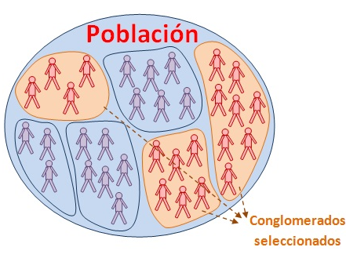
```

**Diferencia entre el muestreo por conglomerados y estratos**

```{r echo=F, out.height=250, out.width=500, fig.align='center'}
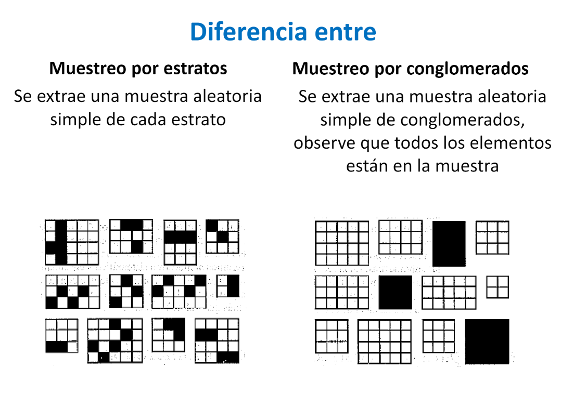
```

### Muestreo sistemático

Se utiliza en muestras ordenadas del 1 al N.
Supongamos que tenemos una población de N individuos ordenados del 1 al N. Queremos seleccionar una muestra de tamaño n.
Sea k el entero más próximo a N/n.
Escogemos al azar un número i entre 1 y k (utilizando los números aleatorios, sacar una bola de un bombo, etc.).
La muestra será el elemento i y los elementos i+k, i+2k, etc. Es decir, el elemento k y los elementos a intervalos fijos k hasta conseguir los n sujetos:

```{r echo=F, out.height=250, out.width=500, fig.align='center'}
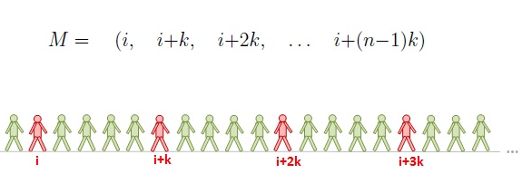
```

**Ejemplo**
Se quiere saber la opinión sobre un profesor de una clase de 60 personas. Dichas personas están ordenadas por orden alfabético en la lista de alumnos de clase. Para realizar la encuesta, seleccionamos a 12 personas. Por lo tanto, N=60 y n=12. El intervalo fijo entre sujetos es:

$$k=N/n     =60/12=5$$
Ahora elegimos al azar un número entre 1 y k=5. Suponemos que nos sale $i=2$. La muestra resultado mediante el muestreo sistemático será:


```{r echo=F, out.height=250, out.width=500, fig.align='center'}
knitr::include_graphics("imagen/sistema2.png")
```


**Ejemplo**

```{r echo=F, out.height=250, out.width=500,fig.align='center'}
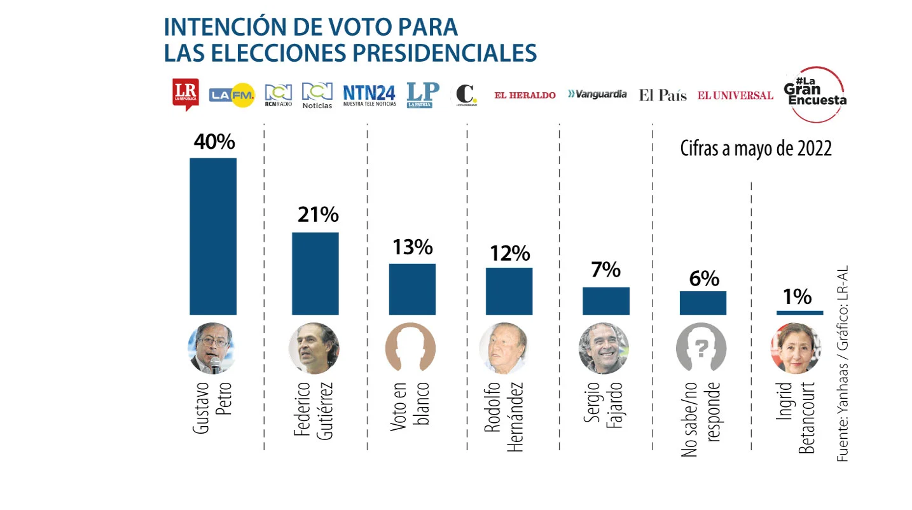
```

**Ficha técnica de la encuesta**

<iframe 
  width="280" 
  height="160" 
  src="https://www.youtube.com/embed/E9JqtQv1AHA?list=PLYqPCyWfFHmbVTdxBk4AXnIApU1EwlMus"
  title="FICHA TÉCNICA de INVESTIGACIÓN. INVESTIGACIÓN DE MERCADOS – MARKETING"
  frameborder="0"
  allow="accelerometer; autoplay; clipboard-write; encrypted-media; gyroscope; picture-in-picture; web-share"
  referrerpolicy="strict-origin-when-cross-origin"
  allowfullscreen
  style="display: block; margin: 0 auto;">
</iframe>

|Item|Respuesta|
|------|---------|
|**Persona jurídica que realizó la encuesta:**| YanHaas S.A Incrito ante el consejo nacional electoral|
|**Encomendada y financiada por:**| Alianza de medios; RCN y periódicos asociados    |
|**Tipo de estudio/ Investigación** |Exploratorio /Cuantitativo|
|**Temas a los que se refiere:**|Intención de voto para las elecciones presidenciales 2022|
|**Universo poblacional:**|Potencial de sufragantes 9.583.254, en las cinco regiones geográficas de estudio: Antioquia-eje cafetero(1), Caribe (2), Bogotá (3), central-Oriente (4) y pacífica (5) |
|**Grupo objetivo**|Hombres y mujeres mayores de 18 años que manifestaron intención de voto en las próximas elecciones presidenciales del año 2022|
|**Sistema de muestreo**|Muestreo aleatorio estratificado por región y tamaño del municipio según censo electoral |
|**Técnica de muestreo**|Entrevista personal cara a cara en hogares|
|**Marco muestral:**|Censo electoral colombiano discriminado por municipios|
|**Elemento muestral**|Persona mayor de edad,  residente de las principales regiones de colombia, que manifestaron intención de voto|
|**Tamaño de la muestra:**|1249 encuestas distribuidas en 60 municipios del país|
| **Margen de error observado:**|3.2%|
|**Nivel de confianza:**|95%|

### Ejercicios 

**Tamaños de muestra para la media**
1. Un biólogo quiere estimar el peso promedio de los ciervos cazados en el estado de Maryland. Un estudio anterior de diez ciervos cazados mostró que la desviación estándar de sus pesos es de 12.2 libras. ¿Qué tan grande debe ser una muestra para que el biólogo tenga el 95% de confianza de que el error de estimación es a lo más de 4 libras?

Rta/ Si el tamaño de la muestra es 36, se puede tener un 95% de confianza en que $\mu $ difiere en menos de 4 libras de $\bar x$ .

2. Una empresa eléctrica fabrica focos que tienen una duración aproximadamente normal con una desviación estándar de 40 horas. ¿De qué tamaño se necesita una muestra si se desea tener 96% de confianza que la media real esté dentro de 10 horas de la media real?

Rta/ Se necesita una muestra de 68 focos para estimar la media de la población y tener un error máximo de 10 horas.

3. Qué pasaría si en lugar de tener un error de estimación de 10 horas sólo se requiere un error de 5 horas?


Rta/ Se puede observar como el tamaño de la muestra aumenta, pero esto tiene como beneficio una estimación más exacta.

**Tamaños de muestra para la proporción**

1. En una muestra aleatoria de 500 familias que tienen televisores en la ciudad de Hamilton, Canadá, se encuentra que 340 están suscritas a HBO. ¿Qué tan grande se requiere que sea una muestra si se quiere tener 95% de confianza de que la estimación de P esté dentro de 0.02?

Rta/ Si basamos nuestra estimación de P sobre una muestra aleatoria de tamaño 2090, se puede tener una confianza de 95% de que nuestra proporción muestral no diferirá de la proporción real por más de 0.02.

2. Una legisladora estatal desea encuestar a los residentes de su distrito para conocer qué proporción del electorado conoce la opinión de ella, respecto al uso de fondos estatales para pagar abortos. ¿Qué tamaño de muestra se necesita si se requiere un confianza del 95% y un error máximo de estimación de 0.10?

Rta/ Se requiere un tamaño de muestra de 97 residentes para que con una confianza del 95% la estimación tenga un error máximo de 0.10.

3. Se planea realizar un estudio de tiempos para estimar el tiempo medio de un trabajo, exacto dentro de 4 segundos y con una probabilidad de 0.90, para terminar un trabajo de montaje. Si la experiencia previa sugiere que $\sigma= 16 seg$. mide la variación en el tiempo de montaje entre un trabajador y otro al realizar una sola operación de montaje, ¿cuántos operarios habrá que incluir en la muestra? Rta/n=44

4. Un ingeniero de control de calidad quiere estimar la fracción de elementos defectuosos en un gran lote de lámparas. Por la experiencia, cree que la fracción real de defectuosos tendría que andar alrededor de 0.2. ¿Qué tan grande tendría que seleccionar la muestra si se quiere estimar la fracción real, exacta dentro de 0.01, utilizando un nivel de confianza fe 95%? rta/6147

