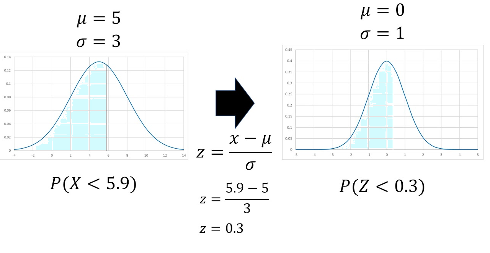

Una distribución ampliamente usada y la más importante de toda la estadística,diversas poblaciones y fenómenos numéricos son representados por esta distribución por ejemplo

- Errores de medición en experimentos científicos

- Mediciones antropométricas

- Tiempos de reacción en experimentos psicológicos

- Mediciones de inteligencia y aptitud 


### Función de distribución de probabilidad

Esta distribución depende de los parámetros de localización y escala, determinados por la media $E(X)=\mu$ y la desviación estándar $sd = \sigma$,

El valor de $\sigma$ es la distancia desde $\mu$ hasta los puntos de inflexión de la curva (los puntos donde la curva cambia de concavidad de hacia abajo a hacia arriba).

```{r echo=FALSE}

knitr::include_app("  https://jtrochezg.shinyapps.io/apppoison/",height = "800px")

```

La función de distribución de probabilidad está dada por:

$$f(x)=\frac{1}{\sqrt{2\pi}\sigma}e^{-\frac{(x-\mu)^2}{2\sigma^2}} $$
Con $-\infty<\mu<\infty$ y $\sigma>0$

Si una variable se distribuye normal se denota de la forma:

$$x \sim N(\mu, \sigma^2)$$

Si la distribución de la población de una variable es (aproximadamente) normal, entonces

1. Aproximadamente 68% de los valores están dentro de 1 DE de la media.

$$P(\mu-\sigma\leq x \leq \mu+\sigma)=68.27\%$$

2. Aproximadamente 95% de los valores están dentro de 2 DE de la media.
$$P(\mu-2\sigma\leq x \leq \mu+2\sigma)=95.45\%$$

3. Aproximadamente 99.7% de los valores están dentro de 3 DE de la media.

$$P(\mu-2\sigma\leq x \leq \mu+2\sigma)=99.73\%$$


```{r echo=F,fig.align='center', fig.width=12, fig.height=18,fig.asp=6}
knitr::include_graphics("imagen/n2.png")
```


### Distribución normal estándar
Una variable aleatoria normal con $\mu=0$ y $\sigma=1$, es llamada una variable aleatoria normal estándar y se denota como z.
$$Z \sim N(0,1)$$
###   Función de distribución de probabilidad acumulada

$$\Phi(x)=P(Z \leq x)=F(x)$$


```{r}

x<-seq(-5,5,0.1)
hist <- dnorm(x, mean=0, sd=1) 
plot(x, hist, type="l", xlab="X", ylab="Densidad",
     ylim=c(0,0.5),xlim=c(-5,5),main="Grafico de Densidad \
     Distribución normal estándar", lty = 1, lwd = 3, yaxs="i") 
polygon(c(x[x <= 1],1), c(dnorm(x[x <= 1]), 0), col="lightblue")
prob <- pnorm(1, 0,1)
text(0, .1,bquote("Prob:" ~ .(round(prob, 4))))
 

```


### ¿Cómo estandarizar una variable aleatoria?
Suponga x es una variable aleatoria normal con media $\mu$ y varianza $\sigma^2$, para estandarizar la variable se debe usar la formula:


$$z=\frac{x-\mu}{\sigma}$$


```{r echo=F,fig.align='center', fig.width=12, fig.height=18,fig.asp=6}

```


lkfdla


```{r}
par(mfrow=c(1,2))


library(latex2exp)

x<-seq(-5,15,0.1)
hist <- dnorm(x, mean=5, sd=3) 
plot(x, hist, type="l", xlab="X", ylab="Densidad",
     ylim=c(0,0.2),xlim=c(-5,15),
     main=TeX('$P(X \\leq 5.6)$'),lty = 1, lwd = 3, yaxs="i") 
mtext(TeX('$\\mu=5$, $\\sigma=3$'), side = 3)
polygon(c(x[x <= 5.6],5.6), c(dnorm(x[x <= 5.6],mean=5, sd=3),0), 
        col="lightblue")
prob <- pnorm(5.6, mean=5, sd=3)
text(3.5,0.15,bquote("Prob:" ~ .(round(prob, 4))))


hist <- dnorm(x, mean=0, sd=1) 
plot(x, hist, type="l", xlab="X", ylab="Densidad",
     ylim=c(0,0.5),xlim=c(-5,5),
     main=TeX('$P(X \\leq 0.3)$'),lty = 1, lwd = 3, yaxs="i") 
mtext(TeX('$\\mu=0$, $\\sigma=1$'), side = 3)
     polygon(c(x[x <= 0.3],0.3), c(dnorm(x[x <= 0.3]), 0), col="lightblue")
prob <- pnorm(0.3, 0,1)
text(0, .1,bquote("Prob:" ~ .(round(prob, 4))))

```

Cualquier distribución Normal se puede convertir a una distribución Normal Estándar


### Tabla de la distribución normal

#### Estructura de la normal


```{r echo=F,fig.align='center', fig.width=12, fig.height=18,fig.asp=6}
knitr::include_graphics("imagen/tn.png")
```


#### Ejemplo 1

```{r}
x<-seq(-5,5,0.1)
hist <- dnorm(x, mean=0, sd=1) 
plot(x, hist, type="l", xlab="X", ylab="Densidad",
     ylim=c(0,0.5),xlim=c(-5,5),main="P(Z<=-0.86)", 
     lty = 1, lwd = 3, yaxs="i") 
polygon(c(x[x <= -0.86],-0.86), c(dnorm(x[x <= -0.86]), -0.86), col="lightblue")
prob <- pnorm(-0.86, 0,1)
text(-2,0.13,bquote("Prob:" ~ .(round(prob, 4))))

```


```{r echo=F,fig.align='center', fig.width=12, fig.height=18,fig.asp=6}
knitr::include_graphics("imagen/tn2.png")
```


### Teorema del límite central

Cuando la distribución subyacente es discreta, la curva normal es una buena aproximación. Además, aun cuando las variables individuales no estén normalmente distribuidas, las sumas y promedios de las variables en condiciones adecuadas tendrán de manera aproximada una distribución normal

### Aproximaciones 

### videos

*Distribución normal*

<iframe width="280" height="160" src="https://www.youtube.com/embed/3mikDVlYiok" frameborder="0" allow="accelerometer; autoplay; encrypted-media; gyroscope; picture-in-picture" allowfullscreen></iframe>

<iframe width="280" height="160" src="https://www.youtube.com/embed/tFlKqPVfVU8" frameborder="0" allow="accelerometer; autoplay; encrypted-media; gyroscope; picture-in-picture" allowfullscreen></iframe>

