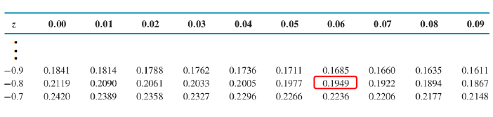
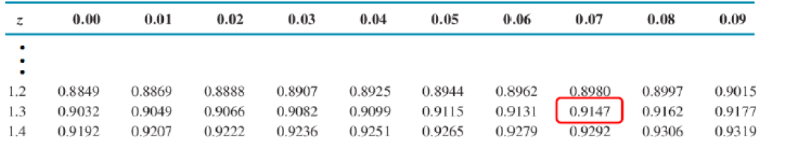
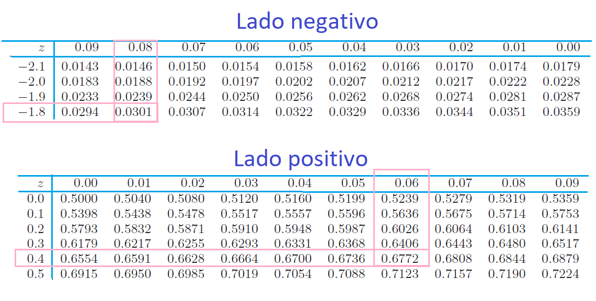

# Distribución normal

Una distribución ampliamente usada y la más importante de toda la estadística, diversas poblaciones y fenómenos numéricos son representados por esta distribución por ejemplo

- Errores de medición en experimentos científicos

- Mediciones antropométricas

- Tiempos de reacción en experimentos psicológicos

- Mediciones de inteligencia y aptitud 


## Función de distribución de probabilidad

Esta distribución depende de los parámetros de localización y escala, determinados por la media $E(X)=\mu$ y la desviación estándar $sd = \sigma$,

El valor de $\sigma$ es la distancia desde $\mu$ hasta los puntos de inflexión de la curva (los puntos donde la curva cambia de concavidad de hacia abajo a hacia arriba).

La función de distribución de probabilidad está dada por:

$$\LARGE f(x)=\frac{1}{\sqrt{2\pi}\sigma}e^{-\frac{(x-\mu)^2}{2\sigma^2}} $$
Con $-\infty<\mu<\infty$ y $\sigma>0$

Si una variable se distribuye normal se denota de la forma:

$$\LARGE x \sim N(\mu, \sigma^2)$$

Si la distribución de la población de una variable es (aproximadamente) normal, entonces

1. Aproximadamente 68% de los valores están dentro de 1 DE (desviación estándar) de la media.

$$\LARGE P(\mu-\sigma\leq x \leq \mu+\sigma)=68.27\%$$

2. Aproximadamente 95% de los valores están dentro de 2 DE de la media.
$$\LARGE P(\mu-2\sigma\leq x \leq \mu+2\sigma)=95.45\%$$

3. Aproximadamente 99.7% de los valores están dentro de 3 DE de la media.

$$\LARGE P(\mu-2\sigma\leq x \leq \mu+2\sigma)=99.73\%$$


```{r echo=F, out.height=500, out.width=500 }
knitr::include_graphics("imagen/n2.png")
```


**Aplicativo de distribuciones de probabilidad continuas**

```{r echo=FALSE}

knitr::include_app("https://amgq828.shinyapps.io/appcontinuas/",height = "1000px")

```


### Distribución normal estándar

Una variable aleatoria normal con $\mu=0$ y $\sigma=1$, es llamada una variable aleatoria normal estándar y se denota como z.

$$\LARGE Z \sim N(0,1)$$
### Función de distribución de probabilidad acumulada

$$\LARGE \Phi(x)=P(Z \leq x)=F(x)$$


```{r echo=FALSE}
library(latex2exp)

x<-seq(-5,5,0.1)
hist <- dnorm(x, mean=0, sd=1) 
plot(x, hist, type="l", xlab="X", ylab="Densidad",
     ylim=c(0,0.5),xlim=c(-5,5),main="Grafico de Densidad \
          Distribución normal estándar", lty = 1, lwd = 3, yaxs="i") 
mtext(TeX('$P(Z\\leq 1)$'), side = 3)
polygon(c(x[x <= 1],1), c(dnorm(x[x <= 1]), 0), col="lightblue")
prob <- pnorm(1, 0,1)
text(0, .1,bquote("Prob:" ~ .(round(prob, 4))))
 

```


### ¿Cómo estandarizar una variable aleatoria?
Suponga x es una variable aleatoria normal con media $\mu$ y varianza $\sigma^2$, para estandarizar la variable se debe usar la formula:


$$\LARGE z=\frac{x-\mu}{\sigma}$$

Cualquier distribución Normal se puede convertir a una distribución Normal Estándar

**Ejemplo 1**

Se desea estandarizar una variable aleatoria con valor x=5.9, media $\mu=5$ y desviación estándar $sd=0.3$.

$$\LARGE z=\frac{5.9-5}{0.3}=?$$

```{r echo=F}
par(mfrow=c(1,2))
library(latex2exp)

x<-seq(-5,15,0.1)
hist <- dnorm(x, mean=5, sd=3) 
plot(x, hist, type="l", xlab="X", ylab="Densidad",
     ylim=c(0,0.2),xlim=c(-5,15),
     main=expression(paste(P(X <= 5.9))),lty = 1, lwd = 3, yaxs="i") 
mtext(TeX('$\\mu=5$, $\\sigma=3$'), side = 3)
polygon(c(x[x <= 5.9],5.9), c(dnorm(x[x <= 5.9],mean=5, sd=3),0), 
        col="lightblue")
prob <- pnorm(5.9, mean=5, sd=3)
text(3.5,0.15,bquote("Prob:" ~ .(round(prob, 4))))


hist <- dnorm(x, mean=0, sd=1) 
plot(x, hist, type="l", xlab="X", ylab="Densidad",
     ylim=c(0,0.5),xlim=c(-5,5),
      main=expression(paste(P(z <= 0.3))),lty = 1, lwd = 3, yaxs="i")
mtext(TeX('$\\mu=0$, $\\sigma=1$'), side = 3)
     polygon(c(x[x <= 0.3],0.3), c(dnorm(x[x <= 0.3]), 0), col="lightblue")
prob <- pnorm(0.3, 0,1)
text(0, .45,bquote("Prob:" ~ .(round(prob, 4))))

```


### Tabla de la distribución normal

**Estructura de la normal**

```{r echo=F,out.height=400, out.width=500}
knitr::include_graphics("imagen/tn.png")
```


**Ejemplo 2**

```{r echo=FALSE}
library(latex2exp)
x<-seq(-5,5,0.1)
hist <- dnorm(x, mean=0, sd=1) 
plot(x, hist, type="l", xlab="X", ylab="Densidad",
     ylim=c(0,0.5),xlim=c(-5,5),
     main=expression(paste(P(z <= -0.86))),lty = 1, lwd = 3, yaxs="i")
    polygon(c(x[x <= -0.86],-0.86), c(dnorm(x[x <= -0.86]), -0.86), col="lightblue")
prob <- pnorm(-0.86, 0,1)
text(-2,0.13,bquote("Prob:" ~ .(round(prob, 4))))
```

En la tabla buscar en el lado negativo:
$$P(Z\leq -0.86)=0.1949$$
```{r echo=F, out.height=150, out.width=500}

```


**Ejemplo 3**

$$P(Z\leq 1.37)=0.9147$$
```{r echo=FALSE}

normal_area <- function(mean = 0, sd = 1, lb, ub, acolor = "lightgray", ...) {
  x <- seq(mean - 3 * sd, mean + 3 * sd, length = 100) 
  
  if (missing(lb)) {
    lb <- min(x)
  }
  if (missing(ub)) {
    ub <- max(x)
  }
  
  x2 <- seq(lb, ub, length = 100)    
  plot(x, dnorm(x, mean, sd), type = "n", ylab = "")
  
  y <- dnorm(x2, mean, sd)
  polygon(c(lb, x2, ub), c(0, y, 0), col = acolor)
  lines(x, dnorm(x, mean, sd), type = "l", ...)
}


normal_area(mean = 0, sd = 1, lb = -3, ub = 1.37,
            acolor = rgb(0, 0, 1, alpha = 0.5))

```

En la tabla buscar en el lado positivo:
$$P(Z\leq 1.37)=0.9147$$
```{r echo=F, out.height=150, out.width=500}

```


**Ejemplo 4** 
$$P(-1.25\leq Z\leq 0.37)$$

```{r echo=F}
normal_area(mean = 0, sd = 1, lb = -1.25, ub = 0.37,
            acolor = rgb(0, 0, 1, alpha = 0.5))
text(995, 0.01, "53.87%", srt = 90)
```
$$P(Z\leq 0.37)-P(Z\leq -1.25)=0.6443-0.1056=0.5387$$

```{r echo=F, out.height=150, out.width=500}
knitr::include_graphics("imagen/tn4.png")
```


**Ejemplo 5** 

$$P(Z>1.55)=1-P(z\leq 1.55)=1-0.9334=0.0666$$

```{r echo=F}

normal_area(mean = 0, sd = 1, lb = 1.55, lwd = 2,
            acolor = rgb(0, 0, 1, alpha = 0.5))
```


```{r echo=F, out.height=150, out.width=500}
knitr::include_graphics("imagen/tn5.png")
```

**Ejemplo 6** 

$$P(-1.88<Z<0.46)=P(z\leq 0.46)-P(z \leq -1.88)=0.6772-0.0301$$

```{r echo=F}
normal_area(mean = 0, sd = 1, lb = -1.88, ub = 0.46,
            acolor = rgb(0, 0, 1, alpha = 0.5))
text(995, 0.01, "34.13%", srt = 90)
```

```{r echo=F, out.height=200, out.width=500}

```

**Ejemplo 7** 
La cantidad de café que vierte una máquina en jarras de 4 onzas varía de una jarra a otra, se puede fijar como una variable aleatoria que tiene una distribución normal con σ = 0,04 onzas.

a. ¿Cuál es la probabilidad de que el contenido de una de las jarras este entre 3.5 y 4.5 onzas?

b. Si sólo el 2% de las jarras va a contener menos de 4 onzas de café. ¿Cuál debe ser el contenido medio de estas jarras? Sol: μ = 4,082 onzas.

**Ejercicios** 
$$\phi(c)=0.9838$$
$$p(0\leq z \leq c)=0.291$$
$$p(-c \leq z \leq c)=0.668$$


**Ejemplo 8** 
Suponga que la fuerza que actúa en una columna que ayuda a soportar un edificio está normalmente distribuida con media de 15 0 kips y desviación estándar de 1 25 kips ¿ Cuál es la probabilidad de que la fuerza

a.sea de más de 18 kips
b. esté entre 10 y 12 kips
c. Difiera de 15.0 kips en cuando mucho 1.5 desviaciones estándar

### Teorema del límite central

Si se toman muestras cada vez más grandes de cualquier población, entonces la media de la distribución muestral,$\bar x$ tiende a acercarse cada vez más a la verdadera media de la población $\mu$.


**Aplicativo de distribuciones de probabilidad discretas**

```{r echo=FALSE}

knitr::include_app("https://jtrochezg.shinyapps.io/apppoison/",height = "1000px")

```

**Teorema del límite central:**

Sean $Y_1, Y_2, . . . , Y_n$ variables aleatorias independientes y distribuidas idénticamente con $E(Yi)=\mu$ y $V(Y_i)=\sigma^2$


Definamos


Un =
n
i=1 Yi −nm
s√n
=
Y −m
s/√n
donde Y =
1
n
n
i=1
Yi .
Entonces la función de distribución de Un converge hacia la función de distribución normal estándar cuando n S q. Esto es,
lím n S q
P(Un ≤u) =
u
−q
1
√2p
e−t2/2 dt para toda u.

### Aproximaciones 

Cuando la distribución subyacente es discreta, la curva normal es una buena aproximación. Además, aun cuando las variables individuales no estén normalmente distribuidas, las sumas y promedios de las variables en condiciones adecuadas tendrán de manera aproximada una distribución normal.


### videos

*Distribución normal*

<iframe width="280" height="160" src="https://www.youtube.com/embed/3mikDVlYiok" frameborder="0" allow="accelerometer; autoplay; encrypted-media; gyroscope; picture-in-picture" allowfullscreen></iframe>

<iframe width="280" height="160" src="https://www.youtube.com/embed/tFlKqPVfVU8" frameborder="0" allow="accelerometer; autoplay; encrypted-media; gyroscope; picture-in-picture" allowfullscreen></iframe>

### Taller

1) Hallar el área bajo la curva normal tipificada:
a) Entre Z = 0 y Z = 1,2 Sol: 0,3849
b) Entre Z = 0,81 y Z = 1,94 Sol: 0,1828
c) A la derecha de Z = -1,28 Sol: 0,8997

2) Si "área" se refiere al área bajo la curva normal tipificada, hallar el valor o los valores de Z tales que:
a) El área entre 0 y Z sea 0,3770 Sol: Z = ±1,16
b) El área a la izquierda de Z sea 0,8621 Sol: Z = 1,09
c) El área entre -1,5 y Z sea 0,0217 Sol: Z = -1,69 y Z = -1,35


3) El peso medio de 500 estudiantes varones de una universidad es de 68,5 Kg. y la desviación típica es de 10 Kg. Suponiendo que los pesos están distribuidos normalmente, hallar el
número de estudiantes que pesan:
a) Entre 48 y 71 kg. Sol: entre 289 y 290 estudiantes.
b) Más de 91 kg. Sol: entre 6 y 7 estudiantes.

4) La media del diámetro interior del conjunto de lavadoras producidas por una máquina es 1,275 cm. y la desviación típica de 0,0125 cm. El propósito para el cual se han diseñado las
lavadoras permite una tolerancia máxima en el diámetro de 1,26cm. a 1,29 cm., de otra forma las lavadoras se consideran defectuosas. Determinar el porcentaje de lavadoras defectuosas
producidas por la máquina, suponiendo que los diámetros están distribuidos normalmente. Sol: 23,02%

5) Si X está distribuida normalmente con media 5 y desviación típica 2, hallar P (X > 8). Sol: 0,0668

6) Se tiene un programador de entrenamiento diseñado para mejorar la calidad de las habilidades de los supervisores de la línea de producción. Debido a que el programa es auto
administrativo, los supervisores requieren un número diferente de horas para terminarlo. Un estudio de los participantes anteriores indica que el tiempo medio que se lleva completar el
programa es de 500 h. y que esta variable aleatoria normalmente distribuida tiene una desviación estándar de 100 h.

a) ¿Cuál es la probabilidad de que un participante elegido al azar requiera más de 500 h. para completar el programa?. Sol: 0,5
b) ¿Cuál es la probabilidad de que un candidato elegido al azar se tome entre 500 h. y 650 h. para completar el programa de entrenamiento?. Sol: 0,4332

c) ¿Cuál es la probabilidad de que un candidato elegido al azar se tome más de 700 h. en completar el programa?. Sol: 0,0228

d) Suponga que el director del programa de entrenamiento desea saber la probabilidad de que un participante escogido al azar requiera entre 550 y 650 h. para completar el trabajo requerido en el programa. ¿Cuánto ha de ser ese valor? Sol: 0,2417

e) ¿Cuál es la probabilidad de que un candidato elegido al azar se tomará menos de 580 h. para completar el programa? Sol; 0,7881

f) ¿Cuál es la probabilidad de que un candidato escogido al azar se tome entre 420h.y 570 h. para completar el programa? Sol: 0,5461
7) Dada una variable con distribución normal de media μ = 40 y desviación estándar σ = 6
encuentre el valor de x que tiene:
a) El 34% del área a la izquierda. Sol: 37,54
b) El 5% del área a la derecha. Sol: 49,87
8) Cierto tipo de pieza para automóvil tiene un promedio de duración de tres años, con una desviación estándar de 0,5 años. Suponga que las duraciones de las piezas están normalmente
distribuidas y encuentre la probabilidad de que una pieza determinada tenga un tiempo de
duración de más de 3,5 años. Sol: 0,1587
9) Una fábrica de alimentos empaca productos cuyos pesos están normalmente distribuidos
con media de 450 gramos y desviación estándar de 20 gramos. Encuentre la probabilidad de
que un paquete escogido al azar pese entre 425 y 486 gramos. Sol: 0,8585

10) En un proceso industrial el diámetro de una arandela es muy importante. El comprador establece en sus especificaciones que el diámetro debe ser de 3,0 ± 0,01 mm. La condición es que no acepta ninguna arandela que se salga de estas especificaciones. Se sabe que en el proceso el diámetro de las arandelas tienen distribución normal con media de 3,0 mm y una desviación estándar de 0,005 mm. ¿Qué porcentaje de arandelas será rechazado?. Sol: 4,56%

11) Determine el área situada debajo de la curva normal estándar que está:
a) A la izquierda de z = 0,94 Sol: 0,8264
b) A la derecha de z = - 0,65 Sol: 0,7422
c) A la derecha de z = 1,76 Sol: 0,0392
d) A la izquierda de z = - 0,85 Sol: 0,1977
e) Entre z = - 0,87 y z = - 1,28 Sol: 0,0919
f) Entre z = - 0,34 y z = 0,62 Sol: 0,3655

12) Determine las probabilidades de que una variable aleatoria tome un valor entre 12 y 15 dado que tenga una distribución normal con:
a) μ = 10 y σ = 5 Sol: 0,1859
b) μ = 20 y σ = 10 Sol: 0,0966

13) Obtenga Z si:
a) El área de la curva normal entre 0 y Z es 0,2019 Sol: Z=±0,53
b) El área de la curva normal a la derecha de Z es 0,8810 Sol: Z=-1,18
c) El área de la curva normal a la derecha de Z es 0,0336 Sol: Z= 1,83
d) El área de la curva normal entre -Z y Z es 0,2662 Sol: Z =±0,34


15) Una empresa fabrica juntas teóricas para el trasbordador espacial de la NASA. Las cuales se han diseñado para sellar conexiones y piezas en el sistema de combustible a fin de impedir fugas. Un tipo de juntas ha de tener 5 centímetros de diámetro para que encaje como es debido; no puede variar arriba o abajo en más de 0,25 cm. sin provocar una fuga peligrosa.
La empresa afirma que esta junta tiene 5 cm. de media con una desviación típica de 0,17 cm. Si estas cifras son correctas y se supone una distribución normal de los diámetros, los
funcionarios de la NASA desean determinar:
a) La proporción de juntas que se adaptarán correctamente. Sol: 0,8584
b) La proporción de juntas que son defectuosas. Sol: 0,1416
c) La probabilidad de que cualquier junta tenga un diámetro superior a 5,3 cm. Sol: 0,0392
d) La probabilidad de que una junta tenga un diámetro comprendido entre 4,9 y 5,2 cm.
 Sol: 0,6034
e) La probabilidad de que una junta elegida al azar tenga un diámetro entre 5,3 y 5,5 cm.  Sol:0,0376


17) Un estudio reciente reveló que el 64% de las mujeres mayores de 18 años, consideran a
la nutrición la prioridad en su vida. Se seleccionó una muestra de 60 mujeres. Determinar la probabilidad de que:

a) 32 o más consideren importante la dieta diaria. Sol: 0,9686
b) 44 o más estimen que la alimentación es esencial. Sol: 0,0853
c) Más de 32 pero menos de 43 consideren importante el aspecto dietético. Sol: 0,8084
d) Exactamente 44 consideren fundamental la alimentación. Sol: 0,0348
18) Supóngase que X tiene una distribución probabilística binomial, con n = 50 y p = 0,25.
Calcule:
a) La media y la desviación estándar de la variable aleatoria. Sol: 12,5 y 3,06
b) La probabilidad de que X valga 15 o más. Sol: 0,2578
c) La probabilidad de que X valga 10 o menos. Sol: 0,2578


