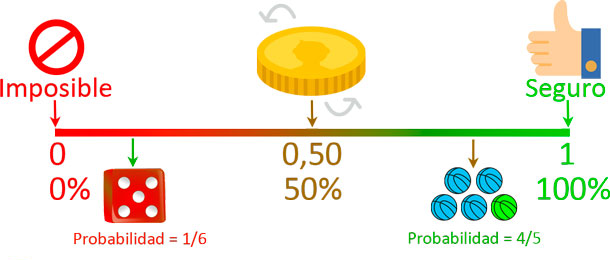
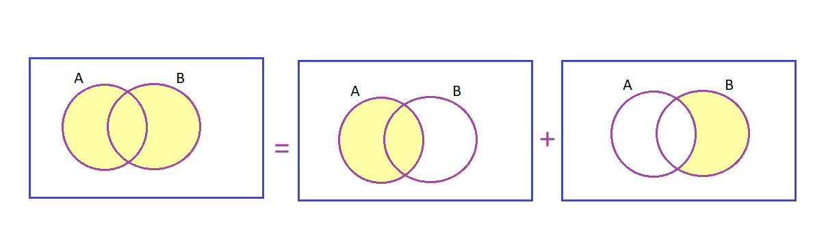

## Conceptos

**Experimento:**  Proceso al azar que produce un resultado sujeto a incertidumbre.

**Espacio muestral (S):**Conjunto de todos los posibles resultados de un experimento.

**Evento:**Subconjunto del espacio muestral, puede ser simple (un solo resultado), compuesto (mas de un resultado).


## Propiedades 

1. Para cualquier evento $0\leq P(A)\leq1$

```{r, echo=F, fig.cap='Probabilidad es un valor entre 0 y 1', fig.asp=0.3, fig.align='center'}

```


2. $P(S)=1$


3. Si $A_1, A_2, A_3 ...A_n$ es un conjunto de eventos mutuamente excluyentes entonces

$$P(A_1 U A_2 U A_3.. U A_n)=\sum_{i=1}^nP(A_i) $$


##  Teoría de conjuntos


```{r, echo=F, fig.cap='Teoría de conjuntos', fig.asp=0.3, fig.align='center'}
knitr::include_graphics("imagen/conjun.png")
```

___________________________________________________________________________________
**Ejemplos clásicos de probabilidad**

**Ejemplo dos monedas**

Se lanzan dos monedas y se observan los resultados posibles, obteniendo el siguiente espacio muestral.

$$S=\{(c,c),(c,s)(s,c)(s,s)\}$$


sea A el evento de obtener al menos una cara

$$A=\{(c,c),(c,s)(s,c)\}$$

sea B el evento de obtener al menos un sello

$$B=\{(s,s),(c,s)(s,c)\}$$
Realice el diagrama de venn

Encuentre la probabilidad de los eventos

$$P(B)=P(A)=\frac{3}{4}$$
____________________________________________________________________________________________________


**Ejemplo de 1 dado**

Sea el espacio muestral comprendido por el resultado de la cara superior de un dado de 6 caras cuando se lanza


$$𝑺 = \{𝟏, 𝟐, 𝟑, 𝟒, 𝟓, 𝟔\}$$

Halle la probabilidad de que caiga una de las caras. 

$$𝑃 (𝐴) =\frac{1}{6}$$

Sea B el evento de obtener un numero primo en la cara superior:

$$B= \{𝟐, 𝟑, 𝟓\}$$

Sea c el evento de obtener un numero par en la cara superior:

$$c= \{𝟐, 4,6\}$$

Sea d el evento de obtener un numero impar en la cara superior:

$$D= \{1,3,5\}$$
Halle la probabilidad de cada uno de los eventos 
$$P(B)=P(C)=P(D)=\frac{3}{6}$$

Grafique el diagrama de ven 


Encuentre el evento asi como su probabilidad
$$B'$$ 
$$CnB$$
$$DnC$$
$$BnCnD$$

$$BUCUD$$

________________________________________________________________________________

## Regla de la adición

$$P(AUB)=P(A)+P(B)-P(A\cap B)$$


```{r, echo=F, fig.cap='Teoría de conjuntos', fig.asp=0.3, fig.align='center'}

```

**Ejemplo 1**

Se aplicó una encuesta a 50 personas sobre el consumo de gaseosas, obteniendo los siguientes resultados

- 20 prefieren coca cola

- 14 prefieren pepsi

- 5 no tienen preferencia por ninguno de ellos


```{r, echo=F, fig.cap='Teoría de conjuntos', fig.asp=0.3, fig.align='center'}
knitr::include_graphics("imagen/ven.png")
```


Halle la probabilidad de:


1. cada uno de los eventos
 
2. Tome por lo menos un refresco 

3. No tome ninguno de los refrescos

4. Cuál es la probabilidad de consumir solo una marca 

$$P(C\cap E')+P(c'\cap E)$$


**Ejemplo 2**


Se hizo una encuesta en la ciudad sobre medio de transporte y se encontró que 70% usan servicios públicos de transporte, 40% usan transporte particular y 30% usan ambos tipos.


Realice el diagrama de venn

Calcular la probabilidad de 

1. Usar solo un tipo de transporte 

2. No usar ninguno de los medios de transporte

3. usar por lo menos un tipo de transporte


**Video**

<iframe width="280" height="160" src="https://www.youtube.com/embed/D21qwSVDLo8" title="Regla de la adición" frameborder="0" allow="accelerometer; autoplay; clipboard-write; encrypted-media; gyroscope; picture-in-picture; web-share" allowfullscreen></iframe>


__________________________________________________________________________________________


## Probabilidad condicional

$P(A|B)$ Probabilidad de que suceda A, **SI** sucedió B


|Probabilidad de A dado B |Probabilidad de B dado A|
|:-----------------------:|:----------------------:|
|$$P(A|B)=\frac{P(A\cap B)}{P(B)}$$ | $$P(B|A)=\frac{P(A\cap B)}{P(A)}$$ |


**|** este símbolo se lee como SI y dado que

P( Pregunta | condición)


$$P(A\cap B)=P(B\cap A)$$
______________________________________________________________________________________________________________________________________________


**Ejemplo**

**Forma 1**
Si salí en moto, ¿Cuál es la probabilidad de que llueva?

¿Cuál es la probabilidad de que llueva?, dado que salí en moto

$$P( llueva | moto)=\frac{P(llueva \cap moto)}{p(moto)}$$
**Forma 2**
Si está lloviendo, ¿Cuál es la probabilidad de salir en moto?

¿Cuál es la probabilidad de salir en moto?, dado que está lloviendo

$$P( moto | llueva)=\frac{P(llueva \cap moto)}{p(llueva)}$$


____________________________________________________________________________________________________________
**Ejemplo**

Se realizó una encuesta sobre hábitos de lectura que se resume por medio de la tabla.


|Género  |Le gusta leer     |No le gusta leer|total|
|--------|:----------------:|:--------------:|:---:|
|Hombre  |     40           |20              | 60  |
|Mujer   |     50           |10              |  60 | 
|Total   |     90           | 30             |  120| 

Halle la probabilidad de que sea mujer

$$P(M)=\frac{60}{120}=0.5$$


HALLE LA PROBABILIDAD DE QUE SEA MUJER Y QUE LE
GUSTE LEER?
$$𝑃(𝐿 ∩ 𝑀) =\frac{50}{120}=0.42$$

2 formas de preguntar lo mismo:


**forma 1:** Halle la probabilidad de que lea dado que es mujer


**forma 2:**Si es mujer halle la probabilidad de que lea
$$𝑃(𝐿\cap𝑀)=\frac{𝑃(𝐿∩𝑀)}{𝑃(𝑀)}=\frac{0.42}{0.5}$$

*Probabilidad condicional*

<iframe width="280" height="160" src="https://www.youtube.com/embed/iRvdGXnMqeQ" frameborder="0" allow="accelerometer; autoplay; encrypted-media; gyroscope; picture-in-picture" allowfullscreen></iframe>


______________________________________________________________________________________

## Independencia de eventos

Dos eventos son independientes si el resultado del segundo evento no es afectado por el resultado del primer evento. 

$$P(A \cap  B)=P(A)*P(B)$$
 $$P(A|B)= \frac{P(A\cap B)}{P(B)}$$
 
 
$$P(A|B)=P(A)$$

```{r, echo=F, fig.cap='Teoría de conjuntos', fig.asp=0.3, fig.align='center'}
knitr::include_graphics("imagen/ESAY.png")
```


*Independencia de eventos*

<iframe width="280" height="160" src="https://www.youtube.com/embed/d4yIg-nEk-M" frameborder="0" allow="accelerometer; autoplay; encrypted-media; gyroscope; picture-in-picture" allowfullscreen></iframe>
____________________________________________________________________________________

## Regla de la multiplicación


Si A y B son dos eventos cualesquiera en un
espacio muestral S y P(A)≠0, entonces

$$P(B|A)=\frac{P(A\cap B)}{P(A)}$$

$$𝑃(𝐴)* 𝑃(𝐵|𝐴)=𝑃(𝐴 ∩ 𝐵)$$


**Ejemplo**


La urna A contiene 4 pelotas rojas y 3 azules, mientras que la urna B contiene 8 bolas rojas y 2 azules. Se toma una pelota de la urna A sin ver su color y se deposita en la urna B. Luego se toma una pelota de la urna B.

Calcular la probabilidad de que ambas pelotas elegidas de las urnas sean rojas, P(1R∩2R).


```{r, echo=F, fig.cap='Teoría de conjuntos', fig.asp=0.3, fig.align='center'}
knitr::include_graphics("imagen/pelota.png")
```

______________________________________________________________________________________________

## Regla de la probabilidad total 
Sea $A_1, A_2... A_k$ eventos mutuamente excluyentes de un espacio muestral S y para cualquier otro evento B, estaría definido como:

$$𝑃(B) = P(B∩A_1)+𝑃(B∩A_2)+ ⋯ + 𝑃(B∩A_k)$$


```{r, echo=F, fig.cap='Teoría de conjuntos', fig.asp=0.3, fig.align='center'}
knitr::include_graphics("imagen/RM.png")
```

$$𝑃(B)=𝑃(B|A_1)𝑃(A_1)+𝑃(B|A_2)𝑃(A_2)+⋯ + 𝑃(𝐵|A_𝐾)𝑃(A_𝐾)$$


## Teorema de bayes 


Sea $A_1, A_2... A_k$ eventos mutuamente excluyentes de un espacio muestral S con $P(A_i)>0$ para $i=1,2,3,...k$ y para cualquier otro evento B, en S Tal que $P(B)>0$


```{r, echo=F, fig.cap='Teoría de conjuntos', fig.asp=0.3, fig.align='center'}
knitr::include_graphics("imagen/BAYES.png")
```

$$P(A_1|B)=\frac{P(A_1\cap B)}{P(B)}$$

$$\frac{P(A_1)P(B|A_1)}{\sum_i^kP(A_i)P(B|A_i)}$$

*Teorema de Bayes*

<iframe width="280" height="160" src="https://www.youtube.com/embed/yWUTaQOwjxU" frameborder="0" allow="accelerometer; autoplay; encrypted-media; gyroscope; picture-in-picture" allowfullscreen></iframe>
