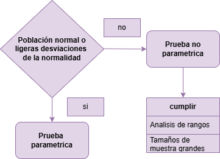

# Pruebas no paramétricas 

```{r  out.height=250, out.width=350, fig.align='center', echo=FALSE}

```


 
## Prueba Chi cuadrado

Tiene diferentes usos entre los que se encuentran

- Determinar si una variable categórica sigue o no, una distribución hipotética, como la binomial o la poisson.

**El juego de hipótesis es:**

$H_0:$ Los datos analizados siguen una distribución M.

$H_1:$ Los datos analizados no siguen una distribución M

**Grados de libertad**

$$gl=\quad  k \quad observaciones-\quad  t\quad  parametros \quad  estimados\quad -1$$

- Evaluar si una variable es independiente de la otra: Dos variables aleatorias X e Y son llamadas independientes, si la distribución de probabilidad de una de las variables no es afectada por la presencia de la otra.


**El juego de hipótesis es:**


$H_o:$ Las variables son independientes, una variable no varía entre los distintos niveles de la otra variable.


$H_a:$ Las variables son dependientes, una variable varía entre los distintos niveles de la otra variable.


**Grados de libertad**

$$df=(columnas−1)*(filas−1)$$

- Comparar si dos distribuciones de probabilidad se desempeñan de las misma manera


**El juego de hipótesis es:**

$H_o:$ la distribución de probabilidad de x es similar a y.


$H_a:$ la distribución de probabilidad de x no es similar a y.

En todos los casos el **estadístico** corresponde a:

$$ \large \chi^2=\sum_{i,j}^n \frac {(o_{ij}-e_{ij})^2}{e_{ij}}$$


Asuma que:

$Oij$ es la frecuencia observada de eventos que pertenecen a la i−ésima categoría de X y la j−ésima categoría de Y.


$e_{ij}$ es la frecuencia esperada si X e Y son independientes.


**Videos ejemplo**

**Prueba chi cuadrado para la independencia de dos distribuciones**


<iframe width="280" height="160" src="https://www.youtube.com/embed/tWfNv_z_bB0" title="Prueba chi cuadrada para tablas de contingencia" frameborder="0" allow="accelerometer; autoplay; clipboard-write; encrypted-media; gyroscope; picture-in-picture; web-share" referrerpolicy="strict-origin-when-cross-origin" allowfullscreen></iframe>

**Prueba de bondad de ajuste para la distribución de probabilidad binomial**

<iframe width="280" height="160" src="https://www.youtube.com/embed/DXKn_0ceN-8" title="Prueba de bondad de ajuste caso binomial" frameborder="0" allow="accelerometer; autoplay; clipboard-write; encrypted-media; gyroscope; picture-in-picture; web-share" referrerpolicy="strict-origin-when-cross-origin" allowfullscreen></iframe>

**Prueba de bondad de ajuste para la distribución de probabilidad poisson**

<iframe width="280" height="160" src="https://www.youtube.com/embed/2USOJ5qTVsE" title="Prueba de bondad de ajuste caso Poisson" frameborder="0" allow="accelerometer; autoplay; clipboard-write; encrypted-media; gyroscope; picture-in-picture; web-share" referrerpolicy="strict-origin-when-cross-origin" allowfullscreen></iframe>


**Ejemplo**
En un supermercado se está estudiando el comportamiento del número de personas que llegan cada hora. Se analizaron 20 horas, cuyos datos se consignan a continuación:


**Análisis exploratorio**
Se analiza los gráficos para determinar una distribución hipotética.

```{r echo=TRUE }

personas<-c(13, 14, 14, 19, 17, 14, 13,  9, 16, 16,13, 13, 15, 13,  7, 14, 14, 13, 20, 15)

mean(personas)

par(mfrow=c(1,2))
hist(personas, xlab = "personas", ylab = "Frecuencia", las=1, main = "", col = "gray")
plot(density(personas), xlab = "personas", ylab = "Densidad", las=1, main = "")


```

En este caso, la variable de interés registra un número de eventos por unidad de tiempo, por lo que se sugiere analizar el ajuste a una distribución poisson. Se muestra la respectiva prueba de hipótesis. Sea X el número de clientes que visitan Celia Express.

$H_0:X_i∼Poisson$

$H_1:X_i≁Poisson$

**Manualmente**

Los valores se agrupan en una tabla de frecuencias

|Clientes/hora|Frec obs|prob |frec esp|(obs-esp)^2/esp|
|:-----------:|:------:|:---:|:------:|:-------------:|
|9            |2       |0.048|0.96    |1.1            |
|13           |6       |0.106|2.12    |7.1            |
|14           |5       |0.105|2.12    |3.9            |
|15           |2       |0.098|1.97    |0              |
|16           |2       |0.085|1.72    | 0             |
|17           |3       |0.07 |1.41    |1.8            |
|total        | 20     |     |        |13.9           |

el valor del promedio $\lambda$ se estima asi: 
 $$\lambda=\frac{(9*2)+(13*6)+(14*5)+(15*2)+(16*2)+(17*3)}{20}=13.95$$ 
 
 A partir de este valor se estima la probabilidad de cada uno de ellos según la distribución de probabilidad
 poisson
 
 $$p(x=9)=\frac{e^{-\lambda}\lambda^x}{x!}=\frac{e^{-13.95}13.95^9}{9!}=0.048$$

La frecuencia esperada se obtiene de multiplicar cada valor de probabilidad por 20. 

El valor del estadístico es 13.9
los grados de libertad de la distribución está dado por: gl=observaciones- k (parámetros estimados)-1

$$P(\chi^2_4>13.9)=0.0075 $$
rechaza la hipotesis nula y se concluye que los datos no se distribuye poisson 


**En Rstudio**

Para estimar los parámetros de una distribución de probabilidad discreta (poisson y binomial), se requiere la función goodfit del paquete vcd. Esta función también realiza la prueba de bondad de ajuste y sus argumentos son: variable de interés, tipo de distribución y método. Se usará el test de Chi-cuadradado a través del argumento “MinChisq”

```{r}
require(vcd)
gf<-goodfit(personas, type = "poisson", method = "MinChisq")
gf$par

summary(gf)

chisq.test(personas)
```

**Ejemplo Comparación de distribuciones**


Retomando el ejemplo de el ph de agua potable y no potable


$H_0:X_{si}∼y_{no}$

$H_1:X_{si}≁y_{no}$


**Ejemplo en R:**

Se usan los datos de la base survey de la librería MASS de R, que corresponden a 237 observaciones provenientes de una encuesta a estudiantes de estadística de una Universidad en Australia.

1. Valide la hipótesis de si el hábito de fumar es independiente del nivel de ejercicios de los estudiantes usando un nivel de significancia del 0.05.

**El juego de hipotesis es:**

$H_o:$ El hábito de fumar es independiente de hacer ejercicio

$H_a:$ El hábito de fumar es dependiente de hacer ejercicio

```{r echo=TRUE}
## Para inst lar librerías use

# install.packages("MASS")

## Para llamar la librería
library(MASS)
library(DT)

## se usan las variables
## FUMA (Smoke) con los niveles: Heavy, Regul, Occas y Never 
## EJERCICIO (Exer) con los niveles: Freq, Some, y None
##se tabulan

tbl=table(survey$Smoke,survey$Exer)
tbl

chisq.test(tbl)


#Note que aparece un mensaje de alerta. Esto es debido a que en algunas celdas las
#frecuencias son muy pequeñas. Podemos solucionar esto agrupando algunas columnas.

ctbl = cbind(tbl[,"Freq"], tbl[,"None"] + tbl[,"Some"])
ctbl

chisq.test(ctbl)


mosaicplot(ctbl,
  main = "Mosaic plot",
  color = TRUE
)
```

**fuerza de asociación**

```{r}
library(vcd)
assocstats(x = tbl)
```


# Pruebas de independencia de las distribuciones

Se utilizan cuando se quiere estudiar si existe asociación entre dos variables cualitativas, es decir, si las proporciones de una variable son diferentes dependiendo del valor que adquiera la otra variable.

Existen dos tipos de pruebas de independencia, la prueba chi cuadrado y la prueba exacta de fisher. La prueba de Chi-cuadrado se utiliza cuando la muestra es suficientemente grande. La prueba exacta de Fisher se utiliza cuando la muestra es pequeña.

La prueba de Chi-cuadrado no es adecuada cuando los valores esperados en una de las celdas de la tabla de contingencia son menores a 5; en este caso, se prefiere la prueba exacta de Fisher (McCrum-Gardner, 2008; Bower, 2003).


**El juego de hipótesis es:**

$H_o:$ Las variables son independientes, una variable no varía entre los distintos niveles de la otra variable.

$H_a:$ Las variables son dependientes, una variable varía entre los distintos niveles de la otra variable.


## Test exacto de fisher

Se aplica para comparar dos variables categóricas con dos niveles cada una (tabla 2x2), está diseñado para situaciones en las que las frecuencias marginales de filas y columnas (los totales de cada fila y columna) son fijas, se conocen de antemano. Esta condición es relevante en los experimentos biológicos ya que no es común poder cumplirla. Si esta condición no se satisface el test de Fisher deja de ser exacto, por lo general pasando a ser más conservativo. 

**Ejemplo de experimentos con y sin frecuencias marginales fijas:**

**Frecuencias marginales fijas:**

Supóngase que se quiere saber si la preferencia que tienen dos especies de pájaros (estorninos y gorriones) para refugiarse en casetas artificiales es diferente dependiendo del material de fabricación (madera o metal). Para ellos se disponen en una pajarera 5 casetas de metal y 5 de madera y se sueltan en el interior de la jaula 4 gorriones y 6 estorninos. En este experimento se sabe que las frecuencias marginales van a ser 5, 5, 4, 6 lo que no se sabe es como se van a distribuir las observaciones dentro de la tabla.

|Pájaro|Metal|Madera|total|
|:----:|:---:|:----:|:---:|
|Gorrión|?   |     ?|4    |
|Estornino|? |?     |6    |
|Total    |5 |5     |10   | 


**Frecuencias marginales no fijas:** 


Supóngase que se quiere determinar si un fármaco acelera la cicatrización. Para ello se selecciona a 50 pacientes que se reparten aleatoriamente en dos grupos iguales (tratamiento y placebo), tras una semana de tratamiento se determina si la cicatrización ha finalizado (si / no). En este caso las frecuencias marginales de los tratamientos son fijas, 25 para cada grupo, sin embargo no se sabe cuántos en cada grupo van a haber cicatrizado o no, por lo que las frecuencias marginales del resultado de cicatrización no son fijas.


|Tratamiento|cicatrizado|No cicatrizado|total|
|:---------:|:---------:|:------------:|:---:|
|placebo    |?          |     ?        |25   |
|Tratamiento|?          |?             |25   |
|Total      |?          |?             |50   | 


**Condiciones del test**

- Independencia,las observaciones de la muestra deben ser independientes unas de otras.

- Muestreo aleatorio.

- Tamaño de la muestra < 10% población.

- Cada observación contribuye únicamente a uno de los niveles.

- Las frecuencias marginales de columnas y filas tienen que ser fijas. Si esta condición no se cumple, el test de Fisher deja de ser exacto.


**Cálculo del p-value**


El test exacto de Fisher se basa en la distribución hipergeométrica, que permite calcular la probabilidad exacta de obtener una determinada distribución de eventos dentro de una tabla. Supóngase la siguiente tabla de contingencia:


|Niveles |Nivel A1|Nivel A2|total|
|:------:|:------:|:------:|:---:|
|Nivel B1|a       |b       |a+b  |
|Nivel B2|c       |d       |c+d  |
|Total   |a+c     |b+d     | n   | 

n=a+b+c+d


$$p=  \frac{{a+b\choose a}\,{c+d\choose c}}{{n\choose a+c}}= \frac{(a+b)!(c+d)!(a+c)!(b+d)!}{a!b!c!d!n!}$$
El test de Fisher calcula las probabilidades de todas las posibles tablas y suma las de aquellas tablas que tengan probabilidades menores o iguales que la tabla observada, generando así el p-value de dos colas.


**Ejemplo**
Se quiere estudiar si la reacción alérgica a un compuesto y una determinada mutación en un gen están relacionados. Para ello se realiza un test alérgico sobre un grupo de individuos seleccionados al azar y se genotipa el estado del gen de interés ¿Existe un diferencia significativa en la incidencia de la mutación entre los alérgicos y no alérgicos?

```{r}
datos <- data.frame( sujeto = c("No alérgico", "No alérgico", "No alérgico","No alérgico","alérgico","No alérgico","No alérgico", "alérgico", "alérgico","No alérgico","alérgico", "alérgico","alérgico", "alérgico", "alérgico","No alérgico", "No alérgico", "No alérgico","No alérgico","alérgico", "alérgico","alérgico", "alérgico", "No alérgico","alérgico", "No alérgico", "No alérgico","alérgico","alérgico", "alérgico"),

                  
mutacion = c(FALSE,FALSE,FALSE,FALSE,TRUE,FALSE,FALSE, FALSE, TRUE,TRUE,TRUE,TRUE,TRUE,TRUE, FALSE,FALSE,TRUE,FALSE,TRUE, FALSE,TRUE,FALSE,FALSE, FALSE, TRUE, FALSE, FALSE, TRUE, FALSE, TRUE))
head(datos)
```

**El juego de hipotesis es:**

$H_o:$ La alergia es independiente de la presencia del gen
 
$H_a:$ La alergia es dependiente de la presencia del gen


**La tabla de frecuencias es**

El test de Fisher trabaja con frecuencia de eventos, por lo tanto con tablas de contingencia en las que se sumariza el número de eventos de cada tipo.

```{r}
tabla <- table(datos$sujeto, datos$mutacion, dnn = c("Sujeto", "Estado gen"))
tabla
fisher.test(x = tabla, alternative = "two.sided")

```


**Fuerza de asociación entre variables cualitativas (tamaño del efecto)**

Dado que las pruebas contrastan si las variables están relacionadas, al tamaño del efecto se le conoce como fuerza de asociación. Existen múltiples medidas de asociación, entre las que destacan phi o Cramer’s V. 


```{r}
library(vcd)
assocstats(x = tabla)
```

En este ejemplo no se satisface la condición de frecuencias marginales fijas y por lo tanto el test de Fisher no es exacto. Aun así, hay evidencias para rechazar la H0
 y considerar que las dos variables sí están relacionadas. El tamaño de la fuerza de asociación (tamaño de efecto) cuantificado por phi o Cramer’s V es mediano.


```{r}
mosaicplot(tabla,
  main = "Mosaic plot",
  color = TRUE
)
```

# Prueba de diferencias entre dos poblaciones con relación a la mediana 


## Prueba de signo
Se utiliza para probar hipótesis sobre una mediana de la población. 

**Hipótesis nula $H_0$**

$$\Large H_0:M_e=M_o$$

**Hipótesis alternativa $H_1$**

|**cola superior**|**cola inferior**|**cola doble**|
|:---------------:|:---------------:|:------------:|
|$\Large H_0:M_e>M_o$|$\Large H_0:M_e<M_o$|$\Large H_0:M_e\neq M_o$|


si la distribución es simétrica, la media y la mediana de la población son iguales. Al probar la hipótesis nula $H_0$ de que $M_e=M_o$ en comparación con la hipótesis
alternativa adecuada, con base en una muestra aleatoria de tamaño n, reemplazamos cada valor de la muestra que exceda a $M_e$ con un signo más, y cada valor de la muestra menor que $M_e$ con un signo menos. Si la hipótesis nula es verdadera y la población es simétrica, la suma de los signos más debería ser casi igual a la suma de los signos menos. 

**Estadístico**

$R^+:$ Numero de diferencias positivas encontradas en el experimento

$$R^+\sim B(n,p) \quad R^+={0,1,2,3...n}$$
n: cantidad de veces q se repite el experimento aleatorio


E: diferencia positiva

$p=P(E)=\frac{1}{2}$ Probabilidad de encontrar una diferencia positiva

$f(x)$ Probabilidad de encontrar x diferencias positivas

$$f(x)=P(R^+=x)=\displaystyle{n \choose x}p^x q^{n-x}=\displaystyle{n \choose x}*{\left (\frac{1}{2} \right)}^n$$
Siempre que n>10, las probabilidades binomiales con p=1/2 se pueden aproximar a partir de la curva normal, ya que np=nq>5.


$$μ=np\quad sd=\sqrt{npq}$$

**valor p**

|condición|fórmula|
|:-------:|:-----:|
|$r^+<\frac{n}{2}$|$k*P \left (x\leq r^+|p=\frac{1}{2}\right)$|
|$r^+>\frac{n}{2}$|$k*P \left (x\geq r^+|p=\frac{1}{2}\right)$|
|prueba unilateral|$k=1$|
|prueba bilateral |$k=2$|


<iframe width="280" height="160" src="https://www.youtube.com/embed/H16Ou4geBnM" title="Prueba de signos  - Ejercicio 1" frameborder="0" allow="accelerometer; autoplay; clipboard-write; encrypted-media; gyroscope; picture-in-picture; web-share" referrerpolicy="strict-origin-when-cross-origin" allowfullscreen></iframe>


<iframe width="280" height="160" src="https://www.youtube.com/embed/lYmVW7R88UQ" title="Prueba de signos  - Ejercicio 2" frameborder="0" allow="accelerometer; autoplay; clipboard-write; encrypted-media; gyroscope; picture-in-picture; web-share" referrerpolicy="strict-origin-when-cross-origin" allowfullscreen></iframe>

**Ejemplo**

Los siguientes datos representan el número de horas que funciona una guadaña
antes de requerir una recarga:

1.5, 2.2, 0.9, 1.3, 2.0, 1.6, 1.8, 1.5, 2.0, 1.2, 1.7

A un nivel de significancia de 0.05 utilice la prueba de signo para probar la hipótesis de que la guadaña funciona con una mediana de 1.8 horas antes de requerir una recarga.

**Solución: **

**1. juego de hipótesis**

$$H_0: Me= 1.8$$
$$H1: M_e≠ 1.8$$


**3. α = 0.05**


**4. Cálculos: **

Al reemplazar cada valor con el símbolo “+” si excede 1.8, con el símbolo “–” si es menor que 1.8 y descartar las mediciones que sean iguales a 1.8, obtenemos la siguiente secuencia

|$X_i$|$x_i-M_e=x_i-1.8$|signo|
|:---:|:---------------:|:---:|
|1.5  |-0.3             |-    |
|2.2  |0.4              |+    |
|0.9  |-0.9             |-    |
|1.3  |-0.5             |-    |
|2.0  |0.2              |+    |
|1.6  |-0.2             |-    |
|1.8  |0                | 0   |
|1.5  |-0.3             |-    |
|2.0  |0.2              |+    |
|1.2  |-0.6             |-    |
|1.7  |-0.1             |-    |

$$n=9 \quad r^+=3 \quad n/2=4.5\quad k=2$$

**5. Estadístico de prueba**

como $r^+<\frac{n}{2} \quad 3<4.5$ la fórmula es:

$$k*P \left (x\leq r^+|p=\frac{1}{2}\right)$$
$$2*P(x\leq 3)=2*\sum_{x=0}^3 \displaystyle{10 \choose x}0.5^x 0.5^{10-x}$$
$$2*\sum_{x=0}^3  \displaystyle{10 \choose x}*{\left (\frac{1}{2} \right)}^{10}=0.3437$$
**6. Decisión: **

No se rechaza la hipótesis nula y se concluye que la mediana del tiempo de funcionamiento no difiere significativamente de 1.8 horas. 


**En R**

```{r}
library(BSDA)
x1<-c(1.5,2.2,0.9,1.3,2.0,1.6,1.8,1.5,2.0,1.2,1.7)
med<-median(x1)
SIGN.test(x1, md =1.8, alternative = "two.sided", conf.level = 0.95)


```


**Otro ejemplo**


Una empresa de taxis intenta decidir si utilizar neumáticos radiales en vez de neumáticos
regulares con cinturón le serviría para ahorrar combustible. Se equipan 16 automóviles
con neumáticos radiales y se conducen por un recorrido de prueba establecido. Después
se equipan los mismos automóviles con los neumáticos regulares con cinturón y se hace
que los mismos conductores vuelvan a realizar el recorrido de prueba. 

El consumo de gasolina, en kilómetros por litro, se presenta en la siguiente tabla, ¿Podemos concluir a un nivel de significancia de 0.05 que los automóviles equipados con neumáticos radiales ahorran más combustible que los equipados con neumáticos regulares con cinturón?


____________________________________________________________________________________________________________________________
**NOTA**
Los neumáticos radiales, con capas dispuestas a 90° y cinturones de acero, ofrecen mayor flexibilidad, tracción y durabilidad, siendo ideales para el uso diario en carretera y el ahorro de combustible. En contraste, los neumáticos convencionales (diagonales o con cinturón) tienen estructuras más rígidas, indicados para cargas pesadas, terrenos irregulares o maquinaria. 

los radiales son superiores para la conducción diaria y el confort en carretera. Los neumáticos convencionales con cinturón ofrecen un terreno medio, siendo más resistentes a impactos en los flancos, pero con un rendimiento inferior en suavidad y eficiencia. 

____________________________________________________________________________________________________________________________


|Automóvil|1|2|3 | 4   | 5    | 6   | 7   | 8   | 9   | 10  | 11  | 12  | 13  | 14  | 15   | 16   |
|:-------:|:-:|:-:|:-:|:-:|:-:|:-:|:-:|:-:|:-:|:-:|:-:|:-:|:-:|:-:|:-:|:-:|:-:|:-:|:-:|
| Neumáticos radiales| 4,2 | 4,7| 6,6 |7| 6,7|4,5|5,7| 6|7,4 |4,9|6,1|5,2|5,7|6,9|6,8|4,9  |
| Neumáticos con cinturón |4,1|4,9|6,2|6,9|6,8|4,4|5,7|5,8|6,9|4,9|6|4,9|5,3|6,5|7,1  | 4,8  |
| diferencia|0,1|-0,2|0,4|0,1|-0,1|0,1 | 0   | 0,2 | 0,5 |0|0,1 | 0,3 | 0,4 | 0,4 | -0,3 | 0,1  |  
| signo                    | +   | -    | +   | +   | -    | +|na|+|+|na|+|+|+| +   | -    | +    |


   |   |   |
|:---:|:---:|:---:|:---:|:---:|:----:|:----:|:---:|:---:|:---:|
   |   |   |
   |   |   |
 |   |   |
   |   |   |
   
1. Realice la prueba de signos
2. Realice la prueba de rangos con signos de wilcoxon
3. Realice la prueba de suma de rangos de wilcoxon

 
**En rstudio**

```{r}
library(BSDA)
rad=c(4.2,4.7,6.6,7,6.7,4.5,5.7,6,7.4,4.9,6.1,5.2,5.7,6.9,6.8,4.9)
cin=c(4.1,4.9,6.2,6.9,6.8,4.4,5.7,5.8,6.9,4.9,6,4.9,5.3,6.5,7.1,4.8)


##Pueba de signos
SIGN.test(rad,cin, alternative = "two.sided", conf.level = 0.95)

## Prueba de rangos con signos
wilcox.test(rad,cin,paired=TRUE) 

## Prueba de suma de rangos
wilcox.test(rad,cin,paired=FALSE) 


```


## Prueba de rangos con signo de wilcoxon

- Compara el rango medio de dos muestras relacionadas y determina si existen diferencias entre ellas. 

- Se utiliza para dos muestras pareadas, tiene en cuenta el signo y valor de la diferencia entre pares. 

**Condiciones**

- Datos independientes y ordenados

- No es necesario asumir que las muestras se distribuyen normal. La distribución de las diferencias debe ser simétrica 

- Trabaja con medianas no con medias

**Hipótesis nula $H_0$**

$$\Large H_0:M_1=M_2$$

**Hipótesis alternativa $H_1$**

|**Cola**    |**Superior**|**Inferior**|**doble**|
|:----------:|:---------------:|:---------------:|:------------:|
|$\Large H_0$|$\Large M_e>M_o$|$M_e<M_o$|$ H_0:M_e\neq |M_o$|


**Criterio de rechazo**
$T<T_{tabla}$


**Hipótesis:**

En este caso la hipótesis nula consiste en afirmar que las poblaciones a la cual pertenecen ambos resultados es la misma o son idénticas. Esto es equivalente a formularlas de la siguiente manera:

**Ho: **El criterio aplicado no tiene efecto significativo en la muestra

**H1:** El criterio aplicado sí tiene efecto significativo en la muestra

Nivel de significación: α

**Procedimiento:**

- Calcular Di = Xi – Yi

- Tomar el valor absoluto de ellas. De preferencia colocarlas en otra columna, acompañado de la identificación del número de elemento

- Ordenarlo de menor a mayor con la columna de identificación

- Asignarle un rango a cada elemento ordenado. Si un rango se repite k veces, el rango asignado a cada elemento que se repite será el promedio de los siguientes rangos. La siguiente diferencia tendrá por rango el número de rango que corresponda, si no hubiera habido repetición.

- Identificar el rango a cada diferencia original (sin el valor absoluto)

- Asignarle el signo positivo o negativo según el valor de la diferencia

- Sumar todos los valores de los rangos positivos y los negativos

- Elegir el mínimo de estas sumas. Este será el estadístico.

**Ejemplo**

Los siguientes datos representan el número de horas que un compensador opera antes de requerir una recarga:

|dato|
|:--:|
|1.5 |
|2.2 |
|0.9 |
|1.3 |
|2.0 |
|1.6 |
|1.8 | 
|1.5 | 
|2.0 | 
|1.2 |
|1.7 | 

Utilice la prueba de rango con signo para probar la hipótesis en el nivel de significancia de 0.05 que este compensador particular opera con una media de 1.8 horas antes de requerir una recarga.


**Solución:**

El juego de hipotesis es:
$$H_0 = 1.8$$

$$H_1=1.8$$

Se procederá a efectuar las diferencias y a poner rango con signo a los datos.

Dato

di = dato - 1.8

|Dato|di | valor abs | jerarquia asignada  |
|:-:|:--:|:---------:|:-------------------:|
|1,5|-0,3| 0,3       | -5,5                |
|2,2|0,4 | 0,4       | 7                   |
|0,9|-0,9| 0,9       | -10                 |
|1,3|-0,5| 0,5       | -8                  |
|2  |0,2 | 0,2       | 3                   |
|1,6|-0,2| 0,2       | -3                  |
|1,8|0   | 0         |         ninguna     |
|1,5|-0,3| 0,3       | -5,5                |
|2  |0,2 | 0,2       | 3                   | 

| dif abs ordenada     | 0 | 0,1 | 0,2 | 0,2 | 0,2 | 0,3 | 0,3 | 0,4 | 0,5 |
|:--------------------:|:---:|:---:|:---:|:---:|:---:|:---:|:---:|:---:|:---:|
| jerarquia            | 0 | 1   | 2   | 3   | 4   | 5   | 6   | 7   | 8   |
| jerarquia reasignada | - | 1   | 3   | 3   | 3   | 5.5 | 5.5 | 7   | 8   |


**Regla de decisión:**

Para  n = 10, después de descartar la medición que es igual a 1.8, la tabla muestra que la región crítica es w=8.

Cálculos:

w+ = 7 + 3 + 3 = 13

w- = 5.5 + 10 + 8 + 3 + 5.5 + 9 + 1 = 42

por lo que w = 13 (menor entre w+ y w-).

**Decisión y Conclusión:**

Como 13 no es menor que 8, no se rechaza H0 y se concluye con un  = 0.05 que el tiempo promedio de operación no es significativamente diferente de 1.8 horas.

 
**En rstudio**

```{r}
y1=c(1.5,2.2,0.9,1.3, 2,1.6,1.8,1.5,2,1.2,1.7)
y2=rep(1.8,times=11)

wilcox.test(y1,y2,paired=TRUE) 


SIGN.test(y1,y2, alternative = "two.sided", conf.level = 0.95)
```


<iframe width="280" height="160" src="https://www.youtube.com/embed/IBOvUAPtirA" title="prueba de rangos con signo de wilcoxon" frameborder="0" allow="accelerometer; autoplay; clipboard-write; encrypted-media; gyroscope; picture-in-picture; web-share" referrerpolicy="strict-origin-when-cross-origin" allowfullscreen></iframe>


## Prueba de la suma de rangos de Wilcoxon

Identifica diferencias entre dos poblaciones basadas en el análisis de **dos muestras independientes** que no están emparejadas.
 

**Juego de hipótesis:**

Ho: Las muestras provienen de la misma población.

H1: Las muestras provienen de poblaciones diferentes.

si las dos muestras comparadas proceden de la misma población, al juntar todas las observaciones y ordenarlas de menor a mayor, cabría esperar que las observaciones de una y otra muestra estuviesen intercaladas aleatoriamente. 

```{r}
library(ggplot2)
set.seed(567)
datos <- data.frame(muestra = rep(c("A", "B"), each = 10),
valor = rnorm(n = 20, mean = 10, sd = 5),
cordenada_y = rep(0, 20))

ggplot(data = datos, aes(x = valor, y = cordenada_y)) +
geom_point(aes(colour = muestra), size = 3) +
ylab("") + xlab("rango") +
theme_bw() +
theme(axis.text.y = element_blank()) + 
ggtitle("Muestras procedentes de la misma población")
```


Por lo contrario, si una de las muestras pertenece a una población con valores mayores o menores que la otra población, al ordenar las observaciones, estas tenderán a agruparse de modo que las de una muestra queden por encima de las de la otra.


```{r}
set.seed(567)
datos <- data.frame(muestra = rep(c("A", "B"), each = 10),
valor = c(rnorm(n = 10, mean = 10, sd = 5), rnorm(n = 10, mean = 20, sd = 5)),
cordenada_y = rep(0, 20))

ggplot(data = datos, aes(x = valor, y = cordenada_y)) +
geom_point(aes(colour = muestra), size = 3) +
ylab("") + xlab("rango") +
theme_bw() +
theme(axis.text.y = element_blank()) + 
ggtitle("Muestras procedentes de distintas poblaciones")
```


**Ejemplo Prueba de wilcoxon en R**

Los siguientes datos corresponden a constantes de permeabilidad de la membrana chorioamnion en humanos (una membrana placentaria) medida a las 12 y 26 semanas de edad gestacional.


1. Realice un analisis descriptivo para verificar la normalidad en los conjuntos de datos

```{r echo=TRUE}
require(car)
library(nortest)

c12=c(0.80, 0.83, 1.89, 1.04, 1.45, 1.38, 1.91, 1.64, 0.73, 1.46)
c26=c(1.15, 0.88, 0.90, 0.74, 1.21)

# Para la constante a las 12 semanas

par(mfrow=c(1,4))
hist(c12, xlab = "Tiempo", ylab = "Frecuencia", las=1, main = "", col = "gray")
qqPlot(c12, col = "gray", ylab="Tiempo")
plot(density(c12), xlab = "Tiempo", ylab = "Densidad", las=1, main = "")
boxplot(c12,c26, xlab = "Tiempo", ylab = "Densidad", las=1, main = "")


# Para la constante a las 26 semanas

par(mfrow=c(1,4))
hist(c26, xlab = "Tiempo", ylab = "Frecuencia", las=1, main = "", col = "gray")
qqPlot(c26, col = "gray", ylab="Tiempo")
plot(density(c26), xlab = "Tiempo", ylab = "Densidad", las=1, main = "")
boxplot(c12,c26, xlab = "Tiempo", ylab = "Densidad", las=1, main = "")


```

2. Pruebe mediante un juego de hipotesis y mediante la prueba de shapiro wilk, la normalidad del conjunto de datos

```{r echo=TRUE}
library(nortest)

##PRUEBA DE NORMALIDAD
shapiro.test(c12)
shapiro.test(c26)


```

3. Pruebe la igualdad entre el conjunto de datos


```{r}

## Prueba de rango con signo 
wilcox.test(x = c12, y = c26, alternative = "two.sided", mu = 0,
            paired = FALSE, conf.int = 0.95) 
#prueba para saber si provienen de la misma distribución 
ks.test(c12,c26)

```


**Ejemplo en R**

Se mide las concentraciones de cortisol en dos grupos de mujeres antes de dar a luz. Al grupo 1 se le practicó una cesárea de urgencias después de inducido el parto. Las del grupo 2, dieron a luz mediante operación cesárea o vía vaginal después de presentarse el trabajo de parto expontáneamente.

1. Realice un analisis grafico para detectar si hay normalidad


2.Verifique normalidad en los conjuntos de datos usando α = 0.05.


4.Compruebe que ambos grupos de datos provienen de la misma distribución de probabilidad

$$H_0:grupo1∼grupo2$$

$$H_1:grupo1≁grupo2$$


```{r echo=TRUE}

###Ingresamos los datos como vectores de los dos grupos de madres

grupo1=c(411,466,432,409,381,363,449,483,438,381)
grupo2=c(584,553,516,688,650,590,574,700,831,688,478,689)         

boxplot(grupo1,grupo2)
## Prueba de normalidad
shapiro.test(grupo1)
shapiro.test(grupo2)

#prueba para saber si provienen de la misma distribución 
ks.test(grupo1,grupo2)

## Prueba de igualdad entre varinzas
var.test(grupo1,grupo2)

## prueba de diferencias entre medias
t.test (grupo1,grupo2,paired=FALSE,conf.level=0.95)


         
```


# Conclusiones

- La prueba chi cuadrado tiene 3 diferentes aplicaciones, entre ellos se encuentran la Prueba de independencia, Prueba de bondad de ajuste y de Comparación de distribuciones**

## Ejercicios propuestos


**Prueba de signo y de rangos con signos de wilcoxon**


1. Se afirma que, si se le proporcionan ejemplos de problemas con antelacion, un estudiante puede aumentar en al menos 50 puntos su calificacion.

Para probar esta afirmacion se divide a un grupo de 20 estudiantes del ultimo ano en 10 pares, de manera que cada par tenga casi la misma calificacion promedio durante sus 3 primeros años en la universidad. 

| **ce** | **se ** |
|:------:|:-------:|
| 531    | 509     |      
| 621    | 540     |      
| 663    | 688     |      
| 579    | 502     |      
| 451    | 424     |      
| 660    | 683     |      
| 591    | 568     |      
| 719    | 748     |      
| 543    | 530     |      
| 575    | 524     |      

Los ejemplos de problemas y las respuestas se proporcionan al azar a un miembro de cada par una semana antes del examen. Las calificaciones del examen se presentan en la sgte tabla.

Use la prueba de signo y de rango con signo de wilcoxon, para probar la hipotesis de si los estudiantes que hacen ejercicios mejoran la nota en almenos 50 puntos.

```{r}
library(BSDA)
ce=c(531,621,663,579,451,660,591,719,543,575)
se=c(509,540,688,502,424,683,568,748,530,524)

SIGN.test(ce,se,alternative = "less", conf.level = 0.95,md=50)

wilcox.test(ce,se,paired=TRUE,mu=50)
```

 

2. Los siguientes datos representan el tiempo, en minutos, que un paciente tiene que esperar durante 12 visitas al consultorio de un médico antes de ser atendido:

|  |  |  |  |  |  |  |  |  |  |  |  |
|:-|:-|:-|:-|:-|:-|:-|:-|:-|:-|:-|:-|
|17|15|20|20|32|28|12|26|25|25|35|24|


Utilice la prueba de signo a un nivel de significancia de 0.05 para probar la afirmación del médico de que la mediana del tiempo de espera de sus pacientes no es mayor de 20 minutos.

**rta x = 7 con valor P = 0.1719; no rechace H0**

Utilice la prueba de rango de signo de wilcoxon a un nivel de significancia de 0.05 para probar la afirmación del médico de que la mediana del tiempo de espera de sus pacientes no es mayor de 20 minutos.


```{r}

library(BSDA)
time=c(17,15,20,20,32,28,12,26,25,25,35,24)
ref=rep(20,12)

SIGN.test(time,ref,alternative = "less", conf.level = 0.95,md=20)

wilcox.test(time,ref,paired=TRUE,mu=20, alternative = "less")


```


3. Un inspector de alimentos examina 16 latas de cierta marca de jamón para determinar el porcentaje de impurezas externas. Se registraron los siguientes datos:

|   |   |   |   |   |   |   |   |   |   |   |   |   |   |   |   |
|:-:|:-:|:-:|:-:|:-:|:-:|:-:|:-:|:-:|:-:|:-:|:-:|:-:|:-:|:-:|:-:|
|2.4|2.3|3.1|2.2|2.3|1.2|1.0|2.4|1.7|1.1|4.2|1.9|1.7|3.6|1.6|2.3|

Realice una prueba de signo a un nivel de significancia de 0.05 para probar la hipótesis nula de que la mediana del porcentaje de impurezas en esta marca de jamón es de 2.5%, en comparación con la hipótesis alternativa de que la mediana del porcentaje de impurezas no es de 2.5%.

**x = 3 con valor P = 0.0244; rechace H0**

Realice una prueba de rango de signo de wilcoxon a un nivel de significancia de 0.05 para probar la hipótesis nula de que la mediana del porcentaje de impurezas en esta marca de jamón es de 2.5%, en comparación con la hipótesis alternativa de que la mediana del porcentaje de impurezas no es de 2.5%.


```{r}
nv=c(2.4,2.3,3.1,2.2,2.3,1.2,1,2.4,1.1,4.2,1.9,1.7,3.6,1.6,2.3,1.7)
SIGN.test(nv, md =2.5, alternative = "two.sided", conf.level = 0.95)
wilcox.test(nv, alternative = c("two.sided"),
            mu =2.5, conf.level = 0.95) 
```


4. Se afirma que una nueva dieta reducirá el peso de una persona en 4.5 kilogramos, en promedio, en un periodo de dos semanas. Se registran los pesos de 10 mujeres que siguen esta dieta, antes y después de un periodo de dos semanas, y se obtienen los siguientes datos:

| **mujer** | **peso antes** | **peso despues ** | 
|:---------:|:--------------:|:-----------------:|
| 1         | 58.5           | 60.0              |
| 2         | 60.3           | 54.9              | 
| 3         | 61.7           | 58.1              | 
| 4         | 69.0           | 62.1              |  
| 5         | 64.0           | 58.5              |
| 6         | 62.6           | 59.9              | 
| 7         | 56.7           | 54.4              | 
| 8         | 63.6           | 60.2              | 
| 9         | 68.2           | 62.3              |      
|10      |  59.4    |58.7      |      


Utilice la prueba de signo a un nivel de significancia de 0.05 para probar la hipótesis de que la dieta reduce la mediana del peso en 4.5 kilogramos, en comparación con la hipótesis alternativa de que la mediana de la pérdida de peso es menor que 4.5 kilogramos.

**x=4 vp=03770 no rechace Ho**

Utilice la prueba de rango de signo de wilcoxon a un nivel de significancia de 0.05 para probar la hipótesis de que la dieta reduce la mediana del peso en 4.5 kilogramos, en comparación con la hipótesis alternativa de que la mediana de la pérdida de peso es menor que 4.5 kilogramos.

**W+=17.5 no rechazo Ho**


3. Las siguientes cifras indican la presión sanguínea sistólica de 16 corredores antes y después de una carrera de ocho kms:

| **corredor** | **antes** | **despues ** |
|:------------:|:---------:|:------------:|
| 1            | 158       | 164          |
| 2            | 149       | 158          |
| 3            | 160       | 163          |
| 4            | 155       | 160          |
| 5            | 164       | 172          |
| 6            | 138       | 147          |
| 7            | 163       | 167          |
| 8            | 159       | 169          |
| 9            | 165       | 173          |
| 10           | 145       | 147          |
| 11           | 150       | 156          |
| 12           | 161       | 164          |
| 13           | 132       | 133          |
| 14           | 155       | 161          |
| 15           | 146       | 154          |
| 16           | 159       | 170          |

Utilice una prueba de signo a un nivel de significancia de 0.05 para probar la hipótesis nula de que correr ocho kilómetros aumenta la mediana de la presión sanguínea sistólica en ocho puntos, en comparación con la hipótesis alternativa de que el aumento en la mediana es menor que ocho puntos.


**x=4 vp=0.1335 no rechace Ho**

Utilice una prueba de rango con signo de wilcoxon a un nivel de significancia de 0.05 para probar la hipótesis nula de que correr ocho kilómetros aumenta la mediana de la presión sanguínea sistólica en ocho puntos, en comparación con la hipótesis alternativa de que el aumento en la mediana es menor que ocho puntos.

**w+=15 n=13 rechazo H0 a favor de me1-m2 menor q 8**


