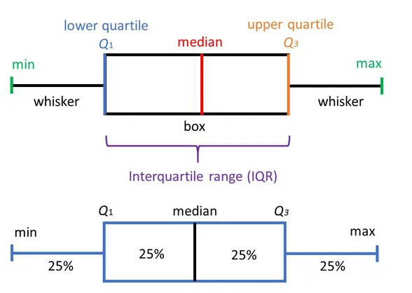

 
 
 
# Graficos para analizar la distribución de los datos 

Gran parte de los modelos estadísticos consideran que las observaciones provienen de poblaciones normales. En muchas situaciones este supuesto no se cumple. A continuación se mencionan algunos gráficos utilizados para analizar la distribución de los datos, además de la detección de puntos atípicos.   


En metrología los datos atípicos son llamados valores aberrantes, conocidos como las observaciones que se desvían significativamente de la tendencia general de los datos o que están considerablemente alejados de otros valores de la muestra. 
La detección y gestión de valores aberrantes es importante en metrología para garantizar la precisión y fiabilidad de las mediciones. Los valores aberrantes pueden sesgar los resultados del análisis y afectar la toma de decisiones basada en los datos.


## Gráfico de densidad 

Visualiza la distribución de datos en un intervalo continuo. Este gráfico es una variación de un histograma, donde el concepto de frecuencia relativa se cambia por el de probabilidad, la suma de todas la superficie será 1.

Los picos ayudan a mostrar dónde los valores se concentran en el intervalo, a su vez permite comparar la densidad de una variable continua en relación a los niveles de factor de una variable cualitativa.


**Ejemplo**

El acceso al agua potable es esencial para la salud, un derecho humano básico y un componente de una política eficaz de protección de la salud. Esto es importante como cuestión de salud y desarrollo a nivel nacional, regional y local. En algunas regiones, se ha demostrado que las inversiones en abastecimiento de agua y saneamiento pueden generar un beneficio económico neto, ya que las reducciones de los efectos adversos para la salud y los costos de atención médica superan los costos de llevar a cabo las intervenciones.

El PH es un parámetro importante para evaluar el equilibrio ácido-base del agua. La OMS ha recomendado un límite máximo permitido de pH de 6,5 a 8,5.

Se tienen los datos del ph del agua dependiendo de si el agua es potable o no, 632 datos de agua potable y 632 de agua no potable, se desea comparar su distribución. 


```{r echo=FALSE}

no<- c(3.7,8.1,8.3,9.1,5.6,10.2,8.6,11.2,7.4,8.0,7.1,7.5,6.3,7.1,9.2,9.0,7.4,6.7,3.9,5.4,6.5,3.4,7.2,9.8,10.4,7.4,5.1,3.6,5.6,9.3,5.3,7.1,9.9,4.8,5.7,7.0,10.7,8.8,7.8,6.7,9.1,10.6,7.5,8.5,5.0,3.9,6.4,8.7,8.1,6.2,5.1,7.3,7.2,5.7,6.2,8.7,6.9,3.5,3.7,6.5,7.3,1.8,5.5,7.4,6.0,6.4,6.2,6.8,9.9,10.2,8.7,6.1,9.0,7.0,6.1,7.1,5.5,7.2,9.2,4.3,7.3,8.5,2.6,8.5,8.9,6.1,8.4,9.3,7.9,7.7,3.4,6.7,7.2,10.1,7.4,7.8,6.9,7.5,8.6,10.3,7.4,11.2,6.5,6.6,5.0,6.9,8.0,6.1,6.2,6.1,8.1,9.6,8.2,8.6,6.8,7.9,5.0,6.2,9.8,9.6,5.2,7.6,5.8,6.6,4.8,7.9,6.9,8.5,7.7,8.9,6.2,6.1,7.3,8.6,8.2,8.3,9.5,7.8,4.4,7.2,6.9,6.1,7.9,6.5,5.3,6.8,5.9,9.5,6.3,8.7,5.7,6.6,7.8,7.6,7.4,9.3,3.7,6.7,9.9,5.6,5.6,4.1,6.0,8.4,6.3,11.3,9.3,7.9,7.9,10.0,6.5,5.9,5.3,7.5,4.1,7.1,6.3,8.0,8.9,6.6,7.7,9.9,9.0,5.1,8.6,7.1,7.7,6.4,4.4,7.0,6.6,3.7,4.8,5.8,6.9,7.4,4.7,9.4,7.8,9.4,9.4,6.3,4.7,8.9,6.6,6.8,6.9,5.7,5.6,7.4,6.3,9.9,5.4,5.0,6.5,6.5,6.3,8.0,7.6,6.9,9.9,7.6,7.0,8.1,7.2,7.5,8.4,6.1,6.1,6.4,9.5,7.9,5.9,6.5,5.2,7.9,7.7,6.7,10.5,9.1,8.1,7.1,8.0,7.0,5.5,8.5,7.3,6.3,7.2,8.7,8.6,7.2,7.2,8.9,6.4,6.7,5.4,7.5,4.4,10.3,6.6,4.2,7.9,6.3,7.8,8.2,5.7,7.4,4.8,7.9,5.9,7.7,7.8,6.1,5.0,8.7,7.7,8.6,5.7,6.6,6.5,9.2,6.3,6.0,7.6,6.4,6.1,5.8,5.4,5.3,5.4,9.9,7.1,9.4,7.5,5.3,7.3,7.8,6.8,5.6,5.7,5.4,5.0,4.6,7.0,5.8,8.4,5.9,6.9,10.3,8.2,7.3,8.8,6.6,6.1,5.9,5.4,5.0,6.5,9.6,8.7,8.4,3.8,4.3,9.9,4.3,8.3,3.4,7.5,7.0,7.5,7.2,8.8,9.0,9.5,6.1,7.5,7.1,6.6,6.0,6.3,7.5,6.4,9.0,7.5,5.7,7.8,7.1,8.8,8.0,7.2,6.4,6.1,8.5,5.8,6.8,7.9,8.6,5.6,8.1,6.7,6.5,9.7,9.3,10.1,6.5,6.1,6.3,5.3,8.3,6.0,6.2,8.2,9.8,8.7,7.0,6.5,7.8,9.7,8.0,7.4,5.5,6.1,6.3,6.3,9.0,8.5,4.0,6.4,6.3,7.6,5.5,7.5,7.9,5.4,8.3,6.7,6.1,6.6,4.7,8.2,5.7,6.6,8.3,10.5,5.2,7.0,6.5,6.6,9.0,6.0,6.3,6.6,7.1,8.1,7.7,5.6,5.2,4.6,6.8,6.4,6.8,6.9,7.9,5.5,6.5,6.7,6.2,4.8,7.4,8.1,7.1,7.6,4.7,8.1,4.3,7.9,9.1,6.6,7.0,9.0,8.6,6.7,6.5,6.8,5.0,8.3,5.5,7.9,5.0,6.5,8.8,8.2,7.7,7.8,7.2,7.0,4.7,4.1,8.4,10.7,6.8,10.0,4.5,8.0,5.1,6.5,6.7,5.8,6.6,8.5,6.0,5.4,5.6,10.6,4.9,7.2,5.9,7.4,7.8,4.7,9.1,5.5,4.5,7.0,10.2,6.8,8.1,7.3,5.9,8.3,5.9,5.3,10.3,7.0,6.9,8.3,8.2,5.8,6.2,7.3,7.6,6.8,5.6,4.9,5.7,10.7,7.6,8.8,6.8,5.1,7.0,9.0,9.5,4.7,10.4,5.7,10.8,9.0,6.8,8.9,4.3,6.7,5.9,6.8,7.4,6.5,6.9,9.3,7.4,6.6,6.2,9.1,4.7,10.6,7.6,6.1,5.3,6.8,7.2,6.6,8.4,8.0,7.4,6.1,7.9,5.2,6.4,7.4,4.4,8.2,4.9,6.9,6.7,7.6,8.2,8.9,8.8,4.7,7.8,6.1,7.7,4.8,5.4,5.5,6.4,8.3,6.6,8.3,6.8,6.4,6.5,6.6,9.3,4.6,7.9,6.2,7.2,8.7,4.8,9.3,7.6,5.3,5.5,8.3,8.6,6.0,5.7,5.2,7.5,11.0,6.7,4.2,7.2,6.2,9.6,5.4,8.7,7.7,7.1,8.3,5.5,10.2,5.4,8.9,8.1,7.2,5.5,5.3,6.4,6.7,6.9,8.0,8.3,8.7,8.2,9.0,8.9,6.0,8.2,7.6,7.8,7.6,6.7,8.8,7.8,6.2,8.6,7.0,3.3,7.9,2.7)

si<-c(9.4,9.0,6.8,7.2,7.7,8.3,5.9,9.8,6.1,5.0,4.8,6.5,13.2,6.6,7.8,5.2,5.6,6.9,9.1,7.3,7.3,6.5,7.2,5.3,7.1,5.3,10.8,6.3,9.8,8.2,6.9,10.4,8.0,3.9,5.7,10.0,6.6,7.6,4.8,7.7,8.3,6.2,9.0,6.1,7.1,5.4,8.1,10.0,5.7,8.9,6.4,7.0,5.9,6.8,10.0,7.3,5.9,7.3,8.1,7.8,11.3,6.6,9.2,4.6,7.8,5.6,7.9,7.4,3.7,9.6,7.0,7.7,6.7,5.4,7.0,10.0,5.6,8.0,5.5,7.5,6.8,5.9,8.7,6.0,9.6,4.3,3.6,8.5,8.1,9.2,8.8,9.5,8.1,2.8,6.4,7.8,7.7,5.1,7.5,5.4,7.1,6.9,4.8,5.0,4.8,4.0,6.5,6.8,7.0,5.6,6.0,6.3,8.0,8.9,6.0,10.3,6.1,9.4,6.9,6.5,5.8,4.9,9.7,5.5,6.4,5.5,8.5,7.4,6.7,6.8,8.7,7.1,5.0,7.7,6.3,8.6,5.8,7.1,8.0,4.7,8.2,6.4,7.0,7.5,7.3,10.0,7.8,6.3,9.6,8.9,8.1,8.2,4.9,9.0,7.4,9.1,4.2,7.8,6.7,3.6,8.0,4.6,4.0,8.9,5.9,9.5,8.8,7.7,9.1,1.8,7.7,6.7,5.1,9.5,6.2,7.4,7.8,8.6,6.4,7.3,6.1,4.7,5.4,5.6,5.8,5.3,7.7,3.7,4.9,5.8,5.0,10.0,7.4,5.1,3.6,8.9,10.1,9.9,10.3,0.2,6.0,7.1,6.4,8.1,10.3,5.5,9.2,7.1,7.1,8.2,6.4,6.2,6.8,7.1,4.6,7.7,8.1,7.5,8.1,7.7,6.8,6.3,5.4,5.7,7.7,8.6,9.9,3.4,8.4,8.4,7.6,9.9,5.2,9.7,7.9,8.9,6.9,10.5,5.7,5.3,6.8,6.8,8.6,8.5,7.6,8.1,5.4,8.0,11.9,7.4,5.1,6.9,9.6,5.4,4.9,6.4,3.9,6.9,9.1,10.3,8.8,7.4,9.4,9.4,7.3,8.9,8.1,7.8,4.7,10.9,4.7,9.9,5.8,1.0,9.5,6.4,6.4,5.5,5.4,7.4,7.8,7.2,6.2,6.8,8.0,8.2,6.7,7.6,8.5,5.4,7.7,8.2,7.8,7.2,5.7,6.7,4.8,8.5,7.7,4.2,7.8,5.9,7.3,9.5,7.5,8.0,7.7,8.3,6.9,6.8,8.2,4.7,6.0,6.6,8.8,6.9,8.8,8.1,5.1,7.4,9.4,5.9,5.8,7.6,9.0,5.4,9.8,5.2,4.9,7.8,7.1,7.9,7.5,7.2,8.7,8.4,6.3,9.3,4.9,6.1,5.7,6.6,7.6,7.9,7.4,5.6,4.3,7.3,6.4,10.8,5.0,10.4,8.4,7.8,7.6,11.2,5.7,10.5,3.8,5.7,5.5,6.8,6.0,6.3,9.2,8.7,8.0,5.5,7.2,5.5,9.8,3.6,7.1,6.6,5.9,9.5,8.4,7.7,6.9,5.8,6.3,6.6,7.3,6.6,6.0,5.9,7.6,6.9,8.0,8.8,6.9,8.7,6.0,4.4,8.2,7.8,7.9,6.1,7.1,8.0,6.6,6.4,6.3,8.0,5.1,8.2,7.6,5.3,7.9,5.3,10.6,7.5,7.1,5.4,7.0,6.0,6.2,7.7,8.1,7.3,6.8,7.4,8.8,7.1,5.3,7.2,7.7,8.7,7.0,6.9,6.4,9.9,5.6,6.3,7.7,6.4,8.0,6.6,6.0,6.4,7.0,6.4,6.0,7.3,9.2,6.6,6.9,5.9,8.2,6.9,7.6,6.6,7.5,7.3,6.8,6.7,6.0,6.7,7.5,6.3,7.4,7.3,7.0,7.6,7.0,6.3,7.3,6.8,8.4,6.6,6.2,6.6,8.1,8.4,7.9,7.9,8.9,7.0,7.6,8.5,6.8,6.5,6.2,5.6,6.2,7.7,8.8,5.6,7.3,7.9,5.7,6.0,8.0,7.2,7.6,6.9,5.7,6.1,6.0,9.7,7.7,6.7,8.0,8.2,6.5,6.8,7.0,7.7,7.9,5.8,7.6,8.7,6.9,8.5,6.5,8.2,7.3,7.1,5.9,7.3,7.4,6.4,6.9,6.5,8.3,6.7,7.2,6.5,7.0,7.5,7.0,7.0,6.5,8.1,7.2,6.8,7.0,7.4,6.5,6.6,6.8,6.3,7.1,7.5,7.5,6.0,6.7,6.8,9.5,7.1,7.6,7.0,8.1,7.0,6.3,6.2,6.9,7.8,7.9,6.4,7.8,7.0,7.0,6.6,7.4,6.9,5.3,6.9,7.8,7.3,6.8,6.7,8.0,6.9,5.8,8.5,7.0,7.3,8.1,7.5,7.5,6.4,7.1,7.4,6.7,7.7,7.0,7.2,6.6,6.9,6.3,7.0,7.4,7.4,7.7,6.5,8.2,6.1,7.1,6.6,4.7,8.0,6.8,7.0,6.4,6.3,9.0,7.8,6.1,7.2,6.7,8.1,6.3,5.9,7.6,6.7,6.9,7.6,7.4,6.6,6.3,5.9,7.9,6.5,6.8,7.2,7.1,7.2,7.8,7.0,7.7,6.3)


```


```{r echo=TRUE}

library(ggplot2)

head(no)

head(si)


# datos 

par(mfrow=c(1,2))
tmp <- rbind(data.frame(origen = "no", dato = no), 
             data.frame(origen = "si", dato = si))
ggplot(tmp, aes(x =dato, fill = origen)) +
  geom_density(alpha = 0.3)

hist(no, xlab = "PH agua no potable", ylab = "Frecuencia", las=1, main = "", col = "gray")

hist(si, xlab = "PH agua potable", ylab = "Frecuencia", las=1, main = "", col = "gray")
```

## Grafico cuantil cuantil

Los gráficos cuantil cuantil son una ayuda para explorar si un conjunto de datos proviene de una población con cierta distribución.

La función **qqnorm** sirve para explorar la normalidad de una muestra, generalmente va acompañada de una linea recta de referencia, que se estima con la función **qqline**.


La función **qqplot** sirve para crear el gráfico cuantil cuantil para cualquier distribución, requiere los cuantiles de la distribución candidata.


**Ejemplo de los datos de agua potable**

```{r echo=TRUE}
par(mfrow=c(1, 2))

qqnorm(y=si, main='PH agua potable', ylab='Cuantiles muestrales',
       xlab='Cuantiles teóricos', las=1)
qqline(y=si, col='blue', lwd=2, lty=2)

qqnorm(y=no, main='PH agua no potable', ylab='Cuantiles muestrales',
       xlab='Cuantiles teóricos', las=1)
qqline(y=no, col='blue', lwd=2, lty=2)

```


## Boxplot

El boxplot es una herramienta de análisis que resalta las principales características de un conjunto de datos, los números usados para construirlo son:

- Valor mínimo
- Los cuartiles $Q_1,Q_2,Q_3$
- Valor máximo


```{r fig.asp=0.9, fig.align='center', echo=FALSE}

```

Cada sección contiene el 25% de los datos. La caja muestra la mitad de los datos, es decir el 50% de ellos, contiene la información entre el 3 cuartil y el primer cuartil.

- Sirve para realizar comparaciones de una variable cuantitativa, en relación a los niveles de una variable cualitativa.

- Es posible observar la dispersión de cada caja, mientras mas larga, más dispersión.

- Permite observar puntos atípicos,los cuales no están contenidos dentro de la caja, ni en sus bigotes.

**Ejemplo**

construir un boxplot con los datos del ph del agua según su potabilidad, Qué infiere?


```{r}
boxplot(no,si)
abline(h=6.5,col=2)
abline(h=8.5,col=2)
```

# Pruebas de bondad de ajuste para distribuciones de probabilidad

## Pruebas de normalidad

La hipotesis nula y alternativa de normalidad son las siguientes:

 $$H_0:  \quad Los\quad datos\quad se\quad distribuyen \quad normal$$
 
$$H_1:  \quad Los\quad datos\quad no \quad se\quad distribuyen \quad normal$$
Existen diferentes pruebas para evaluar la normalidad, todas son de fácil implementación en R.


- **Prueba Shapiro-Wilk** 

En R se usa la función **shapiro.test**, se usa cuando la muestra es como máximo de tamaño 50. Es más potente que la prueba de K-S. 

- Prueba Anderson-Darling con la función ad.test del paquete nortest.

- Prueba Cramer-von Mises con la función cvm.test del paquete nortest.

- Prueba Lilliefors (Kolmogorov-Smirnov) con la función lillie.test del paquete nortest.

- Prueba Pearson chi-square con la función pearson.test del paquete nortest.

- Prueba Shapiro-Francia con la función sf.test del paquete nortest.


**Ejemplo en R probando normalidad en los datos de potabilidad del agua**


Para los datos del ph del agua, se desea probar mediante una prueba estadística si los datos se distribuyen de forma normal

```{r echo=TRUE}
shapiro.test(no)


shapiro.test(si)
```


**Otro Ejemplo en R**


Se necesita verificar si es correcto suponer que el volumen de llenado (en onzas) de una máquina dispensadora de jugos sigue una distribución normal, por lo que se toman 25 botellas de forma aleatoria. Los datos del volumen de llenado obtenidos de la muestra se encuentran almacenados en el vector volumen.

**Hipótesis**

$H_0:$ el volumen de llenado (en onzas) sigue una distribución normal.

$H_1:$ el volumen de llenado (en onzas) no sigue una distribución normal.

Nivel de significancia: 0.05 (Hipotético).

**Analisis descriptivo**


```{r echo=TRUE}
library(nortest)
volumen <-c(8.39,12.14,11.80,12.04,7.34,12.62,11.51,12.47,11.08,14.32,11.33,11.56, 12.79,11.72,12.84,11.73,12.1,11.88,11.95,10.84,11.79,13.21,12.56,12.55,12.80)

mean(volumen)
sd(volumen)

require(car)
library(MASS)
par(mfrow=c(1,4))
hist(volumen, xlab = "Volumen de llenado", ylab = "Frecuencia", las=1, main = "", col = "gray")

plot(density(volumen), xlab = "Volumen de llenado", ylab = "Densidad", las=1, main = "")

qqPlot(volumen, xlab="Cuantiles teóricos", ylab="Cuantiles muestrales", las=1,main="")

boxplot(volumen)


ks.test(volumen, "pnorm", mean =11.81, sd=1.4)

shapiro.test(volumen)

ad.test(volumen)

cvm.test(volumen)

sf.test(volumen)

```

## Pruebas para otras distribuciones

Una alternativa a la no normalidad de los datos, es proceder a implementar pruebas no paramétricas, para evaluar si los datos se ajustan a una distribución hipotética.

**Pruebas de hipótesis**

$H_0:$ Los datos analizados siguen una distribución M.

$H_1:$ Los datos analizados no siguen una distribución M


### Test de Kolmogorov-Smirnov K-S

Se emplea para saber si una distribución de probabilidad acumulada difiere de una distribución hipotética, por lo general la distribución normal, la uniforme, la de Poisson o la exponencial. Es decir permite contrastar si un conjunto de datos muestrales proviene de un tipo de distribución. 


**Estadístico**

Cuando K-S se aplica para contrastar la hipótesis de normalidad de la población, el estadístico de prueba es la máxima diferencia entre las funciones de distribución de probabilidad muestral y la teórica:

$$D=max|F_n-F_0(x)|$$

Siendo $F_n(x)$ la función de distribución muestral y $F_0(x)$ es la función teórica (normal) especificada en la hipotesis nula $H_0$


**Ejemplo probando la distribución exponencial**

Celia quiere medir el tiempo de atención a los usuarios. Se seleccionaron 20 personas y los tiempos de atención en minutos.


```{r echo=TRUE}
require(car)
tiempo<-c(3.69, 39.50,  4.43,  2.70,  9.11, 10.21, 10.44,  2.57,  5.68,  0.80,12.63,  2.35, 25.47, 8.07,  0.96,  0.21, 12.06, 10.79,  6.58, 13.06)

par(mfrow=c(1,4))
hist(tiempo, xlab = "Tiempo", ylab = "Frecuencia", las=1, main = "", col = "gray")
qqPlot(tiempo, col = "gray", ylab="Tiempo")
plot(density(tiempo), xlab = "Tiempo", ylab = "Densidad", las=1, main = "")
boxplot(tiempo, xlab = "Tiempo", ylab = "Densidad", las=1, main = "")


```

Se procede a revisar el ajuste con respecto a una distribución exponencial con un α=0.05

Sea X el tiempo entre llegadas a Celia Express.

$$H_0:X∼exp$$

$$H_1:X≁exp$$

La siguiente función ayuda a estimar los parámetros del modelo

```{r echo=TRUE}
library(MASS)
Ajustex <- fitdistr(tiempo,"exponential")
Ajustex

Ks<- ks.test(tiempo, "pexp", rate=Ajustex$estimate[1])
Ks

```

Según las pruebas realizadas, no se rechaza la hipótesis nula y por tanto, se asume la distribución exponencial.


**Ejemplo comparando dos distribuciones**

Se desea saber si los datos de potabilidad de agua (potable y no potable) siguen la misma distribución de probabilidad.


$$H_0:X_{si}∼X_{no}$$

$$H_1:X_{si}≁X_{no}$$

```{r echo=TRUE}

par(mfrow=c(1,2))
hist(si)
hist(no)
ks.test(si, no)

```


### Prueba Chi cuadrado

Se utiliza para determinar si una variable categórica sigue o no una distribución hipotética.

Para estimar los parámetros de una distribución de probabilidad discreta (poisson y binomial), se requiere la función goodfit del paquete vcd. Esta función también realiza la prueba de bondad de ajuste y sus argumentos son: variable de interés, tipo de distribución y método. Se usará el test de Chi-cuadradado a través del argumento “MinChisq”

**Ejemplo**
En un supermercado se está estudiando el comportamiento del número de personas que llegan cada hora. Se analizaron 20 horas, cuyos datos se consignan a continuación:


**Análisis exploratorio**
Se analiza los gráficos para determinar una distribución hipotética.

```{r echo=TRUE }

personas<-c(13, 14, 14, 19, 17, 14, 13,  9, 16, 16,13, 13, 15, 13,  7, 14, 14, 13, 20, 15)

par(mfrow=c(1,2))
hist(personas, xlab = "personas", ylab = "Frecuencia", las=1, main = "", col = "gray")
plot(density(personas), xlab = "personas", ylab = "Densidad", las=1, main = "")


```

En este caso, la variable de interés registra un número de eventos por unidad de tiempo, por lo que se sugiere analizar el ajuste a una distribución poisson. Se muestra la respectiva prueba de hipótesis. Sea X el número de clientes que visitan Celia Express.

$H_0:$X∼Poisson

$H_1:$X≁Poisson

Se realizará el análisis con un α=0.01

```{r}
require(vcd)
gf<-goodfit(personas, type = "poisson", method = "MinChisq")
gf$par

summary(gf)
```

**Comparación de distribuciones**


Retomando el ejemplo de el ph de agua potable y no potable


$H_0:X_{si}∼y_{no}$

$H_1:X_{si}≁y_{no}$


```{r echo=TRUE}

chisq.test(no,si)

```


**Ejemplo en R**

Se mide las concentraciones de cortisol en dos grupos de mujeres antes de dar a luz. Al grupo 1 se le practicó una cesárea de urgencias después de inducido el parto. Las del grupo 2, dieron a luz mediante operación cesárea o vía vaginal después de presentarse el trabajo de parto expontáneamente.

1. Realice un analisis grafico para detectar si hay normalidad


2.Verifique normalidad en los conjuntos de datos usando α = 0.05.


4.Compruebe que ambos grupos de datos provienen de la misma distribución de probabilidad

$$H_0:grupo1∼grupo2$$

$$H_1:grupo1≁grupo2$$


```{r echo=TRUE}

###Ingresamos los datos como vectores de los dos grupos de madres

grupo1=c(411,466,432,409,381,363,449,483,438,381)
grupo2=c(584,553,516,688,650,590,574,700,831,688,478,689)         

boxplot(grupo1,grupo2)
## Prueba de normalidad
shapiro.test(grupo1)
shapiro.test(grupo2)

#prueba para saber si provienen de la misma distribución 
ks.test(grupo1,grupo2)

## Prueba de igualdad entre varinzas
var.test(grupo1,grupo2)

## prueba de diferencias entre medias
t.test (grupo1,grupo2,paired=FALSE,conf.level=0.95)


         
```


# Pruebas de independencia de las distribuciones

Se utilizan cuando se quiere estudiar si existe asociación entre dos variables cualitativas, es decir, si las proporciones de una variable son diferentes dependiendo del valor que adquiera la otra variable.

Existen dos tipos de pruebas de independencia, la prueba chi cuadrado y la prueba exacta de fisher. La prueba de Chi-cuadrado se utiliza cuando la muestra es suficientemente grande. La prueba exacta de Fisher se utiliza cuando la muestra es pequeña.

La prueba de Chi-cuadrado no es adecuada cuando los valores esperados en una de las celdas de la tabla de contingencia son menores a 5; en este caso, se prefiere la prueba exacta de Fisher (McCrum-Gardner, 2008; Bower, 2003).


**El juego de hipótesis es:**

$H_o:$ Las variables son independientes, una variable no varía entre los distintos niveles de la otra variable.

$H_a:$ Las variables son dependientes, una variable varía entre los distintos niveles de la otra variable.


**Fuerza de asociación entre variables cualitativas (tamaño del efecto)**

Dado que las pruebas contrastan si las variables están relacionadas, al tamaño del efecto se le conoce como fuerza de asociación. Existen múltiples medidas de asociación, entre las que destacan phi o Cramer’s V. Los límites empleados para su clasificación son:

||||||||||||||||||||

pequeño: 0.1
mediano: 0.3
grande: 0.5


## Prueba Chi cuadrado

Dos variables aleatorias X e Y son llamadas independientes si la distribución de probabilidad de una de las variables no es afectada por la presencia de la otra.

Asuma que $Oij$ es la frecuencia observada de eventos que pertenecen a ambos, la i−ésima categoría de X y la j−ésima categoría de Y. Además, suponga que $e_{ij}$ son las correspondientes frecuencias esperadas si X e Y son independientes.

**Estadístico:**

$$ \large \chi^2=\sum_{i,j}^n \frac {(o_{ij}-e_{ij})^2}{e_{ij}}$$


**Grados de libertad**


La distribución chi-cuadrado tiene un único parámetro, los grados de libertad, que determina su forma, centro y dispersión.

df=(niveles variable A−1)x(niveles variable B−1)=(columnas−1)x(filas−1)


**Ejemplo en R:**

Se usan los datos de la base survey de la librería MASS de R, que corresponden a 237 observaciones provenientes de una encuesta a estudiantes de estadística de una Universidad en Australia.

1. Valide la hipótesis de si el hábito de fumar es independiente del nivel de ejercicios de los estudiantes usando un nivel de significancia del 0.05.

**El juego de hipotesis es:**

$H_o:$ El hábito de fumar es independiente de hacer ejercicio

$H_a:$ El hábito de fumar es dependiente de hacer ejercicio

```{r echo=TRUE}
## Para inst lar librerías use

# install.packages("MASS")

## Para llamar la librería
library(MASS)
library(DT)

##la base de datos total corresponde a 
DT::datatable(survey, filter = 'top', 
              options = list(pageLength = 5, autoWidth = TRUE ))


## Para obtener un resumen de los datos

summary(survey)


## se usan las variables
## FUMA (Smoke) con los niveles: Heavy, Regul, Occas y Never 
## EJERCICIO (Exer) con los niveles: Freq, Some, y None
##se tabulan

tbl=table(survey$Smoke,survey$Exer)
tbl

chisq.test(tbl)


#Note que aparece un mensaje de alerta. Esto es debido a que en algunas celdas las
#frecuencias son muy pequeñas. Podemos solucionar esto agrupando algunas columnas.

ctbl = cbind(tbl[,"Freq"], tbl[,"None"] + tbl[,"Some"])
ctbl

chisq.test(ctbl)


mosaicplot(ctbl,
  main = "Mosaic plot",
  color = TRUE
)
```

**fuerza de asociación**

```{r}
library(vcd)
assocstats(x = tbl)
```


## Test exacto de fisher

Se aplica para comparar dos variables categóricas con dos niveles cada una (tabla 2x2), está diseñado para situaciones en las que las frecuencias marginales de filas y columnas (los totales de cada fila y columna) son fijas, se conocen de antemano. Esta condición es relevante en los experimentos biológicos ya que no es común poder cumplirla. Si esta condición no se satisface el test de Fisher deja de ser exacto, por lo general pasando a ser más conservativo. 

**Ejemplo de experimentos con y sin frecuencias marginales fijas:**

**Frecuencias marginales fijas:**

Supóngase que se quiere saber si la preferencia que tienen dos especies de pájaros (estorninos y gorriones) para refugiarse en casetas artificiales es diferente dependiendo del material de fabricación (madera o metal). Para ellos se disponen en una pajarera 5 casetas de metal y 5 de madera y se sueltan en el interior de la jaula 4 gorriones y 6 estorninos. En este experimento se sabe que las frecuencias marginales van a ser 5, 5, 4, 6 lo que no se sabe es como se van a distribuir las observaciones dentro de la tabla.

|Pájaro|Metal|Madera|total|
|:----:|:---:|:----:|:---:|
|Gorrión|?   |     ?|4    |
|Estornino|? |?     |6    |
|Total    |5 |5     |10   | 


**Frecuencias marginales no fijas:** 


Supóngase que se quiere determinar si un fármaco acelera la cicatrización. Para ello se selecciona a 50 pacientes que se reparten aleatoriamente en dos grupos iguales (tratamiento y placebo), tras una semana de tratamiento se determina si la cicatrización ha finalizado (si / no). En este caso las frecuencias marginales de los tratamientos son fijas, 25 para cada grupo, sin embargo no se sabe cuántos en cada grupo van a haber cicatrizado o no, por lo que las frecuencias marginales del resultado de cicatrización no son fijas.


|Tratamiento|cicatrizado|No cicatrizado|total|
|:---------:|:---------:|:------------:|:---:|
|placebo    |?          |     ?        |25   |
|Tratamiento|?          |?             |25   |
|Total      |?          |?             |50   | 


**Condiciones del test**

- Independencia,las observaciones de la muestra deben ser independientes unas de otras.

- Muestreo aleatorio.

- Tamaño de la muestra < 10% población.

- Cada observación contribuye únicamente a uno de los niveles.

- Las frecuencias marginales de columnas y filas tienen que ser fijas. Si esta condición no se cumple, el test de Fisher deja de ser exacto.


**Cálculo del p-value**


El test exacto de Fisher se basa en la distribución hipergeométrica, que permite calcular la probabilidad exacta de obtener una determinada distribución de eventos dentro de una tabla. Supóngase la siguiente tabla de contingencia:


|Niveles |Nivel A1|Nivel A2|total|
|:------:|:------:|:------:|:---:|
|Nivel B1|a       |b       |a+b  |
|Nivel B2|c       |d       |c+d  |
|Total   |a+c     |b+d     | n   | 

n=a+b+c+d


$$p=  \frac{{a+b\choose a}\,{c+d\choose c}}{{n\choose a+c}}= \frac{(a+b)!(c+d)!(a+c)!(b+d)!}{a!b!c!d!n!}$$
El test de Fisher calcula las probabilidades de todas las posibles tablas y suma las de aquellas tablas que tengan probabilidades menores o iguales que la tabla observada, generando así el p-value de dos colas.


**Ejemplo**
Se quiere estudiar si la reacción alérgica a un compuesto y una determinada mutación en un gen están relacionados. Para ello se realiza un test alérgico sobre un grupo de individuos seleccionados al azar y se genotipa el estado del gen de interés ¿Existe un diferencia significativa en la incidencia de la mutación entre los alérgicos y no alérgicos?

```{r}
datos <- data.frame( sujeto = c("No alérgico", "No alérgico", "No alérgico","No alérgico","alérgico","No alérgico","No alérgico", "alérgico", "alérgico","No alérgico","alérgico", "alérgico","alérgico", "alérgico", "alérgico","No alérgico", "No alérgico", "No alérgico","No alérgico","alérgico", "alérgico","alérgico", "alérgico", "No alérgico","alérgico", "No alérgico", "No alérgico","alérgico","alérgico", "alérgico"),

                  
mutacion = c(FALSE,FALSE,FALSE,FALSE,TRUE,FALSE,FALSE, FALSE, TRUE,TRUE,TRUE,TRUE,TRUE,TRUE, FALSE,FALSE,TRUE,FALSE,TRUE, FALSE,TRUE,FALSE,FALSE, FALSE, TRUE, FALSE, FALSE, TRUE, FALSE, TRUE))
head(datos)
```

**El juego de hipotesis es:**

$H_o:$ La alergia es independiente de la presencia del gen
 
$H_a:$ La alergia es dependiente de la presencia del gen


**La tabla de frecuencias es**

El test de Fisher trabaja con frecuencia de eventos, por lo tanto con tablas de contingencia en las que se sumariza el número de eventos de cada tipo.

```{r}
tabla <- table(datos$sujeto, datos$mutacion, dnn = c("Sujeto", "Estado gen"))
tabla
fisher.test(x = tabla, alternative = "two.sided")

```
**Fuerza de asociación**

```{r}
library(vcd)
assocstats(x = tabla)
```

En este ejemplo no se satisface la condición de frecuencias marginales fijas y por lo tanto el test de Fisher no es exacto. Aun así, hay evidencias para rechazar la H0
 y considerar que las dos variables sí están relacionadas. El tamaño de la fuerza de asociación (tamaño de efecto) cuantificado por phi o Cramer’s V es mediano.


```{r}
mosaicplot(tabla,
  main = "Mosaic plot",
  color = TRUE
)
```

# Prueba no paramétrica para la diferencias entre dos poblaciones

## Prueba de Mann-Whitney-wilcoxon

- Sirve para identificar diferencias entre dos poblaciones basadas en el análisis de **dos muestras independientes**. 
 
- Se usa cuando los conjuntos de datos no cumplen los requisitos de la prueba de t-Student y la normal, (normalidad de los datos y tamaño de muestra mayor a 30)

- Se conoce con otros nombres: Mann–Whitney–Wilcoxon, Wilcoxon rank-sum test y Wilcoxon–Mann–Whitney. 


- Juego de hipótesis es:


Ho: Las muestras provienen de la misma población.

H1: Las muestras provienen de poblaciones diferentes.


**Ejemplo Prueba de wilcoxon en R**

Los datos siguientes datos corresponden a constantes de permeabilidad de la membrana chorioamnion en humanos (una membrana placentaria) medida a las 12 y 26 semanas de edad gestacional.


1. Realice un analisis descriptivo para verificar la normalidad en los conjuntos de datos

```{r echo=TRUE}
require(car)
library(nortest)

c12=c(0.80, 0.83, 1.89, 1.04, 1.45, 1.38, 1.91, 1.64, 0.73, 1.46)
c26=c(1.15, 0.88, 0.90, 0.74, 1.21)

# Para la constante a las 12 semanas

par(mfrow=c(1,4))
hist(c12, xlab = "Tiempo", ylab = "Frecuencia", las=1, main = "", col = "gray")
qqPlot(c12, col = "gray", ylab="Tiempo")
plot(density(c12), xlab = "Tiempo", ylab = "Densidad", las=1, main = "")
boxplot(c12,c26, xlab = "Tiempo", ylab = "Densidad", las=1, main = "")


# Para la constante a las 26 semanas

par(mfrow=c(1,4))
hist(c26, xlab = "Tiempo", ylab = "Frecuencia", las=1, main = "", col = "gray")
qqPlot(c26, col = "gray", ylab="Tiempo")
plot(density(c26), xlab = "Tiempo", ylab = "Densidad", las=1, main = "")
boxplot(c12,c26, xlab = "Tiempo", ylab = "Densidad", las=1, main = "")


wilcox.test(x = c12, y = c26, alternative = "two.sided", mu = 0,
            paired = FALSE, conf.int = 0.95)
```

2. Pruebe mediante un juego de hipotesis y mediante la prueba de shapiro wilk, la normalidad del conjunto de datos

```{r echo=TRUE}
library(nortest)

##PRUEBA DE NORMALIDAD
shapiro.test(c12)
shapiro.test(c26)


```

3. Pruebe la igualdad entre el conjunto de datos


```{r echo=TRUE}
#prueba para saber si provienen de la misma distribución 
ks.test(c12,c26)

```


## Prueba chi cuadrado

Retomando el ejemplo de el ph de agua potable y no potable


$H_0:X_{si}∼y_{no}$

$H_1:X_{si}≁y_{no}$


```{r echo=TRUE}

chisq.test(no,si)

```

# Conclusiones

- La prueba chi cuadrado tiene 3 diferentes aplicaciones, entre ellos se encuentran la Prueba de independencia, Prueba de bondad de ajuste y de Comparación de distribuciones**


