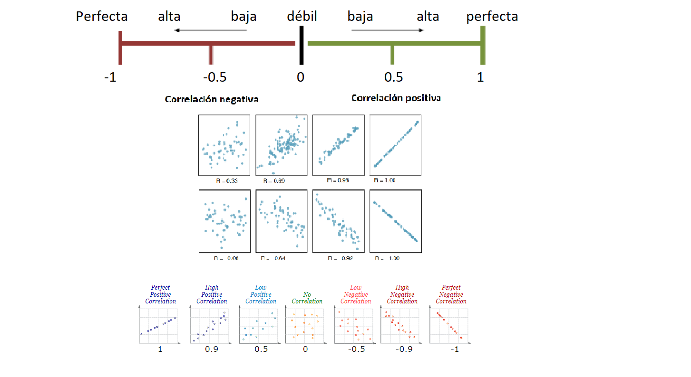
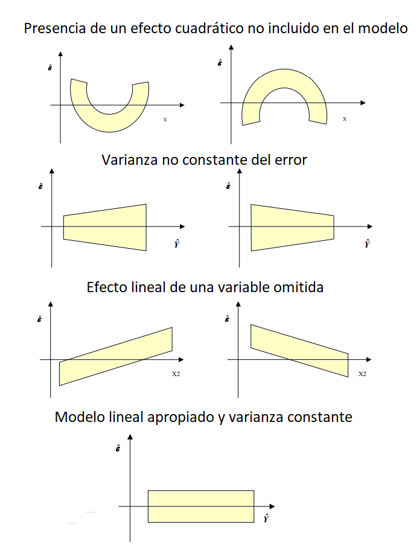
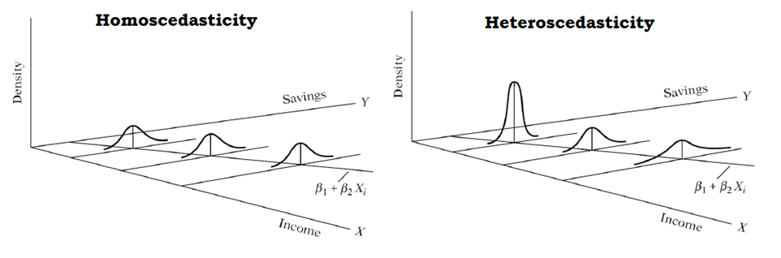

**Gráfico de dispersión**

Diagrama matemático que utiliza las coordenadas cartesianas para mostrar los valores de dos variables cuantitativas, de la forma (x,y), aunque también se puede incluir una variable cualitativa. Sirve para la detección de puntos atípicos.

En el siguiente diagrama se ilustra la presión atmosférica en relación a la temperatura

```{r pressure, echo = TRUE}
plot(pressure)

```


En el siguiente diagrama se ilustra el ancho y el largo de la hoja en relación al tipo de planta.

```{r}
library(ggplot2)
p <- ggplot(iris, aes(x = Petal.Length, y = Petal.Width, colour = Species))

p <- p + geom_point()
p


```


 **Actividad**

Elabore en su cuaderno un gráfico de dispersión de los siguientes datos, identificando con colores diferentes  el tipo de tapa.

|Hojas  |Peso|Tipo de tapa|
|-------|----|------------|
|885 |800 | dura |
|1016|950 | dura |
|1125|1050| dura |
|239 |350 |dura  |
|701 |750 |dura  |
|641 |600 |dura  |
|1228|1075|dura  |
|412 |250 |blanda|
|953 |700 |blanda|
|929 |650 |blanda|
|1492|975 |blanda|
|419 |350 |blanda|
|1010|950 |blanda|
|595 |425 |blanda|
|1034|725 |blanda|


# **Regresión lineal simple**

Permite establecer asociaciones entre variables de interés, entre las cuáles la relación usual no es necesariamente de causa efecto. El objetivo es obtener estimaciones razonables de Y para distintos valores de X a partir de una muestra de n pares de valores (x1, y1), . . . ,(xn, yn).


El modelo más simple de regresión corresponde a: 
$$\Large y_i=\beta_0 +\beta_1 X_i+\varepsilon_i$$


Donde:

$\Large y_i$Es la variable respuesta o dependiente para la i-ésima observación\


$\Large \beta_0$ Intercepto\


$\Large \beta_1$ Pendiente\


$\Large X_i$ Variable predictora independiente para la i-ésima observación\


$\Large \varepsilon_i$ Error aleatorio para la i-ésima observación\


$$\Large \varepsilon_i \sim N (0,\sigma^2)$$


 **Objetivos de la regresión lineal**

- Construir un modelo que describa el efecto o relación entre una variable X sobre otra variable Y. 

- Obtener estimaciones puntuales de los parámetros de dicho modelo. 

- Estimar el valor promedio de Y para un valor de X 

- Predecir futuros de la variable respuesta Y

**Ejemplos**

- Estudiar cómo influye la estatura del padre sobre la estatura del hijo. 

- Estimar el precio de una vivienda en función de su área.

- Aproximar la calificación obtenida en una materia según el numero de horas de estudio semanal. 

## **Métodos de estimación del modelo de regresión lineal**


**Estimación por máxima verosimilitud**


En inglés maximum likelihood estimation (MLE), Consiste en encontrar los parámetros del modelo (coeficientes) que maximizan la probabilidad de obtener los datos observados.

\begin{eqnarray*}
L\left(\beta_0, \beta_1, \sigma^2 | X_1, \ldots, X_n, Y_1, \ldots, Y_n \right)&=&\prod_{i=1}^n\frac{1}{\sqrt{2\pi\sigma^2}}\exp\left\{-\frac{1}{2\sigma^2}(Y_i-\beta_0-\beta_1X_i)^2\right\}\\
&=&\frac{1}{(2\pi\sigma^2)^{n/2}}\exp\left\{-\frac{1}{2\sigma^2}\sum_{i=1}^n(Y_i-\beta_0-\beta_1X_i)^2\right\}
\end{eqnarray*}

**Estimador de mínimos cuadrados ordinarios**

Gauss propuso en 1809 el método de mínimos cuadrados para obtener los valores $\hat{\beta_0}, \hat {\beta_1}$ que mejor se ajustan a los datos:

$$\Large y_i=\beta_0+\beta_1x_i+\varepsilon_i$$

El método consiste en minimizar la suma de los cuadrados de las distancias verticales entre los datos y las estimaciones, es decir, minimizar la suma de los residuos al cuadrado:


$$\Large \sum_{i=1}^n(y_i-\hat{y_i})^2=
\sum_{i=1}^n (y_i-(\hat{\beta_0}+ \hat{\beta_1}x_i))^2$$


el resultado que se obtiene es:

$$\Large \hat{\beta_1}=\frac{S_{xy}}{S_{xx}}=\frac{cov(x,y)}{S_{xx}}=\frac{\sum_{i=1}^{n}(x_i-\bar{x})(y_i-\bar{y})}{\sum_{i=1}^{n}(x_i-\bar{x})^2}$$

A las cantidades $\Large S_{xx}$ y $\Large S_{xy}$ se les conoce como suma corregida de cuadrados y suma corregida de productos cruzados de x y y, respectivamente
$$\Large \hat{\beta_0}=\bar{y}-\hat{\beta_1}\bar{x}$$

```{r fig.asp=0.5, fig.align='right', echo=FALSE}
library(png)
library(grid)
IM3 <- readPNG("mc.png")
grid.raster(IM3)
```
**Significado de $\beta_0$ y $\beta_1$**

- $\Large \beta_0$ es el intercepto

- $\Large \beta_1$ es el valor de la pendiente, es decir que por cada unidad que aumente variable independiente, la variable dependiente aumenta $\beta_1$ unidades.

**Otros tipos de mínimos cuadrados**


|**Tipo: Mínimos cuadrados**| **Definición**                |**Usos**|
|:------------|:----------------------------------------------|:-------------------------:|
|**Lineales u Ordinarios (MCO)**|Se utiliza en modelos con coeficientes lineales, como RLS o RLM. El objetivo es encontrar la línea en RLS o hiperplano en RLM, que minimice la suma de los residuos al cuadrado.|
|**Ponderados**|Funciona cuando la varianza de los residuos no es constante. Asigna pesos a cada punto de datos, dan más importancia a las observaciones con menor varianza.|
|**Robustos**| Diseñados para conjuntos de datos con valores atípicos. Utiliza técnicas iterativas de reponderación para reducir el impacto de los valores atípicos.|En modelación financiera, para tener en cuenta las caídas extremas del mercado.|
|**No lineales**|se utilizan cuando en modelos no lineales en sus coeficientes. requieren técnicas de optimización iterativas (como Gauss-Newton o Levenberg-Marquardt) para encontrar el mejor ajuste.||
|**Totales**|útiles cuando la variable independiente como la dependiente tienen errores de medición. Este método tiene en cuenta los errores en todas las variables. | útil en astronomía y la geodesia (Medición de la forma de la Tierra y el campo gravitatorio), donde los errores de medición están presentes en todas las dimensiones debido al alto nivel de precisión necesario.|
|**Generalizados**|Aborda los retos que plantean los residuos correlacionados. los datos se transforman para aplicar los MCO, utilizando la matriz de covarianza de los residuos para tener en cuenta su estructura de correlación, lo que permite unas estimaciones más precisas de los parámetros.|Útil en el análisis de series temporales, en los que los residuos presentan autocorrelación|


## **Medidas de dependencia lineal**

### Covarianza

La covarianza indica el grado de variación conjunta de dos variables aleatorias respecto a sus medias

$$\Large cov(x,y)=\frac{\sum_{i=1}^{n}(x_i-\bar{x})(y_i-\bar{y})}{(n-1)}$$
- Si hay relación lineal positiva, la covarianza será positiva y grande.

- Si hay relación lineal negativa, la covarianza será negativa y grande en valor absoluto.

- Si no hay relación entre las variables la covarianza será próxima a cero.

- La covarianza depende de las unidades de medida de las variables.

### Coeficiente de correlación

Indica la fuerza y la dirección de una relación lineal y proporcionalidad entre dos variables cuantitativas estadísticas.


$$\Large cor(x,y)=\frac{\sum_{i=1}^{n}(x_i-\bar{x})(y_i-\bar{y})}
{\sqrt{\sum_{i=1}^{n}(x_i-\bar{x})^2\sum_{i=1}^{n}(y_i-\bar{y})^2 }}$$


**Características del coeficiente de correlación**

- Rango entre -1 y 1

- Valores cercanos a -1 la relación es fuertemente negativa.

- Valores cercanos a 1 la relación es fuertemente positiva.

- Valores cercanos a 0 la relación es débil, es decir no hay una relación lineal

|Rangos de correlación (r)|Grado de asociación|
|:-----------------------:|:-----------------:|
|(0,0.2)                  |Débil, sin relación|
|(0.2,0.4)                | Baja              | 
|(0.4,0.6)                | Moderada          |
| (0.6,0.8)               | Fuerte            |
|(0.8,1)                  | Muy fuerte        |       


```{r echo=F, fig.asp=1, fig.align='center'}

```


 **Cómo obtener un modelo de regresión lineal simple en la calculadora**
 
<iframe width="280" height="160" src="https://www.youtube.com/embed/4_WO31Dapv0" frameborder="0" allow="accelerometer; autoplay; encrypted-media; gyroscope; picture-in-picture" allowfullscreen></iframe>


**Prueba de significancia de la correlación**

Podemos chequear la significancia de la correlación a través del siguiente juego de hipótesis.

$$\Large H_0:  r=0$$
$$\Large H_1:  r\not=0$$


En R usamos la función cor.test() para estudiar la significación estadística del coeficiente y concluir sobre la posible existencia de relación lineal entre las variables.

**Ejemplo**
Retomando el ejemplo de las flores, la base de datos iris contiene diferentes variables cuantitativas, largo y ancho del sépalo y largo y ancho del pétalo, asi como de las especies 

```{r echo=F, fig.asp=1, fig.align='center'}

```


```{r}
head(iris)

library(PerformanceAnalytics)
library(ppcor)
#matriz de correlaciones
pcor(iris[1:4])

#matriz con grafico de dispersión 
chart.Correlation(iris[1:4], histogram = T, pch = 19,col=as.factor(iris$Species))

```
```{r}
# install.packages("GGally")
library(GGally)

ggpairs(iris, columns = 1:4, aes(color = Species, alpha = 0.5),
        lower = list(continuous = "smooth")) 

```


### Medida de bondad de ajuste $R^2$

Mide la proporción de la variabilidad total observada en la respuesta que es explicada por la asociación lineal.
Por ser una proporción, esta cantidad varía entre 0 y 1, siendo igual a 0 cuando todos los coeficientes de regresión ajustados son iguales a cero, y es igual a 1 si todas las observaciones caen sobre la superficie de regresión ajustada. Definido como:


$$\Large R^2=1-\frac{SSE}{SST}=1-\frac{\sum_{i=1}^n (y_i-\hat{y_i})^2}{\sum_{i=1}^n (y_i-\bar{y_i})^2}$$
Donde

SSE: es la suma de cuadrados del error


SST: suma de cuadrados totales


## **Residuales**


La diferencia de cada valor $y_i$ de la variable respuesta y su estimación $\hat{y_i}$ se llama residuo,se espera que los residuales tengan media cero y varianza de 1:
$$\Large e_i= y_i- \hat{y_i}$$

```{r fig.asp=0.5, fig.align='right', echo=FALSE}
library(png)
library(grid)
IM4 <- readPNG("img4.png")
grid.raster(IM4)
```


A través del análisis de residuales del modelo es posible detectar la linealidad entre las variables X e Y, la media cero, varianza constante, incorrelación, y normalidad.
son útiles para identificar valores atípicos, puntos influyentes y comprobar los supuestos del modelo.

### **Tipos de residuales**

|Tipo      |Definición |Fórmula|Función en R|
|:------|:--------------------:|:------:|:------------:|
|**Ordinarios**|Diferencia de cada valor $y_i$ de la variable respuesta y su estimación $\hat{y_i}$ |$e_i= y_i- \hat{y_i}$| residuals(mod)|
|**Estandarizados**|Se calculan dividiendo el residual por su desviación estándar (MSE)|$$\large d_i=\frac{\hat \varepsilon_i}{\sqrt{MSE}}$$|rstandard(mod)|
|**Estudentizados** o jackknife|Se calculan utilizando una estimación de la desviación estándar del modelo, donde se elimina la observación actual. |$$ r_i=\frac{\hat \varepsilon_i}{\sqrt{MSE(1-h_{ii})}}$$|rstudent(mod)|
|**Pearson**|Se utilizan en modelos lineales generalizados, como la regresión logística y de Poisson |$$r_i=\frac{obs_i-esp_i}{\sqrt{var\quad esp_i}}$$|residuals(mod, type='pearson')|
|**PRESS**|Mide el error que comete el modelo al predecir un punto que nunca ha visto|$$e_i=y_i-\hat y_{i(-i)}$$||


En general un residual grande, es cuando su valor es superior a 3 $(|di| > 3)$, lo cual  es indicio de una observación atípica potencial.


**Leverage o apalancamiento $h_{ii}$** 

Es una medida de qué tan lejos están los valores de las variables predictoras (variables X) de una observación específica con respecto a la media de todas las variables predictoras.

*Alto Leverage:*  Se encuentra geográficamente lejos del "centro de gravedad" de los datos en el espacio de las variables X. Estos puntos tienen un peso desproporcionado en la determinación de la pendiente de la línea de regresión.

*Bajo Leverage:* Cerca de la media de las variables X y tiene un impacto mínimo en la forma final de la línea de regresión.


**Fórmula**

El apalancamiento para la  i-ésima observación, denotado como $h_{ii}$, es el i-ésimo elemento diagonal de la matriz hat H.

$$h_{ii}=\frac{1}{n}+\frac{(x_i-\bar x)^2}{\sum_{j=1}^n (x_j-\bar x)^2}$$


**Otros diagnósticos con residuales grandes**

|**Nombre**|       **Definición**|**Cómo se detecta**|**Rstudio**|
|:---------|:-------------------------:|:------------:|:--------|
|**Outlier**|Es un valor atípico con un valor Y (variable dependiente) inusual o extremo|si $d_i$ ó $r_i$ son mayores a 3|outlierTest(md)|
|**Punto Influyente**| Punto que si se elimina del conjunto de datos, cambiaría los coeficientes del modelo de regresión|las observaciones que presenten Distancia de cook $D_i>1$| influence.measures(md)|
|**Punto balanceo**|Afecta las medidas de bondad de ajuste como $R^2$|| influence.measures(md)|


**Distancia de cook $D_i$**

Es una medida de cómo influye la observación i-ésima sobre la estimación de β al ser retirada del conjunto de datos. Una distancia de Cook grande significa que una observación tiene un peso grande en la estimación de β.


### **Supuestos de los residuales** 

1. Normalidad
2. Varianza constante
3. Valores incorrelacionados


**Normalidad**

Se puede evaluar mediante el gráfico qqplot, en el cual los puntos residuales deben estar alineados con la diagonal, dicha normalidad también se puede evaluar con la prueba de normalidad de shapiro- wilk, con el juego de hipótesis:

$H_o:$Los residuos son normales

$H_1:$Los residuos no son normales


**Varianza constante**

Mediante gráficos de residuales vs. respuesta ajustada y vs. predictora X. Los residuos están distribuidos alrededor del cero y el gráfico no presenta ninguna tendencia, entonces el modelo se considera adecuado. 

- Si se observa una tendencia, estaríamos violando el supuesto de linealidad, 

- Si se observa una nube de puntos en forma de embudo, podemos tener problemas con el supuesto de homogeneidad de varianzas, también conocido como supuesto de homocedasticidad.

```{r fig.asp=0.8, fig.align='center', echo=FALSE}

```

*Prueba de homocedasticidad*

La homocedasticidad se refiere a la propiedad en la que la varianza de los errores del modelo se mantiene constante a lo largo de todas las observaciones de la variable independiente.


```{r fig.asp=0.8, fig.align='center', echo=FALSE}

```

La prueba de hipótesis para verificar la homogeneidad de varianzas es:


$$H_0:\quad Los \quad errores \quad tienen \quad varianza \quad constante$$

$$H_1:\quad Los \quad errores \quad no \quad tienen \quad varianza \quad constante$$


*Prueba de Breusch-Pagan (1979)*

Consiste en ajustar un modelo de regresión lineal con variable respuesta dada por residuales del modelo original al cuadrado  $e_i^2$ y como covariables las variables del modelo original.

Por ejemplo, si se tienen  k=2 covariables para explicar a  Y, entonces el modelo de regresión para estudiar la homocedasticidad es:

$$e^2_i= δ_0+δ_1x_1+δ_2x_2+u$$
 

Si se concluye que $δ_1=δ_2=0$, significa que los residuales no son función de las covariables del modelo. 

La función bptest del paquete lmtest Zeileis and Hothorn (2002) implementa esta prueba.


**Incorrelación**

Los errores del modelo son independientes entre sí. implica que el valor de un residuo no proporciona información sobre el valor de otro residuo, es decir, no hay autocorrelación. Esta independencia se verifica comúnmente analizando gráficos de residuos o mediante el test de Durbin-Watson o El test de Breusch–Godfrey. 

*Juego de hipótesis*


$H_0$: Residuos incorrelacionados


$H_1$: Residuos correlacionados

_____________________________________________________________________________________________________________________________________________________________________________________________________________________________________________________________________________________________

**Ejemplo**

Los siguientes datos proveen las velocidades en metros por segundo y las distancias necesarias para frenar en metros

```{r echo = TRUE}
head(cars)
```

En este caso ¿Cuál es la variable dependiente e independiente?


Para este modelo el modelo de regresión lineal simple es:

$$\Large \hat{y}=-17.57+3.93x$$
Donde 

- X representa la velocidad en metros por segundo

- y es la distancia de frenado en metros

- Por cada unidad que aumenta la velocidad la distancia de frenado aumenta 3.93 unidades

**Resultados del modelo en R**

```{r echo=TRUE}
library(lmtest)
cor(cars$speed,cars$dist)

##Ajuste modelo de regresión lineal simple

md=lm(cars$dist~cars$speed)
summary(md)

## Grafica de dispersión con la linea estimada sobrepuesta
plot(cars$speed,cars$dist, col=2, lwd=2)
abline(a=-17.57,b=3.93)


## Analisis de residuales

## tipos de residuales
cbind(ei=residuals(md, type='working'),
      pi=residuals(md, type='pearson'),
      di=rstandard(md),
      ri=rstudent(md))
##Graficos de residuales
par(mfrow=c(2,2))
plot(md,col='deepskyblue4', pch=19)

## prueba de normalidad en residuales del modelo
## Ho:Los residuos son normales
## H1:Los residuos no son normales

rr=residuals(md)
shapiro.test(rr)

##prueba de varianza constante
## H0: Los errores tienen varianza constante
## H1: Los errores no tienen varianza constante
bptest(md)

###prueba de incorrelación de residuales del modelo
## H0: Residuos incorrelacionados
## H1: Residuos correlacionados

dwtest(md, data = cars)
bgtest(md, order =1, data = cars)


library(car)

## detección de puntos de influencia
influence.measures(md)
library(car)
influenceIndexPlot(md, vars="Cook")

## detección de outlier
outlierTest(md, n.max=4)


## Quitando observaciones atipicas y puntos de influencia
cars2<-cars[-c(1,2,23,49,50),]
cars2


##volviendo a estimar el modelo
md1=lm(cars2$dist~cars2$speed)
summary(md1)

AIC(md,md1)

```

**Validación cruzada de ambos modelos**


|modelo     |AIC   |$R^2$|$\beta_0$|$\beta_1$|error|
|:----------|:----:|:---:|:-------:|:-------:|:---:|
|Completo   |419.15|65.11|-17.58   |3.93     |15.38|
|Sin outlier|362.27|64.82|-17.28   | 3.76    |12.97|


## **Analisis de varianza ANOVA**


**Suma de cuadrados del error**

La varianza de los términos de error $\varepsilon_i$, es decir, $V[\varepsilon_i]=\sigma^2$, da un indicador de la variabilidad de las distribuciones de probabilidad de Y para los distintos valores de X. En este caso la suma cuadrática de errores o residuales es:

$$\Large SSE=\sum_{i=1}^{n}(y_i-\hat{y_i})^2=\sum_{i=1}^n e^2_i$$
**Media cuadrática del error MSE**

La SSE tiene asociada n−2 grados de libertad (gl), pues se pierden 2 (gl) al estimar $\beta_0$ y $\beta_1$, para obtener a $\hat{y_i}$, de lo anterior se obtiene la media cuadática de errores (MSE) dada por:

$$\Large MSE=\frac{SSE}{n-2}=\frac{\sum_{i=1}^{n}(y_i-\hat{y_i})^2}{n-2}=\frac{\sum_{i=1}^n e^2_i}{n-2}$$

Se puede demostrar que MSE, es un estimador insesgado de $\Large \sigma^2$ para el modelo de RLS, es decir que:

$$\Large \sigma^2=MSE$$
Además
$$\Large E(MSE)=\sigma$$


**Suma total de cuadrados**

La medida de variación de y alrededor de la la media muestral $\bar{y}$ es:
$$\Large SST=\sum_{i=1}^n(Y_i-\bar{Y})^2$$

**Suma cuadrática de regresión**

La diferencia entre la SST y la SSE se denota por:

$$\Large SSR=\sum_{i=1}^n(\hat{Y_i}-\bar{Y})^2$$

La SSR es una medida de la parte de la variabilidad de las observaciones $y_i$, la cual está asociada con la línea de regresión ajustada.

De lo anterior, se obtiene la identidad fundamental del análisis de varianza, la cual está dada por:

$$\Large SST = SSR + SSE$$

**Medias cuadráticas** se obtienen de dividir las SS por sus respectivos grados de libertad


|Suma de cuadrados|Fórmula|componente| variabilidad                     |Grados de libertad|medias cuadráticas          |
|:-----:|:--------------:|:---------:|:-------------------------------------------|:----------------:|:----------------:|
|**SSR**|$\sum_{i=1}^n(\hat{Y_i}-\bar{Y})^2$|regresión|del modelo o por las variables regresoras|1|$MSR=\frac{SSR}{1}$  |
|**SSE**|$\sum_{i=1}^{n}(y_i-\hat{y_i})^2$  | error   |no explicada por el modelo o error     |n−2|$MSE=\frac{SSE}{n-2}$|
|**SST**|$\sum_{i=1}^n(Y_i-\bar{Y})^2$      |totales  |muestral total  |n−1                       |$MST=\frac{SST}{n-1}$|


**Tabla de resumen del análisis de varianza**

|Factor   |Grados de libertad|Suma de cuadrados|Medias cuadráticas|Estadístico|
|---------|------------------|-----------------|------------------|-----------|
|Regresión|1                 |SSR              |MSR               |Fc         |
|Error    |n-2               |SSE              |MSE               |           |
|Total    |n-1               |SST              |MST               |           |


### **Test lineal general**

Se desea probar la significancia del modelo de regresión lineal

**Hipótesis nula: **  


$\Large H_0:$ el modelo de regresión no es significativo


**Hipótesis alternativa:**  

$\Large H_1:$: el modelo de regresión es significativo


El estadístico de prueba corresponde a 

$$\Large F_c=\frac{MSR}{MSE}\sim F_{(1,n-2)}$$


### **Prueba de significancia de los parámetros**


Considere las siguientes afirmaciones, las cuales son llamadas pruebas de hipótesis o prueba de significancia de la regresión:

Hipótesis nula:   


$\Large H_0: \beta_i=0$ el parámetro no es significativo


Hipótesis alternativa:  

$\Large H_1: \beta_i \not= 0$: el parámeto es significativo


## **Test de carencia de ajuste**

Sirve para Verificar si el modelo lineal ajusta adecuadamente a los datos. El test asume que los valores de Y dado X son:

- Independientes,   
- Se distribuyen en forma normal
- Tienen varianza constante

Esta prueba *requiere que en uno o más valores de X haya más de una observación de Y*. Los ensayos repetidos de manera independiente para el mismo nivel de la variable predictora son denominados replicaciones.

Para explicar en qué consiste esta prueba, es necesario modificar la notación usada de la siguiente manera, asumiendo que tenemos réplicas de la respuesta en un valor o nivel dado de X:

$Y_{ij}$ La respuesta i-ésima en el j –ésimo nivel de X.

$X_j$ El j-ésimo nivel de valores de X, supondremos j=1, 2,…, k

$n_j$ Número de observaciones de Y tomadas en el j-esimo nivel de X.


Se define primero un modelo lineal general (**modelo completo**) que corresponde a

$$ Y_{ij}=\mu_j+\varepsilon_{ij}$$ 

donde $\mu_j=E(y_{ij})$, es decir, es la media de la variable respuesta en el j-ésimo nivel de X.

Para el anterior modelo, los estimadores de máxima verosimilitud corresponden a $\hat \mu=\bar Y_j$, es decir, la media muestral de Y en el nivel j de X. Esta cantidad también corresponde al valor predicho para Y en el nivel j de X. Por tanto, la suma de cuadrados del error del modelo general o **suma de cuadrados del error puro** cuyos grados de libertad son n-k, es dada por:

$$SSPE=\sum_{j=1}^k\sum_{i=1}^{n_j}({Y_{ij}-\bar Y_j})^2$$
Se define ahora el **modelo lineal reducido** para la hipótesis nula de la prueba, el cual, para el caso de la regresión lineal es $E(Y|X)=\beta_0+\beta_1 X$ luego la prueba formula que:

$$H_0=E(Y|X)=\beta_0+\beta_1 X $$
$$H_1=E(Y|X)\neq \beta_0+\beta_1 X $$


La suma de cuadrados del error:

$$SSE:\sum_{i=1}^{n}\sum_{j=1}^{k}(y_{ij}-\hat{y_j})^2$$
se puede descomponer en:

$$SSE=SSPE+SSLOF$$

suma de cuadrados del error=suma de cuadrados del error puro + suma de cuadrados de carencia de ajuste 

$$SSLOF=SSE-SSPE$$

El estadístico de prueba es:

$$F_0=\frac{SSLOF/(k-2)}{SSPE/(n-k)}$$

En la tabla ANOVA puede presentar el test de carencia de ajuste descomponiendo el SSE del modelo:


|Fuente de variación|Grados de libertad|Suma de cuadrados|Medias cuadráticas|Estadístico|
|-------------------|------------------|-----------------|------------------|-----------|
|Regresión          |1                 |SSR              |MSR               |Fc         |
|Error              |n-2               |SSE              |MSE               |           |
|carencia de ajuste |k-2               |SSLOF            |MSLOF             | FO        |
|Error puro         |n-k               |SSPE             |                  |           |
|Total              |n-1               |SST              |                  |           |


En general, la prueba de carencia de ajuste puede aplicarse a otras funciones de regresión, sólo se requiere modificar
los grados de libertad del SSLOF, que en general corresponden a k-p , donde p es el número de parámetros en la
función de regresión. Para el caso específico de la regresión lineal simple, p=2.

**Ejemplo**

Los siguientes datos se recolectaron con el fin de determinar la relación existente entre el peso corporal del ganado vacuno (X)
y la rapidez de eliminación metabólica/peso corporal (Y). Los datos que aparecen a continuación son el resultado de varias
realizaciones del experimento, en distintos niveles del peso.

```{r}

peso=c(110,110,110,230,230,230,360,360,360,360,505,505,505,505)
elimina=c(235,198,173,174,149,124,115,130,102,95,122,112,98,96)

datos=data.frame(peso, elimina)


#ajusta el modelo lineal

regre=lm(elimina~peso)
summary(regre)
anova(regre)


plot(peso,elimina)
abline(a=212.72,b=-0.23,col=2)


## residuales del modelo

res=residuals(regre)
shapiro.test(res)


#prueba de carencia de ajuste

regres1=lm(elimina~peso) #Ajusta modelo de regresión y da el error total SSE
regres2=lm(elimina~factor(peso)) #Ajusta modelo lineal general o completo y da su error puro
#SSPE
anova(regres1,regres2) #Compara los dos modelos anteriores y obtenemos el SSLOF, los grados
#de libertad correspondientes,


```

Observe que la variable explicatoria X fue observada en cuatro niveles: 110, 230, 360 y 505, es decir, tenemos réplicas de la
variable respuesta en al menos un nivel de X.


1. Indique qué información nos proporciona el análisis del gráfico de Y vs. X acerca de:
a) El tipo de relación funcional entre Y vs. X (¿lineal o no lineal?)

b) El comportamiento de la varianza de Y en cada nivel de X observado ¿Es constante o no? ¿Si no es constante,
cómo cambia?

2. Ajuste el modelo de regresión lineal simple y determine lo siguiente
a) Interprete los valores ajustados de los parámetros.

b) Realice la prueba de significancia de la regresión (mediante la tabla ANOVA)

c) Realice los test de significancia de cada parámetros (pruebas t).


3. Calcule los residuales y responda lo siguiente:

a) De acuerdo a los gráficos de residuales, determine si el supuesto de varianza constante para los respectivos
errores se cumple o no.

b) Ahora realice los test de normalidad sobre los errores del modelo, use e interprete los resultados del test de
Shapiro Wilk y el gráfico de probabilidad.

4. Considere de nuevo los gráficos de residuales vs. X, calcule la ANOVA para el test de carencia de ajuste del modelo y
determine si

a) ¿Hay carencia de ajuste del modelo postulado para la respectiva respuesta media? (Formule completamente el
test de hipótesis, el estadístico de prueba y los resultados)

b) Caso que exista carencia de ajuste ¿Qué modelos serían más apropiados? ¿Por qué?


## **Validación cruzada**

Se utiliza para:

- Comparar la Regresión Lineal con otros modelos predictivos.

- Seleccionar el número de predictores o el grado polinomial adecuado.

### Akaike Information Criterion (AIC)

El AIC se define como:

$$AIC=-2*LogLik+k*n_{par}$$
donde:

- $LogLik$ Logverosimilitud del modelo para el vector de parámetros Θ

- k valor de penalización por el exceso de parámetros 

- $n_{par}$ corresponde al número de parámetros del modelo.

Se debe recordar siempre que el mejor modelo es aquel que:

- Tiene mayor $LogLik$ 

- Tiene menor $AIC$

Cuando el valor de penalización $k=log(n)$ entonces el $AIC$ se llama $BIC$

### $R^2$ Coeficiente de determinación muestral

- Proviene de la razón SSR/SST (Suma de cuadrados de la regresión/ suma de cuadrados totales).

- Proporción de la variabilidad total observada en la variable respuesta, que es explicada por la relación lineal con la variable predictora considerada. 

- No garantiza que los supuestos básicos del modelo lineal se estén cumpliendo.

AIC


```{r}
pressure
```
### Error de pronóstico medio MAPE

Es importante evaluar la capacidad predictiva del modelo. Esta medida compara promedia la diferencia entre los valores observados con los pronosticados. Dado por la fórmula:

$$\Large MAPE=\frac{\sum_{i=1}^n |\frac{y_i-\hat{y_i}}{y_i}|}{n}$$


## **Transformaciones**
sea el modelo lineal de la forma:

$$Y_i=\beta_0+\beta_1x+\varepsilon_i$$
En el caso de que los errores no resulten normales o la varianza no sea constante, se pueden realizar transformaciones sobre la variable respuesta y/o sobre las variables predictoras ejemplo:


|Denominación|transformación|modelo|
|:-----------|:------------:|:----:|
|            |              |      |
|Exponencial multiplicativo|$log(Y_i)=\beta_0*+\beta_1 X_i+\varepsilon_i*$| $y=\beta_0*e^{\beta_1x}\varepsilon$|
||||
|Potencial multiplicativo|$Y_i=\beta_0*+\beta_1log(X_i)+\varepsilon_i*$|$Y_i=\beta_0*X^{\beta_1}\varepsilon$|$y=\beta_0*X^{\beta_1}\varepsilon$|
||||
|Logarítmico|$Y_i=\beta_0+\beta_1 ln{X_i}+\varepsilon_i$|$Y_i=\beta_0+\beta_1 ln{X_i}+\varepsilon_i$|
||||
|Recíproco|$Y_i=\beta_0*+\beta_1 (1/X_i)+\varepsilon_i*$|$Y_i=\beta_0*+\beta_1 (1/X_i)+\varepsilon_i*$|

Se debe tener cuidado cuando se transforma la variable respuesta, ya que pueden resultar nuevas variables carentes de interpretación práctica según el fenómeno o contexto al cual pertenece la variable respuesta.

Para ver un ejemplo puede consultar el libro de regresión lineal del profesor fredy [Aqui](https://fhernanb.github.io/libro_regresion/trans.html#transformaciones-para-linealizar-el-modelo)

Si las desviaciones respecto al supuesto de normalidad son severas, y ninguna transformación resulta útil y/o interpretable, existe otra alternativa, los llamados modelos lineales generalizados con los cuales se pueden modelar respuestas que no se distribuyen normales; sin embargo, tales modelos están más allá del alcance de este curso.


