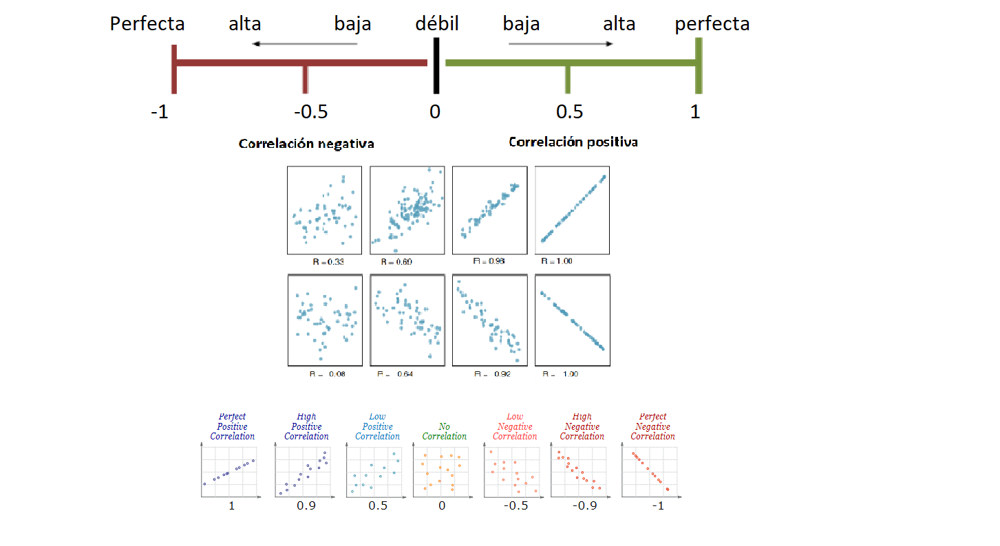
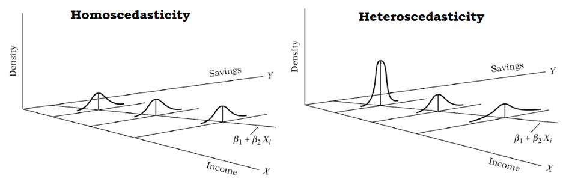

```{r setup, include = FALSE}
knitr::opts_chunk$set(
  collapse = TRUE,
  comment = "#>"
)
```


## **Gráfico de dispersión**

Diagrama matemático que utiliza las coordenadas cartesianas para mostrar los valores de dos variables cuantitativas, de la forma (x,y), aunque también se puede incluir una variable cualitativa. Sirve para la detección de puntos atípicos.


En el siguiente diagrama se ilustra la presión atmosférica en relación a la temperatura

```{r pressure, echo = TRUE}
plot(pressure)

```


En el siguiente diagrama se ilustra el ancho y el largo de la hoja en relación al tipo de planta.

```{r}
library(ggplot2)
p <- ggplot(iris, aes(x = Petal.Length, y = Petal.Width, colour = Species))

p <- p + geom_point()
p


```


 **Actividad**

Elabore en su cuaderno un gráfico de dispersión de los siguientes datos, identificando con colores diferentes  el tipo de tapa.

|Hojas  |Peso|Tipo de tapa|
|-------|----|------------|
|885 |800 | dura |
|1016|950 | dura |
|1125|1050| dura |
|239 |350 |dura  |
|701 |750 |dura  |
|641 |600 |dura  |
|1228|1075|dura  |
|412 |250 |blanda|
|953 |700 |blanda|
|929 |650 |blanda|
|1492|975 |blanda|
|419 |350 |blanda|
|1010|950 |blanda|
|595 |425 |blanda|
|1034|725 |blanda|


## **Regresión lineal simple**


Permite establecer asociaciones entre variables de interés, entre las cuáles la relación usual no es necesariamente de causa efecto. El objetivo es obtener estimaciones razonables de Y para distintos valores de X a partir de una muestra de n pares de valores (x1, y1), . . . ,(xn, yn).


El modelo más simple de regresión corresponde a: 
$$\Large y_i=\beta_0 +\beta_1 X_i+\varepsilon_i$$


Donde:

$\Large y_i$Es la variable respuesta o dependiente para la i-ésima observación\


$\Large \beta_0$ Intercepto\


$\Large \beta_1$ Pendiente\


$\Large X_i$ Variable predictora independiente para la i-ésima observación\


$\Large \varepsilon_i$ Error aleatorio para la i-ésima observación\


$$\Large \varepsilon_i \sim N (0,\sigma^2)$$


 **Objetivos de la regresión lineal**

- Construir un modelo que describa el efecto o relación entre una variable X sobre otra variable Y. 

- Obtener estimaciones puntuales de los parámetros de dicho modelo. 

- Estimar el valor promedio de Y para un valor de X 

- Predecir futuros de la variable respuesta Y

**Ejemplos**

- Estudiar cómo influye la estatura del padre sobre la estatura del hijo. 

- Estimar el precio de una vivienda en función de su área.

- Aproximar la calificación obtenida en una materia según el numero de horas de estudio semanal. 


### Estimador de mínimos cuadrados

Gauss propuso en 1809 el método de mínimos cuadrados para obtener los valores $\hat{\beta_0}, \hat {\beta_1}$ que mejor se ajustan a los datos:

$$\Large y_i=\beta_0+\beta_1x_i+\varepsilon_i$$

El método consiste en minimizar la suma de los cuadrados de las distancias verticales entre los datos y las estimaciones, es decir, minimizar la suma de los residuos al cuadrado:


$$\Large \sum_{i=1}^n(y_i-\hat{y_i})^2=
\sum_{i=1}^n (y_i-(\hat{\beta_0}+ \hat{\beta_1}x_i))^2$$


el resultado que se obtiene es:

$$\Large \hat{\beta_1}=\frac{S_{xy}}{S_{xx}}=\frac{cov(x,y)}{S_{xx}}=\frac{\sum_{i=1}^{n}(x_i-\bar{x})(y_i-\bar{y})}{\sum_{i=1}^{n}(x_i-\bar{x})^2}$$

A las cantidades $\Large S_{xx}$ y $\Large S_{xy}$ se les conoce como suma corregida de cuadrados y suma corregida de productos cruzados de x y y, respectivamente
$$\Large \hat{\beta_0}=\bar{y}-\hat{\beta_1}\bar{x}$$

```{r fig.asp=0.5, fig.align='right', echo=FALSE}
library(png)
library(grid)
IM3 <- readPNG("mc.png")
grid.raster(IM3)
```
**Significado de $\beta_0$ y $\beta_1$**

- $\Large \beta_0$ es el intercepto

- $\Large \beta_1$ es el valor de la pendiente, es decir que por cada unidad que aumente la variable independiente, la variable dependiente aumenta $\beta_1$ unidades


### Residuales

La diferencia de cada valor $y_i$ de la variable respuesta y su estimación $\hat{y_i}$ se llama residuo.
$$\Large e_i= y_i- \hat{y_i}$$


```{r fig.asp=0.5, fig.align='right', echo=FALSE}
library(png)
library(grid)
IM4 <- readPNG("img4.png")
grid.raster(IM4)
```

## **Medidas de dependencia lineal**

### Covarianza

La covarianza indica el grado de variación conjunta de dos variables aleatorias respecto a sus medias

$$\Large cov(x,y)=\frac{\sum_{i=1}^{n}(x_i-\bar{x})(y_i-\bar{y})}{(n-1)}$$
- Si hay relación lineal positiva, la covarianza será positiva y grande.

- Si hay relación lineal negativa, la covarianza será negativa y grande en valor absoluto.

- Si no hay relación entre las variables la covarianza será próxima a cero.

- La covarianza depende de las unidades de medida de las variables.

### Coeficiente de correlación

Indica la fuerza y la dirección de una relación lineal y proporcionalidad entre dos variables cuantitativas estadísticas.


$$\Large cor(x,y)=\frac{\sum_{i=1}^{n}(x_i-\bar{x})(y_i-\bar{y})}
{\sqrt{\sum_{i=1}^{n}(x_i-\bar{x})^2\sum_{i=1}^{n}(y_i-\bar{y})^2 }}$$


**Características del coeficiente de correlación**

- Rango entre -1 y 1

- Valores cercanos a -1 la relación es fuertemente negativa.

- Valores cercanos a 1 la relación es fuertemente positiva.

- Valores cercanos a 0 la relación es débil, es decir no hay una relación lineal

|Rangos de correlación (r)|Grado de asociación|
|:-----------------------:|:-----------------:|
|(0,0.2)                  |Débil, sin relación|
|(0.2,0.4)                | Baja              | 
|(0.4,0.6)                | Moderada          |
| (0.6,0.8)               | Fuerte            |
|(0.8,1)                  | Muy fuerte        |       


```{r echo=F, fig.asp=1, fig.align='center'}

```

**Prueba de significancia de la correlación**

Podemos chequear la significancia de la correlación a través del siguiente juego de hipótesis.

$$\Large H_0:  r=0$$
$$\Large H_1:  r\not=0$$


En R usamos la función cor.test() para estudiar la significación estadística del coeficiente y concluir sobre la posible existencia de relación lineal entre las variables.

**Ejemplo**
Retomando el ejemplo de las flores, la base de datos iris contiene diferentes variables cuantitativas, largo y ancho del sépalo y largo y ancho del pétalo, asi como de las especies 

```{r echo=F, fig.asp=1, fig.align='center'}
knitr::include_graphics("imagen/iris.png")
```


```{r}
head(iris)

library(PerformanceAnalytics)
library(ppcor)
#matriz de correlaciones
pcor(iris[1:4])

#matriz con grafico de dispersión 
chart.Correlation(iris[1:4], histogram = T, pch = 19,col=as.factor(iris$Species))

```
```{r}
# install.packages("GGally")
library(GGally)

ggpairs(iris, columns = 1:4, aes(color = Species, alpha = 0.5),
        lower = list(continuous = "smooth")) 

```


### Medida de bondad de ajuste $R^2$

Mide la proporción de la variabilidad total observada en la respuesta que es explicada por la asociación lineal.
Por ser una proporción, esta cantidad varía entre 0 y 1, siendo igual a 0 cuando todos los coeficientes de regresión ajustados son iguales a cero, y es igual a 1 si todas las observaciones caen sobre la superficie de regresión ajustada. Definido como:


$$\Large R^2=1-\frac{SSE}{SST}=1-\frac{\sum_{i=1}^n (y_i-\hat{y_i})^2}{\sum_{i=1}^n (y_i-\bar{y_i})^2}$$
Donde

SSE: es la suma de cuadrados del error


SST: suma de cuadrados totales

### Error de pronóstico medio MAPE

Es importante evaluar la capacidad predictiva del modelo. Esta medida compara promedia la diferencia entre los valores observados con los pronosticados. Dado por la fórmula:

$$\Large MAPE=\frac{\sum_{i=1}^n |\frac{y_i-\hat{y_i}}{y_i}|}{n}$$


 **Cómo obtener un modelo de regresión lineal simple en la calculadora**
 
<iframe width="280" height="160" src="https://www.youtube.com/embed/4_WO31Dapv0" frameborder="0" allow="accelerometer; autoplay; encrypted-media; gyroscope; picture-in-picture" allowfullscreen></iframe>


## **Test lineal general**


La varianza de los términos de error $\varepsilon_i$, es decir, $V[\varepsilon_i]=\sigma^2$, da un indicador de la variabilidad de las distribuciones de probabilidad de Y para los distintos valores de X. En este caso la suma cuadrática de errores o residuales es:

$$\Large SSE=\sum_{i=1}^{n}(y_i-\hat{y_i})^2=\sum_{i=1}^n e^2_i$$
La SSE tiene asociada n−2 grados de libertad (gl), pues se pierden 2 (gl) al estimar $\beta_0$ y $\beta_1$, para obtener a $\hat{y_i}$, de lo anterior se obtiene la media cuadática de errores dada por:

$$\Large MSE=\frac{SSE}{n-2}=\frac{\sum_{i=1}^{n}(y_i-\hat{y_i})^2}{n-2}=\frac{\sum_{i=1}^n e^2_i}{n-2}$$

Se puede demostrar que MSE, es un estimador insesgado de $\Large \sigma^2$ para el modelo de RLS, es decir que:

$$\Large \sigma^2=MSE$$
Además
$$\Large E(MSE)=\sigma$$


**Suma total de cuadrados**

La medida de variación de y alrededor de la la media muestral $\bar{y}$ es:
$$\Large SST=\sum_{i=1}^n(Y_i-\bar{Y})^2$$

**Suma cuadrática de regresión**

La diferencia entre la SST y la SSE se denota por:

$$\Large SSR=\sum_{i=1}^n(\hat{Y_i}-\bar{Y})^2$$

La SSR es una medida de la parte de la variabilidad de las observaciones $y_i$, la cual está asociada con la línea de regresión ajustada.

De lo anterior, se obtiene la identidad fundamental del análisis de varianza, la cual está dada por:

$$\Large SST = SSR + SSE$$

Aquí,
SST: Variabilidad muestral total y tiene n−1 grados de libertad.

SSR: Variabilidad explicada por el modelo o por las variables regresoras X y tiene 1 grado de libertad.

SSE: Variabilidad no explicada por el modelo o error y tiene n−2 grados de libertad.


**Medias cuadráticas**

Las medias cuadráticas se obtienen, como las SS divididas por sus respectivos grados de libertad, es decir que:

$\Large MST=\frac{SST}{n-1}$: Cuadrado medio total

$\Large MSR=\frac{SSR}{1}$:Cuadrado medio de la regresión

$\Large MSE=\frac{SSE}{n-2}$: Cuadrado medio del error


Tabla de resumen del análisis de varianza

|Factor   |Grados de libertad|Suma de cuadrados|Medias cuadráticas|Estadístico|
|---------|------------------|-----------------|------------------|-----------|
|Regresión|1                 |SSR              |MSR               |Fc         |
|Error    |n-2               |SSE              |MSE               |           |
|Total    |n-1               |SST              |MST               |           |


### Prueba de significancia de la regresión

Considere las siguientes afirmaciones, las cuales son llamadas pruebas de hipótesis o prueba de significancia de la regresión:

Hipótesis nula:   


$\Large H_0: \beta_i=0$ el parámetro no es significativo


Hipótesis alternativa:  

$\Large H_1: \beta_i \not= 0$: el parámeto es significativo

El estadístico de prueba corresponde a 

$$\Large F_c=\frac{MSR}{MSE}\sim F_{(1,n-2)}$$


## **Análisis de residuales para la validación de los supuestos**

A través del análisis de residuales del modelo es posible detectar la linealidad entre las variables X e Y, la media cero, varianza constante, incorrelación, y normalidad.


### Normalidad en los residuales

Se puede evaluar mediante el gráfico qqplot, en el cual los puntos residuales deben estar alineados con la diagonal, dicha normalidad también se puede evaluar con la prueba de normalidad de shapiro- wilk, con el juego de hipótesis:

$H_o:$Los residuos son normales

$H_1:$Los residuos no son normales


### Varianza constante

Mediante gráficos de residuales vs. respuesta ajustada y vs. predictora X. Los residuos están distribuidos alrededor del cero y el gráfico no presenta ninguna tendencia, entonces el modelo se considera adecuado. 

- Si se observa una tendencia, estaríamos violando el supuesto de linealidad, 

- Si se observa una nube de puntos en forma de embudo, podemos tener problemas con el supuesto de homogeneidad de varianzas, también conocido como supuesto de homocedasticidad.

```{r fig.asp=0.8, fig.align='center', echo=FALSE}
knitr::include_graphics("imagen/residuals.png")
```

**Prueba de homocedasticidad**

La homocedasticidad se refiere a la propiedad en la que la varianza de los errores del modelo se mantiene constante a lo largo de todas las observaciones de la variable independiente.


```{r fig.asp=0.8, fig.align='center', echo=FALSE}

```

La prueba de hipótesis para verificar la homogeneidad de varianzas es:


$$H_0:\quad Los \quad errores \quad tienen \quad varianza \quad constante$$

$$H_1:\quad Los \quad errores \quad no \quad tienen \quad varianza \quad constante$$


**Prueba de Breusch-Pagan (1979)**

Consiste en ajustar un modelo de regresión lineal con variable respuesta dada por residuales del modelo original al cuadrado  $e_i^2$ y como covariables las variables del modelo original.

Por ejemplo, si se tienen  k=2 covariables para explicar a  Y, entonces el modelo de regresión para estudiar la homocedasticidad es:

$$e^2_i= δ_0+δ_1x_1+δ_2x_2+u$$
 

Si se concluye que $δ_1=δ_2=0$, significa que los residuales no son función de las covariables del modelo. 

La función bptest del paquete lmtest Zeileis and Hothorn (2002) implementa esta prueba.

**Otros diagnósticos**

Además de la validación de supuestos debemos chequear la presencia de:

- Observaciones atípicas
- Puntos de balanceo
- Observaciones influyentes

Que corresponden a observaciones alejadas del resto de la muestra, que afectan los coeficientes de regresión estimados $\beta_0, \beta_1$, y las medidas de bondad de ajuste como o sı el $R^2$.

Para detectar estas observaciones atípicas construimos residuales escalados, los residuales divididos por una estimación de su error estándar.

## **Residuales escalados**

### Residuales estandarizados $d_i$

El MSE aproxima la varianza de un residual, por tanto los residuales se dividen por su desviación estándar para obtener los residuales estandarizados, los cuales tienen
media cero y varianza aproximada de 1:


$$\large d_i=\frac{\hat \varepsilon_i}{\sqrt{MSE}}$$

Un $d_i$ grande $(|di| > 3)$ es indicio de una observación atípica potencial.

### Residuales estudentizados $r_i$
Si estandarizamos un residual usando su varianza exacta, obtenemos un residual estudentizado

$$\large r_i=\frac{\hat \varepsilon_i}{\sqrt{MSE(1-h_{ii})}}$$
Donde $h_{ii}$ es una medida del lugar o ubicación del i-ésimo punto residual, conocida como leverage.

Se considera potencialmente atípica aquella observación con $r_i$ grande $(|ri| > 3)$


_____________________________________________________________________________________________________________________________________________________________________________________________________


**En R**

Sea *modelo* un objeto de regresión del tipo lm(), las medidas de observaciones influenciales y de balanceo pueden obtenerse mediante la siguiente función:

influence.measures(modelo)


Los residuales estandarizados y los estudentizados pueden obtenerse, respectivamente,mediante las funciones:


rstandard(modelo)

rstudent(modelo)

________________________________________________________________________________________

**Ejemplo**

Los siguientes datos proveen las velocidades en metros por segundo y las distancias necesarias para frenar en metros

```{r echo = TRUE}
head(cars)
```

En este caso ¿Cuál es la variable dependiente e independiente?


Para este modelo el modelo de regresión lineal simple es:

$$\Large \hat{y}=-17.57+3.93x$$
Donde 

- X representa la velocidad en metros por segundo

- y es la distancia de frenado en metros

- Por cada unidad que aumenta la velocidad la distancia de frenado aumenta 3.93 unidades

**Resultados del modelo en R**

```{r echo=TRUE}


cor.test(cars$speed,cars$dist)
md=lm(cars$dist~cars$speed)
summary(md)
plot(cars$speed,cars$dist, col=2, lwd=2)
abline(a=-17.57,b=3.93)
```

**anova del modelo**

```{r}
md=lm(cars$dist~cars$speed)
anova(md)

y=influence.measures(md)
head(y$infmat)
head(rstandard(md))
head(rstudent(md))


```


**Análisis de residuales**


```{r }
md=lm(cars$dist~cars$speed)
rr=residuals(md)
par(mfrow=c(2,2))
plot(md)
shapiro.test(rr)

library(lmtest)

bptest(md)


```

## **Test de carencia de ajuste**

Sirve para Verificar si el modelo lineal ajusta adecuadamente a los datos. El test asume que los valores de Y dado X son:

- Independientes,   
- Se distribuyen en forma normal
- Tienen varianza constante

Esta prueba *requiere que en uno o más valores de X haya más de una observación de Y*. Los ensayos repetidos de manera independiente para el mismo nivel de la variable predictora son denominados replicaciones.

Para explicar en qué consiste esta prueba, es necesario modificar la notación usada de la siguiente manera, asumiendo que tenemos réplicas de la respuesta en un valor o nivel dado de X:

$Y_{ij}$ La respuesta i-ésima en el j –ésimo nivel de X.

$X_j$ El j-ésimo nivel de valores de X, supondremos j=1, 2,…, k

$n_j$ Número de observaciones de Y tomadas en el j-esimo nivel de X.


Se define primero un modelo lineal general (**modelo completo**) que corresponde a

$$ Y_{ij}=\mu_j+\varepsilon_{ij}$$ 

donde $\mu_j=E(y_{ij})$, es decir, es la media de la variable respuesta en el j-ésimo nivel de X.

Para el anterior modelo, los estimadores de máxima verosimilitud corresponden a $\hat \mu=\bar Y_j$, es decir, la media muestral de Y en el nivel j de X. Esta cantidad también corresponde al valor predicho para Y en el nivel j de X. Por tanto, la suma de cuadrados del error del modelo general o **suma de cuadrados del error puro** cuyos grados de libertad son n-k, es dada por:

$$SSPE=\sum_{j=1}^k\sum_{i=1}^{n_j}({Y_{ij}-\bar Y_j})^2$$
Se define ahora el **modelo lineal reducido** para la hipótesis nula de la prueba, el cual, para el caso de la regresión lineal es $E(Y|X)=\beta_0+\beta_1 X$ luego la prueba formula que:

$$H_0=E(Y|X)=\beta_0+\beta_1 X $$
$$H_1=E(Y|X)\neq \beta_0+\beta_1 X $$


La suma de cuadrados del error:

$$SSE:\sum_{i=1}^{n}\sum_{j=1}^{k}(y_{ij}-\hat{y_j})^2$$
se puede descomponer en:

$$SSE=SSPE+SSLOF$$

suma de cuadrados del error=suma de cuadrados del error puro + suma de cuadrados de carencia de ajuste 

$$SSLOF=SSE-SSPE$$

El estadístico de prueba es:

$$F_0=\frac{SSLOF/(k-2)}{SSPE/(n-k)}$$

En la tabla ANOVA puede presentarse el test de carencia de ajuste descomponiendo el SSE del modelo:


|Fuente de variación|Grados de libertad|Suma de cuadrados|Medias cuadráticas|Estadístico|
|-------------------|------------------|-----------------|------------------|-----------|
|Regresión          |1                 |SSR              |MSR               |Fc         |
|Error              |n-2               |SSE              |MSE               |           |
|carencia de ajuste |k-2               |SSLOF            |MSLOF             | FO        |
|Error puro         |n-k               |SSPE             |                  |           |
|Total              |n-1               |SST              |                  |           |


En general, la prueba de carencia de ajuste puede aplicarse a otras funciones de regresión, sólo se requiere modificar
los grados de libertad del SSLOF, que en general corresponden a k-p , donde p es el número de parámetros en la
función de regresión. Para el caso específico de la regresión lineal simple, p=2.

**Ejemplo**

Los siguientes datos se recolectaron con el fin de determinar la relación existente entre el peso corporal del ganado vacuno (X)
y la rapidez de eliminación metabólica/peso corporal (Y). Los datos que aparecen a continuación son el resultado de varias
realizaciones del experimento, en distintos niveles del peso.

```{r}

peso=c(110,110,110,230,230,230,360,360,360,360,505,505,505,505)
elimina=c(235,198,173,174,149,124,115,130,102,95,122,112,98,96)

datos=data.frame(peso, elimina)


#ajusta el modelo lineal

regre=lm(elimina~peso)
summary(regre)
anova(regre)


plot(peso,elimina)
abline(a=212.72,b=-0.23,col=2)


## residuales del modelo

res=residuals(regre)
shapiro.test(res)


#prueba de carencia de ajuste

regres1=lm(elimina~peso) #Ajusta modelo de regresión y da el error total SSE
regres2=lm(elimina~factor(peso)) #Ajusta modelo lineal general o completo y da su error puro
#SSPE
anova(regres1,regres2) #Compara los dos modelos anteriores y obtenemos el SSLOF, los grados
#de libertad correspondientes,


```

Observe que la variable explicatoria X fue observada en cuatro niveles: 110, 230, 360 y 505, es decir, tenemos réplicas de la
variable respuesta en al menos un nivel de X.


1. Indique qué información nos proporciona el análisis del gráfico de Y vs. X acerca de:
a) El tipo de relación funcional entre Y vs. X (¿lineal o no lineal?)

b) El comportamiento de la varianza de Y en cada nivel de X observado ¿Es constante o no? ¿Si no es constante,
cómo cambia?

2. Ajuste el modelo de regresión lineal simple y determine lo siguiente
a) Interprete los valores ajustados de los parámetros.

b) Realice la prueba de significancia de la regresión (mediante la tabla ANOVA)

c) Realice los test de significancia de cada parámetros (pruebas t).


3. Calcule los residuales y responda lo siguiente:

a) De acuerdo a los gráficos de residuales, determine si el supuesto de varianza constante para los respectivos
errores se cumple o no.

b) Ahora realice los test de normalidad sobre los errores del modelo, use e interprete los resultados del test de
Shapiro Wilk y el gráfico de probabilidad.

4. Considere de nuevo los gráficos de residuales vs. X, calcule la ANOVA para el test de carencia de ajuste del modelo y
determine si

a) ¿Hay carencia de ajuste del modelo postulado para la respectiva respuesta media? (Formule completamente el
test de hipótesis, el estadístico de prueba y los resultados)

b) Caso que exista carencia de ajuste ¿Qué modelos serían más apropiados? ¿Por qué?


## **Transformaciones**

En el caso de que los errores no resulten normales o la varianza no sea constante, se pueden realizar transformaciones sobre la variable respuesta y/o sobre las variables predictoras, como por ejemplo:


Modelo 1:
$$log(Y_i)=\beta_0*+\beta_1 X_i+\varepsilon_i*$$
Modelo 2:
$$log(Y_i)=\beta_0*+\beta_1 log(X_i)+\varepsilon_i*$$
Modelo 2:
$$log(Y_i)=\beta_0*+\beta_1 log(X_i)+\varepsilon_i*$$
Modelo 3:
$$Y_i=\beta_0*+\beta_1 log(X_i)+\varepsilon_i*$$
Modelo 4:
$$log(Y_i)=\beta_0*+\beta_1 (1/X_i)+\varepsilon_i*$$
Modelo 5:
$$log(Y_i)=\beta_0*+\beta_1 (1/X_i)+\varepsilon_i*$$
el logaritmo de la variable respuesta.

Se debe tener cuidado cuando se transforma la variable respuesta, ya que pueden resultar en nuevas variables carentes de interpretación práctica según el fenómeno o contexto al cual pertenece la variable respuesta.

Si las desviaciones respecto al supuesto de normalidad son severas, y ninguna transformación resulta útil y/o interpretable, existe otra alternativa, los llamados modelos lineales generalizados con los cuales se pueden modelar respuestas que no se distribuyen normales; sin embargo, tales modelos están más allá del alcance de este curso.


## **Regresión lineal múltiple**

Se desea modelar la variabilidad total de una variable respuesta de interés, en función de relaciones lineales con dos o más variables predictoras, cuantitativas y cualitatiivas, formuladas simultáneamente en un único modelo. 

Las variables predictoras pueden ser:

- Cuantitativas, caso en el cual se supone se miden sin error (o el error es despreciable).

- Cualitativas o categóricas, en este caso su manejo en el modelo se realiza a través de la definición de variables  indicadoras, las cuales toman valores de 0 ó 1. 


Suponemos en principio que las variables predictoras guardan poca asociación lineal entre sí, es decir, cada variable predictora aporta información independiente de las demás predictoras presentes en el modelo (hasta cierto grado, la información aportada por cada una no es redundante). La ecuación del modelo de regresión en este caso es:

$$\Large y_i=\beta_0+\beta_1x_{i1}+\beta_2x_{i2}+...+\beta_kx_{ik}\varepsilon_i$$


## **Regresión lineal con efectos de interacción**


Cuando los efectos de una variable predictora depende de los niveles de otras variables predictoras incluidas en el modelo. 

Por ejemplo, suponga un modelo de regresión con las variables predictoras$X_1$ y $X_2$, que incluye tanto los efectos principales como el de interacción de estas dos variables. Este modelo corresponde a:

$$\large Y_i=\beta_0+\beta_1 X_{i1}+\beta_2 X_{i2}+\beta_3X_{1}X_2+\varepsilon_i$$


El término de interacción es representado por $\beta_3X_{1}X_2$. Para expresar el anterior modelo en términos del modelo lineal general, definimos simplemente $X_3=X_{1}X_2$ y rescribimos el modelo como:

$$\large Y_i=\beta_0+\beta_1 X_{i1}+\beta_2 X_{i2}+\beta_3X_{3}+\varepsilon_i$$


## **Regresión lineal con variables indicadoras**

Suponga que en un modelo de regresión para el gasto mensual por familia en actividades recreativas, se tiene entre las variables predictoras el estrato socioeconómico, definido en cinco niveles, luego, para cada nivel se define una variable indicadora de la siguiente forma:


Estrato 1:
$$ \Large  I_1 =\left\lbrace \begin{array}{rcl}
            {1\quad familia \quad estrato \quad 1}
         \\
            {0 \quad En \quad otro \quad caso  }
         \end{array}  \right. $$
         

Estrato 2:

$$ \Large
           I_2 =\left\lbrace   \begin{array}{rcl}
            {1\quad familia \quad estrato \quad 2}
            \\
            {0 \quad En \quad otro \quad caso  }
         \end{array}  \right.     $$

Estrato 3:

$$ \Large  I_3 =\left\lbrace   \begin{array}{rcl}
            {1\quad familia \quad estrato \quad 3}
         \\
            {0 \quad En \quad otro \quad caso  }
         \end{array}  \right.  $$
         
  
  Estrato 4:
  
$$    \Large     I_4 =\left\lbrace   \begin{array}{rcl}
            {1\quad familia \quad estrato \quad 4}
         \\
            {0 \quad En \quad otro \quad caso  }
         \end{array}  \right.    $$
  


En general, una variable cualitativa con c clases se representa mediante c -1 variables indicadoras, puesto que cuando en una observación dada, todas las c -1 primeras indicadoras son iguales a cero, entonces la variable cualitativa se haya en su última clase. En el ejemplo anterior basta definir las primeras cuatro indicadoras.

<iframe width="560" height="315" src="https://www.youtube.com/embed/eG5tI6aYgos" frameborder="0" allow="accelerometer; autoplay; encrypted-media; gyroscope; picture-in-picture" allowfullscreen></iframe>


**Casos de regresión lineal con variables indicadoras**

Se desea modelar por regresión lineal la relación de una variable respuesta
cuantitativa $Y$ vs. $X_1$, siendo $X_1$ cuantitativa, en presencia de una variable categórica $X_2$. Es decir, se quiere determinar si la relación lineal entre $Y$ vs. $X_1$ depende de la variable categórica $X_2$. Asumiendo que $X_2$ es observada en c categorías.


Podemos considerar las dos siguientes situaciones:


### Caso 1 Intercepto y pendiente diferente

El efecto promedio de $X_1$ sobre la respuesta $Y$ cambia según la categoría en que $X_2$ sea observada, para lo cual es necesario considerar la interacción entre $X_1$ y $X_2$ en el modelo de regresión, y sólo utilizamos c−1 de las posibles variables indicadoras de las categorías de la variable $X_2$, quedando el modelo:

$$\large y=\beta_0+ \beta_1X_1+ \overbrace{\beta_2I_1+\beta_3I_2+...\beta_cI_{c-1}}^{Aporte\ variable\ cualitativa\ con\ c-1\ niveles}+\underbrace{\beta_{1,1}X_1I_1+\beta_{1,2}X_1I_2+...+\beta_{1,c-1}X_1I_{c-1}}_{Efecto\ interacción}+\varepsilon_i$$

Observe que la ecuación anterior define c rectas de regresión simple de Y vs $X_1$, una en cada categoría de la variable cualitativa X2, así:


- Si $I_1=1$, entonces el resto de indicadoras son iguales a cero y obtenemos,
$$\large Y=(\beta_0 +\beta_2)+(\beta_1+\beta_{1,1})X_1+\varepsilon$$

- Si $I_2=1$, entonces el resto de indicadoras son iguales a cero y obtenemos,
$$\large Y=(\beta_0 +\beta_3)+(\beta_1+\beta_{1,2})X_1+\varepsilon$$

- Finalmente, si $I_1 = I_2 = · · · I_{c−1} = 0$, necesariamente, la indicadora $I_c$ no incluida en el modelo, debe ser igual a 1, así, cuando todas la indicadoras del modelo son simultáneamente cero, obtenemos la recta de regresión de Y vs. $X_1$, en la categoría c de la variable categórica X2, de la forma:

$$\large Y_i=\beta_0+\beta_1X_1+\varepsilon_i$$
     

###   Caso 2 Intercepto aleatorio


El efecto promedio de $X_1$ sobre la respuesta Y es el mismo en todas las categorías de $X_2$ pero la media general de Y no es igual en todas las categorías. El modelo a considerar está dado por:


$$\large Y=\beta_0 +\beta_1X_1+\beta_2I_2+\beta_3I_3+ ...\beta_cI_{c−1}+\varepsilon_i$$


donde el efecto promedio de $X_1$ sobre la respuesta es el mismo sin importar la categoría en que sea observada $X_2$, sin embargo la media de Y no es la misma en todas las categorías, dado que las c ecuaciones resultantes, serían las de c rectas paralelas, que pueden diferir en el intercepto,

- Si $I_1=1$, entonces el resto de indicadoras son iguales a cero y obtenemos,
$$\large Y=(\beta_0+\beta_2)+\beta_1X_1+\varepsilon_i$$

- Si $I_2=1$, entonces el resto de indicadoras son iguales a cero y obtenemos,
$$\large Y=(\beta_0 +\beta_3)+\beta_1X_1+\varepsilon$$


- Cuando  $I_1 = I_2 = · · · I_{c−1} = 0$, es decir, $I_c$ = 1, tenemos

$$\large Y_i=\beta_0 +\beta_1X_1+\varepsilon_i$$

**Ejemplo 1 Modelo de circunferencia de los arboles**

**Modelo de regresión lineal simple**

La siguiente base de datos relaciona 7 medidas del crecimiento de 5 tipos de arboles en el tiempo en meses y el diámetro en mm.

```{r echo = TRUE}
head (Orange)
```

El ajuste del modelo de regresión lineal simple corresponde a:

```{r echo = TRUE}
model=lm(Orange$circumference~Orange$age)
summary(model)
```

La ecuación del modelo de regresión general es:

$$\Large \hat y_i=17.4+0.1x_{i}$$
Donde 

$y_i$ es la variable respuesta

$x_i$ es la edad del árbol, por cada unidad que aumente en edad el árbol, el diametro de la circunferencia aumenta 0.1.

El diagrama de dispersión con la linea de regresión ajustada corresponde a:

```{r echo = TRUE}
model=lm(Orange$circumference~Orange$age)
plot(Orange$age,Orange$circumference,lwd=3)
yest=fitted(model)
lines(Orange$age,yest,col=2)
abline(coef(model))

par(mfrow=c(2,2))
plot(model)
shapiro.test(residuals(model))
```

**Significado de los parámetros estimados**

El intercepto es la respuesta media observada en el crecimiento de los arboles.

La  péndiente indica que por cada mes que pasa la circunferencia del arbol aumenta 0.1 unidades


**Modelo de regresión lineal de intercepto aleatorio con la misma pendiente:**

El modelo de regresión lineal con factores corresponde a 
```{r echo = TRUE}
model=lm(Orange$circumference~Orange$age+as.factor(Orange$Tree))
summary(model)
```


La recta general del modelo es:

$$\Large \hat y_i=17.4+0.1x_{i}+39.93arbol2_i+2.51arbol3_i-8.26arbol4_i-4.69arbol5_i$$

Las rectas ajustadas para cada árbol son:


Arbol 1:

$$\Large \hat y_i=17.4+0.1x_{i}$$

Arbol 2:
     $$\Large \hat y_i=57.33+0.1x_{i}$$
     
Arbol 3:
     $$\Large \hat y_i=19.92+0.1x_{i}$$

Arbol 4:
          $$\Large \hat y_i=9.14+0.1x_{i}$$

Arbol 5:
     $$\Large \hat y_i=12.71+0.1x_{i}$$
     
     
     
El diagrama de dispersión discriminando por los niveles de la variables factor es:

```{r echo = TRUE}
plot(Orange$age,Orange$circumference,col=Orange$Tree,lwd=3)
abline(a=17.4,b=0.1,col=1,lwd=3)
abline(a=57.33,b=0.1,col=2,lwd=3)
abline(a=19.92,b=0.1,col=3,lwd=3)
abline(a=9.14,b=0.1,col=4,lwd=3)
abline(a=12.71,b=0.1,col=5,lwd=3)
```

     
Con base en la tabla ANOVA, y bajo los supuestos de los errores, se realiza el test de significancia de la regresión el cual se enuncia de la siguiente manera:

$H_0= \beta_1=\beta_2=...\beta_k$ El modelo de regresión no es significativo.

$H_1=Algún\ \beta_k \not=0$ Existe una relación de regresión significativa con al menos una de las variables.


Es decir, se prueba que existe una relación de regresión, sin embargo esto no garantiza que el modelo resulte útil para hacer predicciones.

```{r}
model=lm(Orange$circumference~Orange$age+as.factor(Orange$Tree))
anova(model)
```


**Modelo de regresión lineal con pendiente e intercepto diferentes**


El modelo de regresión lineal con factores corresponde a 

```{r echo = TRUE}
model=lm(Orange$circumference~Orange$age*as.factor(Orange$Tree))
summary(model)
```


La recta general del modelo es:

$$\Large \hat y_i=17.4+0.1x_{i}-4.3arbol_2+1.51arbol_3+1.4arbol_4-10.9arbol_5+
0.05arbol_2*x_i+0.001arbol_3*x_i-0.01arbol_4*x_i+0.006arbol_5*x_i$$

Las rectas ajustadas para cada árbol son:


Arbol 1:

$$\Large \hat y_i=17.4+0.1x_{i}$$

Arbol 2:
     $$\Large \hat y_i=13.1+0.15x_{i}$$
     
Arbol 3:
     $$\Large \hat y_i=18.9+0.101x_{i}$$

Arbol 4:
          $$\Large \hat y_i=18.8+0.1x_{i}$$

Arbol 5:
     $$\Large \hat y_i=6.5+0.106x_{i}$$
     
     
     
El diagrama de dispersión discriminando por los niveles de la variables factor es:

```{r echo = TRUE}
plot(Orange$age,Orange$circumference,col=Orange$Tree,lwd=3)
abline(a=17.4,b=0.1,col=1,lwd=3)
abline(a=13.1,b=0.15,col=2,lwd=3)
abline(a=18.9,b=0.1,col=3,lwd=3)
abline(a=18.8,b=0.1,col=4,lwd=3)
abline(a=6.1,b=0.1,col=5,lwd=3)
```

     
Con base en la tabla ANOVA, y bajo los supuestos de los errores, se realiza el test de significancia de la regresión el cual se enuncia de la siguiente manera:

$H_0= \beta_1=\beta_2=...\beta_k$ El modelo de regresión no es significativo.

$H_1=Algún\ \beta_k \not=0$ Existe una relación de regresión significativa con al menos una de las variables.


Es decir, se prueba que existe una relación de regresión, sin embargo esto no garantiza que el modelo resulte útil para hacer predicciones.

```{r}
model=lm(Orange$circumference~Orange$age*as.factor(Orange$Tree))
anova(model)
```

**Ejemplo 2**

**Modelo de pendiente e intercepto diferentes**

Se tienen los datos de las ventas y publicidad invertidos en cada una de las secciones


```{r}
Seccion=c(rep("A",5),rep("B",5),rep("C",5))
Publicidad=c(5.2,5.9,7.7,7.9,9.4,8.2,9,9.1,10.5,10.5,10,10.3,12.1,12.7,13.6)
Ventas=c(9,10,12,12,14,13,13,12,13,14,18,19,20,21,22)
datos=data.frame(Seccion,Publicidad,Ventas)
###GRAFICANDO VENTAS VS. PUBLICIDAD SEG´UN SECCION###
attach(datos)
plot(Publicidad,Ventas,pch=1:3,col=1:3,cex=2,cex.lab=1.5)
legend("topleft",legend=c("A","B","C"),pch=c(1:3),col=c(1:3),cex=2)


#USANDO POR DEFECTO COMO SECCIÓN REFERENCIA LA A
###MODELO GENERAL: RECTAS DIFERENTES TANTO EN PENDIENTE COMO EN INTERCEPTO###
#Con interacción entre la variable publicidad y sección
modelo1=lm(Ventas~Publicidad*Seccion)
summary(modelo1)
confint(modelo1)
anova(modelo1)
#recta para la sección a
abline(a=3.03,b=1.16,col=1,pch=1,lwd=2)
# Recta para la sección b
abline(a=9.76,b=0.35,col=2,pch=2,lwd=2)
#Recta para la sección c
abline(a=8.27,b=1,col=3,pch=3,lwd=2)
```

**MODELO CON INTERCEPTO diferente**


```{r}
###MODELO CON RECTAS DIFERENTES SOLO EN EL INTERCEPTO###
modelo2=lm(Ventas~Publicidad+Seccion)
summary(modelo2)
anova(modelo2)
confint(modelo2)
plot(Publicidad,Ventas,pch=1:3,col=1:3,cex=2,cex.lab=1.5)
legend("topleft",legend=c("A","B","C"),pch=c(1:3),col=c(1:3),cex=2)
```


## **Regresión lineal con variables continuas**

### Procedimientos para la selección de variables significativas**
Básicamente, existen tres procedimientos de selección automática, los cuales son computacionalmente menos costosos que el procedimiento de selección basado en ajustar todas las regresiones posibles, y operan en forma secuencial:

- **Forward o selección hacia delante**
Agrega variables, una por vez, buscando reducir en forma significativa la suma de cuadrados de los errores.

- **Backward o selección hacia atrás**
El método backward, parte del modelo con todas las variables y elimina secuencialmente de a una variable, buscando reducir el SSE.

- **Stepwise, una combinación de los dos anteriores**
La variable que se elimina en cada paso, es aquella que no resulta significativa en presencia de las demás variables del modelo de regresión que se tiene en ese momento. El algoritmo se detiene cuando todas las variables que aún permanecen en el modelo son significativas en presencia de las demás.

**Ejemplo**

Para estimar la producción en madera de un bosque se suele realizar un muestreo previo en el que se toman una serie de mediciones no destructivas. Disponemos de mediciones para 20 árboles, así como el volumen de madera que producen una vez cortados. Las variables observadas son:


HT = altura en pies

DBH = diámetro del tronco a 4 pies de altura (en pulgadas)

D16 = diámetro del tronco a 16 pies de altura (en pulgadas)

VOL = volumen de madera obtenida (en pies cúbicos).

El objetivo del análisis es determinar cuál es la relación entre dichas medidas y el volumen de madera, con el fin de poder predecir este último en función de las primeras

```{r}
DBH <- c(10.2,13.72,15.43,14.37,15,15.02,15.12,15.24,15.24,15.28, 13.78,15.67,15.67,15.98,16.5,16.87,17.26,17.28,17.87,19.13)
D16 <-c(9.3,12.1,13.3,13.4,14.2,12.8,14,13.5,14,13.8,13.6,14, 13.7,13.9,14.9,14.9,14.3,14.3,16.9,17.3)
HT <-c(89,90.07,95.08,98.03,99,91.05,105.6,100.8,94,93.09,89, 102,99,89.02,95.09,95.02,91.02,98.06,96.01,101)
VOL <-c(25.93,45.87,56.2,58.6,63.36,46.35,68.99,62.91,58.13, 59.79,56.2,66.16,62.18,57.01,65.62,65.03,66.74,73.38,82.87,95.71)
bosque<-data.frame(VOL=VOL,DBH=DBH,D16=D16,HT=HT)
plot(bosque)
###correlaciones entre variables
#install.packages(ppcor)
library(PerformanceAnalytics)
library(ppcor)
pcor(bosque)
chart.Correlation(bosque, histogram = F, pch = 19)
```


El modelo inicial ajustado corresponde a:


```{r}
m1=lm(VOL~D16+HT+DBH)
summary(m1)
anova(m1)
```

Al quitar la variable no significativa del modelo queda: 


```{r}
m1=lm(VOL~D16+HT)
summary(m1)
par(mfrow=c(2,2))
plot(m1)
```

El modelo ajustado corresponde a:

$$\hat y=-105.9027+7.41D16+0.67HT$$

Al evaluar la significancia de los parámetros del modelo se tiene:


```{r}

library(car)
#library(rgl)
library(perturbR)
library(leaps)
library(scatterplot3d)

anova(m1)
##se hace uso de la siguiente función creada para estimar el aporte de los coeficientes estandarizados
miscoeficientes=function(modeloreg,datosreg){
  coefi=coef(modeloreg)
  datos2=as.data.frame(scale(datosreg))
  coef.std=c(0,coef(lm(update(formula(modeloreg),~.+0),datos2)))
  limites=confint(modeloreg,level=0.95)
  vifs=c(0,vif(modeloreg))
  resul=data.frame(Estimacin=coefi,Limites=limites,Vif=vifs,Coef.Std=coef.std)
  cat("Coeficientes estimados, sus I.C, Vifs y Coeficientes estimados estandarizados","\n")
  resul
}


m1=lm(VOL~D16+HT+DBH)

summary(m1)
miscoeficientes(m1,bosque)

```

Examinando los valores en la columna “Standarized Estimate”, vemos que aparentemente, D16 tiene mayor peso (en términos absolutos) sobre el volumen de madera en función de las variables estandarizadas: el promedio del volumen de madera estandarizado aumenta en 0.65 unidades al aumentar una unidad el diametro a los 16 pies de altura, al mantener fijo los resultados de las otras tres pruebas. La segunda variable con mayor peso es la altura HT. La altura a 4 pies de altura no tiene efecto significativo sobre el volumen de madera. 


###**COMPARACIÓN DE EFECTOS PARCIALES DE LAS VARIABLES EXPLICATORIAS Y MULTICOLINEALIDAD**

Considere el MRLM 

$$\large Y_i=\beta_0+\beta_1X_{i1}+\beta_2X_{i2}+...+\beta_kX_{ik}+\varepsilon_i$$

Si las variables explicatorias no están en una misma escala de medida, no podemos determinar cuál tiene mayor o menor efecto parcial sobre la respuesta promedio, en presencia de las demás, esto es, la magnitud de $\beta_j$􀟚􀯝 refleja las unidades de la variable $X_j$.

Para hacer comparaciones en forma directa de los coeficientes de regresión se recurre al uso de variables escalonadas, tanto la respuesta como las explicatorias.

**Escalonamiento normal unitario**
  
  Cada variable es escalonada restando su media muestral y dividiendo esta diferencia por la desviación estándar muestral de la variable, es decir:
  
  $$\large Y_i^*=\frac{Y_i-\bar Y}{\sum_{i=1}^n (Y_i-\bar Y)^2/(n-1)} $$
  
  
  
  $$\large X_i^*=\frac{X_i-\bar X}{\sum_{i=1}^n (X_i-\bar X)^2/(n-1)} $$
  
Ajustamos el modelo de regresión sin intercepto
$$\large Y_i^*=\beta_1X_{i1}^*+\beta_2X_{i2}^*+...+\beta_kX_{ik}^*+\varepsilon_i $$
Los coeficientes de regresión estandarizados $\beta_j^*$ pueden ser comparados directamente teniendo en cuenta que siguen siendo coeficientes de regresión parcial, es decir, mide el efecto de $X_J$ dado que las demás variables explicatorias están en el modelo, además, los $\beta_j$ pueden servir para determinar la importancia relativa de $X_j$ en presencia de las demás variables, en la muestra o conjunto de datos particular considerado para el ajuste.

NOTA: Hay que tener cuidado al interpretar y comparar los coeficientes estandarizados pues en presencia de multicolinealidad nuestras conclusiones pueden ser erradas.

DEFINICIÓN: Multicolinealidad es la existencia de dependencia casi lineal entre variables explicatorias en el MRLM.

Si existiera dependencia lineal exacta entre dos o más variables explicatorias, la matrix XtX seria singular y por tanto no podríamos hallar los estimadores de mínimos cuadrados!.


