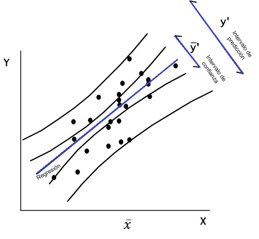

## **Regresión lineal múltiple**

Se desea modelar la variabilidad total de una variable respuesta de interés, en función de relaciones lineales con dos o más variables predictoras, cuantitativas y cualitatiivas, formuladas simultáneamente en un único modelo. 

Las variables predictoras pueden ser:

- Cuantitativas, caso en el cual se supone se miden sin error (o el error es despreciable).

- Cualitativas o categóricas, en este caso su manejo en el modelo se realiza a través de la definición de variables  indicadoras, las cuales toman valores de 0 ó 1. 


Suponemos en principio que las variables predictoras guardan poca asociación lineal entre sí, es decir, cada variable predictora aporta información independiente de las demás predictoras presentes en el modelo (hasta cierto grado, la información aportada por cada una no es redundante). La ecuación del modelo de regresión en este caso es:

$$\Large y_i=\beta_0+\beta_1x_{i1}+\beta_2x_{i2}+...+\beta_kx_{ik}\varepsilon_i$$


### **Regresión lineal con efectos de interacción**


Cuando los efectos de una variable predictora depende de los niveles de otras variables predictoras incluidas en el modelo. 

Por ejemplo, suponga un modelo de regresión con las variables predictoras$X_1$ y $X_2$, que incluye tanto los efectos principales como el de interacción de estas dos variables. Este modelo corresponde a:

$$\large Y_i=\beta_0+\beta_1 X_{i1}+\beta_2 X_{i2}+\beta_3X_{1}X_2+\varepsilon_i$$


El término de interacción es representado por $\beta_3X_{1}X_2$. Para expresar el anterior modelo en términos del modelo lineal general, definimos simplemente $X_3=X_{1}X_2$ y rescribimos el modelo como:

$$\large Y_i=\beta_0+\beta_1 X_{i1}+\beta_2 X_{i2}+\beta_3X_{3}+\varepsilon_i$$


### **Regresión lineal con variables indicadoras**

Suponga que en un modelo de regresión para el gasto mensual por familia en actividades recreativas, se tiene entre las variables predictoras el estrato socioeconómico, definido en cinco niveles, luego, para cada nivel se define una variable indicadora de la siguiente forma:


Estrato 1:
$$ \Large  I_1 =\left\lbrace \begin{array}{rcl}
            {1\quad familia \quad estrato \quad 1}
         \\
            {0 \quad En \quad otro \quad caso  }
         \end{array}  \right. $$
         

Estrato 2:

$$ \Large
           I_2 =\left\lbrace   \begin{array}{rcl}
            {1\quad familia \quad estrato \quad 2}
            \\
            {0 \quad En \quad otro \quad caso  }
         \end{array}  \right.     $$

Estrato 3:

$$ \Large  I_3 =\left\lbrace   \begin{array}{rcl}
            {1\quad familia \quad estrato \quad 3}
         \\
            {0 \quad En \quad otro \quad caso  }
         \end{array}  \right.  $$
         
  
  Estrato 4:
  
$$    \Large     I_4 =\left\lbrace   \begin{array}{rcl}
            {1\quad familia \quad estrato \quad 4}
         \\
            {0 \quad En \quad otro \quad caso  }
         \end{array}  \right.    $$
  


En general, una variable cualitativa con c clases se representa mediante c -1 variables indicadoras, puesto que cuando en una observación dada, todas las c -1 primeras indicadoras son iguales a cero, entonces la variable cualitativa se haya en su última clase. En el ejemplo anterior basta definir las primeras cuatro indicadoras.

<iframe width="560" height="315" src="https://www.youtube.com/embed/eG5tI6aYgos" frameborder="0" allow="accelerometer; autoplay; encrypted-media; gyroscope; picture-in-picture" allowfullscreen></iframe>


**Casos de regresión lineal con variables indicadoras**

Se desea modelar por regresión lineal la relación de una variable respuesta
cuantitativa $Y$ vs. $X_1$, siendo $X_1$ cuantitativa, en presencia de una variable categórica $X_2$. Es decir, se quiere determinar si la relación lineal entre $Y$ vs. $X_1$ depende de la variable categórica $X_2$. Asumiendo que $X_2$ es observada en c categorías.


Podemos considerar las dos siguientes situaciones:


**Caso 1 Intercepto y pendiente diferente**

El efecto promedio de $X_1$ sobre la respuesta $Y$ cambia según la categoría en que $X_2$ sea observada, para lo cual es necesario considerar la interacción entre $X_1$ y $X_2$ en el modelo de regresión, y sólo utilizamos c−1 de las posibles variables indicadoras de las categorías de la variable $X_2$, quedando el modelo:

$$\large y=\beta_0+ \beta_1X_1+ \overbrace{\beta_2I_1+\beta_3I_2+...\beta_cI_{c-1}}^{Aporte\ variable\ cualitativa\ con\ c-1\ niveles}+\underbrace{\beta_{1,1}X_1I_1+\beta_{1,2}X_1I_2+...+\beta_{1,c-1}X_1I_{c-1}}_{Efecto\ interacción}+\varepsilon_i$$

Observe que la ecuación anterior define c rectas de regresión simple de Y vs $X_1$, una en cada categoría de la variable cualitativa X2, así:


- Si $I_1=1$, entonces el resto de indicadoras son iguales a cero y obtenemos,
$$\large Y=(\beta_0 +\beta_2)+(\beta_1+\beta_{1,1})X_1+\varepsilon$$

- Si $I_2=1$, entonces el resto de indicadoras son iguales a cero y obtenemos,
$$\large Y=(\beta_0 +\beta_3)+(\beta_1+\beta_{1,2})X_1+\varepsilon$$

- Finalmente, si $I_1 = I_2 = · · · I_{c−1} = 0$, necesariamente, la indicadora $I_c$ no incluida en el modelo, debe ser igual a 1, así, cuando todas la indicadoras del modelo son simultáneamente cero, obtenemos la recta de regresión de Y vs. $X_1$, en la categoría c de la variable categórica X2, de la forma:

$$\large Y_i=\beta_0+\beta_1X_1+\varepsilon_i$$
     

**Caso 2 Intercepto aleatorio**

El efecto promedio de $X_1$ sobre la respuesta Y es el mismo en todas las categorías de $X_2$ pero la media general de Y no es igual en todas las categorías. El modelo a considerar está dado por:


$$\large Y=\beta_0 +\beta_1X_1+\beta_2I_2+\beta_3I_3+ ...\beta_cI_{c−1}+\varepsilon_i$$


donde el efecto promedio de $X_1$ sobre la respuesta es el mismo sin importar la categoría en que sea observada $X_2$, sin embargo la media de Y no es la misma en todas las categorías, dado que las c ecuaciones resultantes, serían las de c rectas paralelas, que pueden diferir en el intercepto,

- Si $I_1=1$, entonces el resto de indicadoras son iguales a cero y obtenemos,
$$\large Y=(\beta_0+\beta_2)+\beta_1X_1+\varepsilon_i$$

- Si $I_2=1$, entonces el resto de indicadoras son iguales a cero y obtenemos,
$$\large Y=(\beta_0 +\beta_3)+\beta_1X_1+\varepsilon$$


- Cuando  $I_1 = I_2 = · · · I_{c−1} = 0$, es decir, $I_c$ = 1, tenemos

$$\large Y_i=\beta_0 +\beta_1X_1+\varepsilon_i$$

**Ejemplo 1 Modelo de circunferencia de los arboles**

**Modelo de regresión lineal simple**

La siguiente base de datos relaciona 7 medidas del crecimiento de 5 tipos de arboles en el tiempo en meses y el diámetro en mm.

```{r echo = TRUE}
head (Orange)
```

El ajuste del modelo de regresión lineal simple corresponde a:

```{r echo = TRUE}
model=lm(Orange$circumference~Orange$age)
summary(model)
```

La ecuación del modelo de regresión general es:

$$\Large \hat y_i=17.4+0.1x_{i}$$
Donde 

$y_i$ es la variable respuesta

$x_i$ es la edad del árbol, por cada unidad que aumente en edad el árbol, el diametro de la circunferencia aumenta 0.1.

El diagrama de dispersión con la linea de regresión ajustada corresponde a:

```{r echo = TRUE}
model=lm(Orange$circumference~Orange$age)
plot(Orange$age,Orange$circumference,lwd=3)
yest=fitted(model)
lines(Orange$age,yest,col=2)
abline(coef(model))

par(mfrow=c(2,2))
plot(model)
shapiro.test(residuals(model))
```

**Significado de los parámetros estimados**

El intercepto es la respuesta media observada en el crecimiento de los arboles.

La  péndiente indica que por cada mes que pasa la circunferencia del arbol aumenta 0.1 unidades


**Modelo de regresión lineal de intercepto aleatorio con la misma pendiente:**

El modelo de regresión lineal con factores corresponde a 
```{r echo = TRUE}
model=lm(Orange$circumference~Orange$age+as.factor(Orange$Tree))
summary(model)
```


La recta general del modelo es:

$$\Large \hat y_i=17.4+0.1x_{i}+39.93arbol2_i+2.51arbol3_i-8.26arbol4_i-4.69arbol5_i$$

Las rectas ajustadas para cada árbol son:


Arbol 1:

$$\Large \hat y_i=17.4+0.1x_{i}$$

Arbol 2:
     $$\Large \hat y_i=57.33+0.1x_{i}$$
     
Arbol 3:
     $$\Large \hat y_i=19.92+0.1x_{i}$$

Arbol 4:
          $$\Large \hat y_i=9.14+0.1x_{i}$$

Arbol 5:
     $$\Large \hat y_i=12.71+0.1x_{i}$$
     
     
     
El diagrama de dispersión discriminando por los niveles de la variables factor es:

```{r echo = TRUE}
plot(Orange$age,Orange$circumference,col=Orange$Tree,lwd=3)
abline(a=17.4,b=0.1,col=1,lwd=3)
abline(a=57.33,b=0.1,col=2,lwd=3)
abline(a=19.92,b=0.1,col=3,lwd=3)
abline(a=9.14,b=0.1,col=4,lwd=3)
abline(a=12.71,b=0.1,col=5,lwd=3)
```

     
Con base en la tabla ANOVA, y bajo los supuestos de los errores, se realiza el test de significancia de la regresión el cual se enuncia de la siguiente manera:

$H_0= \beta_1=\beta_2=...\beta_k$ El modelo de regresión no es significativo.

$H_1=Algún\ \beta_k \not=0$ Existe una relación de regresión significativa con al menos una de las variables.


Es decir, se prueba que existe una relación de regresión, sin embargo esto no garantiza que el modelo resulte útil para hacer predicciones.

```{r}
model=lm(Orange$circumference~Orange$age+as.factor(Orange$Tree))
anova(model)
```


**Modelo de regresión lineal con pendiente e intercepto diferentes**


El modelo de regresión lineal con factores corresponde a 

```{r echo = TRUE}
model=lm(Orange$circumference~Orange$age*as.factor(Orange$Tree))
summary(model)
```


La recta general del modelo es:

$$\Large \hat y_i=17.4+0.1x_{i}-4.3arbol_2+1.51arbol_3+1.4arbol_4-10.9arbol_5+
0.05arbol_2*x_i+0.001arbol_3*x_i-0.01arbol_4*x_i+0.006arbol_5*x_i$$

Las rectas ajustadas para cada árbol son:


Arbol 1:

$$\Large \hat y_i=17.4+0.1x_{i}$$

Arbol 2:
     $$\Large \hat y_i=13.1+0.15x_{i}$$
     
Arbol 3:
     $$\Large \hat y_i=18.9+0.101x_{i}$$

Arbol 4:
          $$\Large \hat y_i=18.8+0.1x_{i}$$

Arbol 5:
     $$\Large \hat y_i=6.5+0.106x_{i}$$
     
     
     
El diagrama de dispersión discriminando por los niveles de la variables factor es:

```{r echo = TRUE}
plot(Orange$age,Orange$circumference,col=Orange$Tree,lwd=3)
abline(a=17.4,b=0.1,col=1,lwd=3)
abline(a=13.1,b=0.15,col=2,lwd=3)
abline(a=18.9,b=0.1,col=3,lwd=3)
abline(a=18.8,b=0.1,col=4,lwd=3)
abline(a=6.1,b=0.1,col=5,lwd=3)
```

     
Con base en la tabla ANOVA, y bajo los supuestos de los errores, se realiza el test de significancia de la regresión el cual se enuncia de la siguiente manera:

$H_0= \beta_1=\beta_2=...\beta_k$ El modelo de regresión no es significativo.

$H_1=Algún\ \beta_k \not=0$ Existe una relación de regresión significativa con al menos una de las variables.


Es decir, se prueba que existe una relación de regresión, sin embargo esto no garantiza que el modelo resulte útil para hacer predicciones.

```{r}
model=lm(Orange$circumference~Orange$age*as.factor(Orange$Tree))
anova(model)
```

**Ejemplo 2**

**Modelo de pendiente e intercepto diferentes**

Se tienen los datos de las ventas y publicidad invertidos en cada una de las secciones


```{r}
Seccion=c(rep("A",5),rep("B",5),rep("C",5))
Publicidad=c(5.2,5.9,7.7,7.9,9.4,8.2,9,9.1,10.5,10.5,10,10.3,12.1,12.7,13.6)
Ventas=c(9,10,12,12,14,13,13,12,13,14,18,19,20,21,22)
datos=data.frame(Seccion,Publicidad,Ventas)
###GRAFICANDO VENTAS VS. PUBLICIDAD SEG´UN SECCION###
attach(datos)
plot(Publicidad,Ventas,pch=1:3,col=1:3,cex=2,cex.lab=1.5)
legend("topleft",legend=c("A","B","C"),pch=c(1:3),col=c(1:3),cex=2)


#USANDO POR DEFECTO COMO SECCIÓN REFERENCIA LA A
###MODELO GENERAL: RECTAS DIFERENTES TANTO EN PENDIENTE COMO EN INTERCEPTO###
#Con interacción entre la variable publicidad y sección
modelo1=lm(Ventas~Publicidad*Seccion)
summary(modelo1)
confint(modelo1)
anova(modelo1)
#recta para la sección a
abline(a=3.03,b=1.16,col=1,pch=1,lwd=2)
# Recta para la sección b
abline(a=9.76,b=0.35,col=2,pch=2,lwd=2)
#Recta para la sección c
abline(a=8.27,b=1,col=3,pch=3,lwd=2)
```

**MODELO CON INTERCEPTO diferente**


```{r}
###MODELO CON RECTAS DIFERENTES SOLO EN EL INTERCEPTO###
modelo2=lm(Ventas~Publicidad+Seccion)
summary(modelo2)
anova(modelo2)
confint(modelo2)
plot(Publicidad,Ventas,pch=1:3,col=1:3,cex=2,cex.lab=1.5)
legend("topleft",legend=c("A","B","C"),pch=c(1:3),col=c(1:3),cex=2)
```


### **Regresión lineal con variables continuas**

### Procedimientos para la selección de variables significativas**
Básicamente, existen tres procedimientos de selección automática, los cuales son computacionalmente menos costosos que el procedimiento de selección basado en ajustar todas las regresiones posibles, y operan en forma secuencial:

- **Forward o selección hacia delante**
Agrega variables, una por vez, buscando reducir en forma significativa la suma de cuadrados de los errores.

- **Backward o selección hacia atrás**
El método backward, parte del modelo con todas las variables y elimina secuencialmente de a una variable, buscando reducir el SSE.

- **Stepwise, una combinación de los dos anteriores**
La variable que se elimina en cada paso, es aquella que no resulta significativa en presencia de las demás variables del modelo de regresión que se tiene en ese momento. El algoritmo se detiene cuando todas las variables que aún permanecen en el modelo son significativas en presencia de las demás.

**Ejemplo**

Para estimar la producción en madera de un bosque se suele realizar un muestreo previo en el que se toman una serie de mediciones no destructivas. Disponemos de mediciones para 20 árboles, así como el volumen de madera que producen una vez cortados. Las variables observadas son:


HT = altura en pies

DBH = diámetro del tronco a 4 pies de altura (en pulgadas)

D16 = diámetro del tronco a 16 pies de altura (en pulgadas)

VOL = volumen de madera obtenida (en pies cúbicos).

El objetivo del análisis es determinar cuál es la relación entre dichas medidas y el volumen de madera, con el fin de poder predecir este último en función de las primeras

```{r}
DBH <- c(10.2,13.72,15.43,14.37,15,15.02,15.12,15.24,15.24,15.28, 13.78,15.67,15.67,15.98,16.5,16.87,17.26,17.28,17.87,19.13)
D16 <-c(9.3,12.1,13.3,13.4,14.2,12.8,14,13.5,14,13.8,13.6,14, 13.7,13.9,14.9,14.9,14.3,14.3,16.9,17.3)
HT <-c(89,90.07,95.08,98.03,99,91.05,105.6,100.8,94,93.09,89, 102,99,89.02,95.09,95.02,91.02,98.06,96.01,101)
VOL <-c(25.93,45.87,56.2,58.6,63.36,46.35,68.99,62.91,58.13, 59.79,56.2,66.16,62.18,57.01,65.62,65.03,66.74,73.38,82.87,95.71)
bosque<-data.frame(VOL=VOL,DBH=DBH,D16=D16,HT=HT)
plot(bosque)
###correlaciones entre variables
#install.packages(ppcor)
library(PerformanceAnalytics)
library(ppcor)
pcor(bosque)
chart.Correlation(bosque, histogram = F, pch = 19)
```


El modelo inicial ajustado corresponde a:


```{r}
m1=lm(VOL~D16+HT+DBH)
summary(m1)
anova(m1)
```

Al quitar la variable no significativa del modelo queda: 


```{r}
m1=lm(VOL~D16+HT)
summary(m1)
par(mfrow=c(2,2))
plot(m1)
```

El modelo ajustado corresponde a:

$$\hat y=-105.9027+7.41D16+0.67HT$$

Al evaluar la significancia de los parámetros del modelo se tiene:


```{r}

library(car)
#library(rgl)
library(perturbR)
library(leaps)
library(scatterplot3d)

anova(m1)
##se hace uso de la siguiente función creada para estimar el aporte de los coeficientes estandarizados
miscoeficientes=function(modeloreg,datosreg){
  coefi=coef(modeloreg)
  datos2=as.data.frame(scale(datosreg))
  coef.std=c(0,coef(lm(update(formula(modeloreg),~.+0),datos2)))
  limites=confint(modeloreg,level=0.95)
  vifs=c(0,vif(modeloreg))
  resul=data.frame(Estimacin=coefi,Limites=limites,Vif=vifs,Coef.Std=coef.std)
  cat("Coeficientes estimados, sus I.C, Vifs y Coeficientes estimados estandarizados","\n")
  resul
}


m1=lm(VOL~D16+HT+DBH)

summary(m1)
miscoeficientes(m1,bosque)

```

Examinando los valores en la columna “Standarized Estimate”, vemos que aparentemente, D16 tiene mayor peso (en términos absolutos) sobre el volumen de madera en función de las variables estandarizadas: el promedio del volumen de madera estandarizado aumenta en 0.65 unidades al aumentar una unidad el diametro a los 16 pies de altura, al mantener fijo los resultados de las otras tres pruebas. La segunda variable con mayor peso es la altura HT. La altura a 4 pies de altura no tiene efecto significativo sobre el volumen de madera. 


###**COMPARACIÓN DE EFECTOS PARCIALES DE LAS VARIABLES EXPLICATORIAS Y MULTICOLINEALIDAD**

Considere el MRLM 

$$\large Y_i=\beta_0+\beta_1X_{i1}+\beta_2X_{i2}+...+\beta_kX_{ik}+\varepsilon_i$$

Si las variables explicatorias no están en una misma escala de medida, no podemos determinar cuál tiene mayor o menor efecto parcial sobre la respuesta promedio, en presencia de las demás, esto es, la magnitud de $\beta_j$􀟚􀯝 refleja las unidades de la variable $X_j$.

Para hacer comparaciones en forma directa de los coeficientes de regresión se recurre al uso de variables escalonadas, tanto la respuesta como las explicatorias.

**Escalonamiento normal unitario**
  
  Cada variable es escalonada restando su media muestral y dividiendo esta diferencia por la desviación estándar muestral de la variable, es decir:
  
  $$\large Y_i^*=\frac{Y_i-\bar Y}{\sum_{i=1}^n (Y_i-\bar Y)^2/(n-1)} $$
  
  
  
  $$\large X_i^*=\frac{X_i-\bar X}{\sum_{i=1}^n (X_i-\bar X)^2/(n-1)} $$
  
Ajustamos el modelo de regresión sin intercepto
$$\large Y_i^*=\beta_1X_{i1}^*+\beta_2X_{i2}^*+...+\beta_kX_{ik}^*+\varepsilon_i $$
Los coeficientes de regresión estandarizados $\beta_j^*$ pueden ser comparados directamente teniendo en cuenta que siguen siendo coeficientes de regresión parcial, es decir, mide el efecto de $X_J$ dado que las demás variables explicatorias están en el modelo, además, los $\beta_j$ pueden servir para determinar la importancia relativa de $X_j$ en presencia de las demás variables, en la muestra o conjunto de datos particular considerado para el ajuste.

NOTA: Hay que tener cuidado al interpretar y comparar los coeficientes estandarizados pues en presencia de multicolinealidad nuestras conclusiones pueden ser erradas.

DEFINICIÓN: Multicolinealidad es la existencia de dependencia casi lineal entre variables explicatorias en el MRLM.

Si existiera dependencia lineal exacta entre dos o más variables explicatorias, la matrix XtX seria singular y por tanto no podríamos hallar los estimadores de mínimos cuadrados!.


## Intervalos de confianza en regresión lineal


```{r fig.asp=0.8, fig.align='center', echo=FALSE}

```


**Intervalos de confianza para la línea de regresión**


Los IC para la línea de regresión son más angostos que las bandas de confianza para la predicción individual. Ambas crecen en la medida que se alejan de la media de X lo que refleja que las predicciones son menos confiables en los extremos pues se basan en menos datos.


Los intervalos de confianza de la línea de regresión se refieren a la línea de las medias y no a la población globalmente. Debe notarse que son angostos y se ensanchan hacia los extremos. No es infrecuente presentar estos como intervalos de confianza de toda la población, lo que no corresponde pues es análogo a usar el error estándar de la media como una medida de la variabilidad de la población en vez de la desviación estándar. 

Distinto es el caso de las bandas de confianza o intervalos de predicción para valores individuales, que son más anchas y que sí nos dan una idea de la variabilidad de la muestra y, por ende, del grado de imprecisión envuelto en la estimación. En el primer caso, nos dicen que podemos estar confiados en un 95% que el valor promedio de Y para un valor determinado de X está dentro de las líneas en cuestión. En el segundo caso, cuantifica la incertidumbre en la estimación de un valor individual de Y a partir de X que es lo que se quiere saber generalmente. El intervalo de confianza de las líneas de regresión puede hacerse más estrecho aumentando el tamaño de la muestra, pero no sucede lo mismo con el intervalo de predicción ya que este refleja fundamentalmente la variabilidad individual en torno a la recta calculada.

**IC para la respuesta media**

En regresión lineal simple, Si  $\hat \mu_{Y|x_o}$ es la media estimada para la variable respuesta cuando $X=X_o$, entonces un IC del $(1-\alpha/2)*100$ para $E(Y|x_o)$ está dado por:

$$\hat \mu_{Y|x_o}\pm t_{\alpha/2,n-p}\sqrt {MSR\left(\frac{1}{n}+\frac{(x_0-\bar x )^2}{\sum (x_i-\bar x)}^2\right) }$$
**IC para la predicción de nuevas observaciones**

En regresión lineal simple, Si  $\hat Y_o}$ es el valor estimado para la variable respuesta cuando $X=X_o$, entonces un IC del $(1-\alpha/2)*100$ para $Y_o$ está dado por:

$$\hat Y_o\pm t_{\alpha/2,n-p}\sqrt {MSR\left(1+\frac{1}{n}+\frac{(x_0-\bar x )^2}{\sum (x_i-\bar x)}^2\right) }$$
**IC para los parámetros del modelo $\beta_i$**

Las distribuciones de todos los valores posibles de a y b tienen una distribución Normal con medias a y b, y desviaciones estándar sa y sb que se denominan errores estándar de la intercepción y de la pendiente respectivamente. Estos errores estándar pueden ser usados tal como se usan los errores estándar de la media o de una proporción, para calcular IC y para las PH  usando la distribución de t. 


$$\beta_i\pm t_{\alpha/2,n-2}*Sd_{\beta_i}$$

- $\beta_i$ pendiente o intercepto

- $Sd_{\beta_i}$ pendiente o intercepto


**IC para la pendiente**

- Es un rango de valores que estima la verdadera pendiente de la línea de regresión de la población con un cierto nivel de confianza. 

- Refleja la variabilidad e incertidumbre de la línea de regresión de la muestra debido al error de muestreo.

Para probar la hipótesis nula de que la pendiente de la población es cero, puede comprobar si el intervalo de confianza para la pendiente contiene cero o no; Si no lo hace, entonces rechazas la hipótesis nula y concluyes que existe una relación lineal significativa entre X e Y. 


**IC para el error estándar de la regresión **


El error estándar mide la variabilidad o precisión de una estimación, específicamente cuánto varían las estimaciones de la pendiente de la muestra con respecto a la verdadera pendiente de la población.


```{r}

DBH <- c(10.2,13.72,15.43,14.37,15,15.02,15.12,15.24,15.24,15.28, 13.78,15.67,15.67,15.98,16.5,16.87,17.26,17.28,17.87,19.13)
D16 <-c(9.3,12.1,13.3,13.4,14.2,12.8,14,13.5,14,13.8,13.6,14, 13.7,13.9,14.9,14.9,14.3,14.3,16.9,17.3)
HT <-c(89,90.07,95.08,98.03,99,91.05,105.6,100.8,94,93.09,89, 102,99,89.02,95.09,95.02,91.02,98.06,96.01,101)
VOL <-c(25.93,45.87,56.2,58.6,63.36,46.35,68.99,62.91,58.13, 59.79,56.2,66.16,62.18,57.01,65.62,65.03,66.74,73.38,82.87,95.71)
bosque<-data.frame(VOL=VOL,DBH=DBH,D16=D16,HT=HT)


## modelo completo

full.model <- lm(VOL~., data=bosque)
summary(full.model)

## busqueda de modelo optimo
library(MASS)  # Para poder usar la funcion stepAIC
modback <- stepAIC(full.model, trace=TRUE, direction="backward")


modback$anova


## modelo reducido

redu <- lm(VOL~D16,data=bosque)
summary(redu)


future_y <- predict(object=redu, interval="prediction", level=0.95)
nuevos_datos <- cbind(VOL, future_y)

library(ggplot2)
ggplot(nuevos_datos, aes(x=D16,y=VOL))+
    geom_point() +
    geom_line(aes(y=lwr), color="red", linetype="dashed") +
    geom_line(aes(y=upr), color="red", linetype="dashed") +
    geom_smooth(method=lm, formula=y~x, se=TRUE, level=0.95, col='blue', fill='pink2') +
    theme_light()
```

