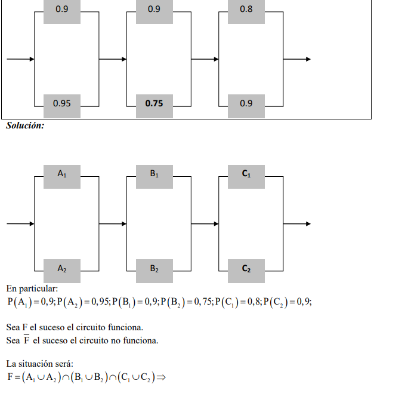
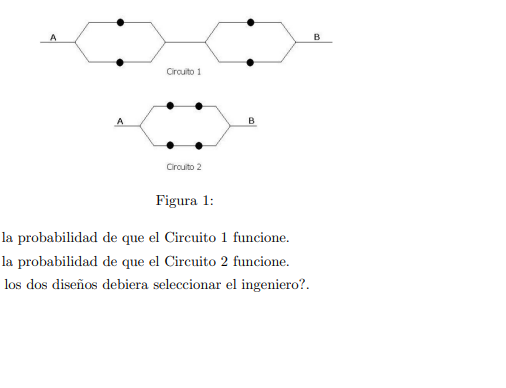

---
title: "Taller de probabilidad"
---


```{r setup, include=FALSE}
knitr::opts_chunk$set(echo = FALSE)
```

# **Tecnicas de conteo y probabilidades**

1. Un furgón de ferrocarril contiene seis sistemas electrónicos complejos. Dos de los seis se han de seleccionar al azar para hacerles pruebas completas y luego clasificarlos como defectuosos o no defectuosos.

a. Si dos de los seis sistemas en realidad están defectuosos, encuentre la probabilidad de que al menos uno de los dos sistemas probados sea defectuoso. Encuentre la probabilidad de que ambos sean defectuosos.

b. Si cuatro de los seis sistemas están defectuosos en realidad, encuentre las probabilidades indicadas en el inciso a.

2. Con fecha de abril de 2006, aproximadamente 50 millones de nombres de dominio web.com fueron registrados (p. ej., yahoo.com).

a. ¿Cuántos nombres de dominio compuestos de exactamente dos letras pueden ser formados?

b. ¿Cuántos nombres de dominio de dos letras existen si como caracteres se permiten dígitos y números? 
*[Nota: Una longitud de carácter de tres o más ahora es obligatoria.] *
*Rta/ 676; 1296*

c. ¿Cuántos nombres de dominio existen compuestos de tres letras en secuencia? ¿Cuántos de esta longitud existen si se permiten letras o dígitos? *[Nota: En la actualidad todos están utilizados.]*
*Rta(17576; 46 656)*

d. Responda las preguntas hechas en b) para secuencias de cuatro caracteres. *Rta(456976;1679616)*

e. Con fecha de abril de 2006, 97786 de las secuencias de cuatro caracteres utilizando letras o dígitos aún no habían sido reclamadas. Si se elige un nombre de cuatro caracteres al azar, ¿cuál es la probabilidad de que ya tenga dueño? *Rta(0.942)*


3. Una marca de automóvil viene en cinco estilos diferentes, con cuatro tipos de motor, con dos tipos de transmisiones y en ocho colores.

a.¿Cuántos autos tendría que tener en existencia un distribuidor si incluyera uno por cada combinación de estilo, motor y transmisión?

b.¿Cuántos tendría que tener en existencia un centro de distribución si todos los colores de autos se tuvieran para cada combinación del inciso a?

4. a. Beethoven escribió 9 sinfonías y Mozart 27 conciertos para piano. Si el locutor de una estación de radio de una universidad desea tocar primero una sinfonía de Beethoven y luego un concierto de Mozart, ¿de cuántas maneras puede hacerlo? *Rta (243)*

b. El gerente de la estación decide que en cada noche sucesiva (7 días a la semana), se tocará una sinfonía de Beethoven, seguida por un concierto para piano de Mozart, seguido por un cuarteto de cuerdas de Schubert (de los cuales existen 15). ¿Durante aproximadamente cuántos años se podría continuar con esta política antes de que exactamente el mismo programa se repitiera? *Rta(364 dias)*

5. Una fraternidad local está realizando una rifa en la que se han de vender 50 boletos, uno por cliente. Hay tres premios para ser concedidos. Si los cuatro organizadores de la rifa compran un boleto cada uno, 
a. ¿cuál es la probabilidad de que los cuatro organizadores ganen a todos los premios?,
b exactamente dos de los premios?,
c exactamente uno de los premios?,
d ninguno de los premios?


6. Una caja en un almacén contiene cuatro focos de 40 W, cinco de 60 W y seis de 75 W. Suponga que se eligen al azar tres focos.
a. ¿Cuál es la probabilidad de que exactamente dos de los focos seleccionados sean de 75 W?
b. ¿Cuál es la probabilidad de que los tres focos seleccionados sean de los mismos watts?
c. ¿Cuál es la probabilidad de que se seleccione un foco de cada tipo?

7. Una flota de nueve taxis se ha de despachar a tres aeropuertos en forma tal que tres vayan al aeropuerto A, cinco al aeropuerto B y uno al aeropuerto C. 
A. ¿En cuántas formas distintas se puede lograr esto?
Suponga que los taxis son asignados a aeropuertos al azar.
a Si exactamente uno de los taxis necesita reparación, ¿cuál es la probabilidad de que sea despachado al aeropuerto C?
b Si exactamente tres de los taxis necesitan reparación, ¿cuál es la probabilidad de que cada aeropuerto reciba uno de los taxis que necesita reparación?


8. Un restaurante de nivel económico alto ofrece un menú especial de precios fijos en el que, por un costo fijo de comidas, una persona puede seleccionar de entre cuatro aperitivos, tres ensaladas, cuatro entradas y cinco postres. ¿Cuántas comidas diferentes hay si una de ellas consta de un aperitivo, una ensalada, una entrada y un postre?

9. Un amigo mío va a ofrecer una fiesta. Sus existencias actuales de vino incluyen 8 botellas de zinfandel, 10 de merlot y 12 de cabernet (él sólo bebe vino tinto), todos de diferentes fábricas vinícolas.

a. Si 6 botellas de vino tienen que ser seleccionadas al azar de las 30 para servirse, ¿cuántas formas existen de hacerlo?
b. Si se seleccionan al azar 6 botellas, ¿cuántas formas existen de obtener dos botellas de cada variedad?
c.Si se seleccionan 6 botellas al azar, ¿cuál es la probabilidad de que el resultado sea dos botellas de cada variedad?

10. Cuatro parejas compran 8 lugares en la misma fila para un concierto. ¿De cuántas maneras diferentes se pueden sentar

a. Sin restricciones?
b. si cada pareja se sienta junta?
c. si todos los hombres se sientan juntos a la derecha de todas las mujeres?


# **Diagrama de venn y probabilidad**

1. Los trenes de aterrizaje hidráulicos que salen de una planta de reparación de aviones se inspeccionan para ver si tienen defectos. Registros históricos indican que 8% tienen defectos sólo en ejes, 6% tienen defectos sólo en bujes y 2% tienen defectos en ejes y bujes. 

a.Realice el diagrama de ven

Uno de los trenes hidráulicos se selecciona al azar. ¿Cuál es la probabilidad de que el conjunto tenga:

b. un buje defectuoso?
c. un eje o buje defectuoso?
d. exactamente uno de los dos tipos de defecto?
e. ningún tipo de defecto? 


2. En el último año de colegio, en un grupo de 120 estudiantes se encontró que 42 cursaron Matemáticas, 52 Psicología, 70 Historia, 25 matemáticas e historia, 20 matemáticas y psicología, 16 historia, pero no matemáticas ni psicología, 10 las tres materias y 30 ninguna de las tres.
Si se selecciona un estudiante aleatoriamente, encuentre la probabilidad que: 
a. Una persona inscrita en psicología haya estudiado las tres materias. 

b. Una persona que no se inscribió en psicología haya tomado historia y matemáticas. 

c. Un estudiante inscrito en historia, haya tomado matemáticas. 

d. Un estudiante que no haya cursado matemáticas, haya cursado historia.

3.De un grupo de 1352 turistas que visitan México se encuentra que, 935 de ellos visitaron las momias, 955 el museo de antropología, 925 las pirámides, 35 fueron a las pirámides, pero no al museo ni las momias, 80 fueron al museo, pero no a las pirámides ni a las momias, 120 estuvieron en las momias, pero no fueron ni a las pirámides ni al museo, 590 estuvieron en las momias y en las pirámides, 350 estuvieron en los 3 lugares. indique cuantas de estas personas asistieron a: 
a. Defina los eventos y realice el diagrama de ven
Cuál es la probabilidad de que:
b. Una persona asista a exactamente a uno de estos lugares
c. Una persona asista exactamente a 2 lugares 
d. Una persona asista al menos a un lugar
e. Una persona que no asistió al museo haya asistido a las pirámides 

4.Una compañía de electricidad ofrece una tarifa de consumo mínimo a cualquier usuario cuyo consumo de electricidad sea de menos de 240 kWh durante un mes particular. Si A denota el evento en que un usuario seleccionado al azar en una cierta comunidad no excede el consumo mínimo durante enero y B el evento análogo para el mes de julio (A y B se refieren al mismo usuario. Suponga P(A) = 0.8, P(B)= 0.7 y P(A ∩ B) = 0.9. Calcule lo siguiente:
a. P(A U B)
b. La probabilidad de que el consumo mínimo sea sobrepasado en exactamente uno de los dos meses. Describa este evento en función de A y B.

5. En un conjunto residencial, 60% de las familias se suscriben al
periódico metropolitano, 80% lo hacen al periódico local y 50% de
todas las familias a ambos periódicos. Si se elige una familia al azar,
¿cuál es la probabilidad de que se suscriba a


a. por lo menos a uno de los dos periódicos ?

b. Solo al periódico local?

c. Solo al periódico metropolitano?

d. Exactamente a uno de los dos periódicos?


# **Probabilidad condicional **

1. En un experimento para estudiar la relación entre la Diabetes y el consumo de licor, se reunieron los siguientes datos en 180 individuos: Un total de 87 son diabéticos, 69 consumen licor en forma moderada; 21 son diabéticos y consumen licor en forma moderada; 49 toman licor en forma exagerada; 26 no consumen licor y son no diabéticos.

a. Con la información anterior construya una tabla de doble entrada 

b. Si se selecciona aleatoriamente a uno de estos individuos y los eventos son DEPENDIENTES, encuentre la probabilidad de que la persona experimente diabetes, y consuma licor moderadamente.

c. Halle la probabilidad de que sea diabético dado que consume licor


2. Considere seleccionar al azar un estudiante en cierta universidad y que A denote el evento en que el individuo seleccionado tenga una tarjeta de crédito Visa y que B sea el evento análogo para la tarjeta MasterCard. Suponga que P(A) = 0.6, P(B)=0.3 y P(A ∩ B)= 0.25. 

a. Grafique el diagrama de venn

b. Calcule la probabilidad de que el individuo seleccionado tenga por lo menos uno de los dos tipos de tarjetas 

c. Dado que el individuo seleccionado tiene por lo menos una tarjeta, ¿cuál es la probabilidad de que el estudiante tenga una tarjeta master card? 

d. Calcule  $P(B'|A)$ y $P(A|B)$

3. Cien adultos fueron entrevistados con respecto a las cargas que implican los préstamos para estudiantes universitarios y si quienes respondieron tenían un hijo actualmente en la universidad. Sus respuestas se resumen en la tabla siguiente:


|HIJO EN UNIVERSIDAD|CP	ALTO|CP	RAZONABLE	|CP BAJA|
|-------------------|-------|-------------|-------|
|SI                 |	   0.2|     	0.09	|0.01   |
|NO                 |   0.41|	      0.21	|0.08   |

carga de prestamo=CP

a. Cuál es la probabilidad de que la carga de préstamo sea razonable
b. Cuál es la probabilidad de que la carga de préstamo sea alta y se tenga un hijo en la universidad
c. Dado que una persona tiene un hijo en la universidad, ¿Cuál es la probabilidad de que la carga de prestamo sea razonable

4.  Una compañía de seguros ofrece cuatro diferentes niveles de deducible, ninguno, bajo, medio y alto, para sus tenedores de pólizas de propietario de casa y tres diferentes niveles, bajo, medio y alto, para sus tenedores de pólizas de automóviles. La tabla adjunta da proporciones de las varias categorías de tenedores de pólizas que tienen ambos tipos de seguro. Por ejemplo, la proporción de individuos con deducible bajo de casa como deducible bajo de carro es 0.06 (6% de todos los individuos). Suponga que se elige al azar un individuo que posee ambos tipos de pólizas.

|Auto |ninguno|Bajo|Medio|Alto|
|-----|-------|----|-----|----|
|Bajo |   0.04|0.06| 0.05|0.03|
|Medio|0.07   |0.1 |  0.2|0.1 |
|Alto |0.02   |0.03| 0.15|0.15|

a. ¿Cuál es la probabilidad de que el individuo tenga un deducible de auto medio y un deducible de casa alto? rta(0.1)

b. ¿Cuál es la probabilidad de que el individuo tenga un deducible de casa bajo y un deducible de auto bajo? rta(0.18 0.19)

c. ¿Cuál es la probabilidad de que el individuo se encuentre en la misma categoría de deducibles de casa y auto? rta(0.41)

d. Basado en su respuesta en el inciso c), ¿cuál es la probabilidad de que las dos categorías sean diferentes? rta(0.59)

e. ¿Cuál es la probabilidad de que el individuo tenga por lo menos un nivel deducible bajo? rta(0.31)

f. Utilizando la respuesta del inciso e). ¿cuál es la probabilidad de que ningún nivel deducible sea bajo? rta(0.69)


5. Una encuesta clasificó a gran número de adultos de acuerdo con si se les diagnosticó la necesidad de usar lentes para corregir su visión de lectura o si ya usan lentes cuando leen. Las proporciones que caen en las cuatro categorías resultantes se dan en la tabla siguiente:


|Necesita lentes|Usa lentes| No usa lentes|
|---------------|----------|--------------|
|Si             |0.44|0.14|
|No             |0.02|0.4|
Si se selecciona un solo adulto del grupo grande, encuentre las probabilidades de que 
a. El adulto necesita lentes, 
b necesita lentes pero no los usa, 
c usa lentes los necesite o no.
d. Halle la probabilidad de que un adulto necesita lentes SI no los usa.


6. La población de un país particular se compone de tres grupos étnicos. Cada individuo pertenece a uno de los cuatro grupos sanguíneos principales. La tabla de probabilidad conjunta anexa da la proporción de individuos en las diversas combinaciones de grupo étnico-grupo sanguíneo.

GS: Grupo sanguíneo
GE: Grupo étnico


|Grupo étnico|GSO  |GSA  |GSB  |GSAB |
|------------|-----|-----|-----|-----|
|1           |0.082|0.106|0.008|0.004|
|2           |0.135|0.141|0.018|0.006|
|3           |0.215|0.2  |0.065|0.02 |

Suponga que se selecciona un individuo al azar de la población y que los eventos se definen como:
A={tipo A seleccionado}
B={tipo B seleccionado} 
C={grupo étnico 3 seleccionado}

a. Calcule P(A), P(C) y P(AnC).

b. Calcule tanto P(A | C) y P(C | A) y explique en contexto lo que cada una de estas probabilidades representa. 
 
c. Si el individuo seleccionado no tiene sangre de tipo B, ¿cuál es la probabilidad de que él o ella pertenezca al grupo étnico 1? 

7.Para los clientes que compran un refrigerador en una tienda de aparatos domésticos, sea A el evento en que el refrigerador fue fabricado en EU, B el evento en que el refrigerador contaba con una máquina de hacer hielos y C el evento en que el cliente adquirió una garantía ampliada. Las probabilidades pertinentes son.
$P(A)= 0.75$
$P(B|A)=0.9$
$P(B|A')=0.8$
$P(C |A ∩ B)= 0.8 $
$P(C| A ∩ B') = 0.6$
$P(C|A' ∩ B) = 0.7$
$P(C| A' ∩ B')=0.3$

a. Construya un diagrama de árbol compuesto de ramas de primera, segunda y tercera generaciones y anote el evento y la probabilidad apropiada junto a cada rama.
b. Calcule P(A ∩ B ∩ C). rta(0.54)
c. Calcule P(B ∩ C). rta(0.68)
d. Calcule P(C). rta(0.74)
e. Calcule P(A | B ∩ C), la probabilidad de la compra de un refrigerador fabricado en EU dado que también se adquirieron una máquina de hacer hielos y una garantía ampliada. rta(0.7941)

# Probabilidades independientes

El circuito ilustrado debajo opera si y sólo si hay una trayectoria de dispositivos funcionales de izquierda a derecha. La probabilidad de que cada dispositivo funcione se indica en el gráfico. 

Suponga que los dispositivos fallan independientemente. ¿Cuál es la probabilidad de que el circuito opere?

```{r, echo=F, fig.cap='Teoría de conjuntos', fig.asp=0.3, fig.align='center'}

```

2.Tenemos un circuito


     |--A--|       |--D--E--|
            |--C--|            
     |--B--|       |----F----|

La pregunta es que probabilidades hay de que el circuito funcione.
Por si alguien no lo pilla
Si A ó B funciona el circuito funciona
C debe funcionar si o si
D,E ó F deben funcionar para que funcione el circuito

Creo que se entiende

P(A)=0,9
P(B)=0,8
P(C)=0,95
P(D)=0,9
P(E)=0,9
P(F)=0,5

3. Un ingeniero desea seleccionar, entre los dos dise˜nos de circuitos que se muestran en la Figura 1, aquel que brinda una mayor probabilidad de que la corriente circule entre el punto A y el punto B. Si las componentes (resistencias) funcionan de forma independiente y cada una tiene una probabilidad 0.1 de fallar.

```{r, echo=F, fig.cap='Teoría de conjuntos', fig.asp=0.3, fig.align='center'}

```


a) Calcular la probabilidad de que el Circuito 1 funcione.
b) Calcular la probabilidad de que el Circuito 2 funcione.
c) ¿Cu´al de los dos dise˜nos debiera seleccionar el ingeniero?.


# **Arboles y teorema de bayes, Regla de la multiplicación **

1. Una compañía de fondos de inversión mutua ofrece a sus clientes varios fondos diferentes: un fondo de mercado de dinero, tres fondos de bonos (a corto, intermedio y a largo plazo), dos fondos de acciones (de moderado y alto riesgo) y un fondo balanceado. Entre los clientes que poseen acciones en un solo fondo, los porcentajes de clientes en los diferentes fondos son como sigue:

|fondo de inversión| Porcentaje|
|------------------|----------|
|Mercado de dinero| 20%|
|Acciones de alto riesgo |18%|
|Bonos a corto plazo |15% |
|Bonos a plazo moderado |25%| 
|Bonos a largo plazo |5%|
|Acciones de riesgo intermedio| 10% |
|Acciones de riesgo Balanceado| 7%|

Se selecciona al azar un cliente que posee acciones en sólo un fondo.

a. ¿Cuál es la probabilidad de que el individuo seleccionado posea acciones en el fondo balanceado? Rta(0.07)

b. ¿Cuál es la probabilidad de que el individuo posea acciones en un fondo de bonos? Rta(0.3)

c. ¿Cuál es la probabilidad de que el individuo seleccionado no posea acciones en un fondo de acciones? Rta(0.57)

2. Una caja contiene seis pelotas rojas y cuatro verdes y una segunda caja contiene siete pelotas rojas y tres verdes. Se selecciona una pelota al azar de la primera caja y se le coloca en la segunda caja. Luego se selecciona al azar una pelota de la segunda caja y se le coloca en la primera caja.

a. ¿Cuál es la probabilidad de que se seleccione una pelota roja de la primera caja y de que se seleccione una pelota roja de la segunda caja?

```{r fig.asp=0.6, fig.align='center', echo=FALSE}
library(png)
library(grid)
img2 <- readPNG("urnas.png")
grid.raster(img2)
```


3. El 70% de las aeronaves ligeras que desaparecen en vuelo
en cierto país son posteriormente localizadas. De las aeronaves
que son localizadas, 60% cuentan con un localizador de emergencia, mientras que 90% de las aeronaves no localizadas no cuentan con dicho localizador. Suponga que una aeronave ligera ha desaparecido.
a. Si tiene un localizador de emergencia, ¿cuál es la probabilidad
de que no sea localizada?

b. Si no tiene un localizador de emergencia, ¿cuál es la probabilidad de que sea localizada?


4. En una gasolinería, 40% de los clientes utilizan gasolina regular (A1), 35% usan gasolina plus (A2) y 25% utilizan Premium (A3). De los clientes que utilizan gasolina regular, sólo 30% llenan sus tanques (evento B). De los clientes que utilizan plus, 60% llenan sus tanques, mientras que los que utilizan premium, 50% llenan sus tanques.
a. ¿Cuál es la probabilidad de que el siguiente cliente pida gasolina plus y llene el tanque (A2 ∩ B)? rta (0.21)

b. ¿Cuál es la probabilidad de que el siguiente cliente llene el tanque? rta(0.455)

c. Si el siguiente cliente llena el tanque, ¿cuál es la probabilidad que pida gasolina regular? ¿Plus? ¿Premium? Rta (0.264 0.274)

considere la siguiente información adicional sobre el uso de tarjetas de crédito:

El 70% de todos los clientes que utilizan gasolina regular y que llenan el tanque usan una tarjeta de crédito. El 50% de todos los clientes que utilizan gasolina regular y que no llenan el tanque usan una tarjeta de crédito. El 60% de todos los clientes que llenan el tanque con gasolina plus usan una tarjeta de crédito. El 50% de todos los clientes que utilizan gasolina plus y que no llenan el tanque usan una tarjeta de crédito. El 50% de todos los clientes que utilizan gasolina Premium y que llenan el tanque usan una tarjeta de crédito. El 40% de todos los clientes que utilizan gasolina premium y
que no llenan el tanque usan una tarjeta de crédito. Calcule la probabilidad de cada uno de los siguientes eventos para el siguiente cliente que llegue (un diagrama de árbol podría ayudar).

a. {Plus, tanque lleno y tarjeta de crédito} rta(0.126)

b. {Premium, tanque no lleno y tarjeta de crédito} rta(0.05)

c. {Premium y tarjeta de crédito} rta(0.1125)

d. {Tanque lleno y tarjeta de crédito} rta(0.2725)

e. {Tarjeta de crédito} rta(0.5325)

f. Si el siguiente cliente utiliza una tarjeta de crédito, ¿cuál es la probabilidad de que pida premium? rta(0.2113)


5. En una gran universidad, en la búsqueda que nunca termina de un libro de texto satisfactorio, el Departamento de Estadística probó un texto diferente durante cada uno de los últimos tres trimestres. Durante el trimestre de otoño, 500 estudiantes utilizaron el texto del profesor Mean; durante el trimestre de invierno, 300 estudiantes usaron el texto del profesor Median y durante el trimestre de primavera, 200 estudiantes utilizaron el texto del profesor Mode. Una encuesta realizada al final de cada trimestre mostró que 200 estudiantes se sintieron satisfechos con el libro de Mean, 150 con el libro de Median y 160 con el libro de Mode. Si se selecciona al azar un estudiante que cursó estadística durante uno de estos trimestres y admite haber estado satisfecho con el texto, ¿es probable que el estudiante haya utilizado el libro de Mean, Median o Mode? ¿Quién es el autor menos probable? [Sugerencia: Trace un diagrama de árbol o use el teorema de Bayes.] 

rta/P(Media|S)= 0.3922, P(Median|S)= 0.2941, de modo que Media y Mediana son la más y la menos probable, respectivamente