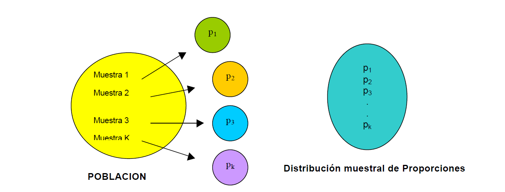
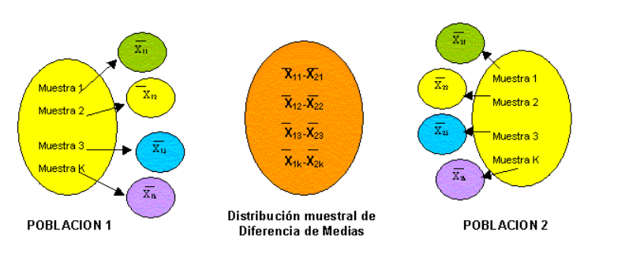

____________________________________________________________________________

# Distribuciones asociadas al muestreo

## Distribución t

<iframe width="280" height="160" src="https://www.youtube.com/embed/wGSutshZDiA?list=PLfX5C7cc6LRIpDDiblGwkJX2k9XG0GU5p" title="Uso de la tabla t-student" frameborder="0" allow="accelerometer; autoplay; clipboard-write; encrypted-media; gyroscope; picture-in-picture; web-share" allowfullscreen></iframe>

## Distribución Chi cuadrado
<iframe width="280" height="160" src="https://www.youtube.com/embed/teJ2of7rtKo" title="Uso de la tabla chi-cuadrada" frameborder="0" allow="accelerometer; autoplay; clipboard-write; encrypted-media; gyroscope; picture-in-picture; web-share" allowfullscreen></iframe>


## Distribución F
<iframe width="280" height="160" src="https://www.youtube.com/embed/wFwKZyvyGOg?list=PLfX5C7cc6LRIpDDiblGwkJX2k9XG0GU5p" title="Uso de la tabla F" frameborder="0" allow="accelerometer; autoplay; clipboard-write; encrypted-media; gyroscope; picture-in-picture; web-share" allowfullscreen></iframe>


# Distribuciones muestrales para una sola muestra


Un **estadístico** es una función de las variables aleatorias observables en una muestra, como la media muestral $\bar Y$, la varianza muestral $S^2$, Max, Min, la amplitud (Rango = max – min), la mediana muestral, etc. 

Se usan estadísticos para hacer inferencias o estimaciones, acerca de parámetros de población desconocidos. Todos los estadísticos son funciones de las variables aleatorias observadas en una muestra, por tanto también son variables aleatorias. En consecuencia, todos **los estadísticos tienen distribuciones de probabilidad, que llamaremos distribuciones muestrales**. 

La distribución muestral de un estadístico proporciona un modelo teórico para el histograma de frecuencia relativa de los posibles valores del estadístico que observaríamos por medio de muestreo repetido.

```{r fig.asp=0.8, fig.align='center', echo=FALSE}
knitr::include_graphics("imagen/tabla.png")
```


## Distribución  muestral de medias

Si se seleccionan muestras aleatorias de tamaño 20 en una población grande. Se calcula la media muestral $\bar X$ para cada muestra; la colección de todas estas medias muestrales recibe el nombre de **distribución muestral de medias**, así como tambien se puede obtener la **distribución muestral de las desviaciones estándar** lo que se puede ilustrar en la siguiente figura:

```{r fig.asp=0.8, fig.align='center', echo=FALSE}
knitr::include_graphics("imagen/dmm.png")
```

Si la población de la que se extraen las muestras es normal, la distribución muestral de medias será normal sin importar el tamaño de la muestra.


____________________________________________________________________________


**Teorema**


____________________________________________________________________________

Sean $Y_1, Y_2, . . . , Y_n$ variables aleatorias independientes y distribuidas idénticamente con $E(Yi)=\mu$ y $V(Y_i)=\sigma^2 <\infty$. 


Entonces:
$$\bar Y=\frac{1}{n}\sum_{i=1}^nY_i$$

está distribuida normalmente con media $\mu_{\bar y }=\mu$ y varianza $\sigma^2_{\bar y }=\sigma^2/n$ 

$$\bar Y \sim N( \mu,\sigma^2/n) $$
y la estandarización es:

$$Z=\frac{\bar y-\mu}{\sigma/\sqrt n}$$

____________________________________________________________________________


**Casos de la distribución muestral de medias según la varianza poblacional**

1.$\sigma ^2$ conocida

2.$\sigma ^2$ desconocida

3.$\sigma ^2$ desconocida con n>30


____________________________________________________________________________

|ítem            |varianza|Desviación estándar|Estadístico|Distribución|
|----------------|----------|---------------|-------------------|----------|
|Variables aleatorias $Y_1, Y_2, . . . , Y_n$|$\sigma^2$|$\sigma$|$Z=\frac{y-\mu}{\sigma}$|$N(\mu,\sigma^2)$ |$N(\mu,\sigma^2)$|
|Distribución muestral $\bar Y_i$, $\sigma^2$ conocida|$\sigma^2_{\bar y }=\sigma^2/n$|$\sigma_{\bar y }=\sigma/\sqrt n$|$Z=\frac{\bar y-\mu}{S/\sqrt n}$|$N(\mu,\sigma^2)$ |$N(\mu,\sigma^2)$|
|Distribución muestral $\bar Y_i$, $\sigma^2$ desconocida|$S^2_{\bar y }=S^2/n$|$S_{\bar y }=S/\sqrt n$|$T=\frac{\bar y-\mu}{S/\sqrt n}$|$t_{n-1}$|
|Distribución muestral $\bar Y_i$, $\sigma^2$ desconocida con n>30|$S^2_{\bar y }=S^2/n$|$S_{\bar y }=S/\sqrt n$|$T=\frac{\bar y-\mu}{S/\sqrt n}$|$T \rightarrow N(0,1)$|


____________________________________________________________________________

**Ejemplo 1** 

**$\sigma ^2$ desconocida, con n>30**

Las calificaciones de exámenes para todos los estudiantes tienen media de 60 y varianza de 64. Una muestra aleatoria de n=100 estudiantes tuvo una calificación media de 58. ¿Hay evidencia para sugerir que el nivel de conocimientos de esta escuela sea inferior? 

**Solución **

Denote con Y la media de una muestra aleatoria de n = 100 calificaciones de una población con $\mu = 60$ y $s^2 = 64$. 

$$\Large P(\bar Y≤58)$$
estandarizamos por medio del teorema de límite central


$$P \left(Z ≤\frac {58-60}{8/\sqrt 100}\right)$$
$$\Large P \left (Z ≤\frac {58-60}{0.8} \right)$$
$$\Large P \left (z ≤-2.5 \right)=0.0062$$

**Ejemplo 2**
**$\sigma ^2$ desconocida, con n>30**

Los tiempos de servicio para los clientes que pasan por la caja en una tienda de venta al menudeo son variables aleatorias independientes con media de 1.5 minutos y varianza de 1.0.

Calcule la probabilidad de que 100 clientes puedan ser atendidos en menos de 2 horas de tiempo total de servicio.


**Solución**

Sea $Y_i$ el tiempo de servicio para el i-ésimo cliente, entonces queremos calcular:


$$\Large P \left( \sum_{i=1}^{100} y_i \leq 120 \right)=\Large P \left( \frac{1}{n}\sum_{i=1}^{100} y_i \leq \frac{120}{n} \right)$$
$$P \left(\bar Y \leq \frac{120}{100}\right )=P \left(\bar Y \leq 1.2\right )$$

Como el tamaño muestral es grande, el teorema del límite central nos dice que $\bar Y$ está distribuida normalmente en forma aproximada con media $\mu_{\bar y}=\mu=1.5$ y varianza $\sigma^2_{\bar y=}\sigma^2/n=1/100$


Por tanto

$$\Large P(\bar Y ≤1.20) = P\left(\frac {\bar Y-\mu}{\sigma/\sqrt n } \leq \frac{1.2-1.5}{1/\sqrt 100}\right )$$

$$\Large P\left(Z \leq \frac{-0.3}{0.1}\right )=P\left(Z \leq -3\right )=0.001$$
Entonces, la probabilidad de que 100 clientes puedan ser atendidos en menos de 2 horas es aproximadamente 0.0013. Esta pequeña probabilidad indica que es prácticamente imposible atender a 100 clientes en menos de 2 horas.

**Ejemplo 3**
**$\sigma ^2$ desconocida**
Se está realizando un estudio sobre la calidad del aire en una zona. 
Supongamos que la variable Y: ”Número de medio de microgramos de partículas en suspensión por metro cúbico”, está normalmente distribuida.
Se hacen 16 mediciones, en las que se obtiene una cuasidesviación típica de 10.8585 unidades. Obtener la probabilidad de que la media muestral no difiera de la media poblacional en más de 8 unidades.

**Solución**

El estadístico es una distribución t 

$$T=\frac{\bar Y-\mu}{S/\sqrt n}=\frac{\bar Y-\mu}{10.8585/\sqrt 16}=\frac{\bar Y-\mu}{2.7146} \sim t_{n-1}$$
$$P(|\bar Y-\mu | \leq 8)=P(8-\mu<\bar Y<8-\mu)$$


$$P(\frac{\mu-8-\mu}{2.7146}<\frac{\bar Y - \mu}{2.7146} <\frac{+\mu + 8 - \mu}{2.7146})$$
$$P(\frac{8}{2.7146}<\frac{\bar Y - \mu}{2.7146} <\frac{8}{2.7146})$$
$$P(\frac{8}{2.7146}<t_{15} <\frac{8}{2.7146})$$
Recordemos que en la distribución t 
$$P(t>b)=\alpha \qquad P(t<b)=\rho$$


**Ejercicio propuesto**

Una máquina embotelladora puede ser regulada para que descargue un promedio de $\mu$ onzas por botella. Se ha observado que la cantidad de líquido dosificado por la máquina está distribuida normalmente con $\sigma= 1.0$ onza. Una muestra de n = 9 botellas se selecciona aleatoriamente de la producción de la máquina en un día determinado (todas embotelladas con el mismo ajuste de la máquina) y las onzas de contenido líquido se miden para cada una.

1. Determine la probabilidad de que la media muestral se encuentre a no más de 0.3 onza de la verdadera media $\mu$ para el ajuste seleccionado de la máquina.

2. ¿Cuántas observaciones deben estar incluidas en la muestra si deseamos
que Y se encuentre a no más de 0.3 onza de $\mu$ con probabilidad de 0.95?

____________________________________________________________________________

## Distribución muestral de la varianza

Un buen estimador de $\sigma^2$ es la varianza muestral $S^2$, la distribución asociada a esta distribución es la chi cuadrado.

$$P(\chi^2>\chi^2_\alpha)=\alpha$$
$$P(\chi^2 \leq \chi^2_\alpha)=\rho $$


```{r}
# computing values of 50k random values with 5 degrees of freedom
x <- rchisq(50000, df = 5)
  
hist(x, 
     freq = FALSE, 
     xlim = c(0,16), 
     ylim = c(0,0.2))
  
curve(dchisq(x, df = 5), from = 0, to = 15, 
      n = 5000, col= 'red', lwd=2, add = T)
```

____________________________________________________________________________


**Teorema**


Se desea hacer una inferencia acerca de la varianza poblacional basada en una muestra aleatoria $Y_1, Y_2, . . . , Y_n$ de una población normal, con media $\mu$ y varianza $\sigma^2$. Entonces el estadístico corresponde a:


$$\chi^2=\frac{(n-1)S^2}{\sigma^2}=\frac{1}{\sigma^2}\sum_{i=1}^n(Y_i-\bar Y)^2$$
tiene una distribución $\chi^2$ con n-1 grados de libertad. También $\bar Y$ y $S^2$ son variables aleatorias independientes.


____________________________________________________________________________

Para valores grandes de n, la distribución Chi-
Cuadrado se aproxima a la distribución Normal. La
aproximación se considera aceptable para n > 30

**Ejemplo 1**

Las onzas de líquido que vierte una máquina embotelladora tienen una distribución normal con $\sigma^2=1$. Suponga que planeamos seleccionar una muestra aleatoria de diez botellas y medir la cantidad de líquido en cada una. Si estas diez observaciones se usan para calcular $S^2$. Especifique un intervalo de valores que incluyan $S^2$ con una probabilidad 0.9. Encuentre números b1 y b2 tales que.

$$P(b_1 \leq S^2 \leq b_2)=0.9$$

**Solución**

Estandarizar

$$P  \left ( \frac{(n-1) b_1}{\sigma^2} \leq \frac{(n-1) S^2}{\sigma^2} \leq \frac{(n-1) b_2 }{\sigma^2}\right)=0.9$$
como $\sigma^2=1$ entonces 

$$P\left((n-1) b_1 \leq \chi^2 \leq (n-1) b_2\right)=0.9$$

Podemos usar la Tabla 6 para hallar dos números $a_1$ y $a_2$ tales que
$$P(a_1 \leq  \chi^2\leq a_2)=0.9$$

Se debe encontrar un valor $a_2$ que delimite un área de 0.05 en la cola superior y el valor de $a_1$ que delimite 0.05 en la cola inferior (0.95 en la cola superior). Como hay n − 1 = 9 grados de libertad, la Tabla indica que $a_2=16.919$ y $a_1 = 3.325$


```{r}
# computing values of 50k random values with 5 degrees of freedom
x <- rchisq(50000, df = 9)
  
hist(x, 
     freq = FALSE, 
     xlim = c(0,30), 
     ylim = c(0,0.2))
  
curve(dchisq(x, df = 9), from = 0, to = 30, 
      n = 5000, col= 'red', lwd=2, add = T)
```

$$16.919=\frac{(n-1) b_2}{\sigma^2}$$
$$16.919=\frac{(9) b_2}{\sigma^2}$$
como $\sigma^2=1$ entonces


$$ 16.919 = 9*b_2$$
$$b_2=\frac{16.919}{9}$$

encuentre el otro valor b1.

Por tanto, si deseamos tener un intervalo que incluya $S^2$ con probabilidad 0.90, uno de estos intervalos es (0.369, 1.880).

**Ejemplo 2**

Se considera una medición física realizada con un instrumento de precisión, donde el interés se centra en la variabilidad de la lectura. Se sabe que la medición es una v.a. con distribución Normal y desviación típica 4 unidades. Se toma una m.a.s. de tamaño 25.Obtener la probabilidad de que el valor de la varianza muestral sea mayor de 12.16 unidades cuadradas

$X_i$ corresponde las mediciones $ \sim N(\mu;4^2)$ con n=25.

$$\chi^2=\frac{(n-1)S^2}{\sigma^2}$$
$$P(S^2\geq 12.16)$$
Estandarizamos.
$$P \left (\frac{(n-1)S^2}{\sigma^2}\geq \frac{(24)*12.16}{16} \right )$$

$$P \left (\chi^2\geq 18.24 \right )=79.12 \%$$
```{r}
#lower.tail=FALSE
#cola derecha P(x>alfa)
pchisq(18.24, df=24, lower.tail=FALSE)

```


## Distribución muestral de Proporciones

Se desea investigar la proporción de artículos defectuosos. Esta distribución se genera extrayendo muestras de la población y calculando la proporción (p=x/n en donde “x” es el número de éxitos u observaciones de interés y “n” el tamaño de la muestra).


```{r fig.asp=0.8, fig.align='center', echo=FALSE}

```


La fórmula que se utilizará para el cálculo de probabilidad en una distribución muestral de proporciones está basada en la aproximación de la distribución normal a la binomial. Esta fórmula nos servirá para calcular la probabilidad del
comportamiento de la proporción en la muestra.


$$z=\frac{\hat p-P}{\sqrt{\frac{Pq}{n}}}$$

**Ejemplo:**
Se ha determinado que 60% de los estudiantes de una universidad grande fuman cigarrillos. Se toma una muestra aleatoria de 800 estudiantes. Calcule la probabilidad de que la proporción de la muestra de la gente que fuma cigarrillos sea menor que 0.55.


**Ejemplo**

n=800 est
P=0.6
p=0.55


$$P(\hat p<0.55)$$

Aplicando factor de corrección por continuidad
 
```{r fig.asp=0.8, fig.align='center', echo=FALSE}
knitr::include_graphics("imagen/ejemplo.png")
```


$$P(\hat p\leq 0.5493)=P\left(\frac{\hat p-P}{\sqrt{\frac{Pq}{n}}}\leq\frac{0.5493-0.6}{\sqrt{\frac{0.6*0.4}{800}}}\right)=-2.92$$
$$P\left(z\leq -2.92 \right)=0.0018$$

# Distribuciones muestrales para dos muestras

```{r fig.asp=0.8, fig.align='center', echo=FALSE}

```

## Distribución de la diferencia de medias muestrales 

## 1. Varianzas poblacionales conocidas 

$$(\bar X - \bar Y) \sim N \left ( (\mu_x-\mu_y), \frac{\sigma^2_x}{n_x}+\frac{\sigma^2_y}{n_y}\right) $$

El estadístico es:

$$Z=\frac{(\bar X - \bar Y)-(\mu_x-\mu_y)}{\sqrt{\frac{\sigma^2_x}{n_x}+\frac{\sigma^2_y}{n_y}}} \longrightarrow N(0,1)$$

## 2. Varianzas poblacionales desconocidas pero iguales

La condición de igualdad de varianzas debe comprobarse o afirmarse.

$$\sigma^2_x=\sigma^2_y$$

El estadístico es:

$$T=\frac{(\bar X - \bar Y)-(\mu_x-\mu_y)}{S_p\sqrt{\frac{\sigma^2_x}{n_x}+\frac{\sigma^2_y}{n_y}}} $$
Donde: 
$$S^2_p=\frac{(n_x-1)S^2_x+(n_y-1)S^2_y}{n_x+n_y-2}$$

Tiene una distribución t de student con $n_x+n_y-2$

## 3. Varianzas poblacionales desconocidas con tamaños de muestra $n_1>30$ y $n_2>30$

El estadístico es:

$$Z=\frac{(\bar X - \bar Y)-(\mu_x-\mu_y)}{\sqrt{\frac{S^2_x}{n_x}+\frac{S_y}{n_y}}} \longrightarrow N(0,1)$$

**Ejercicio diferencia de medias con Varianzas poblacionales conocidas**

Los niveles de radiación latente en dos regiones A y B
siguen distribuciones Normales independientes de medias
0.48 y 0.4663 y varianzas 0.2 y 0.01 rem por año,
respectivamente. Se realizan 25 mediciones en la región A y 100 en la B. 


X: "Nivel radiación latente en A"
Y: "Nivel radiación latente en B"


Obtener la probabilidad de que la media de la muestra A sea como máximo 0.2 rem superior a la media de la muestra B.


$$P(\bar X \leq \bar Y+0.2) $$
**Ejercicio diferencia de medias con Varianzas poblacionales desconocidas pero iguales**

Se está realizando un estudio sobre la calidad del aire
en dos zonas A y B. Un indicador de la calidad es el
número de microgr. de partículas en suspensión por m3 de aire, que suponemos siguen distribuciones Normales
independientes de media 62.237 en A, 61.022 en B y
varianzas iguales. En la zona A se realizan 12 mediciones, obteniéndose una varianza de 8.44 microgr2 y en la B 15 mediciones, con una varianza de 9.44 microgr2. 

Obtener la probabilidad de que la media muestral de A sea como mínimo tres unidades superior a la media muestral de B.

$$P(\bar X \geq \bar Y+3)$$

**Ejercicio propuesto**
Se estudia el efecto de un vertido tóxico en un río,
comparando el índice de biodiversidad I.B-D. antes y
después del vertido. Supongamos que los I.B-D. siguen distribuciones Normales. Antes del vertido se habían realizado 35 pruebas y se obtuvo una media de 1.9 y una desviación típica de 0.4. Después del vertido se realizan 40 pruebas y se obtiene una media de 1.7 y una desviación típica de 0.7.


x: "I.B-D después del vertido"
Y: "I.B-D antes del vertido"

Obtener la probabilidad de que la media poblacional
antes del vertido sea como máximo 0.5 unidades inferior
a la media poblacional después del vertido.


$$P(\bar X \leq \bar Y+0.5) $$

## Distribución del cociente de varianzas muestrales de dos poblaciones Normales independientes

El estadístico F, definido como:


$$F=\frac{S^2_x*\sigma_y^2}{S^2_y*\sigma_x^2} \longrightarrow F_{n_x-1,n_y-1}$$
**Ejemplo**
Se está comparando la variabilidad de los I.B-D de dos
ríos A y B, que suponemos siguen distribuciones
Normales. Se realizan 16 mediciones en el río A y se
obtiene una varianza de 9.52, y 18 mediciones en el río B y se obtiene una varianza de 7.


X: "I.B-D en el río A
Y: "I.B-D en el río B

Obtener la probabilidad de que la varianza en el río B
sea como mínimo el doble de la varianza en el río A.

$$P(\sigma^2_Y\geq 2\sigma^2_Y)$$

$$P( \frac{\sigma^2_Y}{\sigma^2_Y}\geq 2)$$
$$P( \frac{\sigma^2_Y}{\sigma^2_Y}\geq 2)$$

# Taller

## Ejercicios teorema central del límite

1. La resistencia a la ruptura del vidrio templado promedia 14 (medida en miles de libras por pulgada cuadrada) y tiene una desviación estándar de 2.

a ¿Cuál es la probabilidad de que el promedio de resistencia a la ruptura de 100 piezas seleccionadas aleatoriamente de este vidrio exceda de 14.5?

b Encuentre un intervalo que incluya, con probabilidad 0.95, el promedio de resistencia a la ruptura de 100 piezas de este vidrio seleccionadas aleatoriamente.

2. Una antropóloga desea calcular el promedio de estatura de los hombres de cierta raza. Si se supone que la desviación estándar poblacional es de 2.5 pulgadas y si ella muestrea 100 hombres aleatoriamente, 

a) encuentre la probabilidad de que la diferencia entre la media muestral y la verdadera media poblacional no exceda de 0.5 pulgada. Rta/0.9544

b) Suponga que la antropóloga desea que la diferencia entre la media muestral y la mediapoblacional sea menor que 0.4 pulgada, con probabilidad de 0.95. ¿Cuántos hombres debe tomar como muestra para lograr este objetivo?

3. Trabajadores de una gran empresa de servicios tienen un salario promedio de 7% por hora con una desviación estándar de 0.5. La industria tiene 64 trabajadores de cierto grupo étnico que tienen un salario promedio de $6.9$ por hora. ¿Es razonable suponer que la tasa salarial del grupo étnico es equivalente a la de una muestra aleatoria de trabajadores tomada de los empleados en la industria militar?
[Sugerencia: calcule la probabilidad de obtener una media muestral menor o igual que $6.9 por hora.Rta/0.0548]

4. La acidez de los suelos se mide mediante una cantidad llamada pH, que varía de 0 (acidez alta) a 14 (alcalinidad alta). Un edafólogo desea calcular el promedio de pH para un campo de grandes dimensiones al seleccionar aleatoriamente n muestras de núcleos y medir el pH de cada muestra. Aun cuando la desviación estándar poblacional de mediciones de pH no se conoce, la experiencia del pasado indica que casi todos los suelos tienen un valor de pH de entre 5 y 8. 

a. Si el científico selecciona n = 40 muestras, encuentre la probabilidad aproximada de que la media muestral de las 40 mediciones de pH esté a 0.2 unidades del verdadero promedio de pH para el campo. [Sugerencia: vea el Ejercicio 1.17.]


5. Suponga que al científico del Ejercicio 7.46 le gustaría que la media muestral estuviera a no más de 0.1 de la verdadera media con probabilidad .90. ¿Cuántas muestras de núcleos debe tomar?

6 Un aspecto importante de un plan económico federal era que los consumidores ahorraran una parte importante de dinero que recibieran por una reducción de impuestos sobre sus ingresos. Suponga que las primeras estimaciones de la parte del total de impuesto ahorrada, con base en una muestra aleatoria de 35 economistas, tuvo media de 26% y desviación estándar de 12%. 

a ¿Cuál es la probabilidad aproximada de que la estimación de la media muestral, basada en una muestra aleatoria de n = 35 economistas, se encuentre a no más de 1% de la media de la población de las estimaciones de todos los economistas?
 
b ¿Es necesariamente verdadero que la media de la población de las estimaciones de todos los economistas sea igual al porcentaje de ahorro en impuestos que en realidad se logrará?

7. El tiempo necesario para el mantenimiento periódico de un automóvil u otra máquina tiene por lo general una distribución de probabilidad en forma de campana. Debido a que se presentarán algunos alargamientos en los tiempos de servicio, la distribución tiende a estar sesgada a la derecha. Suponga que el tiempo necesario para dar servicio a un automóvil que ha recorrido 5000 millas tiene una media de 1.4 horas y desviación estándar de 0.7 horas. Suponga también que el departamento de servicio planea atender a 50 automóviles por jornada de 8 horas y que, para hacerlo, puede dedicar un tiempo promedio
máximo de sólo 1.6 horas por automóvil. ¿Cuántos días tendrá que trabajar tiempo extra el departamento de servicio?

8. Se ha encontrado que las mediciones de resistencia al corte en soldaduras por puntos tienen una desviación estándar de 10 libras por pulgada cuadrada (psi). Si se han de medir 100 soldaduras de prueba, ¿cuál es la probabilidad aproximada de que la media muestral se encuentre a no más de 1 psi de la verdadera media poblacional?

Si la desviación estándar de mediciones de resistencia al corte en soldaduras por puntos es 10 psi, ¿cuántas soldaduras de prueba deben muestrearse si deseamos que la media muestral se encuentre a no más de 1 psi de la verdadera media con probabilidad aproximada de 0.99?

9. Los resistores que se han de usar en un circuito tienen un promedio de resistencia de 200 ohms y desviación estándar de 10 ohms. Suponga que 25 de estos resistores se seleccionan aleatoriamente para usarse en un circuito.
a ¿Cuál es la probabilidad de que la resistencia promedio para los 25 resistores esté entre 199 y 202 ohms?

b Encuentre la probabilidad de que la resistencia total no exceda de 5100 ohms.

10 Concentraciones de monóxido de carbono de cierta hora en muestras de aire de una gran ciudad promedian 12 ppm (partes por millón) con desviación estándar de 9 partes por millón.

a ¿Cree usted que las concentraciones de monóxido de carbono en las muestras de aire de esta ciudad están distribuidas normalmente? ¿Por qué sí o por qué no?

b Encuentre la probabilidad de que la concentración promedio en 100 muestras seleccionadas aleatoriamente exceda de 14 partes por millón.

## Ejercicios distribución muestral de proporciones

1. Un medicamento para malestar estomacal tiene la advertencia de que algunos usuarios pueden presentar una reacción adversa a él, más aún, se piensa que alrededor del 3% de los usuarios tienen tal reacción. Si una muestra aleatoria de 150 personas con malestar estomacal usa el medicamento, encuentre la probabilidad de que la proporción de la muestra de los usuarios que realmente presentan una reacción adversa, exceda el 4%.

Resolverlo mediante distribución binomial Rta/0.1685
Resolverlo con la distribución muestral de proporciones

2. Se sabe que la verdadera proporción de los componentes defectuosos fabricadas por una firma es de 4%, y encuentre la probabilidad de que una muestra aleatoria de tamaño 60 tenga:

Menos del 3% de los componentes defectuosos. 0.2327
Más del 1% pero menos del 5% de partes defectuosas 0.3290
