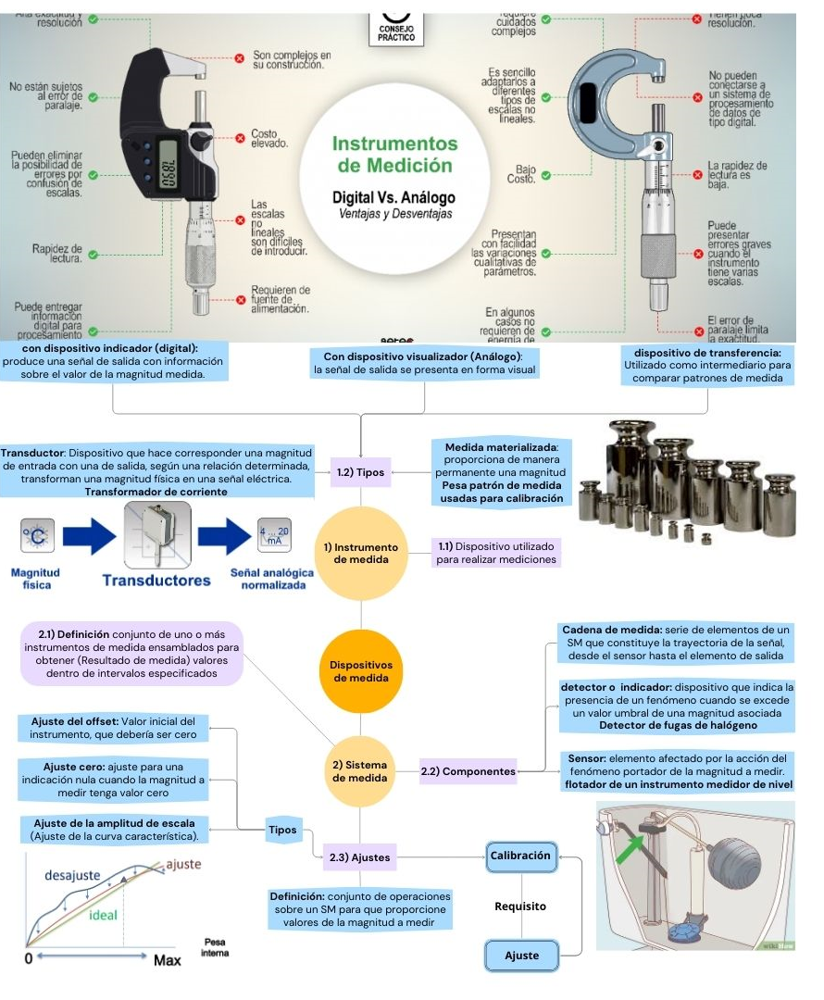

|Capítulo|Tema|Definiciones|
|:------:|:-----------------------------|:-:|
|1|Magnitudes y unidades                 |29|
|2|Medición                              |54|
|3|Dispositivos para medir               |12|
|4|Propiedades de dispositivos para medir|30|
|5|Patrones de medida                    |18|

## Capítulo 1: Sistema Internacional de Magnitudes (ISQ):

Sistema de magnitudes basado en las siete magnitudes básicas


**Sistema Internacional de unidades SI:**


Sistema de unidades basado en el Sistema Internacional de Magnitudes(ISQ), con nombres y símbolos de las unidades, y con una serie de prefijos con sus nombres y símbolos, así como reglas para su utilización, adoptado por la Conferencia General de Pesas y Medidas (CGPM)


|Magnitud básica (SIQ)|símbolo (SIQ)|Nombre (SI)|símbolo (SI)|Constante|Reseña|
|:-------:|:---------:|:---------:|:-------:|:-------:|:-------------------------:|
|Longitud |L|Metro      |m     |c=299 792 458 m/s   |velocidad de la luz en el vacio|
|Masa     |M|Kilogramo  |kg    |$6.626 070 15 × 10^{−34}$  J⋅s| Constante de Planck|
|Tiempo   |T|Segundo    |s     |Δν Cs= 9 192 631 770  Hz|frecuencia de transición hiperfina del átomo del celsio Cs|
|Corriente eléctrica|I|Ampére|A|1,602 176 634 × $10^{−19}$   C|carga elemental|
|Temperatura termodinámica|$\Theta$|kelvin|K|$1.380649×10^{−23} J/K$|Constante de Boltzmann|
|Cantidad de sustancia|N|mol    |mol |$N_a=6.022 140 76 × 10^23  mol^{−1}$|Constante de Avogadro|
|Intensidad Luminosa|J  |Candela| cd |$K_{cd}$=683 lm / W |Eficacia luminosa de Radiación de 540 THz|


**Magnitud:** 

Propiedad que puede expresarse cuantitativamente mediante un número y una referencia

**Magnitud de base:**

Magnitud de un subconjunto elegido por convenio, dentro de un sistema de magnitudes dado, de tal manera que ninguna magnitud del subconjunto pueda ser expresada en función de las otras. por ejemplo ISQ (Sistema internacional de magnitudes)

Las magnitudes básicas son independientes entre sí, dado que una magnitud básica no puede expresarse como el producto de potencias de otras magnitudes básicas.


**Magnitud derivada**

Magnitud definida en función de las magnitudes de base.


**Magnitud escalar real**

Definida y adoptada por convenio, con la que se puede comparar cualquier otra magnitud de la misma naturaleza para expresar la relación entre ambas mediante un número 


**EJEMPLOS:** 


|Magnitud base|Magnitud derivada|ISQ   |SI|
|:-----------:|:---------------:|:----:|:----:|
|Masa y volumen|Densidad|$\rho=[M][L]^{-3}$|$\rho=[kg][m]^{-3}$|
|masa, longitud y tiempo|Fuerza producto de la masa y la aceleración |$F=[M][L][T]^{-2}$|$F=[Kg][m][s]^{-2}$|


**Dimensión de una magnitud**

Expresión de la dependencia de una magnitud en términos de las magnitudes de base, dentro de un sistema de magnitudes, como el producto de potencias de factores de magnitudes de base, omitiendo cualquier factor numérico

<font color="blue">Magnitud</font>  

<font color="green">Valor de la Magnitud</font> 

<font color="pink">Unidad de medida</font>

- <font color="blue">Longitud</font> de una carretera <font color="green">10 000 </font> <font color="pink">m</font>

- <font color="blue">Masa</font> del planeta tierra <font color="green">$5.972x10^{-24}$ </font> <font color="pink">kg</font>

- <font color="blue">Tiempo</font> que le toma a la luz recorrer un metro <font color="green">$3.34x10^{-9}$ </font> <font color="pink">s</font>

**Unidad derivada coherente**
Unidad derivada que, para un sistema de magnitudes y un conjunto de unidades básicas dados, es producto de potencias de unidades de base, sin otro factor de proporcionalidad que el número uno.


$$F=C(M*a)$$

**UNIDAD DERIVADA NO COHERENTE**
Es el caso en el cual el factor de proporcionalidad es diferente de uno.


$$F=\frac{1}{9.81}m*(Kg)*a\left(\frac{m}{s^2}\right)$$

```{r out.width="100%", fig.align='center', echo=FALSE}
knitr::include_graphics("imagen/cap1VIM.png")
```

## Capítulo 3: Dispositivos de medida


```{r out.width="100%", fig.align='center', echo=FALSE}

```

**MEDICIÓN**

Proceso que consiste en obtener experimentalmente uno o varios valores que pueden atribuirse razonablemente a una magnitud

supone:

- Una comparación de magnitudes e incluye el conteo de entidades

- Es una descripción de la magnitud compatible con el resultado de medida de un procedimiento y un sistema de medida calibrado conforme a un procedimiento de medida especificado, incluyendo las condiciones de medida.


**SISTEMA DE MEDIDA**

Conjunto de uno o más instrumentos de medida, frecuentemente, otros dispositivos, incluyendo reactivos e insumos varios, ensamblados y adaptados para proporcionar información utilizada para obtener valores medidos dentro de intervalos especificados, para magnitudes de naturalezas dadas


## Materiales de referencia certificados (MRC)

Su incertidumbre se estima mediante un análisis repetido del MRC. si no resulta ser significativa, la incertidumbre asociada es la combinación de la incertidumbre del valor del MRC, con la desviación estándar asociada a la medida del sesgo. 

```{r out.width="100%", fig.align='center', echo=FALSE}

```


